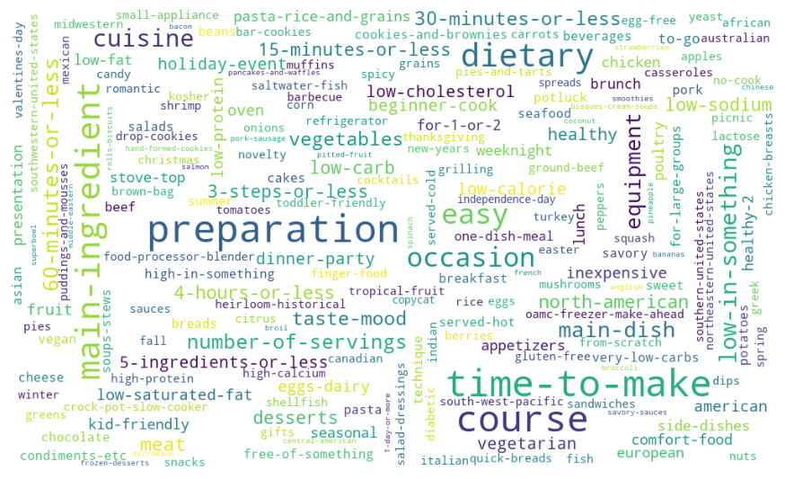
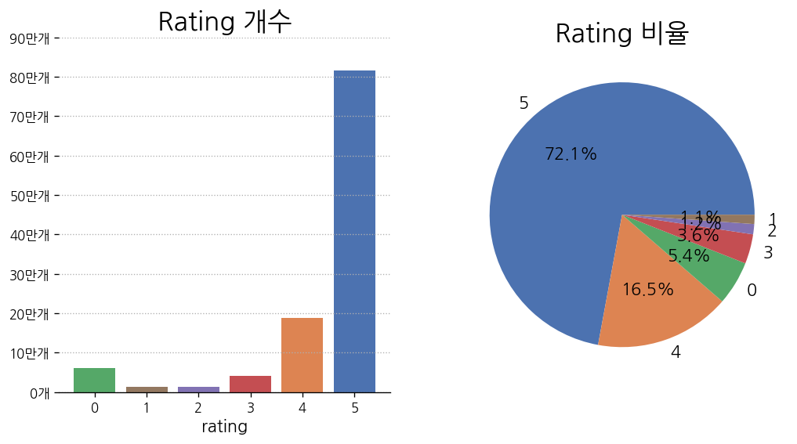
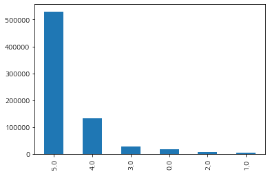
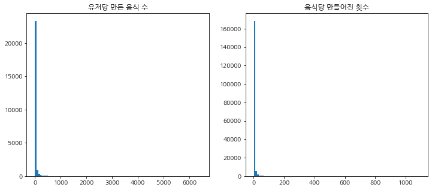

import pandas as pd
import numpy as np
import matplotlib.pyplot as plt
import seaborn as sns
import ast
from collections import Counter
from wordcloud import WordCloud
import warnings

plt.rcParams['font.family']='NanumGothic'
plt.rcParams['axes.unicode_minus'] = False
pd.set_option('float_format', '{:.2f}'.format)
warnings.filterwarnings(action='ignore')


```python
raw_recipes = pd.read_csv('/opt/ml/foodcom/RAW_recipes.csv')
raw_interactions = pd.read_csv('/opt/ml/foodcom/RAW_interactions.csv')
pp_recipes = pd.read_csv('/opt/ml/foodcom/PP_recipes.csv')
pp_users = pd.read_csv('/opt/ml/foodcom/PP_users.csv')
interactions_train = pd.read_csv('/opt/ml/foodcom/interactions_train.csv')
interactions_validation = pd.read_csv('/opt/ml/foodcom/interactions_validation.csv')
interactions_test = pd.read_csv('/opt/ml/foodcom/interactions_test.csv')
```

# EDA

## raw_recipes

### Column 설명

name : 음식 이름

id : 음식 id

minutes : 걸리는 시간

contributor_id : 레시피 제공자 id

submitted : 등록된 날짜

tags : 레시피 관련 태그

nutrition : 영양소

n_steps : 과정 수

steps : 과정 상세

description : 설명

ingredients : 재료

n_ingredients : 재료 종류 수


```python
# 결측값 확인
raw_recipes.isnull().sum()
```


    name                 1
    id                   0
    minutes              0
    contributor_id       0
    submitted            0
    tags                 0
    nutrition            0
    n_steps              0
    steps                0
    description       4979
    ingredients          0
    n_ingredients        0
    dtype: int64


```python
# 레시피 이름 결측값 제거
name_null_id = raw_recipes[raw_recipes.name.isnull()].id.values
raw_recipes = raw_recipes[~raw_recipes.id.isin(name_null_id)]
```

### name


음식이 아닌 레시피가 존재

cleaner 와 washer 같은 세제류의 레시피도 포함되어 있음


```python
print(raw_recipes[raw_recipes.name.str.contains('cleaner')].name.values)
```

    ['all purpose spray cleaner   dr  oz  show'
     'all in one magic non toxic bathroom cleaner'
     'awesome sparkling crystal clear windows cleaner'
     'draino    drain cleaner'
     'earth scrub  a green  soft scrub   all purpose cleaner'
     'easy microwave cleaner' 'eye glass cleaner' 'fantastic glass cleaner'
     'garbage disposal cleaner' 'green window cleaner that costs pennies'
     'handy hand cleaner' 'homemade window cleaner' 'magic cleaner'
     'multipurpose cleaner' 'natural floor cleaner' 'shower head cleaner'
     'smooth top stove cleaner' 'stainless steel pots   pans cleaner'
     'toilet cleaner' 'vacuum cleaner bar cookies' 'vacuum cleaner cookies'
     'washer cleaner']


### minutes

요리하는데 걸리는 시간은 0분 부터 2147483647분 까지 존재

75%까지 65분 이하라는 것을 확인 할 수 있음


```python
raw_recipes.minutes.describe()
```


    count       231636.00
    mean          9398.59
    std        4461972.67
    min              0.00
    25%             20.00
    50%             40.00
    75%             65.00
    max     2147483647.00
    Name: minutes, dtype: float64


```python
fig,ax = plt.subplots()

sns.boxplot(raw_recipes.minutes.values, ax=ax)
ax.set_title('요리 시간')

plt.show()
```

    /opt/conda/envs/test1/lib/python3.8/site-packages/seaborn/_decorators.py:36: FutureWarning: Pass the following variable as a keyword arg: x. From version 0.12, the only valid positional argument will be `data`, and passing other arguments without an explicit keyword will result in an error or misinterpretation.
      warnings.warn(


    

    


boxplot을 본 결과 이상치라고 판단됨

#### 0분 걸리는 레시피


```python
zero_minutes_recipes = raw_recipes[raw_recipes.minutes == 0]
print('0분표기 레시피 수 =',zero_minutes_recipes.shape[0])
zero_minutes_recipes.head(5)
```

    0분표기 레시피 수 = 1094


<div>
<style scoped>
    .dataframe tbody tr th:only-of-type {
        vertical-align: middle;
    }

    .dataframe tbody tr th {
        vertical-align: top;
    }

    .dataframe thead th {
        text-align: right;
    }
</style>
<table border="1" class="dataframe">
  <thead>
    <tr style="text-align: right;">
      <th></th>
      <th>name</th>
      <th>id</th>
      <th>minutes</th>
      <th>contributor_id</th>
      <th>submitted</th>
      <th>tags</th>
      <th>nutrition</th>
      <th>n_steps</th>
      <th>steps</th>
      <th>description</th>
      <th>ingredients</th>
      <th>n_ingredients</th>
    </tr>
  </thead>
  <tbody>
    <tr>
      <th>5</th>
      <td>apple a day  milk shake</td>
      <td>5289</td>
      <td>0</td>
      <td>1533</td>
      <td>1999-12-06</td>
      <td>['15-minutes-or-less', 'time-to-make', 'course...</td>
      <td>[160.2, 10.0, 55.0, 3.0, 9.0, 20.0, 7.0]</td>
      <td>4</td>
      <td>['combine ingredients in blender', 'cover and ...</td>
      <td>NaN</td>
      <td>['milk', 'vanilla ice cream', 'frozen apple ju...</td>
      <td>4</td>
    </tr>
    <tr>
      <th>2451</th>
      <td>acorn magic delights</td>
      <td>1712</td>
      <td>0</td>
      <td>1534</td>
      <td>1999-10-01</td>
      <td>['15-minutes-or-less', 'time-to-make', 'course...</td>
      <td>[148.4, 15.0, 28.0, 2.0, 3.0, 21.0, 4.0]</td>
      <td>13</td>
      <td>['melt the butter or margarine over low heat',...</td>
      <td>NaN</td>
      <td>['butter', 'brown sugar', 'pecans', 'all-purpo...</td>
      <td>7</td>
    </tr>
    <tr>
      <th>3079</th>
      <td>albanian byrek</td>
      <td>4880</td>
      <td>0</td>
      <td>1534</td>
      <td>1999-11-24</td>
      <td>['15-minutes-or-less', 'time-to-make', 'course...</td>
      <td>[354.4, 42.0, 25.0, 59.0, 37.0, 37.0, 2.0]</td>
      <td>14</td>
      <td>['prepare the dough with flour , 1 and a half ...</td>
      <td>the directions to this are vague, but maybe yo...</td>
      <td>['flour', 'water', 'oil', 'vinegar', 'salt', '...</td>
      <td>9</td>
    </tr>
    <tr>
      <th>3193</th>
      <td>alfredo sauce with pasta</td>
      <td>3258</td>
      <td>0</td>
      <td>1534</td>
      <td>1999-10-10</td>
      <td>['15-minutes-or-less', 'time-to-make', 'course...</td>
      <td>[1902.9, 287.0, 5.0, 140.0, 104.0, 583.0, 3.0]</td>
      <td>8</td>
      <td>['cook noodles or fettuccine according to pack...</td>
      <td>NaN</td>
      <td>['butter', 'heavy cream', 'parmesan cheese', '...</td>
      <td>6</td>
    </tr>
    <tr>
      <th>3259</th>
      <td>alice s doughnuts</td>
      <td>2284</td>
      <td>0</td>
      <td>1752</td>
      <td>1999-10-18</td>
      <td>['15-minutes-or-less', 'time-to-make', 'course...</td>
      <td>[107.3, 6.0, 20.0, 3.0, 3.0, 10.0, 4.0]</td>
      <td>17</td>
      <td>['in a large bowl , beat the eggs until foamy'...</td>
      <td>NaN</td>
      <td>['eggs', 'sugar', 'milk', 'shortening', 'vanil...</td>
      <td>9</td>
    </tr>
  </tbody>
</table>
</div>


```python
print('15분 이하 태그가 붙어있는 수',zero_minutes_recipes[zero_minutes_recipes.tags.str.contains('15-minutes')].shape[0])
zero_minutes_recipes[zero_minutes_recipes.tags.str.contains('15-minutes')].head(5)
```

    15분 이하 태그가 붙어있는 수 1094


<div>
<style scoped>
    .dataframe tbody tr th:only-of-type {
        vertical-align: middle;
    }

    .dataframe tbody tr th {
        vertical-align: top;
    }

    .dataframe thead th {
        text-align: right;
    }
</style>
<table border="1" class="dataframe">
  <thead>
    <tr style="text-align: right;">
      <th></th>
      <th>name</th>
      <th>id</th>
      <th>minutes</th>
      <th>contributor_id</th>
      <th>submitted</th>
      <th>tags</th>
      <th>nutrition</th>
      <th>n_steps</th>
      <th>steps</th>
      <th>description</th>
      <th>ingredients</th>
      <th>n_ingredients</th>
    </tr>
  </thead>
  <tbody>
    <tr>
      <th>5</th>
      <td>apple a day  milk shake</td>
      <td>5289</td>
      <td>0</td>
      <td>1533</td>
      <td>1999-12-06</td>
      <td>['15-minutes-or-less', 'time-to-make', 'course...</td>
      <td>[160.2, 10.0, 55.0, 3.0, 9.0, 20.0, 7.0]</td>
      <td>4</td>
      <td>['combine ingredients in blender', 'cover and ...</td>
      <td>NaN</td>
      <td>['milk', 'vanilla ice cream', 'frozen apple ju...</td>
      <td>4</td>
    </tr>
    <tr>
      <th>2451</th>
      <td>acorn magic delights</td>
      <td>1712</td>
      <td>0</td>
      <td>1534</td>
      <td>1999-10-01</td>
      <td>['15-minutes-or-less', 'time-to-make', 'course...</td>
      <td>[148.4, 15.0, 28.0, 2.0, 3.0, 21.0, 4.0]</td>
      <td>13</td>
      <td>['melt the butter or margarine over low heat',...</td>
      <td>NaN</td>
      <td>['butter', 'brown sugar', 'pecans', 'all-purpo...</td>
      <td>7</td>
    </tr>
    <tr>
      <th>3079</th>
      <td>albanian byrek</td>
      <td>4880</td>
      <td>0</td>
      <td>1534</td>
      <td>1999-11-24</td>
      <td>['15-minutes-or-less', 'time-to-make', 'course...</td>
      <td>[354.4, 42.0, 25.0, 59.0, 37.0, 37.0, 2.0]</td>
      <td>14</td>
      <td>['prepare the dough with flour , 1 and a half ...</td>
      <td>the directions to this are vague, but maybe yo...</td>
      <td>['flour', 'water', 'oil', 'vinegar', 'salt', '...</td>
      <td>9</td>
    </tr>
    <tr>
      <th>3193</th>
      <td>alfredo sauce with pasta</td>
      <td>3258</td>
      <td>0</td>
      <td>1534</td>
      <td>1999-10-10</td>
      <td>['15-minutes-or-less', 'time-to-make', 'course...</td>
      <td>[1902.9, 287.0, 5.0, 140.0, 104.0, 583.0, 3.0]</td>
      <td>8</td>
      <td>['cook noodles or fettuccine according to pack...</td>
      <td>NaN</td>
      <td>['butter', 'heavy cream', 'parmesan cheese', '...</td>
      <td>6</td>
    </tr>
    <tr>
      <th>3259</th>
      <td>alice s doughnuts</td>
      <td>2284</td>
      <td>0</td>
      <td>1752</td>
      <td>1999-10-18</td>
      <td>['15-minutes-or-less', 'time-to-make', 'course...</td>
      <td>[107.3, 6.0, 20.0, 3.0, 3.0, 10.0, 4.0]</td>
      <td>17</td>
      <td>['in a large bowl , beat the eggs until foamy'...</td>
      <td>NaN</td>
      <td>['eggs', 'sugar', 'milk', 'shortening', 'vanil...</td>
      <td>9</td>
    </tr>
  </tbody>
</table>
</div>


0분은 잘못 표시된 것이라고 보여짐

tags를 보면 15-minutes-or-less로 15분 이하 tag가 있는 것을 볼 수 있는데

0분 레시피에 모두 포함된 것을 확인 할 수 있음

#### 가장 오래걸리는 레시피


```python
raw_recipes[raw_recipes.minutes == 2147483647]
```


<div>
<style scoped>
    .dataframe tbody tr th:only-of-type {
        vertical-align: middle;
    }

    .dataframe tbody tr th {
        vertical-align: top;
    }

    .dataframe thead th {
        text-align: right;
    }
</style>
<table border="1" class="dataframe">
  <thead>
    <tr style="text-align: right;">
      <th></th>
      <th>name</th>
      <th>id</th>
      <th>minutes</th>
      <th>contributor_id</th>
      <th>submitted</th>
      <th>tags</th>
      <th>nutrition</th>
      <th>n_steps</th>
      <th>steps</th>
      <th>description</th>
      <th>ingredients</th>
      <th>n_ingredients</th>
    </tr>
  </thead>
  <tbody>
    <tr>
      <th>144074</th>
      <td>no bake granola balls</td>
      <td>261647</td>
      <td>2147483647</td>
      <td>464080</td>
      <td>2007-10-26</td>
      <td>['60-minutes-or-less', 'time-to-make', 'course...</td>
      <td>[330.3, 23.0, 110.0, 4.0, 15.0, 24.0, 15.0]</td>
      <td>9</td>
      <td>['preheat the oven to 350 degrees', 'spread oa...</td>
      <td>healthy snacks that kids (and grown ups) will ...</td>
      <td>['rolled oats', 'unsweetened dried shredded co...</td>
      <td>8</td>
    </tr>
  </tbody>
</table>
</div>


tag로는 60분 이하의 레시피로 보여짐

minutes 값은 잘못적혀진 것이라고 판단

100만분이 넘어가는 레시피도 위의 레시피를 제외하면 한개


```python
raw_recipes[raw_recipes.minutes > 1000000]
```


<div>
<style scoped>
    .dataframe tbody tr th:only-of-type {
        vertical-align: middle;
    }

    .dataframe tbody tr th {
        vertical-align: top;
    }

    .dataframe thead th {
        text-align: right;
    }
</style>
<table border="1" class="dataframe">
  <thead>
    <tr style="text-align: right;">
      <th></th>
      <th>name</th>
      <th>id</th>
      <th>minutes</th>
      <th>contributor_id</th>
      <th>submitted</th>
      <th>tags</th>
      <th>nutrition</th>
      <th>n_steps</th>
      <th>steps</th>
      <th>description</th>
      <th>ingredients</th>
      <th>n_ingredients</th>
    </tr>
  </thead>
  <tbody>
    <tr>
      <th>109624</th>
      <td>how to preserve a husband</td>
      <td>447963</td>
      <td>1051200</td>
      <td>576273</td>
      <td>2011-02-01</td>
      <td>['time-to-make', 'course', 'preparation', 'for...</td>
      <td>[407.4, 57.0, 50.0, 1.0, 7.0, 115.0, 5.0]</td>
      <td>9</td>
      <td>['be careful in your selection', "don't choose...</td>
      <td>found this in a local wyoming cookbook "a coll...</td>
      <td>['cream', 'peach']</td>
      <td>2</td>
    </tr>
    <tr>
      <th>144074</th>
      <td>no bake granola balls</td>
      <td>261647</td>
      <td>2147483647</td>
      <td>464080</td>
      <td>2007-10-26</td>
      <td>['60-minutes-or-less', 'time-to-make', 'course...</td>
      <td>[330.3, 23.0, 110.0, 4.0, 15.0, 24.0, 15.0]</td>
      <td>9</td>
      <td>['preheat the oven to 350 degrees', 'spread oa...</td>
      <td>healthy snacks that kids (and grown ups) will ...</td>
      <td>['rolled oats', 'unsweetened dried shredded co...</td>
      <td>8</td>
    </tr>
  </tbody>
</table>
</div>


10만분 이상 걸리는 레시피는 liqueur (술) 종류가 많음

술을 담궈놓는 기간이라 minutes 값이 높게 측정됐다고 판단


```python
raw_recipes[raw_recipes.minutes > 100000]
```


<div>
<style scoped>
    .dataframe tbody tr th:only-of-type {
        vertical-align: middle;
    }

    .dataframe tbody tr th {
        vertical-align: top;
    }

    .dataframe thead th {
        text-align: right;
    }
</style>
<table border="1" class="dataframe">
  <thead>
    <tr style="text-align: right;">
      <th></th>
      <th>name</th>
      <th>id</th>
      <th>minutes</th>
      <th>contributor_id</th>
      <th>submitted</th>
      <th>tags</th>
      <th>nutrition</th>
      <th>n_steps</th>
      <th>steps</th>
      <th>description</th>
      <th>ingredients</th>
      <th>n_ingredients</th>
    </tr>
  </thead>
  <tbody>
    <tr>
      <th>5497</th>
      <td>angelica liqueur</td>
      <td>70551</td>
      <td>201610</td>
      <td>59064</td>
      <td>2003-09-04</td>
      <td>['weeknight', 'time-to-make', 'course', 'cuisi...</td>
      <td>[891.8, 0.0, 906.0, 0.0, 1.0, 0.0, 76.0]</td>
      <td>7</td>
      <td>['crush the fennel , aniseed , coriander seeds...</td>
      <td>finish off a large meal with a tiny glass of t...</td>
      <td>['fennel seed', 'anise seed', 'coriander seeds...</td>
      <td>7</td>
    </tr>
    <tr>
      <th>6545</th>
      <td>apple cinnamon liqueur</td>
      <td>236379</td>
      <td>129615</td>
      <td>327115</td>
      <td>2007-06-21</td>
      <td>['time-to-make', 'course', 'preparation', 'low...</td>
      <td>[4.2, 0.0, 2.0, 0.0, 0.0, 0.0, 0.0]</td>
      <td>7</td>
      <td>['in a quart jar , add apple , cinnamon sticks...</td>
      <td>this is amazing.  a really nice amber color an...</td>
      <td>['granny smith apple', 'cinnamon sticks', 'vod...</td>
      <td>6</td>
    </tr>
    <tr>
      <th>26124</th>
      <td>blueberry liqueur</td>
      <td>236281</td>
      <td>129615</td>
      <td>327115</td>
      <td>2007-06-21</td>
      <td>['time-to-make', 'course', 'preparation', 'low...</td>
      <td>[4.2, 0.0, 2.0, 0.0, 0.0, 0.0, 0.0]</td>
      <td>7</td>
      <td>['in a quart jar , blueberries , 1 cup sugar ,...</td>
      <td>this is an absolutely beautiful shade of purpl...</td>
      <td>['blueberries', 'vodka', 'sugar', 'water', 'gl...</td>
      <td>5</td>
    </tr>
    <tr>
      <th>38116</th>
      <td>celtic druid s honey mead   meade   metheglin</td>
      <td>216215</td>
      <td>259260</td>
      <td>242729</td>
      <td>2007-03-11</td>
      <td>['time-to-make', 'course', 'main-ingredient', ...</td>
      <td>[531.0, 0.0, 561.0, 1.0, 1.0, 0.0, 47.0]</td>
      <td>18</td>
      <td>['equipement:', 'very large pan - to hold 12 p...</td>
      <td>mead, made from fermented honey, was the earli...</td>
      <td>['gingerroot', 'lemons, juice and rind of', 'w...</td>
      <td>7</td>
    </tr>
    <tr>
      <th>41471</th>
      <td>cherry liqueur</td>
      <td>13345</td>
      <td>144015</td>
      <td>21752</td>
      <td>2001-10-28</td>
      <td>['weeknight', 'time-to-make', 'course', 'main-...</td>
      <td>[706.1, 0.0, 309.0, 0.0, 2.0, 0.0, 27.0]</td>
      <td>19</td>
      <td>['mix vodka , brandy and sugar in a large glas...</td>
      <td>my mother makes this all the time, she used to...</td>
      <td>['red cherries', 'sugar', 'vodka', 'brandy']</td>
      <td>4</td>
    </tr>
    <tr>
      <th>53721</th>
      <td>cinnamon extract</td>
      <td>153634</td>
      <td>172800</td>
      <td>208121</td>
      <td>2006-01-30</td>
      <td>['time-to-make', 'course', 'preparation', 'for...</td>
      <td>[14.3, 0.0, 0.0, 0.0, 0.0, 0.0, 0.0]</td>
      <td>5</td>
      <td>['put ingredients in container', 'combine', 'p...</td>
      <td>a no brainer.. so why didn't i think of it? \r...</td>
      <td>['cinnamon sticks', 'vodka']</td>
      <td>2</td>
    </tr>
    <tr>
      <th>85835</th>
      <td>framboise</td>
      <td>240595</td>
      <td>129630</td>
      <td>219942</td>
      <td>2007-07-15</td>
      <td>['time-to-make', 'course', 'main-ingredient', ...</td>
      <td>[2217.7, 1.0, 632.0, 0.0, 4.0, 0.0, 57.0]</td>
      <td>31</td>
      <td>['pick over raspberries and discard any soft o...</td>
      <td>this is a lovely raspberry liqueur. it's easy ...</td>
      <td>['fresh raspberries', 'vodka', 'sugar', 'disti...</td>
      <td>4</td>
    </tr>
    <tr>
      <th>102299</th>
      <td>hard apple cider</td>
      <td>2714</td>
      <td>167040</td>
      <td>1549</td>
      <td>1999-08-16</td>
      <td>['weeknight', 'time-to-make', 'course', 'main-...</td>
      <td>[306.2, 0.0, 291.0, 0.0, 1.0, 0.0, 25.0]</td>
      <td>11</td>
      <td>['crush and dissolve campden tablets in a cup ...</td>
      <td>NaN</td>
      <td>['fresh apple juice', 'sugar', 'pectic enzyme ...</td>
      <td>8</td>
    </tr>
    <tr>
      <th>106563</th>
      <td>homemade fruit liquers</td>
      <td>291571</td>
      <td>288000</td>
      <td>553251</td>
      <td>2008-03-12</td>
      <td>['time-to-make', 'course', 'main-ingredient', ...</td>
      <td>[836.2, 0.0, 333.0, 0.0, 0.0, 0.0, 27.0]</td>
      <td>12</td>
      <td>['rinse the fruit or berries , fruit must be c...</td>
      <td>this should be a nice easy project for those w...</td>
      <td>['berries', 'vodka', 'granulated sugar']</td>
      <td>3</td>
    </tr>
    <tr>
      <th>106963</th>
      <td>homemade vanilla</td>
      <td>425681</td>
      <td>259205</td>
      <td>28177</td>
      <td>2010-05-16</td>
      <td>['time-to-make', 'preparation', '5-ingredients...</td>
      <td>[69.4, 0.0, 0.0, 0.0, 0.0, 0.0, 0.0]</td>
      <td>9</td>
      <td>['slice the vanilla beans length-wise and scra...</td>
      <td>found this recipe on tammy's blog (http://www....</td>
      <td>['vanilla beans', 'vodka']</td>
      <td>2</td>
    </tr>
    <tr>
      <th>106964</th>
      <td>homemade vanilla extract</td>
      <td>463624</td>
      <td>129600</td>
      <td>1722785</td>
      <td>2011-09-05</td>
      <td>['time-to-make', 'preparation', 'occasion', 'f...</td>
      <td>[75.2, 0.0, 0.0, 0.0, 0.0, 0.0, 0.0]</td>
      <td>12</td>
      <td>['carefully open the bottle of brandy', 'pour ...</td>
      <td>after getting a very poor bottle of vanilla ex...</td>
      <td>['brandy', 'vanilla beans']</td>
      <td>2</td>
    </tr>
    <tr>
      <th>109624</th>
      <td>how to preserve a husband</td>
      <td>447963</td>
      <td>1051200</td>
      <td>576273</td>
      <td>2011-02-01</td>
      <td>['time-to-make', 'course', 'preparation', 'for...</td>
      <td>[407.4, 57.0, 50.0, 1.0, 7.0, 115.0, 5.0]</td>
      <td>9</td>
      <td>['be careful in your selection', "don't choose...</td>
      <td>found this in a local wyoming cookbook "a coll...</td>
      <td>['cream', 'peach']</td>
      <td>2</td>
    </tr>
    <tr>
      <th>124353</th>
      <td>limoncello   lemoncella</td>
      <td>13264</td>
      <td>115230</td>
      <td>14749</td>
      <td>2001-10-25</td>
      <td>['weeknight', 'time-to-make', 'course', 'main-...</td>
      <td>[2482.9, 1.0, 1093.0, 1.0, 6.0, 0.0, 97.0]</td>
      <td>11</td>
      <td>['wash the lemons well with a vegetable brush ...</td>
      <td>this is a great lemony flavored vodka that is ...</td>
      <td>['lemons', '100 proof vodka', 'sugar', 'water']</td>
      <td>4</td>
    </tr>
    <tr>
      <th>144074</th>
      <td>no bake granola balls</td>
      <td>261647</td>
      <td>2147483647</td>
      <td>464080</td>
      <td>2007-10-26</td>
      <td>['60-minutes-or-less', 'time-to-make', 'course...</td>
      <td>[330.3, 23.0, 110.0, 4.0, 15.0, 24.0, 15.0]</td>
      <td>9</td>
      <td>['preheat the oven to 350 degrees', 'spread oa...</td>
      <td>healthy snacks that kids (and grown ups) will ...</td>
      <td>['rolled oats', 'unsweetened dried shredded co...</td>
      <td>8</td>
    </tr>
    <tr>
      <th>145524</th>
      <td>nut wine</td>
      <td>242032</td>
      <td>132495</td>
      <td>331364</td>
      <td>2007-07-23</td>
      <td>['time-to-make', 'course', 'cuisine', 'prepara...</td>
      <td>[129.6, 3.0, 111.0, 0.0, 1.0, 1.0, 9.0]</td>
      <td>4</td>
      <td>['make a mixture of the nuts and alcohol and h...</td>
      <td>from emmanuelle mercier's cookbook (strasbourg...</td>
      <td>['walnuts', 'everclear alcohol', 'sugar']</td>
      <td>3</td>
    </tr>
    <tr>
      <th>155044</th>
      <td>peach brandy</td>
      <td>98912</td>
      <td>216015</td>
      <td>34146</td>
      <td>2004-09-01</td>
      <td>['time-to-make', 'course', 'main-ingredient', ...</td>
      <td>[3645.3, 3.0, 2040.0, 0.0, 16.0, 0.0, 173.0]</td>
      <td>9</td>
      <td>['use only fully ripened , unblemished fruit',...</td>
      <td>posted in reply to a message board request for</td>
      <td>['fresh peaches', 'granulated sugar', 'honey',...</td>
      <td>4</td>
    </tr>
    <tr>
      <th>170999</th>
      <td>raspberry liqueur</td>
      <td>172114</td>
      <td>172810</td>
      <td>83093</td>
      <td>2006-06-09</td>
      <td>['time-to-make', 'course', 'main-ingredient', ...</td>
      <td>[91.5, 0.0, 35.0, 0.0, 0.0, 0.0, 3.0]</td>
      <td>7</td>
      <td>['rinse the berries &amp; cut into small pieces or...</td>
      <td>if you love chambord as i do but suffer sticke...</td>
      <td>['fresh raspberry', 'vodka', 'fine sugar']</td>
      <td>3</td>
    </tr>
    <tr>
      <th>171791</th>
      <td>recipe for elephant stew  from griot s cookbook</td>
      <td>236340</td>
      <td>146880</td>
      <td>514761</td>
      <td>2007-06-21</td>
      <td>['time-to-make', 'cuisine', 'preparation', '5-...</td>
      <td>[1.1, 0.0, 0.0, 0.0, 0.0, 0.0, 0.0]</td>
      <td>6</td>
      <td>['after the 60 days it takes to dice the eleph...</td>
      <td>in 1985 (the year my daughter rachel was born)...</td>
      <td>['elephant', 'salt and pepper', 'onion', 'elbo...</td>
      <td>5</td>
    </tr>
    <tr>
      <th>177906</th>
      <td>rumtopf</td>
      <td>12931</td>
      <td>187200</td>
      <td>5060</td>
      <td>2001-10-20</td>
      <td>['weeknight', 'time-to-make', 'course', 'main-...</td>
      <td>[11510.6, 10.0, 6543.0, 2.0, 51.0, 5.0, 579.0]</td>
      <td>16</td>
      <td>['in a 8 quart stockpot , combine sugar and wa...</td>
      <td>rumtopf is a traditional german delicious frui...</td>
      <td>['sugar', 'water', 'golden rum', 'peaches', 'g...</td>
      <td>8</td>
    </tr>
    <tr>
      <th>186635</th>
      <td>simple brandy</td>
      <td>193914</td>
      <td>129610</td>
      <td>250795</td>
      <td>2006-11-04</td>
      <td>['time-to-make', 'course', 'preparation', 'for...</td>
      <td>[209.4, 0.0, 92.0, 0.0, 0.0, 0.0, 12.0]</td>
      <td>8</td>
      <td>['enough fruit to somewhat fill a gallon jar ,...</td>
      <td>this brandy recipe is so simple to make but it...</td>
      <td>['sugar', 'vodka', 'crabapples']</td>
      <td>3</td>
    </tr>
    <tr>
      <th>201041</th>
      <td>strawberry liqueur</td>
      <td>236274</td>
      <td>129615</td>
      <td>327115</td>
      <td>2007-06-21</td>
      <td>['time-to-make', 'course', 'preparation', 'low...</td>
      <td>[4.2, 0.0, 2.0, 0.0, 0.0, 0.0, 0.0]</td>
      <td>7</td>
      <td>['in a quart jar , add strawberries , 1 cup su...</td>
      <td>a beautiful light red shade with a delicious s...</td>
      <td>['strawberry', 'vodka', 'sugar', 'water', 'gly...</td>
      <td>5</td>
    </tr>
    <tr>
      <th>220566</th>
      <td>vanilla extract</td>
      <td>184528</td>
      <td>129620</td>
      <td>4439</td>
      <td>2006-09-03</td>
      <td>['time-to-make', 'course', 'preparation', 'occ...</td>
      <td>[8154.7, 0.0, 0.0, 1.0, 0.0, 0.0, 0.0]</td>
      <td>7</td>
      <td>['split open the vanilla beans with a sharp kn...</td>
      <td>this recipe makes a huge amount of vanilla and...</td>
      <td>['vanilla beans', 'vodka', 'jar']</td>
      <td>3</td>
    </tr>
  </tbody>
</table>
</div>


### tags


```python
raw_recipes.tags
```


    0         ['60-minutes-or-less', 'time-to-make', 'course...
    1         ['30-minutes-or-less', 'time-to-make', 'course...
    2         ['time-to-make', 'course', 'preparation', 'mai...
    3         ['60-minutes-or-less', 'time-to-make', 'course...
    4         ['weeknight', 'time-to-make', 'course', 'main-...
                                    ...                        
    231632    ['ham', '60-minutes-or-less', 'time-to-make', ...
    231633    ['15-minutes-or-less', 'time-to-make', 'course...
    231634    ['60-minutes-or-less', 'time-to-make', 'course...
    231635    ['30-minutes-or-less', 'time-to-make', 'course...
    231636    ['30-minutes-or-less', 'time-to-make', 'course...
    Name: tags, Length: 231636, dtype: object


```python
# 전체 tag 추출
tags = raw_recipes.tags.apply(lambda x: ast.literal_eval(x))
all_tags = set()
all_tags_list = []
for tag in tags.values:
    all_tags.update(tag)
    all_tags_list.extend(tag)
all_tags.discard('')
```


```python
print('총 tag 개수 =',len(all_tags))
print('tag 별 사용된 횟수', Counter(all_tags_list))
```

    총 tag 개수 = 551
    tag 별 사용된 횟수 Counter({'preparation': 230545, 'time-to-make': 225325, 'course': 218147, 'main-ingredient': 170446, 'dietary': 165090, 'easy': 126061, 'occasion': 114145, 'cuisine': 91165, 'low-in-something': 85775, 'main-dish': 71786, 'equipment': 70436, '60-minutes-or-less': 69990, 'number-of-servings': 58949, 'meat': 56042, '30-minutes-or-less': 55077, 'vegetables': 53814, 'taste-mood': 52143, '4-hours-or-less': 49497, 'north-american': 48479, '3-steps-or-less': 44932, '15-minutes-or-less': 43933, 'low-sodium': 43348, 'desserts': 43203, 'low-carb': 42189, 'healthy': 40340, 'dinner-party': 37561, 'low-cholesterol': 36743, 'low-calorie': 36429, 'vegetarian': 35651, 'beginner-cook': 35561, '5-ingredients-or-less': 35466, 'holiday-event': 34920, 'inexpensive': 32618, 'low-protein': 32521, 'low-saturated-fat': 31378, 'fruit': 31324, 'oven': 31180, 'american': 31179, 'eggs-dairy': 30142, 'pasta-rice-and-grains': 27084, 'kid-friendly': 27074, 'side-dishes': 26902, 'healthy-2': 26619, 'comfort-food': 26136, 'european': 24912, 'presentation': 24470, 'poultry': 24160, 'lunch': 23800, 'for-1-or-2': 23084, 'low-fat': 22170, 'stove-top': 22095, 'seasonal': 21933, 'weeknight': 20948, 'chicken': 20381, 'appetizers': 20379, 'brunch': 18927, 'to-go': 18524, 'for-large-groups': 17391, 'beef': 17074, 'one-dish-meal': 16807, 'cheese': 15147, 'seafood': 14791, 'salads': 14686, 'breads': 14537, 'breakfast': 13655, 'asian': 13485, 'pasta': 12908, 'pork': 12692, 'cookies-and-brownies': 12440, 'served-hot': 12061, 'condiments-etc': 11874, 'free-of-something': 11804, 'technique': 11540, 'high-in-something': 11462, 'soups-stews': 11360, 'beverages': 11124, 'potluck': 10699, 'savory': 10544, 'sweet': 10543, 'potatoes': 10293, 'summer': 10039, 'vegan': 10012, 'cakes': 9653, 'beans': 9533, 'chocolate': 9389, 'very-low-carbs': 9201, 'eggs': 8577, 'small-appliance': 8522, 'spicy': 8225, 'chicken-breasts': 8147, 'christmas': 8145, 'ground-beef': 8090, 'picnic': 7802, 'fall': 7754, 'winter': 7654, 'served-cold': 7558, 'fish': 7462, 'italian': 7410, 'high-protein': 7209, 'snacks': 7159, 'southern-united-states': 7114, 'nuts': 7044, 'shellfish': 6948, 'gifts': 6923, 'mexican': 6694, 'crock-pot-slow-cooker': 6608, 'diabetic': 6458, 'finger-food': 6458, 'casseroles': 6453, 'no-cook': 6194, 'rice': 6013, 'grains': 5997, 'sandwiches': 5832, 'berries': 5831, 'gluten-free': 5743, 'tomatoes': 5699, 'quick-breads': 5652, 'sauces': 5556, 'tropical-fruit': 5335, 'onions': 5300, 'saltwater-fish': 5198, 'romantic': 5179, 'egg-free': 5064, 'apples': 4943, 'high-calcium': 4907, 'food-processor-blender': 4844, 'refrigerator': 4833, 'grilling': 4782, 'pies-and-tarts': 4766, 'dips': 4727, 'novelty': 4632, 'heirloom-historical': 4575, 'canadian': 4572, 'toddler-friendly': 4447, 'kosher': 4446, 'thanksgiving': 4357, 'cocktails': 4310, 'shrimp': 4266, 'oamc-freezer-make-ahead': 4232, 'barbecue': 4116, 'lactose': 4105, 'spring': 4072, 'citrus': 4058, 'greens': 4038, 'south-west-pacific': 3934, 'squash': 3696, 'southwestern-united-states': 3536, 'bar-cookies': 3385, 'mushrooms': 3305, 'pies': 3210, 'peppers': 3180, 'brown-bag': 3170, 'yeast': 3128, 'drop-cookies': 3011, 'carrots': 2911, 'midwestern': 2884, 'african': 2851, 'australian': 2845, 'from-scratch': 2716, 'indian': 2708, 'valentines-day': 2680, 'muffins': 2650, 'northeastern-united-states': 2566, 'turkey': 2558, 'new-years': 2487, 'puddings-and-mousses': 2485, 'corn': 2432, 'greek': 2391, 'salad-dressings': 2388, 'candy': 2372, 'easter': 2368, 'independence-day': 2359, 'copycat': 2314, 'spreads': 2289, 'pancakes-and-waffles': 2282, 'pineapple': 2277, 'french': 2268, 'salmon': 2251, 'broccoli': 2232, 'strawberries': 2231, '1-day-or-more': 2138, 'microwave': 2133, 'bananas': 2098, 'middle-eastern': 2067, 'savory-sauces': 2041, 'chinese': 2008, 'pork-sausage': 1995, 'frozen-desserts': 1955, 'rolls-biscuits': 1915, 'spinach': 1893, 'hand-formed-cookies': 1893, 'smoothies': 1878, 'broil': 1868, 'superbowl': 1865, 'pitted-fruit': 1837, 'central-american': 1818, 'bisques-cream-soups': 1808, 'bacon': 1744, 'english': 1744, 'coconut': 1723, 'mixer': 1711, 'caribbean': 1709, 'lemon': 1705, 'chili': 1693, 'stir-fry': 1690, 'ham': 1664, 'spaghetti': 1655, 'chicken-thighs-legs': 1611, 'stews': 1592, 'pork-chops': 1590, 'freezer': 1573, 'camping': 1565, 'elbow-macaroni': 1552, 'tuna': 1547, 'asparagus': 1542, 'lamb-sheep': 1526, 'black-beans': 1522, 'cheesecake': 1517, 'yams-sweet-potatoes': 1508, 'pizza': 1505, 'tex-mex': 1476, 'oranges': 1468, 'savory-pies': 1444, 'curries': 1439, 'blueberries': 1426, 'crab': 1400, 'green-yellow-beans': 1396, 'german': 1377, 'cake-fillings-and-frostings': 1308, 'scandinavian': 1294, 'omelets-and-frittatas': 1283, 'south-american': 1255, 'soy-tofu': 1243, 'lentils': 1243, 'bread-machine': 1241, 'long-grain-rice': 1239, 'marinades-and-rubs': 1236, 'roast-beef': 1209, 'thai': 1208, 'cajun': 1206, 'cobblers-and-crisps': 1197, 'pork-loins': 1190, 'chick-peas-garbanzos': 1181, 'roast': 1158, 'cauliflower': 1154, 'deep-fry': 1114, 'granola-and-porridge': 1103, 'penne': 1095, 'white-rice': 1081, 'steaks': 1073, 'spanish': 1072, 'whole-chicken': 1054, 'wedding': 1046, 'raspberries': 1039, 'chowders': 1037, 'steak': 1031, 'coffee-cakes': 1021, 'canning': 1013, 'cooking-mixes': 1013, 'brownies': 977, 'punch': 972, 'freshwater-fish': 950, 'lettuces': 906, 'moroccan': 897, 'pacific-northwest': 887, 'peaches': 873, 'rolled-cookies': 870, 'lasagna': 867, 'cupcakes': 866, 'creole': 855, 'sweet-sauces': 854, 'japanese': 851, 'st-patricks-day': 828, 'jams-and-preserves': 821, 'californian': 819, 'shakes': 784, 'ontario': 731, 'scottish': 715, 'brown-rice': 711, 'pears': 707, 'herb-and-spice-mixes': 700, 'halloween': 698, 'ravioli-tortellini': 696, 'fudge': 680, 'melons': 677, 'salsas': 673, 'hanukkah': 673, 'mango': 667, 'irish': 658, 'gelatin': 657, 'lime': 653, 'new-zealand': 645, 'scones': 641, 'wings': 638, 'british-columbian': 635, 'celebrity': 631, 'flat-shapes': 625, 'scallops': 615, 'jewish-ashkenazi': 612, 'stuffings-dressings': 589, 'clear-soups': 586, 'wild-game': 546, 'pork-ribs': 532, 'cherries': 531, 'garnishes': 502, 'pasta-shells': 492, 'tarts': 457, 'hawaiian': 444, 'passover': 437, 'steam': 433, 'polish': 407, 'infant-baby-friendly': 405, 'cod': 405, 'beef-sausage': 400, 'water-bath': 396, 'rosh-hashana': 394, 'stocks': 391, 'russian': 381, 'crusts-pastry-dough-2': 381, 'swiss': 375, 'swedish': 373, 'tilapia': 368, 'portuguese': 358, 'vietnamese': 351, 'mardi-gras-carnival': 338, 'veal': 330, 'clams': 329, 'short-grain-rice': 325, 'south-african': 324, 'hungarian': 317, 'pressure-cooker': 314, 'high-fiber': 312, 'halibut': 310, 'lebanese': 308, 'biscotti': 308, 'non-alcoholic': 303, 'leftovers': 301, 'baking': 294, 'kwanzaa': 289, 'turkish': 286, 'turkey-breasts': 285, 'ramadan': 279, 'burgers': 279, 'simply-potatoes': 276, 'deer': 258, 'cuban': 255, 'korean': 253, 'iranian-persian': 252, 'beef-ribs': 247, 'brazilian': 247, 'grapes': 245, 'sole-and-flounder': 244, 'birthday': 233, 'danish': 230, 'super-bowl': 224, 'dutch': 224, 'indonesian': 218, 'nut-free': 218, 'amish-mennonite': 214, 'soul': 210, 'mussels': 209, 'peanut-butter': 207, 'filipino': 206, 'polynesian': 203, 'welsh': 203, 'egyptian': 200, 'norwegian': 199, 'lobster': 197, 'gumbo': 196, 'dairy-free': 195, 'chutneys': 194, 'whole-turkey': 189, 'catfish': 189, 'quebec': 187, 'zucchini': 185, 'jewish-sephardi': 185, 'jellies': 178, 'oysters': 178, 'papaya': 171, 'finnish': 171, 'plums': 170, 'austrian': 170, 'duck': 169, 'belgian': 165, 'native-american': 164, 'pennsylvania-dutch': 164, 'baja': 160, 'no-shell-fish': 156, 'manicotti': 154, 'smoker': 150, 'chard': 144, 'beef-organ-meats': 144, 'pakistani': 141, 'kiwifruit': 141, 'czech': 136, 'sourdough': 132, 'trout': 127, 'argentine': 124, 'collard-greens': 123, 'peruvian': 121, 'malaysian': 119, 'medium-grain-rice': 117, 'meatloaf': 115, 'szechuan': 114, 'avocado': 111, '': 109, 'mahi-mahi': 107, 'hidden-valley-ranch': 107, 'puerto-rican': 106, 'bok-choys': 104, 'saudi-arabian': 102, 'mashed-potatoes': 102, 'iraqi': 98, 'eggplant': 97, 'meatballs': 94, 'crawfish': 94, 'palestinian': 92, 'beef-liver': 91, 'cantonese': 90, 'squid': 89, 'ethiopian': 88, 'pumpkin': 86, 'chicken-livers': 83, 'bass': 82, 'orange-roughy': 80, 'chilean': 76, 'macaroni-and-cheese': 75, 'colombian': 73, 'oaxacan': 72, 'whitefish': 72, 'chocolate-chip-cookies': 72, 'ice-cream': 70, 'reynolds-wrap': 70, 'tempeh': 69, 'cinco-de-mayo': 63, 'brewing': 60, 'rabbit': 58, 'turkey-burgers': 56, 'dehydrator': 55, 'labor-day': 53, 'nepalese': 53, 'duck-breasts': 53, 'oatmeal': 51, 'memorial-day': 50, 'unprocessed-freezer': 50, 'micro-melanesia': 49, 'mothers-day': 49, 'costa-rican': 48, 'venezuelan': 48, 'rosh-hashanah': 47, 'pheasant': 46, 'cambodian': 46, 'icelandic': 44, 'whole-duck': 44, 'artichoke': 43, 'ragu-recipe-contest': 43, 'a1-sauce': 41, 'veggie-burgers': 41, 'pressure-canning': 41, 'libyan': 40, 'nigerian': 38, 'college': 37, 'ecuadorean': 37, 'guatemalan': 34, 'elk': 34, 'hunan': 31, 'pot-pie': 27, 'quiche': 27, 'perch': 25, 'fathers-day': 25, 'fillings-and-frostings-chocolate': 22, 'moose': 21, 'honduran': 21, 'sugar-cookies': 21, 'goose': 19, 'beijing': 18, 'quail': 18, 'georgian': 17, 'laotian': 16, 'sudanese': 15, 'octopus': 14, 'angolan': 13, 'halloween-cupcakes': 13, 'mongolian': 13, 'chinese-new-year': 11, 'congolese': 11, 'halloween-cakes': 11, 'dips-lunch-snacks': 11, 'somalian': 9, 'pasta-elbow-macaroni': 9, 'april-fools-day': 7, 'pickeral': 7, 'simply-potatoes2': 6, 'bear': 6, 'beef-kidney': 6, 'namibian': 6, 'main-dish-pork': 5, 'prepared-potatoes': 5, 'halloween-cocktails': 4, 'main-dish-beef': 3, 'main-dish-chicken': 3, 'breakfast-eggs': 2, 'spaghetti-sauce': 2, 'heirloom-historical-recipes': 2, 'side-dishes-beans': 2, 'beans-side-dishes': 2, 'pasta-salad': 2, 'crock-pot-main-dish': 2, 'eggs-breakfast': 1, 'beef-crock-pot': 1, 'pot-roast': 1, 'irish-st-patricks-day': 1, 'beef-sauces': 1, 'pork-loins-roast': 1, 'baked-beans': 1, 'snacks-kid-friendly': 1, 'snacks-sweet': 1, 'main-dish-pasta': 1, 'mushroom-soup': 1, 'beef-barley-soup': 1, 'pork-crock-pot': 1, 'desserts-fruit': 1, 'desserts-easy': 1, 'lasagne': 1, 'cabbage': 1, 'middle-eastern-main-dish': 1, 'high-in-something-diabetic-friendly': 1, 'dips-summer': 1, 'black-bean-soup': 1, 'bean-soup': 1, 'served-hot-new-years': 1, 'ham-and-bean-soup': 1, 'lamb-sheep-main-dish': 1, 'for-large-groups-holiday-event': 1, 'stews-poultry': 1, 'pasta-rice-and-grains-elbow-macaroni': 1, 'pork-loin': 1, 'cranberry-sauce': 1, 'marinara-sauce': 1, 'breakfast-casseroles': 1, 'breakfast-potatoes': 1, 'main-dish-seafood': 1, 'shrimp-main-dish': 1, 'pumpkin-bread': 1, 'bread-pudding': 1, 'less_thansql:name_topics_of_recipegreater_than': 1, 'chicken-crock-pot': 1, 'chicken-stews': 1, 'chicken-stew': 1, 'Throw the ultimate fiesta with this sopaipillas recipe from Food.com.': 1, 'roast-beef-main-dish': 1, 'roast-beef-comfort-food': 1})


```python
# wordcloud
ct = Counter(all_tags_list)
wc = WordCloud(background_color='white', max_font_size=50, width=1000, height=600)
cloud = wc.generate_from_frequencies(dict(ct))
```


```python
fig, ax = plt.subplots(figsize=(10,10), dpi=110)
ax.axis('off')
ax.imshow(cloud)
plt.show()
```


    

    


레시피의 특성을 나타내주는 단어들의 집합으로 볼 수 있음

잘 활용한다면 추천이나 분류에 사용 가능할 것으로 생각함

### steps, n_steps

steps는 요리 과정 정보

요리 과정에도 재료, 도구 등등 다양한 정보가 있기 때문에 nlp를 이용하면 뭔가 할 수 있을지도..?


```python
raw_recipes.steps
```


    0         ['make a choice and proceed with recipe', 'dep...
    1         ['preheat oven to 425 degrees f', 'press dough...
    2         ['brown ground beef in large pot', 'add choppe...
    3         ['place potatoes in a large pot of lightly sal...
    4         ['mix all ingredients& boil for 2 1 / 2 hours ...
                                    ...                        
    231632    ['heat oil in a 4-quart dutch oven', 'add cele...
    231633          ['mix all ingredients together thoroughly']
    231634    ['in a bowl , combine the mashed yolks and may...
    231635    ['place melted butter in a large mixing bowl a...
    231636    ['whip sugar and shortening in a large bowl , ...
    Name: steps, Length: 231636, dtype: object


n_steps는 요리 과정의 개수


```python
raw_recipes.n_steps.describe()
```


    count   231636.00
    mean         9.77
    std          6.00
    min          0.00
    25%          6.00
    50%          9.00
    75%         12.00
    max        145.00
    Name: n_steps, dtype: float64


n_steps 가 0인 것은 누락된 것으로 보여짐


```python
raw_recipes[raw_recipes.n_steps == 0]
```


<div>
<style scoped>
    .dataframe tbody tr th:only-of-type {
        vertical-align: middle;
    }

    .dataframe tbody tr th {
        vertical-align: top;
    }

    .dataframe thead th {
        text-align: right;
    }
</style>
<table border="1" class="dataframe">
  <thead>
    <tr style="text-align: right;">
      <th></th>
      <th>name</th>
      <th>id</th>
      <th>minutes</th>
      <th>contributor_id</th>
      <th>submitted</th>
      <th>tags</th>
      <th>nutrition</th>
      <th>n_steps</th>
      <th>steps</th>
      <th>description</th>
      <th>ingredients</th>
      <th>n_ingredients</th>
    </tr>
  </thead>
  <tbody>
    <tr>
      <th>3381</th>
      <td>all season bread</td>
      <td>176767</td>
      <td>90</td>
      <td>331268</td>
      <td>2006-07-10</td>
      <td>['time-to-make', 'course', 'main-ingredient', ...</td>
      <td>[198.8, 11.0, 70.0, 18.0, 5.0, 5.0, 10.0]</td>
      <td>0</td>
      <td>[]</td>
      <td>just change the fruit/vegetable in this recipe...</td>
      <td>['flour', 'baking soda', 'salt', 'baking powde...</td>
      <td>12</td>
    </tr>
  </tbody>
</table>
</div>


요리 과정이 가장 많은 레시피

요리 과정의 적고 많음이 요리의 난이도와 연관 지을 수 있을지는 생각해봐야 할듯


```python
raw_recipes[raw_recipes.n_steps == 145]
```


<div>
<style scoped>
    .dataframe tbody tr th:only-of-type {
        vertical-align: middle;
    }

    .dataframe tbody tr th {
        vertical-align: top;
    }

    .dataframe thead th {
        text-align: right;
    }
</style>
<table border="1" class="dataframe">
  <thead>
    <tr style="text-align: right;">
      <th></th>
      <th>name</th>
      <th>id</th>
      <th>minutes</th>
      <th>contributor_id</th>
      <th>submitted</th>
      <th>tags</th>
      <th>nutrition</th>
      <th>n_steps</th>
      <th>steps</th>
      <th>description</th>
      <th>ingredients</th>
      <th>n_ingredients</th>
    </tr>
  </thead>
  <tbody>
    <tr>
      <th>78633</th>
      <td>easy yeast bread with variations</td>
      <td>158120</td>
      <td>210</td>
      <td>182358</td>
      <td>2006-02-28</td>
      <td>['time-to-make', 'course', 'preparation', 'hea...</td>
      <td>[1784.5, 62.0, 104.0, 151.0, 103.0, 42.0, 99.0]</td>
      <td>145</td>
      <td>['white bread:', 'lightly spooning flour into ...</td>
      <td>found online in response to a request and now ...</td>
      <td>['all-purpose flour', 'dry yeast', 'sugar', 's...</td>
      <td>8</td>
    </tr>
  </tbody>
</table>
</div>


### ingredients, n_ingredients


```python
raw_recipes.ingredients
```


    0         ['winter squash', 'mexican seasoning', 'mixed ...
    1         ['prepared pizza crust', 'sausage patty', 'egg...
    2         ['ground beef', 'yellow onions', 'diced tomato...
    3         ['spreadable cheese with garlic and herbs', 'n...
    4         ['tomato juice', 'apple cider vinegar', 'sugar...
                                    ...                        
    231632    ['celery', 'onion', 'green sweet pepper', 'gar...
    231633    ['paprika', 'salt', 'garlic powder', 'onion po...
    231634    ['hard-cooked eggs', 'mayonnaise', 'dijon must...
    231635    ['butter', 'eagle brand condensed milk', 'ligh...
    231636    ['granulated sugar', 'shortening', 'eggs', 'fl...
    Name: ingredients, Length: 231636, dtype: object


```python
# 전체 재료 추출
ingredients = raw_recipes.ingredients.apply(lambda x: ast.literal_eval(x))
all_ingredients = set()
all_ingredients_list = []
for ingredient in ingredients.values:
    all_ingredients.update(ingredient)
    all_ingredients_list.extend(ingredient)
all_ingredients.discard('')
```


```python
print('총 ingredient 개수 =',len(all_ingredients))
print('ingredient 별 사용된 횟수', Counter(all_ingredients_list))
```

    총 ingredient 개수 = 14942
    ingredient 별 사용된 횟수 Counter({'salt': 85746, 'butter': 54975, 'sugar': 44535, 'onion': 39065, 'water': 34914, 'eggs': 33761, 'olive oil': 32821, 'flour': 26266, 'milk': 25786, 'garlic cloves': 25748, 'pepper': 22319, 'brown sugar': 18655, 'garlic': 18087, 'all-purpose flour': 17659, 'baking powder': 17504, 'egg': 17304, 'salt and pepper': 15415, 'parmesan cheese': 14807, 'lemon juice': 14233, 'baking soda': 14099, 'vegetable oil': 13912, 'vanilla': 13315, 'black pepper': 13097, 'cinnamon': 12560, 'tomatoes': 11950, 'sour cream': 11779, 'garlic powder': 10887, 'vanilla extract': 10271, 'oil': 9925, 'honey': 9897, 'onions': 9872, 'cream cheese': 9827, 'garlic clove': 9778, 'celery': 9541, 'cheddar cheese': 8969, 'unsalted butter': 8935, 'soy sauce': 8856, 'mayonnaise': 8736, 'paprika': 7982, 'chicken broth': 7963, 'worcestershire sauce': 7832, 'extra virgin olive oil': 7704, 'fresh parsley': 7656, 'cornstarch': 7486, 'fresh ground black pepper': 7160, 'carrots': 7023, 'parsley': 7001, 'chili powder': 6984, 'bacon': 6948, 'ground cinnamon': 6864, 'carrot': 6707, 'potatoes': 6507, 'nutmeg': 6299, 'cayenne pepper': 6285, 'granulated sugar': 6254, 'ground cumin': 6169, 'ground beef': 5824, 'green onions': 5814, 'red onion': 5777, 'walnuts': 5765, 'pecans': 5752, 'dijon mustard': 5599, 'green onion': 5585, 'kosher salt': 5583, 'powdered sugar': 5377, 'fresh lemon juice': 5311, 'heavy cream': 5201, 'margarine': 5077, 'mozzarella cheese': 4980, 'dried oregano': 4882, 'orange juice': 4702, 'zucchini': 4591, 'raisins': 4487, 'red bell pepper': 4450, 'tomato sauce': 4402, 'fresh cilantro': 4360, 'chicken stock': 4352, 'tomato paste': 4335, 'canola oil': 4315, 'green pepper': 4301, 'fresh ginger': 4255, 'cumin': 4233, 'oregano': 4185, 'boneless skinless chicken breasts': 3994, 'ground black pepper': 3936, 'ketchup': 3901, 'balsamic vinegar': 3848, 'buttermilk': 3825, 'lime juice': 3749, 'cilantro': 3742, 'ground ginger': 3655, 'fresh basil': 3636, 'ginger': 3600, 'onion powder': 3598, 'dried thyme': 3532, 'diced tomatoes': 3462, 'vinegar': 3395, 'green bell pepper': 3287, 'egg whites': 3258, 'bay leaf': 3253, 'dried basil': 3252, 'white sugar': 3228, 'red wine vinegar': 3223, 'fresh ground pepper': 3220, 'whipping cream': 3158, "confectioners' sugar": 3140, 'sea salt': 3138, 'dry white wine': 3130, 'salt & freshly ground black pepper': 3123, 'whole wheat flour': 3053, 'light brown sugar': 3026, 'sesame oil': 2988, 'thyme': 2980, 'curry powder': 2959, 'crushed red pepper flakes': 2936, 'ground nutmeg': 2925, 'lemon': 2900, 'white wine': 2890, 'dry mustard': 2839, 'white pepper': 2837, 'chicken breasts': 2793, 'breadcrumbs': 2773, 'bananas': 2747, 'shortening': 2744, 'boiling water': 2733, 'basil': 2727, 'mushrooms': 2718, 'cheese': 2712, 'salsa': 2703, 'garlic salt': 2635, 'egg yolks': 2623, 'semi-sweet chocolate chips': 2606, 'red pepper flakes': 2602, 'lean ground beef': 2560, 'cider vinegar': 2540, 'bay leaves': 2537, 'feta cheese': 2510, 'sharp cheddar cheese': 2483, 'black beans': 2468, 'scallions': 2425, 'nuts': 2421, 'monterey jack cheese': 2411, 'peanut butter': 2363, 'fresh lime juice': 2353, 'banana': 2327, 'ground cloves': 2321, 'yellow onion': 2297, 'half-and-half': 2265, 'seasoning salt': 2261, 'red pepper': 2252, 'chocolate chips': 2232, 'shallots': 2197, 'apples': 2193, 'tabasco sauce': 2188, 'white vinegar': 2184, 'fresh thyme': 2184, 'cucumber': 2176, 'salt & pepper': 2156, 'cream of mushroom soup': 2138, 'cold water': 2138, 'sesame seeds': 2134, 'evaporated milk': 2129, 'skim milk': 2125, 'hot sauce': 2124, 'chicken': 2115, 'cream': 2100, 'cooking spray': 2091, 'beef broth': 2090, 'fresh mushrooms': 2079, 'shallot': 2066, 'lemon, juice of': 2056, 'warm water': 2054, 'almond extract': 2046, 'swiss cheese': 2043, 'ground coriander': 2041, 'mushroom': 2020, 'lemon zest': 1993, 'italian seasoning': 1990, 'black olives': 1981, 'maple syrup': 1962, 'cooked chicken': 1931, 'whole milk': 1931, 'celery ribs': 1919, 'bread': 1903, 'shrimp': 1903, 'sliced mushrooms': 1899, 'avocado': 1894, 'turmeric': 1858, 'cayenne': 1855, 'cabbage': 1844, 'plain yogurt': 1818, 'sweetened condensed milk': 1811, 'green chilies': 1810, 'fresh rosemary': 1807, 'hot water': 1795, 'cocoa': 1791, 'chives': 1757, 'boneless skinless chicken breast halves': 1753, 'molasses': 1740, 'dark brown sugar': 1735, 'lettuce': 1733, 'flour tortillas': 1725, 'almonds': 1709, 'egg white': 1674, 'pine nuts': 1663, 'cherry tomatoes': 1651, 'ham': 1642, 'peanut oil': 1626, 'capers': 1623, 'orange zest': 1611, 'apple': 1604, 'cooked rice': 1589, 'allspice': 1588, 'coconut milk': 1585, 'active dry yeast': 1582, 'frozen peas': 1577, 'ice': 1568, 'cocoa powder': 1551, 'red wine': 1548, 'barbecue sauce': 1547, 'corn': 1533, 'cream of chicken soup': 1531, 'green beans': 1528, 'pineapple juice': 1527, 'rolled oats': 1526, 'scallion': 1525, 'cornmeal': 1522, 'rice vinegar': 1519, 'potato': 1515, 'crushed pineapple': 1512, 'broccoli': 1508, 'coconut': 1506, 'bell pepper': 1506, 'fresh dill': 1502, 'sweet potatoes': 1476, 'rice': 1463, 'ricotta cheese': 1455, 'rosemary': 1433, 'white wine vinegar': 1426, 'gingerroot': 1416, 'fresh chives': 1410, 'pure vanilla extract': 1405, 'red potatoes': 1400, 'vegetable broth': 1390, 'cooking oil': 1382, 'apple cider vinegar': 1377, 'beer': 1373, 'whipped cream': 1365, 'egg yolk': 1349, 'cool whip': 1345, 'plain flour': 1339, 'jalapeno pepper': 1333, 'dried cranberries': 1324, 'spinach': 1316, 'white onion': 1311, 'mustard': 1306, 'strawberries': 1299, 'chickpeas': 1295, 'vodka': 1291, 'sweet onion': 1286, 'ground allspice': 1277, 'dried parsley': 1271, 'fish sauce': 1267, 'of fresh mint': 1267, 'blueberries': 1264, 'slivered almonds': 1259, 'vegetable stock': 1256, 'bread flour': 1253, 'yeast': 1249, 'icing sugar': 1247, 'flat leaf parsley': 1243, 'boneless skinless chicken breast': 1236, 'hot pepper sauce': 1228, 'lime': 1221, 'fresh spinach': 1219, 'caster sugar': 1210, 'blue cheese': 1196, 'sliced almonds': 1192, 'applesauce': 1185, 'prepared mustard': 1178, 'plum tomatoes': 1178, 'dry sherry': 1177, 'low sodium chicken broth': 1166, 'frozen chopped spinach': 1166, 'vanilla ice cream': 1164, 'light corn syrup': 1164, 'dried rosemary': 1155, 'clove': 1150, 'hard-boiled eggs': 1150, 'crushed tomatoes': 1146, 'jalapeno': 1126, 'unsweetened cocoa powder': 1120, 'lemons': 1101, 'red onions': 1096, 'coarse salt': 1095, 'white bread': 1094, 'spaghetti': 1086, 'fresh strawberries': 1083, 'ground pepper': 1078, 'cream of tartar': 1076, 'coriander': 1064, 'pasta': 1061, 'cauliflower': 1058, 'heavy whipping cream': 1057, 'pork tenderloin': 1044, 'strawberry': 1041, 'asparagus': 1040, 'french bread': 1037, 'cinnamon stick': 1037, 'kidney beans': 1025, 'apple juice': 1025, 'pork chops': 1024, 'salmon fillets': 1024, 'red bell peppers': 1015, 'elbow macaroni': 1007, 'spaghetti sauce': 1001, 'orange': 999, 'celery seed': 994, 'splenda sugar substitute': 994, 'romaine lettuce': 993, 'dry breadcrumbs': 990, 'beef stock': 989, 'dry red wine': 985, 'avocados': 985, 'basil leaves': 981, 'ground turkey': 971, 'corn tortillas': 971, 'fresh oregano': 960, 'lemon, zest of': 957, 'brandy': 955, 'fresh garlic': 951, 'baby spinach': 949, 'ground red pepper': 946, 'leeks': 945, 'pumpkin': 944, 'chili sauce': 943, 'peanuts': 941, 'baby carrots': 932, 'peaches': 928, 'oatmeal': 921, 'lime, juice of': 919, 'graham cracker crumbs': 913, 'cucumbers': 912, 'green peppers': 899, 'yellow cake mix': 898, 'salt and black pepper': 898, 'creamy peanut butter': 896, 'ground pork': 895, 'frozen corn': 888, 'ice cubes': 884, 'semisweet chocolate': 877, 'cottage cheese': 876, 'velveeta cheese': 869, 'stewed tomatoes': 868, 'eggplant': 863, 'sherry wine': 862, 'taco seasoning': 861, 'orange rind': 860, 'hoisin sauce': 859, 'nonfat milk': 855, 'low sodium soy sauce': 852, 'tortilla chips': 851, 'flaked coconut': 848, 'jalapeno peppers': 848, 'russet potatoes': 846, 'rum': 844, 'cumin seed': 843, 'ground cardamom': 839, 'cake flour': 838, 'roma tomatoes': 828, 'butternut squash': 825, 'celery salt': 820, 'cooked ham': 819, 'oats': 818, 'cinnamon sticks': 817, 'half-and-half cream': 817, 'cloves': 813, 'dates': 813, 'cracked black pepper': 810, 'chopped tomatoes': 810, 'broccoli florets': 808, 'frozen spinach': 797, 'fresh coarse ground black pepper': 790, 'garam masala': 790, 'lemon peel': 788, 'leek': 783, 'boneless chicken breasts': 782, 'jalapenos': 779, 'yellow cornmeal': 776, 'fresh basil leaf': 766, 'dill weed': 764, 'baking potatoes': 761, 'pineapple': 756, 'provolone cheese': 755, 'sage': 753, 'goat cheese': 751, 'black peppercorns': 749, 'ground turmeric': 745, 'poultry seasoning': 745, 'whole kernel corn': 738, 'rice wine vinegar': 736, 'whole cloves': 736, 'unsweetened applesauce': 734, 'prepared horseradish': 728, 'quick-cooking oats': 728, 'american cheese': 725, 'light soy sauce': 724, 'fresh blueberries': 722, 'yellow onions': 719, 'sunflower seeds': 719, 'large shrimp': 718, 'fresh orange juice': 716, 'unbleached all-purpose flour': 715, 'golden raisin': 715, 'tomato juice': 712, 'liquid smoke': 709, 'tomato puree': 709, 'egg noodles': 709, 'hamburger buns': 708, 'oranges': 708, 'granny smith apples': 704, 'pinto beans': 702, 'pumpkin pie spice': 701, 'mango': 700, 'cajun seasoning': 699, 'dill': 699, 'crabmeat': 698, 'mustard seeds': 698, 'penne pasta': 695, 'yogurt': 693, 'nonstick cooking spray': 693, 'artichoke hearts': 688, 'yellow bell pepper': 687, 'fresh basil leaves': 687, 'bittersweet chocolate': 682, 'celery rib': 682, 'corn syrup': 681, 'cornflour': 679, 'pepperoni': 677, 'prosciutto': 675, 'lemon rind': 672, 'apple cider': 672, 'light cream': 671, 'bell peppers': 668, 'sweet red pepper': 668, 'parmigiano-reggiano cheese': 665, 'ice cube': 664, 'couscous': 664, 'pecan halves': 664, 'sauerkraut': 663, 'lime zest': 662, 'tequila': 661, 'dried onion flakes': 660, 'brown rice': 659, 'fresh coriander': 657, 'splenda granular': 656, 'soymilk': 655, 'fresh gingerroot': 655, 'tuna': 654, 'white chocolate chips': 654, 'shredded cheddar cheese': 653, 'taco seasoning mix': 651, 'linguine': 649, 'catsup': 649, 'long grain rice': 645, 'panko breadcrumbs': 644, 'fresh mint leaves': 642, 'dark rum': 641, 'chicken thighs': 640, 'romano cheese': 637, 'medium shrimp': 637, 'dried apricot': 636, 'pumpkin puree': 635, 'egg substitute': 632, 'pesto sauce': 632, 'chicken breast': 632, 'spring onions': 632, 'kalamata olive': 631, 'green bell peppers': 630, 'seasoning': 630, 'low-fat milk': 630, 'green olives': 628, 'caraway seed': 628, 'onion soup mix': 626, 'peas': 624, 'dry yeast': 621, 'chocolate syrup': 619, 'chicken wings': 619, 'minced garlic cloves': 619, 'mustard powder': 618, 'oyster sauce': 616, 'garbanzo beans': 615, 'lemon pepper': 615, 'button mushrooms': 612, 'mashed potatoes': 611, 'parsley flakes': 608, 'old bay seasoning': 608, 'limes': 608, 'fresh parsley leaves': 607, 'beef': 606, 'yellow squash': 606, 'cranberry juice': 606, 'green cabbage': 604, 'refried beans': 599, 'white rice': 598, 'diced green chilies': 594, 'orange marmalade': 592, 'corn flakes': 592, 'cannellini beans': 591, 'hamburger': 589, 'cranberries': 587, 'cashews': 587, 'raspberries': 585, 'italian sausage': 584, 'fennel seed': 584, 'boneless skinless chicken thighs': 581, 'mandarin oranges': 581, 'vegetable shortening': 580, 'eggplants': 580, 'sweet potato': 579, 'red kidney beans': 579, 'grape tomatoes': 579, 'fresh green beans': 577, 'white flour': 575, 'bean sprouts': 574, 'old fashioned oats': 572, 'basmati rice': 572, 'yellow mustard': 568, 'kahlua': 565, 'light sour cream': 564, 'horseradish': 563, 'fresh cranberries': 563, 'fresh sage': 561, 'marjoram': 560, 'table salt': 558, 'wheat germ': 556, 'shredded coconut': 554, 'pears': 551, 'dark chocolate': 551, 'gruyere cheese': 549, 'canned pumpkin': 546, 'whipped topping': 545, 'tomato soup': 543, '2% low-fat milk': 543, 'pizza sauce': 543, 'sun-dried tomato': 543, 'light mayonnaise': 542, 'orzo pasta': 541, 'baby spinach leaves': 539, 'unsweetened chocolate': 537, 'mint': 535, 'monterey jack pepper cheese': 531, 'tahini': 530, 'lasagna noodles': 529, 'iceberg lettuce': 526, 'red peppers': 526, 'white chocolate': 525, 'lemon wedge': 524, 'unsweetened cocoa': 522, 'fresh cilantro leaves': 521, 'dried marjoram': 521, 'italian dressing': 520, 'marshmallows': 515, 'unflavored gelatin': 514, 'self-rising flour': 514, 'cooked bacon': 514, 'sweet paprika': 514, 'roasted red peppers': 511, 'milk chocolate chips': 511, 'macaroni': 510, 'pineapple chunks': 509, 'bourbon': 509, 'salad oil': 508, 'snow peas': 506, 'red food coloring': 502, 'roasted red pepper': 500, 'dried sage': 500, 'whole wheat bread': 500, 'firm tofu': 499, 'ground chuck': 498, 'italian seasoned breadcrumbs': 496, 'ranch dressing': 495, 'whole tomatoes': 493, 'dried parsley flakes': 488, 'dried tarragon': 488, 'quick oats': 487, 'fresh flat-leaf parsley': 487, 'reduced-sodium chicken broth': 487, 'mangoes': 481, 'chicken bouillon cubes': 479, 'teriyaki sauce': 478, 'maraschino cherry': 478, 'unbleached flour': 478, 'miracle whip': 477, 'greek yogurt': 477, 'coffee': 476, 'lentils': 475, 'chopped tomato': 473, 'dry onion soup mix': 473, 'butterscotch chips': 472, '1% low-fat milk': 472, 'marinara sauce': 471, 'fresh tarragon': 471, 'vanilla essence': 468, 'asiago cheese': 466, 'cherry pie filling': 464, 'smoked paprika': 464, 'sun-dried tomatoes': 463, 'sweetened flaked coconut': 462, 'lime wedge': 461, 'poppy seed': 459, 'frozen mixed vegetables': 459, 'pure maple syrup': 459, 'cream of celery soup': 458, 'angel hair pasta': 457, 'macadamia nuts': 457, 'toasted sesame seeds': 455, 'self raising flour': 454, 'instant vanilla pudding': 453, 'chocolate': 453, 'diced onion': 453, 'pasta sauce': 453, 'cilantro leaf': 453, 'salt & fresh ground pepper': 452, 'quinoa': 450, 'orange peel': 449, 'lemongrass': 448, 'chicken pieces': 447, 'bisquick': 444, 'vegetable oil cooking spray': 444, 'onion salt': 442, 'powdered milk': 441, 'tarragon': 439, 'part-skim mozzarella cheese': 439, 'instant coffee': 438, 'turmeric powder': 438, 'hazelnuts': 438, 'rhubarb': 436, 'lettuce leaves': 436, 'cooked chicken breasts': 435, 'lemon, rind of': 434, 'corn oil': 434, 'water chestnuts': 434, 'ground mustard': 433, 'red chili powder': 432, 'sausage': 431, 'cooked brown rice': 431, 'dried dill': 428, 'yukon gold potatoes': 426, 'low-fat sour cream': 425, 'red cabbage': 424, 'refrigerated crescent dinner rolls': 422, 'new potatoes': 421, 'ginger ale': 420, 'vegetables': 419, 'arborio rice': 416, 'ground cayenne pepper': 415, 'chili': 415, 'noodles': 414, 'fresh parmesan cheese': 413, 'creme fraiche': 413, 'salmon': 412, 'triple sec': 412, 'portabella mushrooms': 412, 'condensed cream of mushroom soup': 411, 'ice water': 411, 'creamed corn': 411, 'chicken breast halves': 411, 'fresh breadcrumb': 410, 'italian parsley': 410, 'chorizo sausage': 410, 'fresh italian parsley': 409, 'reduced sodium soy sauce': 408, 'plain breadcrumbs': 408, 'self-raising flour': 407, 'grenadine': 407, 'cumin powder': 407, 'dark sesame oil': 407, 'toasted sesame oil': 405, 'fresh tomatoes': 405, 'italian bread': 405, 'club soda': 404, 'smoked sausage': 403, 'apricot preserves': 402, 'lemon extract': 400, 'maraschino cherries': 399, 'rice flour': 399, 'saffron': 399, 'lemons, juice of': 398, 'cardamom': 398, 'brewed coffee': 398, 'frozen strawberries': 397, 'ground chicken': 396, 'nonfat sour cream': 395, 'frozen orange juice concentrate': 395, 'miniature marshmallows': 391, 'smoked salmon': 391, 'bacon bits': 391, 'creole seasoning': 389, 'fresh lemon rind': 389, 'amaretto': 388, 'low-fat cheddar cheese': 387, 'mini marshmallows': 386, 'grand marnier': 385, 'dried thyme leaves': 382, 'fresh pineapple': 382, 'kalamata olives': 382, 'light cream cheese': 381, 'pistachios': 381, 'cooked turkey': 381, 'salted butter': 380, 'diced tomato': 378, 'pie crusts': 377, 'mexican blend cheese': 377, 'fresh asparagus': 377, 'coriander leaves': 377, 'rice krispies': 376, 'cream-style corn': 376, 'granny smith apple': 376, 'mint leaf': 375, 'poppy seeds': 373, 'beef bouillon cubes': 372, 'vanilla instant pudding mix': 371, 'broccoli floret': 370, 'gorgonzola': 370, 'frozen whipped topping': 369, 'seasoned bread crumbs': 368, 'spinach leaves': 367, 'yellow pepper': 366, 'peppercorns': 366, 'boneless pork chops': 365, 'kielbasa': 365, 'tilapia fillets': 365, 'red chilies': 365, 'mirin': 364, 'fat free cream cheese': 364, 'dried oregano leaves': 364, 'olive': 364, 'sweet onions': 363, 'pizza dough': 363, 'arugula': 361, 'fresh garlic cloves': 360, 'chipotle chile in adobo': 360, 'lettuce leaf': 360, 'beets': 359, 'sunflower oil': 359, 'kale': 359, 'coriander powder': 358, 'pancetta': 358, 'tortillas': 357, 'dried dill weed': 356, 'ghee': 355, 'green chili': 355, 'superfine sugar': 354, 'long-grain rice': 353, 'vanilla bean': 352, 'brie cheese': 351, 'white cake mix': 351, 'pork sausage': 351, 'tart apples': 349, 'pork': 348, 'chipotle chiles in adobo': 348, 'low-fat mayonnaise': 348, 'sweet pickle relish': 347, 'extra lean ground beef': 347, 'mascarpone cheese': 347, 'currants': 346, 'dried italian seasoning': 346, 'ground almonds': 344, 'baguette': 343, 'feta': 342, 'coriander seed': 342, 'limes, juice of': 342, 'condensed cream of chicken soup': 341, 'white onions': 341, 'fettuccine': 341, 'pearl barley': 341, 'plain low-fat yogurt': 339, 'vidalia onion': 339, 'parsnips': 339, 'orange, zest of': 338, 'bow tie pasta': 334, 'oreo cookies': 333, 'wide egg noodles': 333, 'soft breadcrumbs': 332, 'nonfat dry milk powder': 332, 'colby-monterey jack cheese': 332, 'fat free sour cream': 331, 'italian salad dressing': 330, 'alfredo sauce': 330, 'enchilada sauce': 330, 'dried apricots': 330, 'puff pastry': 329, 'crystallized ginger': 329, 'sherry wine vinegar': 328, 'prawns': 328, 'asparagus spears': 328, 'turkey': 327, 'cooked white rice': 327, 'lard': 327, 'bisquick baking mix': 326, 'fresh thyme leave': 326, 'sliced water chestnuts': 324, 'graham crackers': 323, 'pita bread': 323, 'oat bran': 322, 'penne': 321, 'oregano leaves': 318, 'rice wine': 317, 'pie crust': 317, 'low fat cottage cheese': 317, 'whole chickens': 317, 'marinated artichoke hearts': 316, 'flank steaks': 315, 'baking cocoa': 314, 'tomatoes and green chilies': 313, 'deli ham': 312, 'whole wheat pastry flour': 312, 'dried cherries': 312, 'instant coffee granules': 312, 'white beans': 310, 'sourdough bread': 310, 'wonton wrappers': 309, 'cherries': 308, 'red chile': 306, 'chicken bouillon cube': 306, 'smooth peanut butter': 306, 'dijon-style mustard': 306, 'vanilla yogurt': 305, 'ground lamb': 305, 'instant yeast': 305, 'guacamole': 304, 'green food coloring': 302, 'english cucumber': 300, 'berries': 300, 'beef stew meat': 299, 'fresh tomato': 299, 'condensed milk': 299, 'saltine crackers': 299, 'chili flakes': 298, 'golden syrup': 298, 'olive oil flavored cooking spray': 297, 'great northern beans': 297, 'fresh mozzarella cheese': 297, 'wild rice': 297, 'wine vinegar': 297, 'lemon, juice and zest of': 296, 'minced garlic clove': 296, 'cumin seeds': 295, 'radishes': 295, 'hot dogs': 294, 'ranch dressing mix': 294, 'whole berry cranberry sauce': 293, 'frozen raspberries': 293, 'rotini pasta': 292, 'sweet chili sauce': 292, 'spring onion': 292, 'instant chocolate pudding mix': 291, 'saffron thread': 291, 'cantaloupe': 291, 'cardamom pods': 290, 'double cream': 290, 'fat-free mayonnaise': 289, 'chunky salsa': 288, 'canned tomatoes': 288, 'low-fat buttermilk': 287, 'tuna in water': 286, 'sea scallops': 286, 'frozen chopped broccoli': 285, 'sugar substitute': 284, 'apricot jam': 284, 'condensed tomato soup': 284, 'soya sauce': 284, 'mixed salad greens': 284, 'part-skim ricotta cheese': 283, 'extra-sharp cheddar cheese': 283, 'frozen corn kernels': 283, 'black-eyed peas': 282, 'plain nonfat yogurt': 282, 'diced tomatoes with juice': 282, 'tamari': 280, 'red capsicum': 280, 'ground flax seeds': 279, 'fish fillets': 279, 'green peas': 277, 'coleslaw mix': 277, 'bok choy': 277, 'salted peanuts': 276, 'pineapple tidbits': 276, 'corn kernels': 276, 'xanthan gum': 276, 'thyme leaves': 276, 'artificial sweetener': 275, 'dark soy sauce': 275, 'spicy brown mustard': 274, 'chicken bouillon': 273, 'desiccated coconut': 272, 'olives': 272, 'plain fat-free yogurt': 272, 'fresh broccoli': 272, 'chuck roast': 272, 'lemon slice': 272, 'pumpkin seeds': 271, 'instant rice': 271, 'plum tomato': 271, 'frozen puff pastry': 270, 'frozen blueberries': 268, 'lump crabmeat': 268, 'roasting chickens': 268, 'cognac': 268, 'coconut oil': 268, 'picante sauce': 267, 'crunchy peanut butter': 267, 'mixed vegetables': 267, 'mint leaves': 267, 'food coloring': 267, 'sliced ripe olives': 266, 'bicarbonate of soda': 266, 'anchovy fillets': 265, 'summer squash': 265, 'fresh raspberry': 265, 'ritz crackers': 264, 'reduced-fat cream cheese': 264, 'extra firm tofu': 264, 'raw shrimp': 264, 'dried breadcrumbs': 263, 'pear': 262, 'barley': 262, 'rigatoni pasta': 262, 'watermelon': 261, 'skinless chicken breasts': 261, 'fettuccine pasta': 260, 'phyllo dough': 260, 'roma tomato': 260, 'beef brisket': 260, 'fresh thyme leaves': 260, 'pitted dates': 259, 'dried basil leaves': 258, 'chinese five spice powder': 258, 'fresh breadcrumbs': 258, 'stewing beef': 257, 'mini chocolate chip': 257, 'fruit': 256, 'pork and beans': 256, 'long-grain white rice': 256, 'reduced-fat sour cream': 255, 'five-spice powder': 255, 'chili paste': 255, 'rotel tomatoes': 254, 'red chili pepper': 254, 'french-fried onions': 254, 'cauliflower florets': 253, 'sun-dried tomato packed in oil': 253, 'sake': 252, 'tofu': 252, 'baked beans': 252, 'fontina cheese': 252, 'cooked shrimp': 252, 'herbes de provence': 252, 'light olive oil': 251, 'peppermint extract': 250, 'lean ground turkey': 250, 'light rum': 250, 'frozen broccoli': 249, 'peach': 249, 'crisco': 249, 'raspberry jam': 249, 'agave nectar': 248, 'star anise': 247, "devil's food cake mix": 247, 'round steaks': 247, 'low-fat cream cheese': 247, 'chicken drumsticks': 247, 'fresh raspberries': 247, 'button mushroom': 246, 'english muffins': 246, 'mild cheddar cheese': 244, 'liquid honey': 244, 'whiskey': 243, 'rolls': 243, 'crouton': 242, 'sweet corn': 242, 'honey mustard': 242, 'flax seed meal': 242, 'low-fat plain yogurt': 241, 'ground sage': 240, 'dried onion': 240, 'pitted black olives': 240, 'shiitake mushrooms': 239, 'light coconut milk': 238, 'acorn squash': 238, 'fine dry breadcrumb': 238, 'strong coffee': 237, 'unsweetened coconut milk': 237, 'brussels sprouts': 237, 'nutritional yeast': 236, 'pimientos': 236, 'scallops': 236, 'chili-garlic sauce': 235, 'chunky peanut butter': 235, 'corn kernel': 234, 'chilies': 234, 'whole chicken': 234, 'spanish onion': 234, 'prepared yellow mustard': 233, 'chocolate cake mix': 233, 'adobo sauce': 233, 'carbonated lemon-lime beverage': 233, 'crescent rolls': 233, 'mint sprig': 233, 'chili pepper': 233, 'napa cabbage': 233, 'vanilla wafers': 232, 'fresh spinach leaves': 232, 'corned beef': 232, 'salami': 232, 'chili beans': 232, 'potato starch': 232, 'marshmallow creme': 232, 'potato chips': 232, 'ginger powder': 232, 'gelatin': 231, 'coconut cream': 231, 'ziti pasta': 231, 'reduced-sodium fat-free chicken broth': 231, 'turkey breast': 231, 'cremini mushrooms': 231, 'pecorino romano cheese': 231, 'lemons, zest of': 231, 'marshmallow cream': 230, 'green chili peppers': 230, 'walnut pieces': 230, 'caramels': 229, 'stock': 229, 'radish': 229, 'mixed spice': 227, 'aluminum foil': 227, 'bread machine yeast': 227, 'whole grain mustard': 227, 'port wine': 227, 'dry roasted peanuts': 227, 'beans': 226, 'coconut extract': 226, 'miniature marshmallow': 226, 'smoked ham': 226, 'champagne': 226, 'white mushrooms': 225, 'hot italian sausage': 225, 'blanched almond': 225, 'ramen noodles': 224, 'herbs': 223, 'sun-dried tomatoes packed in oil': 223, 'rose water': 223, 'flax seed': 223, 'kiwi fruits': 223, 'ice cream': 222, 'tea bags': 222, 'fennel bulb': 222, 'granulated garlic': 221, 'imitation crabmeat': 221, 'salad dressing': 221, 'self rising flour': 221, 'instant minced onion': 221, 'baileys irish cream': 221, 'beef bouillon cube': 220, 'ground sirloin': 220, 'caraway seeds': 220, 'mango chutney': 220, 'fresh peaches': 219, 'curry leaves': 219, 'fresh coriander leaves': 219, 'cracker': 218, 'salad greens': 218, 'distilled white vinegar': 218, 'orange juice concentrate': 218, 'miniature semisweet chocolate chips': 217, 'chow mein noodles': 217, 'wheat flour': 217, 'peppercorn': 216, 'gin': 216, 'raw sugar': 216, 'pecan pieces': 216, 'walnut halves': 216, 'roasted peanuts': 215, 'unsweetened chocolate squares': 214, 'parsnip': 214, 'caramel ice cream topping': 214, 'pimiento': 214, 'ground thyme': 213, 'minced ginger': 213, 'beef bouillon granules': 213, 'graham cracker crust': 213, 'nonfat plain yogurt': 213, 'pork loin': 213, 'taco sauce': 212, 'coarse grain mustard': 212, 'wheat bran': 212, 'mussels': 212, 'clams': 212, 'dill pickles': 211, 'jam': 211, 'dried mint': 211, 'coconut rum': 211, 'milk chocolate': 211, 'dark corn syrup': 210, 'steak sauce': 210, 'watercress': 210, 'dried chili pepper flakes': 210, 'jicama': 210, 'philadelphia cream cheese': 209, 'rice noodles': 209, 'strawberry jam': 209, 'water chestnut': 208, 'chicken tenders': 208, 'low-fat vanilla yogurt': 208, 'celery seeds': 207, 'dried chipotle powder': 207, 'cracked pepper': 207, 'steak': 207, 'low sodium beef broth': 206, 'smoked bacon': 206, 'beef bouillon': 206, 'rye flour': 206, 'red curry paste': 206, 'corn chips': 205, 'papaya': 205, 'tomatillos': 205, 'rye bread': 205, 'vidalia onions': 205, 'red seedless grapes': 205, 'egg beaters egg substitute': 204, 'red chili pepper flakes': 204, 'graham cracker pie crust': 204, 'dried red chilies': 204, 'basil pesto': 203, 'long grain white rice': 203, 'baby shrimp': 202, 'peanut butter chips': 202, 'grapefruit juice': 202, 'canadian bacon': 202, 'white potatoes': 202, 'quick-cooking rolled oats': 202, 'skinless chicken thighs': 202, 'broth': 201, 'boneless chicken breast': 201, 'onion flakes': 201, 'hot pepper flakes': 201, 'swiss chard': 201, 'whole wheat tortillas': 201, 'rubbed sage': 200, 'dill pickle': 200, 'hot red pepper flakes': 200, 'orange extract': 200, 'jasmine rice': 200, 'chicken legs': 200, 'clam juice': 200, 'dried red pepper flakes': 200, 'coarse black pepper': 200, 'chicken breast fillets': 199, 'mace': 199, 'popped popcorn': 199, 'pork loin chops': 198, 'accent seasoning': 198, 'fresh fruit': 198, 'green chili pepper': 198, 'yellow food coloring': 197, 'marsala wine': 197, 'dried ancho chile powder': 197, 'meat': 197, 'semi-sweet chocolate baking squares': 197, 'fresh sage leaves': 197, 'frozen lemonade concentrate': 197, 'canned black beans': 197, 'ripe olives': 196, 'fat-free evaporated milk': 196, 'unbleached white flour': 196, 'biscuit mix': 196, 'angel food cake': 196, 'tasty cheese': 196, 'prepared pizza crust': 195, 'a.1. original sauce': 195, 'yoghurt': 195, 'refrigerated biscuits': 195, 'white rum': 195, 'fat-free half-and-half': 195, 'frozen hash brown potatoes': 195, 'salmon fillet': 195, "lawry's seasoned salt": 195, 'orange liqueur': 195, 'irish cream': 195, 'turnips': 194, 'granola cereal': 194, 'virgin olive oil': 194, 'white fish fillets': 194, 'frozen hash browns': 194, 'pam cooking spray': 193, 'okra': 193, 'purple onion': 193, 'cointreau liqueur': 193, 'fresh corn': 192, 'italian salad dressing mix': 192, 'neufchatel cheese': 192, 'evaporated skim milk': 191, 'apple pie filling': 190, 'lipton onion soup mix': 190, 'yams': 190, 'small curd cottage cheese': 190, 'candy sprinkles': 190, 'frozen green pea': 190, 'navy beans': 189, 'wine': 189, 'dark red kidney beans': 189, 'gouda cheese': 189, 'white cheddar cheese': 189, 'crushed pineapple in juice': 189, 'coarse sea salt': 189, 'minute rice': 188, 'fat-free chicken broth': 188, 'beef roast': 188, 'dried sweetened cranberries': 188, 'fast rising yeast': 187, 'pork shoulder': 187, 'seasoned stuffing mix': 187, 'white bread flour': 187, 'tomato ketchup': 186, 'lamb': 186, 'cod fish fillets': 186, 'espresso': 185, 'cinnamon sugar': 185, 'grainy mustard': 185, 'dried fruit': 185, 'garlic granules': 185, 'pineapple chunk': 184, 'dry vermouth': 184, 'uncooked rice': 184, 'meatballs': 184, 'anise seed': 184, 'reduced-fat cheddar cheese': 184, 'simple syrup': 183, 'garlic paste': 183, 'hard-boiled egg': 183, 'small red potatoes': 183, 'raspberry vinegar': 183, 'mashed banana': 182, 'polenta': 182, 'small shell pasta': 181, 'cheese tortellini': 181, 'coriander seeds': 181, 'cranberry sauce': 181, 'sourdough starter': 181, 'dark molasses': 180, 'fine sea salt': 180, 'turnip': 180, 'mushroom stems and pieces': 180, 'ground round': 179, 'toffee pieces': 178, 'unsweetened coconut': 178, 'fresh corn kernels': 177, 'pimento stuffed olive': 177, 'kaiser rolls': 177, 'corn flake crumbs': 177, 'vanilla vodka': 177, 'fresh broccoli florets': 177, 'chopped pimiento': 177, 'artichokes': 177, 'strawberry jell-o gelatin dessert': 176, 'tomatoes with juice': 176, 'fresh herb': 175, 'sweet butter': 175, 'grapes': 175, 'dry milk': 174, 'frozen green beans': 174, 'nonfat yogurt': 174, 'pomegranate juice': 174, 'vermicelli': 173, 'italian breadcrumbs': 173, 'butter beans': 173, 'gruyere': 173, 'flour tortilla': 173, 'white button mushrooms': 173, 'sirloin steaks': 173, 'cooking apples': 172, 'orange bell pepper': 172, 'nutella': 172, 'orange, juice of': 171, 'fat free chicken broth': 171, 'fresh black pepper': 171, 'toasted almond': 171, 'ground mace': 171, 'kosher salt & freshly ground black pepper': 170, 'beef gravy': 170, 'dutch-processed cocoa powder': 170, 'rotel': 170, 'blue curacao': 170, 'frozen whole kernel corn': 170, 'season salt': 170, 'crusty bread': 170, 'peach schnapps': 169, 'sweet italian sausage': 169, 'flank steak': 169, 'cream of coconut': 169, 'fine breadcrumbs': 169, 'roasted garlic': 169, 'brown onion': 169, 'cheddar cheese soup': 168, 'lemonade': 168, 'grapeseed oil': 168, 'refrigerated buttermilk biscuits': 167, 'bulk pork sausage': 167, 'brownie mix': 167, 'lime slice': 167, 'coffee liqueur': 167, 'ground lean pork': 166, 'boneless pork loin': 166, 'natural-style peanut butter': 165, 'roast beef': 165, 'dark chocolate chips': 165, 'diced tomatoes with green chilies': 165, 'creme de cacao': 165, 'jumbo shrimp': 165, 'powdered ginger': 165, 'golden brown sugar': 165, 'sweet red peppers': 164, 'hot pepper': 164, 'lime rind': 164, 'orange slice': 163, 'syrup': 163, 'rum extract': 163, 'bacon drippings': 162, 'thousand island dressing': 161, 'eggnog': 161, 'rotel tomatoes & chilies': 161, 'russet potato': 161, 'kiwi': 161, 'hoagie rolls': 161, 'seedless grapes': 161, 'dried lentils': 161, 'red lentil': 161, 'dried cilantro': 161, 'poblano chiles': 161, "mccormick's montreal brand steak seasoning": 160, 'beef tenderloin': 160, 'walnut oil': 160, 'serrano chilies': 160, 'chili oil': 160, 'mixed mushrooms': 159, 'black mustard seeds': 159, 'serrano peppers': 159, 'ground turkey breast': 159, 'chicken bouillon granule': 159, 'gluten-free flour': 159, 'splenda brown sugar blend': 158, 'curry paste': 158, 'fennel': 158, 'baking mix': 158, 'ginger paste': 158, 'lemon pepper seasoning': 158, 'pineapple chunks in juice': 158, 'dark beer': 157, 'quick-cooking oatmeal': 157, 'leg of lamb': 157, 'adobo seasoning': 156, 'kaffir lime leaves': 156, 'chocolate ice cream': 156, 'hot dog buns': 156, 'unsweetened pineapple juice': 156, 'all-bran cereal': 156, 'hungarian paprika': 156, 'cooked pasta': 155, 'bulgur': 155, 'key lime juice': 155, 'phyllo pastry': 155, 'palm sugar': 155, 'frozen limeade concentrate': 154, 'pork roast': 154, 'crisco shortening': 154, 'vanilla sugar': 154, 'chocolate shavings': 154, 'craisins': 153, 'sweetened coconut': 153, 'pita breads': 153, 'tamarind paste': 153, 'fennel seeds': 152, 'spaghetti squash': 152, 'sultana': 152, 'pretzels': 152, 'stew meat': 152, 'breakfast sausage': 152, 'beef consomme': 151, 'sambal oelek': 151, 'sprite': 151, 'tuna steaks': 151, 'turkey bacon': 151, 'crackers': 150, 'caesar salad dressing': 150, 'fenugreek seeds': 150, 'instant espresso powder': 150, 'butter-flavored cooking spray': 150, 'plums': 150, 'raspberry preserves': 150, 'farfalle pasta': 150, 'brussels sprout': 150, 'mixed herbs': 149, 'queso fresco': 148, 'candied ginger': 148, 'lemon wedges': 148, 'jalapeno chile': 148, 'chili peppers': 148, 'lime peel': 148, 'dry crushed red pepper': 148, 'vanilla pudding mix': 147, "hellmann's mayonnaise": 147, 'tapioca flour': 147, 'dried herbs': 147, 'harissa': 147, 'cool whip topping': 146, 'fresh thyme sprigs': 146, 'boneless chicken breast halves': 146, 'almond milk': 146, 'soft brown sugar': 146, 'blackberries': 146, 'muenster cheese': 146, 'anchovy paste': 146, 'biscuits': 145, 'chili seasoning mix': 145, 'boneless skinless chicken': 145, 'instant potato flakes': 144, 'italian cheese blend': 144, 'seasoned dry bread crumb': 144, 'portabella mushroom': 144, 'malt vinegar': 144, 'dried chives': 144, 'apple butter': 144, 'sultanas': 144, 'curry': 143, 'light butter': 143, 'lemons, rind of': 143, 'fresh marjoram': 143, 'egg roll wraps': 143, 'boneless beef chuck roast': 142, 'roasting chicken': 142, 'chutney': 142, 'golden raisins': 142, 'squash': 141, 'ground veal': 141, 'head of cabbage': 141, 'mixed nuts': 141, 'louisiana hot sauce': 140, 'silken tofu': 140, 'ranch salad dressing': 140, 'smoked gouda cheese': 140, 'pie shell': 140, 'condensed golden mushroom soup': 140, 'chicken bouillon granules': 140, 'cashew nuts': 140, 'seasoned rice vinegar': 139, 'matzo meal': 139, 'hardboiled egg': 139, 'salmon steaks': 139, 'apricot nectar': 139, 'brown gravy mix': 138, 'white pearl onions': 138, 'idaho potatoes': 138, 'ritz cracker': 138, 'mixed greens': 138, 'rib eye steaks': 138, 'yellow bell peppers': 138, 'canned chick-peas': 138, 'brown rice flour': 138, 'blackberry': 137, 'hot coffee': 137, 'maple extract': 137, 'cracker crumb': 137, 'cut green beans': 137, 'italian sausages': 137, 'fish': 136, 'tart apple': 136, 'fat-free cottage cheese': 136, 'lima beans': 136, 'serrano chili': 136, 'mrs. dash seasoning mix': 136, 'pickled jalapeno pepper': 136, 'pasta shells': 136, 'deli turkey': 135, 'small shrimp': 135, 'bacon grease': 135, 'soft fresh goat cheese': 135, 'condensed cheddar cheese soup': 135, 'bamboo shoots': 135, 'lemon slices': 135, 'whole canned tomatoes': 134, 'fresh lemon zest': 134, 'frangelico': 134, 'pickle juice': 134, 'reduced-fat mayonnaise': 134, 'cilantro leaves': 134, 'tarragon vinegar': 134, "frank's red hot sauce": 134, 'almond paste': 134, 'red leaf lettuce': 134, 'fusilli': 134, 'fish stock': 134, 'italian style breadcrumbs': 133, 'cake mix': 133, 'burgundy wine': 133, 'french baguette': 133, 'sriracha sauce': 133, 'brown lentils': 133, 'sweetened whipped cream': 133, 'mild green chilies': 133, 'cornbread': 132, 'lemon-pepper seasoning': 132, 'chicken base': 132, 'turbinado sugar': 132, 'baby corn': 132, 'collard greens': 131, 'italian spices': 131, 'low-fat yogurt': 131, 'colby cheese': 131, 'honeydew melon': 131, 'msg': 131, 'refrigerated pie crusts': 131, 'sausages': 131, 'flat-leaf italian parsley': 131, 'cheerios toasted oat cereal': 131, 'baking potato': 130, 'safflower oil': 130, 'strawberry gelatin': 130, 'vital wheat gluten': 130, 'pickling salt': 130, 'cooked long-grain rice': 130, 'whole allspice': 130, 'almond meal': 130, 'fresh blackberries': 130, 'baby portabella mushrooms': 129, 'flax seeds': 129, 'hot chili sauce': 129, 'sweet basil': 129, 'ground oregano': 129, 'fruit cocktail': 129, 'manicotti': 129, 'shiitake mushroom': 129, 'country-style pork ribs': 129, 'sage leaves': 129, 'coconut flakes': 129, 'arrowroot': 129, 'oysters': 129, 'thin spaghetti': 129, 'diced pimentos': 128, 'spices': 128, 'sandwich buns': 128, 'lime wedges': 128, 'boneless pork shoulder': 128, 'fat-free cheddar cheese': 128, 'chambord raspberry liquor': 128, 'blanched almonds': 128, 'french dressing': 128, 'almond flour': 128, 'catfish fillets': 128, 'quick-cooking tapioca': 128, 'sugar snap peas': 128, 'pork spareribs': 127, 'cayenne powder': 127, 'frosting': 127, 'mushroom soup': 127, 'caramel sauce': 127, 'white balsamic vinegar': 127, 'dry ranch dressing mix': 126, 'parsley sprig': 126, 'toothpick': 126, 'frozen green peas': 126, 'tamari soy sauce': 126, 'madeira wine': 126, 'italian tomatoes': 126, 'natural bran': 125, 'unbaked pie shells': 125, 'jumbo pasta shells': 125, 'low-fat ricotta cheese': 125, 'clarified butter': 125, 'fresh ground white pepper': 125, 'juice': 125, 'white corn syrup': 125, 'chicken bouillon powder': 125, 'balsamic vinaigrette': 124, 'edamame': 124, 'red beans': 124, 'golden delicious apples': 124, 'salsa verde': 124, "m&m's plain chocolate candy": 124, 'guinness stout': 124, 'poblano peppers': 124, 'crispy rice cereal': 124, 'seedless cucumber': 123, 'pitted ripe olives': 123, 'cranberry juice cocktail': 123, 'lime, juice and zest of': 123, 'graham cracker': 123, 'prunes': 123, 'hummus': 123, 'clear honey': 123, 'real butter': 123, 'boneless pork loin roast': 123, 'asparagus spear': 123, 'bamboo shoot': 123, 'split peas': 122, 'tortilla': 122, 'buckwheat flour': 121, 'frozen broccoli florets': 121, 'celery leaves': 121, 'buns': 121, 'italian-style diced tomatoes': 121, 'whole black peppercorn': 121, 'mandarin orange segments': 121, 'red lentils': 121, 'stove top stuffing mix': 121, 'fat': 120, 'pickle': 120, 'cool whip lite': 120, 'italian plum tomatoes': 120, 'extra large eggs': 120, 'broiler-fryer chickens': 120, 'beet': 120, 'long grain and wild rice blend': 120, 'cooked chicken breast': 120, 'sugar snap pea': 120, 'savoy cabbage': 120, 'spaghetti noodles': 119, 'lime, zest of': 119, 'green tomatoes': 119, 'boneless chicken': 119, 'sparkling water': 119, 'prune': 119, 'butterscotch schnapps': 119, 'cod': 119, 'midori melon liqueur': 119, 'fresh rosemary leaf': 119, 'instant coffee powder': 119, 'fresh cilantro stem': 119, 'unbaked pie shell': 119, 'irish whiskey': 119, 'greens': 118, 'boneless pork loin chops': 118, 'mexican oregano': 118, 'unsalted peanuts': 118, 'tea': 118, 'lean bacon': 118, 'mashed bananas': 118, 'pillsbury refrigerated crescent dinner rolls': 118, 'dried currant': 118, 'condensed cream of celery soup': 117, 'havarti cheese': 117, 'navel oranges': 117, 'fresh herbs': 116, 'frozen baby peas': 116, 'raw cashews': 116, 'garlic pepper seasoning': 116, 'dried black beans': 116, 'fennel bulbs': 116, 'alfalfa sprout': 115, 'jello gelatin': 115, 'asafoetida powder': 115, 'hidden valley ranch dressing mix': 115, 'pickled jalapeno peppers': 115, 'whole almond': 115, 'all purpose greek seasoning': 115, 'cereal': 115, 'seedless raspberry jam': 115, 'oleo': 115, 'corn muffin mix': 114, 'pancake mix': 114, 'lemon jell-o gelatin': 114, 'fast rise yeast': 114, 'sweet hungarian paprika': 114, 'chili pepper flakes': 114, 'apricots': 114, 'cauliflower floret': 114, 'red apple': 114, 'wooden skewers': 114, 'center-cut pork chops': 114, 'andouille sausage': 113, 'pickling spices': 113, 'cheese ravioli': 113, 'butter flavor shortening': 113, 'halibut fillets': 113, 'semolina': 113, 'medium egg noodles': 113, 'savory': 113, 'short-grain rice': 113, 'bratwursts': 113, 'cooking sherry': 113, 'artichoke heart': 113, 'fresh jalapeno peppers': 112, 'caramel topping': 112, 'chicken tenderloins': 112, 'sifted flour': 112, 'semisweet chocolate morsels': 112, 'fat-free cool whip': 112, 'habanero pepper': 111, 'lemon cake mix': 111, 'crisp rice cereal': 111, 'lite olive oil': 111, 'ladyfingers': 111, 'strawberry preserves': 111, 'lamb shanks': 111, 'portabella mushroom caps': 111, 'sour milk': 111, 'thai basil': 111, 'wasabi powder': 111, 'ciabatta': 110, 'lean pork': 110, 'taco shells': 110, 'v8 vegetable juice': 110, 'serrano pepper': 110, 'sugar-free instant vanilla pudding mix': 110, 'fat-free low-sodium chicken broth': 110, 'instant mashed potatoes': 110, 'hot paprika': 110, 'amaretto liqueur': 110, 'rosemary sprigs': 110, 'fresh shrimp': 110, 'salt pork': 110, 'mild salsa': 109, 'braggs liquid aminos': 109, 'butter flavor crisco': 109, 'jalapeno chiles': 109, 'corn on the cob': 109, 'steak seasoning': 108, 'lamb chops': 108, 'cola': 108, 'soy flour': 108, 'celery & leaves': 108, 'coca-cola': 108, 'fresh cracked pepper': 108, 'canned tuna': 108, 'green capsicum': 108, 'thai red curry paste': 108, 'white kidney beans': 107, 'no-boil lasagna noodles': 107, 'rice chex': 107, 'nori': 107, 'mild italian sausage': 107, 'mixed italian herbs': 107, 'masa harina': 107, 'champagne vinegar': 107, 'pomegranate seeds': 107, 'cube steaks': 107, 'red currant jelly': 107, 'apple jelly': 107, 'bulk italian sausage': 107, 'simply potatoes shredded hash browns': 106, 'pepperoncini peppers': 106, 'fresh peas': 106, 'fat-free refried beans': 106, 'spelt flour': 106, 'head cauliflower': 106, 'dried porcini mushrooms': 106, 'light molasses': 106, 'french style green beans': 106, 'jellied cranberry sauce': 106, 'radicchio': 106, 'french baguettes': 106, 'instant chicken bouillon granules': 106, 'anchovies': 106, 'dry basil': 106, 'mincemeat': 105, 'vanilla frosting': 105, 'green enchilada sauce': 105, 'rotisserie-cooked chicken': 105, 'pork loin roast': 105, 'sirloin steak': 105, 'toasted sliced almonds': 105, 'chocolate curls': 105, 'sandwich bread': 105, '9 inch pie shell': 105, 'chinese cabbage': 105, 'natural yoghurt': 105, 'whole wheat pita bread': 105, 'real maple syrup': 104, 'southern comfort': 104, 'ground sausage': 104, 'hard-cooked eggs': 104, 'red grapes': 104, 'dry oregano': 104, 'pumpernickel bread': 104, 'dark raisin': 104, 'frozen bread dough': 104, 'toast': 104, 'soba noodles': 104, 'red snapper fillets': 104, 'cornbread mix': 103, 'white mushroom': 103, 'whole turkey': 103, 'crescent roll dough': 103, 'dry active yeast': 103, 'sweet green pepper': 103, 'round steak': 103, 'fresh lemon': 103, 'ginger-garlic paste': 103, 'fresh jalapeno pepper': 103, 'garam masala powder': 103, 'steaks': 103, 'tomatillo': 103, 'fat-free buttermilk': 103, 'old cheddar cheese': 103, 'baby bok choy': 103, 'polish sausage': 103, 'vegan margarine': 102, 'romaine lettuce hearts': 102, 'unsweetened apple juice': 102, 'popcorn': 102, 'dried mustard': 102, 'icing': 102, 'kitchen bouquet': 102, 'steel cut oats': 102, 'creole mustard': 102, 'miso': 102, 'oat flour': 101, 'catalina dressing': 101, 'whole black peppercorns': 101, 'plantains': 101, 'red chili peppers': 101, 'mixed baby greens': 101, 'long grain brown rice': 101, 'romaine lettuce leaves': 101, 'old-fashioned oatmeal': 101, 'vegetable juice': 101, 'non-fat powdered milk': 100, 'lasagna noodle': 100, 'seafood cocktail sauce': 100, 'cooked spaghetti': 100, 'green apple': 100, 'semisweet mini chocolate chips': 100, 'flounder fillets': 100, 'pastry for double-crust pie': 100, 'juniper berries': 100, 'fish fillet': 100, 'hass avocadoes': 100, 'diced onions': 100, 'fresh jalapenos': 100, 'green curry paste': 100, 'nectarines': 99, 'anaheim chilies': 99, 'pork butt': 99, 'reduced-fat feta cheese': 99, 'frozen tater tots': 99, 'monterey jack and cheddar cheese blend': 99, 'apple pie spice': 99, 'sharp white cheddar cheese': 99, 'hominy': 99, 'light margarine': 99, 'beef tenderloin steaks': 99, 'boiling potatoes': 98, 'brown mustard': 98, 'red apples': 98, 'rice milk': 98, 'vanilla beans': 98, 'white whole wheat flour': 98, 'fajita seasoning mix': 98, 'grape jelly': 98, 'steamed rice': 98, 'chicken parts': 98, 'non-fat vanilla yogurt': 98, 'pretzel sticks': 98, 'seedless raisin': 98, 'seasoned croutons': 98, 'vanilla flavoring': 97, 'baby potatoes': 97, 'canned pumpkin puree': 97, 'cremini mushroom': 97, 'pineapple slices': 97, 'dried navy beans': 97, 'whole wheat spaghetti': 97, 'prepared stuffing': 97, 'bacon fat': 97, 'ham bone': 96, 'almond butter': 96, 'dill seed': 96, 'green cardamom pods': 96, 'chile': 96, 'beef short ribs': 96, 'whole grain bread': 96, 'tapioca starch': 96, 'skewers': 96, 'french rolls': 96, 'canned tomato': 96, 'extra-large eggs': 95, 'whole milk ricotta cheese': 95, 'chocolate frosting': 95, 'fresh jalapeno': 95, 'roasted cashews': 95, 'pimento stuffed olives': 95, 'thickened cream': 95, 'ground fennel': 95, 'habanero peppers': 95, 'red enchilada sauce': 95, 'skirt steaks': 95, 'cardamom powder': 95, 'reduced-fat sharp cheddar cheese': 95, 'lemon curd': 95, 'liquid pectin': 95, 'spam': 95, 'bibb lettuce': 94, 'prepared sweet-and-sour mix': 94, 'spice cake mix': 94, 'mandarin orange': 94, 'pie shells': 94, 'thai fish sauce': 94, 'bulk sausage': 94, 'hamburger bun': 94, 'lime jell-o gelatin': 94, 'lowfat mozzarella cheese': 94, 'unsifted flour': 94, 'frozen orange juice': 94, 'gnocchi': 94, 'poblano pepper': 94, 'demerara sugar': 94, 'unseasoned breadcrumbs': 93, 'processed cheese': 93, 'french onion soup': 93, 'fresh garlic clove': 93, 'corn chex': 93, 'unsweetened baking chocolate': 93, 'all-purpose white flour': 93, 'mexicorn': 93, 'dry lentils': 93, 'instant pistachio pudding mix': 93, 'fat-free sweetened condensed milk': 93, 'soda water': 93, 'thai sweet chili sauce': 93, 'chicken stock cube': 93, 'dry pasta': 93, 'hash browns': 93, 'refrigerated sugar cookie dough': 93, 'boneless chicken thighs': 93, 'fresh white breadcrumbs': 93, 'rutabaga': 93, 'frozen vegetables': 92, 'large raw shrimp': 92, 'water-packed artichoke hearts': 92, 'rump roast': 92, 'glace cherries': 92, 'marinade': 92, 'chicken breast tenders': 92, 'fat-free whipped topping': 92, 'lean beef': 92, 'mascarpone': 92, 'manchego cheese': 92, 'banana liqueur': 92, 'red pepper sauce': 92, 'horseradish sauce': 92, 'fresh rhubarb': 92, 'italian herb seasoning': 91, 'andouille sausages': 91, 'orange jell-o': 91, 'cornish hens': 91, 'deli roast beef': 91, 'whole wheat pasta': 91, 'pecorino cheese': 91, 'sweet relish': 91, 'allspice berries': 91, 'dried figs': 91, 'shortcrust pastry': 91, 'ground coffee': 91, 'mushroom pieces': 90, 'milk chocolate candy bars': 90, 'minced clams': 90, 'dried beef': 90, 'vanilla-flavored soymilk': 90, 'roast': 90, 'rosemary sprig': 90, 'corn tortilla': 90, 'new potato': 90, 'roquefort cheese': 90, 'stilton cheese': 90, 'pineapple rings': 90, 'amarula cream liqueur': 90, 'salted cashews': 90, 'ground paprika': 90, 'unbleached cane sugar': 90, 'white corn': 90, 'pickled ginger': 89, 'bamboo skewers': 89, 'textured vegetable protein': 89, 'pico de gallo': 89, 'red sweet bell pepper': 89, 'plum sauce': 89, 'baby arugula': 89, 'crab': 89, 'pickle relish': 89, 'low sodium vegetable broth': 89, 'shell pasta': 89, 'stevia': 89, 'minced beef': 89, 'peach slices': 89, 'peach preserves': 89, 'jelly': 89, 'sweet pepper': 88, 'blue cheese dressing': 88, 'dried yeast': 88, 'dried split peas': 88, 'frozen cut green beans': 88, 'single cream': 88, 'herb seasoned stuffing mix': 88, 'maple flavoring': 88, 'skinless chicken breast halves': 88, 'jiffy corn muffin mix': 87, 'beef base': 87, 'thick & chunky salsa': 87, 'chicken liver': 87, 'dried rosemary leaves': 87, 'bulb of garlic': 87, 'canned chicken broth': 87, 'kidney bean': 87, 'frozen lemonade': 87, 'pistachio nut': 87, 'unsweetened dried shredded coconut': 87, 'beef flank steak': 87, 'liqueur': 87, 'fresh nutmeg': 87, 'fresh shiitake mushrooms': 87, 'escarole': 86, 'bulgar wheat': 86, 'bread cubes': 86, 'boston lettuce': 86, 'sweet and sour sauce': 86, 'fresh figs': 86, 'baking apples': 86, 'red capsicums': 86, 'boneless chuck roast': 86, 'hershey chocolate kisses': 86, 'whole green chilies': 85, 'nutritional yeast flakes': 85, 'instant minced garlic': 85, 'macaroni noodles': 85, 'canned corn': 85, 'yukon gold potato': 85, 'non-dairy whipped topping': 85, 'tilapia fillet': 85, 'beef chuck': 85, 'chipotle pepper': 85, 'soft tofu': 85, 'figs': 85, 'fritos corn chips': 85, 'tiny new potatoes': 85, 'eagle brand condensed milk': 85, 'fresh rosemary leaves': 85, 'croutons': 85, 'wasabi paste': 85, 'semisweet baking chocolate': 85, 'toasted wheat germ': 84, 'genoa salami': 84, 'tempeh': 84, 'orange-flavored liqueur': 84, 'cream of potato soup': 84, 'pie filling': 84, 'mixed dried fruit': 84, 'lean ham': 84, 'malibu rum': 84, 'millet': 84, 'yellow peppers': 84, 'toothpicks': 84, 'german chocolate cake mix': 84, 'fresh dill weed': 84, 'brewed espresso': 83, 'seltzer water': 83, 'ground walnuts': 83, 'fat-free italian salad dressing': 83, 'instant pudding mix': 83, 'fresh mango': 83, 'yellow split peas': 83, 'grapefruit': 83, 'rocket': 83, 'beef round steak': 83, 'pizza crust': 83, 'fat-free ricotta cheese': 83, 'chicken meat': 83, 'stale bread': 83, 'gravy': 83, 'deep dish pie shells': 83, 'spiral shaped pasta': 83, 'red cinnamon candies': 82, 'cool whip free': 82, 'boneless skinless chicken breast half': 82, 'cooked noodles': 82, 'ranch style beans': 82, 'whole almonds': 82, 'navel orange': 82, 'papayas': 82, 'chipotle chile': 82, 'frozen apple juice concentrate': 81, 'fat free mozzarella cheese': 81, 'almond flavoring': 81, 'vinaigrette dressing': 81, 'oranges, juice of': 81, 'orange blossom water': 81, 'pork ribs': 81, 'simply potatoes traditional mashed potatoes': 80, 'smoked turkey': 80, 'fresh thyme sprig': 80, 'mint sprigs': 80, 'courgettes': 80, 'dried italian herb seasoning': 80, 'fresh goat cheese': 80, 'double-acting baking powder': 80, 'relish': 80, 'whipped cream cheese': 80, 'condensed beef broth': 80, 'dried chilies': 80, 'green leaf lettuce': 80, 'seasoned pepper': 80, 'fresh sage leaf': 80, 'blueberry pie filling': 79, 'cardamom seed': 79, 'vinaigrette': 79, 'gluten': 79, 'cream-style cottage cheese': 79, 'focaccia bread': 79, 'dry pectin': 79, 'green onion top': 79, 'limoncello': 79, 'mild curry powder': 79, 'grits': 79, "emeril's original essence": 79, 'vegetable bouillon cubes': 78, 'albacore tuna': 78, 'sweet unsalted butter': 78, 'green cardamoms': 78, '7-up soda': 78, 'halibut steaks': 78, 'refrigerated pie crust': 78, 'spiced rum': 78, 'skinless chicken pieces': 78, 'coleslaw': 78, 'madras curry powder': 78, 'butter recipe cake mix': 78, 'white shoepeg corn': 78, 'merlot': 78, 'fudge brownie mix': 78, 'chicken flavor stuffing mix': 78, 'mini chocolate chips': 78, 'butter lettuce': 78, 'fresh lemongrass': 78, 'sole fillets': 78, 'tortellini': 78, 'pretzel': 77, 'seasoned flour': 77, 'turkey sausage': 77, 'semisweet chocolate morsel': 77, 'chili paste with garlic': 77, 'raspberry jell-o gelatin': 77, 'jack daniels whiskey': 77, 'chicken cutlets': 77, 'hot dog': 77, 'crushed pineapple with juice': 77, 'belgian endive': 77, 'boneless pork': 77, 'stir fry vegetables': 76, 'english muffin': 76, 'ground meat': 76, 'orange, juice and zest of': 76, 'english cucumbers': 76, 'white fish fillet': 76, 'oriental sesame oil': 76, 'spanish onions': 76, 'hass avocado': 75, 'cooked beef': 75, 'miniature chocolate chip': 75, 'chive & onion cream cheese': 75, 'hamburger meat': 75, 'pickles': 75, 'fine dry breadcrumbs': 75, 'gala apples': 75, 'pastry shells': 75, 'corned beef brisket': 75, 'green apples': 75, 'vermouth': 75, 'bagels': 75, 'dried fig': 75, 'quick-cooking grits': 75, 'mexican cheese': 74, 'low-fat cheese': 74, 'baby red potatoes': 74, 'kirsch': 74, 'protein powder': 74, 'frying chicken': 74, 'orange sherbet': 74, 'sesame seed oil': 74, 'instant malted milk powder': 74, 'sliced apples': 74, 'pastry dough': 74, 'coke': 74, 'solid pack pumpkin': 74, 'chicken stock powder': 74, 'frozen mixed berries': 74, 'tater tots': 74, 'dried garbanzo beans': 74, 'italian-style tomatoes': 74, 'hot chili pepper': 73, 'vegan mayonnaise': 73, 'unsalted dry roasted peanuts': 73, 'orange, rind of': 73, 'hot peppers': 73, 'bouquet garni': 73, 'chipotle chiles': 73, 'reduced-fat peanut butter': 73, 'cream cheese frosting': 73, 'mixed salad green': 73, 'reduced-fat mozzarella cheese': 73, 'chocolate sprinkles': 73, 'dill pickle relish': 72, 'frozen meatballs': 72, 'simply potatoes diced potatoes with onion': 72, 'maraschino cherry juice': 72, 'dill pickle slices': 72, 'cider': 72, 'grape juice': 72, 'white grape juice': 72, 'lager beer': 72, 'white peppercorns': 72, 'whole mushrooms': 72, 'tapioca': 72, 'canned tomato sauce': 72, 'frozen peas and carrots': 72, 'mushroom caps': 72, 'dried chili': 72, 'scotch bonnet pepper': 72, 'fine salt': 72, 'green seedless grape': 72, 'bay scallop': 72, 'chardonnay wine': 72, 'mint extract': 72, 'beef mince': 72, 'small red potato': 71, 'chickpea flour': 71, 'quick-cooking barley': 71, 'equal sugar substitute': 71, 'chocolate milk': 71, 'stone ground mustard': 71, 'lean stewing beef': 71, 'nonfat vanilla yogurt': 71, 'burrito-size flour tortillas': 71, 'phyllo pastry sheets': 71, 'fresh crabmeat': 71, 'poundcake': 71, 'frozen artichoke hearts': 71, 'unsalted cashews': 71, 'spicy mustard': 70, 'corn tortilla chips': 70, 'canning salt': 70, 'hot chili oil': 70, 'strong black coffee': 70, 'dry buttermilk': 70, 'whole wheat bread crumbs': 70, 'lean hamburger': 70, 'dry penne pasta': 70, 'green chili salsa': 70, 'spareribs': 69, 'sugar syrup': 69, 'dried apple': 69, 'cornbread stuffing mix': 69, 'venison': 69, 'seedless watermelon': 69, 'hard salami': 69, 'halloumi cheese': 69, 'espresso powder': 69, 'coffee ice cream': 69, 'filet of beef': 69, 'squid': 68, 'orange gelatin': 68, 'pepperoni slices': 68, 'chicken-flavored ramen noodles': 68, 'medium cheddar': 68, 'white creme de cacao': 68, 'coarse sugar': 68, 'puff pastry sheets': 68, 'penne rigate': 68, 'baking chocolate': 68, 'beefsteak tomatoes': 68, '2% cheddar cheese': 68, 'turkey broth': 68, 'coconut flour': 68, 'instant brown rice': 68, 'bosc pears': 68, 'black tea': 68, 'unsifted all-purpose flour': 68, 'sirloin': 68, 'jiffy cornbread mix': 67, 'yellow mustard seeds': 67, 'mashed sweet potatoes': 67, 'pink salmon': 67, 'mahi mahi fillets': 67, 'custard powder': 67, 'bittersweet chocolate chips': 67, 'reynolds wrap foil': 67, 'beef sirloin': 67, 'fat free egg substitute': 67, 'reduced-calorie margarine': 67, 'veal': 67, 'green grape': 66, 'chili with beans': 66, 'macaroni and cheese mix': 66, 'dinner rolls': 66, 'lemons, juice and zest of': 66, 'peach nectar': 66, 'marmalade': 66, 'raw potatoes': 66, 'kiwi fruit': 66, 'ras el hanout spice mix': 66, 'carob powder': 66, 'cooked macaroni': 66, 'pepperoncini pepper': 66, 'pomegranate molasses': 66, 'short rib of beef': 66, 'country bread': 66, 'wasabi': 66, 'cooked basmati rice': 66, 'fresh chili pepper': 66, 'cherry juice': 66, 'beef steaks': 65, 'raw rice': 65, 'cheez whiz': 65, 'angostura bitters': 65, 'mango nectar': 65, 'root beer': 65, 'sweet peas': 65, 'red cayenne pepper': 65, 'yellow sweet pepper': 65, 'cooked egg noodles': 65, 'poblano chile': 65, 'refrigerated chocolate chip cookie dough': 65, 'fresh cream': 65, 'pimentos': 65, 'streaky bacon': 65, 'broiler-fryer chicken': 65, 'sweet cherries': 65, 'jarlsberg cheese': 65, 'unsweetened flaked coconut': 65, 'ketjap manis': 65, 'ro-tel tomatoes': 65, 'beetroots': 65, 'whole wheat penne': 65, 'mixed fruit': 64, 'fiber one cereal': 64, 'condensed chicken broth': 64, 'ditalini': 64, 'vanilla wafer crumbs': 64, 'hash brown potatoes': 64, 'cooked pork': 64, 'candied cherry': 64, 'fontina': 64, 'hearts of palm': 64, 'tamarind pulp': 64, 'creme de menthe': 64, 'apricot brandy': 64, 'cubed ham': 64, 'skinless chicken': 64, 'lavender flowers': 64, 'deep dish pie shell': 64, 'udon noodles': 64, 'new york strip steaks': 64, 'jalapeno jack cheese': 64, 'jalapeno jelly': 64, 'kernel corn': 64, 'london broil beef': 63, 'rice vermicelli': 63, 'french vanilla instant pudding': 63, 'candy corn': 63, 'cooked wild rice': 63, 'apple juice concentrate': 63, 'shiitake mushroom caps': 63, 'light-brown sugar': 63, 'black sesame seed': 63, 'pita bread rounds': 63, 'boneless pork roast': 63, 'cajun spices': 62, 'ouzo': 62, 'mexican-style corn': 62, 'light whipped topping': 62, 'blackstrap molasses': 62, 'white chocolate baking squares': 62, 'pink grapefruit': 62, 'dried ancho chiles': 62, 'dried savory': 62, 'chinese rice wine': 62, 'green lentils': 62, 'strawberry yogurt': 62, 'gingersnaps': 62, 'bartlett pears': 62, 'bleu cheese salad dressing': 62, 'lobsters': 62, 'galangal': 62, 'buffalo wing sauce': 62, 'diced tomatoes with mild green chilies': 62, 'tri-color spiral pasta': 61, 'parsley sprigs': 61, 'boneless center cut pork chops': 61, 'parchment paper': 61, 'fresh okra': 61, 'chorizo sausages': 61, 'liquid egg substitute': 61, 'mung bean sprouts': 61, 'instant lemon pudding': 61, 'coffee beans': 61, 'flaked sea salt': 61, 'dried blueberries': 61, 'top sirloin steaks': 61, 'black coffee': 61, 'green seedless grapes': 61, 'gelatin powder': 61, 'italian-style stewed tomatoes': 61, 'firm bananas': 61, 'fresh pepper': 61, 'vanilla frozen yogurt': 61, 'medium pasta shells': 61, 'boneless beef top sirloin steak': 61, 'hot sausage': 61, 'winter squash': 60, 'asian chili sauce': 60, 'bouillon cubes': 60, 'potato flakes': 60, 'flax seed oil': 60, 'unsweetened baking cocoa': 60, 'semisweet chocolate chunks': 60, 'ale': 60, 'french fried onion rings': 60, 'rutabagas': 60, 'non-dairy coffee creamer': 60, 'dried pinto bean': 60, 'liquid smoke flavoring': 60, 'marsala': 60, 'converted rice': 60, 'firm silken tofu': 60, 'cooking apple': 60, 'dried currants': 60, 'pistachio nuts': 60, 'fresh bean sprout': 60, 'scotch bonnet peppers': 60, 'halibut': 60, 'canned diced green chiles': 60, 'lemon gelatin': 59, 'tap water': 59, 'reduced-sodium beef broth': 59, 'quick oatmeal': 59, 'quaker oats': 59, 'calvados': 59, 'instant lemon pudding mix': 59, 'challah': 59, 'karo syrup': 59, 'semolina flour': 59, 'boursin cheese': 59, 'apricot': 59, 'parmigiano': 59, 'english mustard': 59, 'no-salt-added diced tomatoes': 59, 'blanched slivered almond': 59, 'cream cheese spread': 59, 'skim milk powder': 59, 'sugar-free maple syrup': 59, 'pastry flour': 59, 'cavatappi pasta': 59, 'japanese eggplants': 59, 'crisp bacon': 59, 'fava beans': 59, 'ground venison': 58, 'leaf lettuce': 58, 'hot red pepper sauce': 58, 'unsulphured molasses': 58, 'semisweet chocolate pieces': 58, 'crushed tomatoes in puree': 58, 'chocolate candy bars': 58, 'diced tomatoes with basil oregano and garlic': 58, 'whole chicken breasts': 58, 'cooked boneless skinless chicken breasts': 58, 'small pretzels': 58, 'chocolate liqueur': 58, 'chicken thigh fillets': 58, 'vegetable bouillon cube': 58, 'lamb loin chops': 58, 'roasted almonds': 58, 'frozen lima beans': 58, 'cinnamon-sugar mixture': 58, 'fresh tarragon leaves': 58, 'thick slab bacon': 58, 'dream whip': 58, 'bay scallops': 58, 'head of garlic': 58, 'garlic-flavored croutons': 58, 'white pearl onion': 58, 'reduced-fat monterey jack cheese': 58, 'fresh cherries': 58, 'solid white tuna': 58, 'beef bouillon powder': 58, 'lean ground lamb': 58, 'good seasonings italian salad dressing mix': 57, 'albacore tuna in water': 57, 'fat free greek yogurt': 57, 'emmenthaler cheese': 57, 'crepes': 57, 'sausage links': 57, 'instant coffee crystals': 57, 'mexican-style tomatoes': 57, 'jalapeno juice': 57, 'celery root': 57, 'red delicious apples': 57, 'mild chili powder': 57, 'dried coriander': 57, 'oranges, zest of': 57, 'chocolate fudge topping': 57, 'rock salt': 57, 'seafood seasoning': 57, 'gingersnap cookies': 57, 'ham steak': 57, 'vanilla flavor instant pudding and pie filling mix': 57, 'dried tart cherry': 57, 'golden delicious apple': 57, 'pectin': 57, 'cake': 57, 'arugula leaves': 57, 'kumara': 57, 'refrigerated breadstick dough': 57, 'peppermint candy': 57, 'wild mushrooms': 56, 'four-cheese mexican blend cheese': 56, 'miracle whip light': 56, 'orecchiette': 56, 'chocolate pudding mix': 56, 'cherry jell-o': 56, 'instant butterscotch pudding mix': 56, '8-inch flour tortillas': 56, 'cotija cheese': 56, 'bouillon cube': 56, 'bologna': 56, 'pimento-stuffed green olives': 56, 'low-fat chicken broth': 56, 'espresso coffee': 56, 'instant chicken bouillon': 56, 'whole cumin seed': 56, 'splenda sugar blend for baking': 56, 'chocolate wafer crumbs': 56, 'no-salt-added tomato sauce': 56, 'lavender': 56, 'fruit juice': 56, 'french onion soup mix': 56, 'green sweet pepper': 56, 'lemon yogurt': 56, 'ham hock': 55, 'sugar-free instant chocolate pudding mix': 55, 'fast-rising active dry yeast': 55, 'hidden valley original ranch dressing': 55, 'italian stewed tomatoes': 55, 'camembert cheese': 55, 'dried garlic': 55, 'spring roll wrappers': 55, 'salt substitute': 55, 'yellow sweet onion': 55, 'powdered coffee creamer': 55, 'hot chocolate powder': 55, 'dried shiitake mushrooms': 55, 'chicken livers': 55, 'corn flakes cereal': 55, 'baby greens': 55, 'szechuan peppercorns': 55, 'pea pods': 55, 'pillsbury grands refrigerated buttermilk biscuits': 55, 'wheat berries': 55, 'stuffed green olive': 55, 'ears of corn': 55, 'bottled hot pepper sauce': 55, 'red snapper': 55, 'shrimp paste': 55, 'raw honey': 54, 'banana peppers': 54, 'corkscrew macaroni': 54, 'french mustard': 54, 'dark creme de cacao': 54, 'pizza crusts': 54, 'baby back ribs': 54, 'cream sherry': 54, 'brown mustard seeds': 54, 'chuck steaks': 54, 'ground pecans': 54, 'orange slices': 54, 'butter flavoring': 54, "french's french fried onions": 54, "za'atar spice mix": 54, 'pork fillets': 54, 'whole wheat hamburger buns': 54, 'rump steak': 54, 'medium raw shrimp': 54, 'oyster crackers': 54, 'ruby port': 54, 'solid white tuna packed in water': 54, 'solid-pack pumpkin': 54, 'frozen pink lemonade concentrate': 54, 'teriyaki marinade': 53, 'candy cane': 53, 'reduced fat margarine': 53, 'grape-nuts cereal': 53, 'carnation evaporated milk': 53, 'ham hocks': 53, 'hot salsa': 53, 'peppermint candies': 53, 'season-all salt': 53, 'fresh bay leaves': 53, 'fresh pumpkin': 53, 'frozen unsweetened strawberries': 53, 'boneless beef roast': 53, 'raspberry liqueur': 53, 'lamb shoulder': 53, 'dried black-eyed peas': 53, 'instant nonfat dry milk powder': 53, 'dried red chili': 53, 'canned salmon': 53, 'dried red lentils': 53, 'risotto rice': 53, 'baked corn tortilla chips': 53, 'graham wafer crumbs': 53, 'glaze': 53, 'sun-dried tomato pesto': 53, 'guar gum': 53, 'meat tenderizer': 53, 'stir-fry sauce': 53, 'pepitas': 53, 'red salmon': 53, 'smoked mozzarella cheese': 53, 'cannellini': 53, 'dried great northern beans': 53, 'chinese noodles': 52, 'reduced-calorie mayonnaise': 52, 'cayenne pepper sauce': 52, 'mixed berries': 52, 'butter flavored crackers': 52, 'heinz 57 steak sauce': 52, 'cookies': 52, 'puff pastry sheet': 52, 'white sesame seeds': 52, 'crispix cereal': 52, 'dried mexican oregano': 52, 'dill relish': 52, 'light karo syrup': 52, 'process american cheese': 52, 'duck': 52, 'bran flakes': 52, 'pineapple preserves': 52, 'stuffed green olives': 52, 'cinnamon baking chips': 52, 'panir': 52, 'pot roast': 52, 'italian turkey sausage': 52, 'chipotle peppers': 52, 'cheese spread': 52, 'pork steaks': 52, 'dried ginger': 52, 'lobster meat': 52, "m&m's": 52, 'turkey gravy': 52, 'velveeta reduced fat cheese product': 52, 'herb stuffing mix': 52, 'unsweetened crushed canned pineapple': 52, 'angel food cake mix': 51, "campbell's cream of mushroom soup": 51, 'caramel syrup': 51, 'hersheys chocolate syrup': 51, 'chocolate wafers': 51, 'light chunk tuna in water': 51, 'dried dates': 51, 'white cornmeal': 51, 'orange flower water': 51, 'raspberry gelatin powder': 51, 'stuffed olives': 51, 'tagliatelle pasta noodles': 51, 'ground rosemary': 51, 'non-dairy powdered coffee creamer': 51, 'low-fat cream of mushroom soup': 51, 'cabernet sauvignon wine': 51, 'honey dijon mustard': 51, 'pie pastry': 51, 'wonton skins': 51, 'boneless beef top sirloin steaks': 51, 'baby clams': 51, 'fresh parsley sprig': 51, 'russian salad dressing': 51, 'canned peaches': 51, 'cherry preserves': 51, 'small onion': 51, 'coffee creamer': 51, 'strawberry ice cream': 50, 'kraft macaroni and cheese': 50, 'reduced fat graham cracker crust': 50, 'wooden popsicle sticks': 50, 'wheat chex': 50, 'smart balance butter spread': 50, 'sweetcorn': 50, 'marinated artichokes': 50, 'unbaked 9-inch pie shell': 50, 'sour mix': 50, 'brown onions': 50, 'hot chili powder': 50, 'croissants': 50, 'grapefruits': 50, 'lime slices': 50, 'cabbage leaves': 50, 'sparkling wine': 50, 'almond essence': 50, 'apricot halves': 50, 'chocolate wafer cookies': 50, 'brie round': 50, 'fresh bean sprouts': 50, 'cardamoms': 50, 'chevre cheese': 50, 'turkey pepperoni': 50, 'snickers candy bars': 50, 'low-sodium low-fat chicken broth': 50, 'scotch whisky': 50, 'sugar-free strawberry gelatin': 50, 'frying chickens': 50, 'veal cutlets': 50, 'bouillon': 49, 'frozen peaches': 49, 'sorghum flour': 49, 'hot chili peppers': 49, 'raisin bran cereal': 49, 'stout beer': 49, 'cooked elbow macaroni': 49, 'chocolate instant pudding': 49, 'diced green chilis': 49, 'gram flour': 49, 'cod fish fillet': 49, 'fresh cilantro stems': 49, 'dried rubbed sage': 49, 'agave syrup': 49, 'smoked cheddar cheese': 49, 'reduced-fat milk': 49, '35% cream': 49, 'ancho chilies': 49, 'lime gelatin': 49, 'sage leaf': 49, 'sofrito sauce': 49, 'black bean sauce': 49, 'tartar sauce': 49, 'frozen pearl onions': 49, 'small white beans': 49, 'instant beef bouillon': 49, 'colored sprinkles': 49, 'browning sauce': 49, 'frozen broccoli carrots cauliflower mix': 49, 'cherry gelatin': 49, 'frozen french fries': 48, 'tuna in vegetable oil': 48, 'pork baby back ribs': 48, 'shoyu': 48, 'hot fudge': 48, 'french haricots vert': 48, 'green peppercorn': 48, 'chocolate cookie pie crust': 48, 'filet mignon': 48, 'cracker crumbs': 48, 'vanilla pod': 48, 'fried onions': 48, 'king prawns': 48, 'boneless pork butt': 48, 'sumac': 48, 'seitan': 48, 'sweet peppers': 48, 'grape leaves': 48, 'chia seeds': 48, 'raw peanuts': 48, 'pepper sauce': 48, 'lebanese cucumber': 48, 'green onions with tops': 48, 'brown basmati rice': 48, 'cheese whiz': 48, 'rabbit': 48, 'flat bread': 48, 'lemon, juice and rind of': 48, 'dry roasted salted peanut': 48, 'green lentil': 48, 'swordfish steaks': 48, 'self-rising cornmeal': 48, 'frozen okra': 48, 'salt water': 47, 'rye cocktail bread': 47, 'canned chicken': 47, 'broccoli rabe': 47, "m&m'": 47, 'ground fenugreek': 47, 'vegetable bouillon granules': 47, 'assorted fresh vegetables': 47, 'white hominy': 47, 'pumpkin pie filling': 47, 'pace picante sauce': 47, 'fat free tortillas': 47, 'mixed sprouts': 47, 'littleneck clams': 47, 'fresh carrot': 47, 'heinz ketchup': 47, 'dried apricot halves': 47, 'saffron threads': 47, '9" unbaked pie shell': 47, 'fingerling potatoes': 47, 'preserved lemon': 47, 'chicken thigh': 47, 'cooked turkey breast': 47, 'chicken soup base': 47, 'candied orange peel': 47, 'dill seeds': 47, 'oyster': 47, 'skewer': 47, 'gherkins': 47, 'bocconcini': 47, 'double crust pie crust': 47, 'mesclun': 47, 'chicken fillets': 47, 'green onion tops': 47, 'lemon thyme': 47, 'broccoli slaw mix': 47, 'french onion dip': 47, 'butternut pumpkin': 47, 'chicken sausage': 47, 'sugar-free chocolate syrup': 47, 'beef eye round': 47, 'thai red chili peppers': 47, 'basil sprig': 47, 'seedless raspberry preserves': 47, 'green zucchini': 47, 'celeriac': 47, 'tea bag': 46, 'green grapes': 46, 'popped corn': 46, 'light beer': 46, 'frozen peas and carrot': 46, 'boneless leg of lamb': 46, 'fire-roasted tomatoes': 46, 'texas toast thick bread': 46, 'fresh carrots': 46, 'condensed french onion soup': 46, 'canned artichoke hearts': 46, 'cherry brandy': 46, 'daikon radish': 46, 'mandarin orange sections': 46, 'plain croissants': 46, 'medium noodles': 46, 'colored crystal sugar': 46, 'fresh green chile': 46, 'frozen cranberries': 46, 'vegemite': 46, 'chicken strips': 46, 'bottled lemon juice': 46, 'anaheim chili': 46, 'dried tarragon leaves': 46, 'pre-shredded mozzarella cheese': 46, 'cooked quinoa': 46, 'black cardamom pods': 46, 'haddock fillets': 46, 'trout': 46, 'chocolate hazelnut spread': 46, 'chicken stock cubes': 46, 'soy yogurt': 45, 'unsweetened pineapple chunks': 45, 'mexican chocolate': 45, 'hot chicken stock': 45, 'decorative candies': 45, 'unsweetened chocolate square': 45, 'candied fruit': 45, 'canned crushed pineapple': 45, 'ham steaks': 45, 'thai chiles': 45, 'sausage meat': 45, 'grey poupon dijon mustard': 45, 'white cabbage': 45, 'stevia powder': 45, 'plain soymilk': 45, 'brown rice syrup': 45, 'minute tapioca': 45, 'sweet rice flour': 45, 'black forest ham': 45, 'vegetable soup mix': 45, 'purple cabbage': 45, 'coffee-flavored liqueur': 45, 'mcintosh apples': 45, 'chestnuts': 45, 'creamed horseradish': 45, 'white miso': 45, 'miniature party rye rounds': 45, 'dry pinto beans': 45, 'condensed cream of potato soup': 45, 'duck breasts': 45, 'full-fat milk': 45, 'soft margarine': 45, 'skinless chicken breast': 45, 'yam': 44, 'frozen southern style hash brown potatoes': 44, 'gluten free baking powder': 44, 'white distilled vinegar': 44, 'fresh onion': 44, 'smoked turkey breast': 44, 'sucanat': 44, 'maggi seasoning': 44, "campbell's cream of chicken soup": 44, 'nonfat cottage cheese': 44, 'red chili paste': 44, 'microwave popcorn': 44, 'fresh coconut': 44, 'aubergines': 44, 'chicken piece': 44, 'creme de banane': 44, 'seasoned dry bread crumbs': 44, 'candied red cherries': 44, 'graham cracker squares': 44, 'english toffee bits': 44, 'cooked pumpkin': 44, 'jimmy dean sausage': 44, 'hamburger buns with sesame seeds': 44, 'brioche bread': 44, 'roasted sunflower seeds': 44, 'toasted hazelnuts': 44, 'green tea': 44, 'chervil': 44, 'spring greens': 44, 'sirloin tip roast': 44, 'canned corn niblets': 44, 'beef t-bone steaks': 44, 'smoked ham hock': 44, 'buttermilk biscuits': 44, 'pastrami': 44, 'fudge cake mix': 44, 'vanilla chips': 44, 'ground red chili pepper': 43, 'snap peas': 43, 'courgette': 43, 'gold tequila': 43, 'pork & beans': 43, 'chips': 43, 'unsweetened orange juice': 43, 'vegetable stock cube': 43, 'ground chipotle chile pepper': 43, 'green creme de menthe': 43, 'turkey carcass': 43, 'potato flour': 43, 'spinach fettuccine': 43, 'chablis': 43, 'honey mustard dressing': 43, 'sweet vermouth': 43, 'unsalted margarine': 43, 'cheese slices': 43, 'dried bay leaves': 43, 'passion fruit': 43, 'red-hot candies': 43, 'tuna fish': 43, 'tuna in olive oil': 43, 'miniature phyllo cups': 43, 'dashi': 43, 'black sesame seeds': 43, 'whole pecans': 43, 'instant espresso': 43, 'string beans': 43, 'yellow tomatoes': 43, 'bottled clam juice': 43, '90% lean ground beef': 43, 'reduced-fat mexican cheese blend': 43, 'string bean': 43, 'turkey kielbasa': 43, 'heath candy bars': 43, 'tangerines': 43, 'dried sweet basil leaves': 42, 'vanilla protein powder': 42, 'canned jalapeno slices': 42, 'ear of corn': 42, 'cheesecloth': 42, 'macaroni & cheese dinner mix': 42, 'sushi rice': 42, 'smoked turkey sausage': 42, '98% fat-free cream of mushroom soup': 42, 'cheese sauce': 42, 'seedless raisins': 42, 'pickling cucumbers': 42, 'white chicken meat': 42, '98% fat-free cream of chicken soup': 42, 'heinz chili sauce': 42, 'vanilla wafer': 42, 'urad dal': 42, 'light cheddar cheese': 42, 'melon': 42, '10-inch flour tortillas': 42, 'farmer cheese': 42, 'riesling wine': 42, 'salad leaves': 42, 'white karo': 42, 'paraffin wax': 42, 'butterscotch pudding mix': 42, 'citrus-infused vodka': 42, 'orange roughy fillets': 42, 'spanish olives': 42, 'lemonade concentrate': 42, 'passata': 42, 'real vanilla extract': 42, 'frozen cauliflower': 42, 'ham slices': 42, 'cashew pieces': 42, 'summer savory': 42, 'prime rib roast': 42, 'diced fire-roasted tomatoes': 42, 'racks of lamb': 42, 'boneless lamb': 42, 'toasted almonds': 41, 'oreo cookie crumbs': 41, 'ritz cracker crumbs': 41, 'mustard greens': 41, 'blackening seasoning': 41, 'soy margarine': 41, 'porridge oats': 41, 'unsalted sunflower seeds': 41, 'tiger shrimp': 41, 'firm ripe tomatoes': 41, 'head romaine lettuce': 41, 'cocktail franks': 41, 'dehydrated onion': 41, 'vanilla-flavored syrup': 41, 'pecan nuts': 41, 'tia maria': 41, 'orange bell peppers': 41, 'mexican-style stewed tomatoes': 41, 'peanut sauce': 41, 'honey-roasted ham': 41, 'granulated onion': 41, 'raisin bread': 41, 'consomme': 41, 'file powder': 41, 'mixed fresh herbs': 41, 'frozen unsweetened raspberries': 41, 'beef top round steak': 41, 'saffron strands': 41, 'ciabatta rolls': 41, 'garlic butter': 41, 'oriental-flavor instant ramen noodles': 41, 'hidden valley original ranch seasoning mix': 41, 'pink grapefruit juice': 41, 'tahini paste': 41, 'ground sumac': 41, 'dried red beans': 41, 'rag pasta sauce': 41, 'brown sugar substitute': 41, 'tomato and basil pasta sauce': 41, '9-inch pie shell': 41, 'fresh mussels': 41, 'mexican chili powder': 40, 'jamaican jerk spice': 40, 'skinless chicken breast half': 40, 'little smokies sausages': 40, 'ginger juice': 40, 'limes, juice and zest of': 40, 'canned mushrooms': 40, 'dried pinto beans': 40, 'black tea bags': 40, 'sugar-free jello': 40, 'boneless pork chop': 40, 'margarita mix': 40, 'tarragon leaf': 40, 'citric acid': 40, 'melon liqueur': 40, 'roll': 40, 'mango powder': 40, 'canned pineapple': 40, 'beef liver': 40, 'almond liqueur': 40, 'sugar cookie mix': 40, 'semisweet chocolate piece': 40, 'shell macaroni': 40, 'chunk pineapple': 40, 'wax paper': 40, 'blood orange juice': 40, 'aged cheddar cheese': 40, 'graham cracker pie crusts': 40, 'fresh zucchini': 40, 'bamboo skewer': 40, 'top sirloin steak': 40, 'cream cheese with garlic and herbs': 40, 'curry leaf': 40, 'dried italian salad dressing mix': 40, 'dried brown lentils': 40, 'dried celery flakes': 40, 'tomatoes with garlic': 40, 'chicken gravy': 40, 'smoked ham hocks': 40, 'szechwan pepper': 40, 'tamarind juice': 40, 'dr. pepper cola': 39, 'sazon goya': 39, 'wondra flour': 39, 'seafood': 39, 'chicken drummettes': 39, 'mostaccioli pasta': 39, 'instant oats': 39, 'lean ground chuck': 39, 'alum': 39, 'white potato': 39, 'fine sugar': 39, 'peach pie filling': 39, 'tzatziki': 39, 'israeli couscous': 39, 'chocolate-covered coffee beans': 39, 'tangerine juice': 39, 'broccoli coleslaw mix': 39, 'peppermint schnapps': 39, 'dried orange peel': 39, 'pomegranate': 39, 'wood chips': 39, 'galliano': 39, 'mineral water': 39, 'miniature peanut butter cups': 39, 'blue food coloring': 39, 'frozen edamame': 39, 'wild mushroom': 39, 'butter flavored cracker': 39, 'lobster tails': 39, 'banana pepper': 39, 'red hot sauce': 39, 'powdered fruit pectin': 39, 'scallion top': 39, 'dark cocoa': 39, 'medium grain rice': 39, 'grilled chicken breasts': 39, 'sweet italian sausage links': 39, 'cooked jasmine rice': 39, 'tabasco brand chipotle pepper sauce': 39, 'romaine lettuce leaf': 39, 'haddock': 39, 'nonfat beef broth': 39, 'fresh green chilies': 39, 'cream-filled chocolate sandwich cookies': 39, 'sea bass fillets': 39, 'limes, zest of': 39, 'velveeta mexican cheese': 39, 'fresh horseradish': 39, 'tabasco jalapeno sauce': 39, 'sweet pickle': 39, 'crookneck yellow squash': 39, 'frozen cheese tortellini': 39, 'brine': 38, 'ground hazelnuts': 38, 'mozzarella string cheese': 38, 'chili without beans': 38, 'soybeans': 38, 'masa harina flour': 38, 'saltines': 38, 'crusty italian bread': 38, 'coleslaw dressing': 38, 'creme de cassis': 38, 'naan bread': 38, 'peach juice': 38, 'beef hot dogs': 38, 'fresh pineapple chunks': 38, 'capellini': 38, 'wholemeal self-rising flour': 38, 'day-old white bread': 38, 'soda crackers': 38, 'white horseradish': 38, 'fresh snow peas': 38, 'dried chinese mushrooms': 38, 'snow pea pods': 38, 'white sauce': 38, 'buttermilk baking mix': 38, 'fresh brussels sprouts': 38, 'lea & perrins worcestershire sauce': 38, 'banana extract': 38, 'filet mignon steaks': 38, 'seeds': 38, 'pudding': 38, 'pear halves in natural juice': 38, 'doritos': 38, 'caribbean jerk seasoning': 38, 'garlic oil': 38, 'chat masala': 37, 'lemon twist': 37, 'canned pinto beans': 37, 'oxtails': 37, 'cooking wine': 37, 'fat-free parmesan cheese': 37, 'raspberry sherbet': 37, 'bottled chili sauce': 37, 'cinnamon raisin bread': 37, "tony chachere's seasoning": 37, 'low-fat swiss cheese': 37, 'greek oregano': 37, 'spaghettini': 37, 'buttered bread crumb': 37, 'nigella seeds': 37, 'dried red pepper': 37, 'extract': 37, 'frozen sweet peas': 37, 'marzipan': 37, 'decorator sugar': 37, 'roasted garlic cloves': 37, 'sweet pickles': 37, 'fresh yeast': 37, 'dried pineapple': 37, 'boneless round steak': 37, 'flavoring': 37, 'solid shortening': 37, 'suet': 37, 'chocolate pudding': 37, 'rum flavoring': 37, 'white cheese': 37, 'string': 37, 'turkey meat': 37, 'family-size tea bags': 37, 'fat-free margarine': 37, 'candied pineapple': 37, 'fresh snow pea': 37, 'cream of shrimp soup': 37, 'floury potatoes': 37, 'whole wheat breadcrumbs': 37, 'vegetarian baked beans': 37, 'trout fillets': 37, 'cheese crackers': 37, 'tea leaves': 37, 'boneless beef round steak': 37, 'lasagna sheets': 37, 'frozen carrots': 37, 'currant jelly': 37, 'turkey cutlets': 37, 'cooked lentils': 37, 'smoked kielbasa': 37, 'knorr vegetable soup mix': 36, 'fresh curly-leaf parsley': 36, 'peas and carrots': 36, 'frozen shrimp': 36, 'small potatoes': 36, 'ravioli': 36, 'diced tomatoes with jalapenos': 36, 'center-cut bacon': 36, 'pink peppercorns': 36, 'liquid': 36, 'fruit preserves': 36, 'southwest seasoning': 36, 'horseradish cream': 36, 'preserves': 36, 'hot cocoa': 36, 'allspice berry': 36, 'hazelnut-flavored liqueur': 36, 'whole wheat couscous': 36, 'butter flavor extract': 36, 'italian seasoning mix': 36, 'prosciutto ham': 36, 'pitted prunes': 36, 'dry bread': 36, 'red delicious apple': 36, 'boiled potatoes': 36, 'caramel candies': 36, 'unbaked 9-inch pie crust': 36, 'orange food coloring': 36, 'extra large egg': 36, 'beef-flavor ramen noodles': 36, 'day-old french bread': 36, 'green tea bags': 36, 'gold medal all-purpose flour': 36, 'cellophane noodles': 36, 'fine egg noodles': 36, 'arugula leaf': 36, 'black vinegar': 36, 'tonic water': 36, 'red chili sauce': 36, 'chinese egg noodles': 36, 'frozen fruit': 36, 'diced pimento': 36, 'whole wheat lasagna noodles': 36, 'ready-to-bake refrigerated buttermilk flaky biscuits': 36, 'white raisins': 36, 'fudge sauce': 36, 'fresh peach': 36, 'semisweet chocolate chunk': 36, 'canned red kidney beans': 36, 'frankfurters': 36, 'fresh chili peppers': 36, 'head broccoli': 36, 'chinese wine': 36, 'mung beans': 36, 'great northern bean': 35, 'canned unsweetened coconut milk': 35, 'dried beans': 35, 'pepsi': 35, 'shortbread cookies': 35, 'bulgur wheat': 35, 'dried apples': 35, 'new mexico chile powder': 35, 'hot mustard': 35, 'dried mushroom': 35, 'wesson oil': 35, 'canned whole tomatoes': 35, 'cooked couscous': 35, 'dry-roasted unsalted peanuts': 35, 'powdered saffron': 35, 'gingersnap crumbs': 35, 'candy': 35, 'chex cereal': 35, 'unsalted chicken stock': 35, 'hot green chili pepper': 35, 'racks of baby-back pork ribs': 35, '9-inch graham cracker crust': 35, 'mortadella': 35, 'fresh lime leaves': 35, 'tomatillo salsa': 35, 'fryer chickens': 35, 'wooden skewer': 35, 'biscuit dough': 35, 'italian rolls': 35, 'cream of wheat': 35, 'hot chili paste': 35, 'saltine': 35, 'steak fillets': 35, 'pure chile powder': 35, 'garlic and herb seasoning': 35, 'whole wheat tortilla': 35, 'canned mushroom slices': 35, 'assorted fresh vegetable': 35, 'wonton wrapper': 35, 'fryer': 35, 'butterfinger candy bars': 35, 'strawberry syrup': 35, 'frozen sweet corn': 35, 'cream of broccoli soup': 35, 'green peppercorns': 35, 'channa dal': 35, 'truffle oil': 35, 'cheese-filled tortellini': 34, 'vanilla wafer cookies': 34, 'cracked ice': 34, 'french vanilla cake mix': 34, 'sweet italian sausage link': 34, 'pappardelle pasta': 34, 'reduced-fat cream of chicken soup': 34, 'frozen non-dairy topping': 34, 'fruit pectin': 34, '7-up': 34, 'beetroot': 34, 'multigrain bread': 34, 'fuji apple': 34, 'pork chop': 34, 'skinless salmon fillet': 34, 'aubergine': 34, 'garlic & herb spreadable cheese': 34, 'cardamom seeds': 34, 'anchovy fillet': 34, 'anise extract': 34, 'caramel': 34, 'pork cutlets': 34, 'japanese soy sauce': 34, 'country ham': 34, 'whole grain dijon mustard': 34, 'passion fruit juice': 34, 'special k cereal': 34, 'mild paprika': 34, 'beef cube steaks': 34, 'seedless oranges': 34, 'soup': 34, 'medium pasta shell': 34, 'frozen shredded hash browns': 34, 'dill sprigs': 34, 'red thai chile': 34, 'mixed berry': 34, 'top round steaks': 34, 'unsweetened soymilk': 34, 'homemade chicken stock': 34, 'fresh kale': 34, 'sodium-free seasoning': 34, 'mild curry paste': 34, 'lemon juice concentrate': 34, 'frozen blackberries': 34, 'french fries': 34, 'fresh fettuccine': 34, 'roasted unsalted peanuts': 34, 'red radish': 34, 'reduced-fat parmesan cheese': 33, 'prepared polenta': 33, 'digestive biscuits': 33, 'mountain dew soda': 33, 'miniature m&m baking bits': 33, 'plum jam': 33, 'buckwheat groats': 33, 'sweet italian turkey sausage': 33, 'vegetable stock powder': 33, 'canned crabmeat': 33, 'saffron strand': 33, 'vanilla baking chips': 33, 'farina': 33, 'hot red pepper': 33, 'ground aniseed': 33, 'reduced-fat whipped topping': 33, 'guava juice': 33, 'broccoli stems': 33, 'boneless sirloin steaks': 33, 'dried mixed fruit': 33, 'low-fat vanilla ice cream': 33, 'pastry for a double-crust 9-inch pie': 33, 'nectarine': 33, 'light soya sauce': 33, 'chunk light tuna': 33, 'shaoxing wine': 33, 'swanson chicken broth': 33, 'hokkien noodles': 33, 'whole grain buns': 33, 'mango juice': 33, 'saltine crumbs': 33, 'ground celery seed': 33, 'edam cheese': 33, 'bitters': 33, 'dried red kidney beans': 33, 'dried kidney beans': 33, 'kohlrabi': 33, 'fresh lump crabmeat': 33, 'orange section': 33, "campbell's tomato soup": 33, 'chicken legs with thigh': 33, 'light ricotta cheese': 33, 'frozen brussels sprouts': 33, 'pina colada nonalcoholic drink mix': 33, 'maple sugar': 33, 'cooking onion': 33, 'no-added-salt tomato paste': 33, 'top round beef': 33, 'dried shrimp': 33, 'plain doritos': 33, 'campari': 33, 'sour cherries': 33, 'red raspberries': 33, 'light italian dressing': 33, 'instant espresso coffee powder': 33, 'pork loin chops with bone': 33, 'canned kidney beans': 33, 'frozen light whipped dessert topping': 33, 'chocolate sandwich style cookies': 32, 'soft silken tofu': 32, 'smooth cashew butter': 32, 'whipped dessert topping mix': 32, 'non-fat vanilla frozen yogurt': 32, 'sweet pickle juice': 32, 'beau monde seasoning': 32, 'veggie crumbles': 32, 'vanilla powder': 32, 'gummy worms': 32, 'raspberry vodka': 32, 'strawberry jelly': 32, 'lime sherbet': 32, 'canned milk': 32, 'pernod': 32, 'chocolate flavor instant pudding and pie filling mix': 32, 'frisee': 32, 'milk chocolate kisses': 32, 'fat-free sugar-free instant vanilla pudding mix': 32, 'fresh spearmint': 32, 'dried red chili pepper': 32, 'pure olive oil': 32, 'endive': 32, 'dried bay leaf': 32, 'dried fenugreek leaves': 32, 'sun-dried tomato paste': 32, 'whole coriander seed': 32, 'broad egg noodles': 32, 'dried leaf thyme': 32, 'anchovies packed in oil': 32, 'instant vanilla flavor pudding and pie filling': 32, 'frozen sweetened strawberries': 32, 'rotelle pasta': 32, 'tapenade': 32, 'peach jam': 32, 'dry rub seasonings': 32, 'egg wash': 32, 'italian cheese': 32, 'hot chicken broth': 32, 'watercress leaf': 32, 'nam pla': 32, 'barley flour': 32, 'clamato juice': 32, 'hot italian sausages': 32, 'rice paper': 32, '1% fat cottage cheese': 32, 'pretzel twists': 32, 'spicy sausage': 32, 'peanut butter cups': 32, 'skinless chicken drumsticks': 32, 'powdered cocoa mix': 32, 'frozen broccoli cuts': 31, "i can't believe it's not butter spread": 31, 'corn tortilla strips': 31, 'fresh dill sprig': 31, 'pigeon peas': 31, '2% fat cottage cheese': 31, 'birds eye chiles': 31, 'mixed peel': 31, 'head iceberg lettuce': 31, 'cracked wheat': 31, 'skirt steak': 31, 'sweet gherkins': 31, 'table cream': 31, 'ziploc bag': 31, 'pretzel stick': 31, 'raspberry vinaigrette dressing': 31, 'french vanilla ice cream': 31, 'tangerine': 31, 'mustard oil': 31, 'low fat mozzarella': 31, 'san marzano tomatoes': 31, 'chunky applesauce': 31, 'real vanilla': 31, 'evaporated low-fat milk': 31, 'yellow zucchini': 31, 'plum': 31, 'anise seeds': 31, 'peach yogurt': 31, 'raw carrot': 31, 'pizza cheese': 31, 'bagel': 31, 'veal stock': 31, 'rose wine': 31, 'malted milk balls': 31, 'fresh edible flower': 31, 'frozen cherries': 31, 'whole boneless skinless chicken breasts': 31, 'unbaked 9-inch deep dish pie pastry': 31, 'pizza seasoning': 31, 'red radishes': 31, 'garlic sauce': 31, 'roasted sesame seeds': 31, 'fresh chervil': 31, 'pepper bacon': 31, 'yellow hominy': 31, 'bean thread noodles': 31, 'french bread dough': 31, 'canned plum tomatoes': 31, 'sea bass': 31, 'low-fat greek yogurt': 31, 'instant chocolate drink mix': 31, 'tart cherries': 31, 'shake-n-bake': 31, 'crawfish': 31, 'chocolate chip cookies': 31, 'vegetarian ground beef': 30, 'honey roasted peanuts': 30, 'ground marjoram': 30, 'quark': 30, 'karo light corn syrup': 30, 'red sweet peppers': 30, 'pickapeppa sauce': 30, 'gluten flour': 30, 'frozen pound cake': 30, 'prepared graham cracker crust': 30, 'lean ground sirloin': 30, 'hickory flavored barbecue sauce': 30, 'bun': 30, 'heirloom tomatoes': 30, 'light muscovado sugar': 30, 'red beets': 30, 'golden caster sugar': 30, 'chicken leg quarters': 30, 'quick-rising yeast': 30, 'vegan butter': 30, 'low-fat parmesan cheese': 30, 'beef stock cube': 30, 'hickory chips': 30, 'fresh ricotta': 30, 'unbleached bread flour': 30, 'canola oil cooking spray': 30, 'dried coconut': 30, 'brewed tea': 30, 'colby': 30, 'plantain': 30, 'orange soda': 30, 'hot green chili peppers': 30, 'candy canes': 30, 'dark raisins': 30, 'crushed pineapple in syrup': 30, 'black walnut': 30, 'cream cheese with chives': 30, 'onion juice': 30, 'ready-made pie crust': 30, 'unsweetened kool-aid powdered drink mix': 30, 'tart cooking apples': 30, 'fresh bay leaf': 30, 'country-style boneless pork ribs': 30, 'brown bread': 30, 'drippings': 30, 'red pepper powder': 30, 'rindless bacon': 30, 'sweet soy sauce': 30, 'straw mushrooms': 30, 'cinnamon-swirl bread': 30, 'bermuda onion': 30, 'white frosting': 30, 'sirloin tip steaks': 30, 'pork back ribs': 30, 'fresh salmon': 30, 'garlic heads': 30, 'dry dill weed': 30, 'honey graham crackers': 30, 'bourbon whiskey': 30, 'tomatoes with basil': 30, 'shoulder lamb chops': 30, 'bratwurst': 30, 'fat free ranch dressing': 30, 'crab boil': 30, 'garlic bread': 30, 'kikkoman soy sauce': 30, 'vanilla bean paste': 30, 'biscuit': 30, 'lean boneless pork': 30, 'frozen cubed hash brown potatoes': 30, 'cooked linguine': 30, 'rice paper sheets': 30, 'masala': 30, 'lemonade mix': 30, 'cantaloupes': 30, 'fat-free sugar-free instant chocolate pudding mix': 30, 'cookie': 29, 'coconut flavoring': 29, 'soup mix': 29, 'coco lopez': 29, 'corn niblets': 29, 'cookie crumbs': 29, 'soft cream cheese': 29, 'dulce de leche': 29, 'barbecue seasoning': 29, 'spaghetti sauce mix': 29, 'strawberry cake mix': 29, 'taco cheese': 29, 'whole corn': 29, 'longhorn cheese': 29, 'carbonated water': 29, '80% lean ground beef': 29, 'roasted peppers': 29, 'club crackers': 29, 'wheat': 29, 'sweet white onion': 29, 'green onions with top': 29, 'brazil nut': 29, 'lamb stew meat': 29, 'sweet sherry': 29, 'onion soup': 29, 'almond bark': 29, 'chocolate-covered english toffee bars': 29, 'wheat flour tortillas': 29, 'anise': 29, 'semisweet vegan chocolate chips': 29, 'boneless beef chuck': 29, 'lean ground meat': 29, 'sweet gherkin': 29, 'pancake syrup': 29, 'wheat gluten': 29, 'ground buffalo meat': 29, 'cream of onion soup': 29, 'pepperoni slice': 29, 'dry marsala wine': 29, 'rice bubbles': 29, 'bay shrimp': 29, 'large scallop': 29, 'soft taco-size flour tortillas': 29, 'bechamel sauce': 29, 'pita pockets': 29, 'crisco cooking oil': 29, 'ground flax seed': 29, 'frozen cranberry juice concentrate': 29, 'bread dough': 29, 'ener-g egg substitute': 29, "libby's canned pumpkin": 29, 'pork belly': 29, 'chicken rice-a-roni': 29, 'brown button mushrooms': 29, 'dried whole thyme': 29, 'garlic and red chile paste': 29, 'daikon radishes': 29, 'gluten-free soy sauce': 29, 'head of broccoli': 29, 'baby rocket': 29, 'white breadcrumbs': 29, 'french beans': 29, 'ranch dip mix': 29, 'instant banana pudding mix': 29, 'jelly beans': 29, 'hormel real bacon bits': 29, 'dripping': 29, 'onion rings': 29, 'yellow rice': 29, 'chicken cutlet': 29, 'fruit chutney': 29, 'tomatoes with onion and garlic': 29, 'deli corned beef': 29, 'venison steak': 29, 'yellow cake mix with pudding': 29, 'shrimp stock': 29, 'dutch process cocoa': 29, 'gherkin': 29, 'broccolini': 29, 'bisquick reduced-fat baking mix': 29, 'kale leaves': 29, 'orange wedge': 29, 'sugar-free lemon gelatin': 29, 'cacao': 29, 'dried hot red chili peppers': 29, 'veg-all': 29, 'hunts tomato sauce': 28, 'cooked ground beef': 28, 'purple onions': 28, 'mexican crema': 28, 'miniature chocolate chips': 28, 'custard': 28, "o'brien frozen potatoes": 28, 'low-fat monterey jack cheese': 28, 'capsicum': 28, 'pimento pepper': 28, 'french style green bean': 28, 'canned beef broth': 28, 'chicken breast fillet': 28, 'yucca root': 28, 'white corn tortillas': 28, 'instant couscous': 28, 'cream soup': 28, 'catfish fillet': 28, 'mint chocolate chips': 28, 'stewing chicken': 28, 'low-sodium tomato sauce': 28, 'dried lavender': 28, 'boneless beef sirloin': 28, 'white baking chocolate': 28, 'sweet smoked paprika': 28, 'candies': 28, 'lemon pie filling': 28, 'backfin crab meat': 28, 'tuna packed in oil': 28, 'liquor': 28, 'fennel leaves': 28, 'fleur de sel': 28, 'matzos': 28, "sweet 'n low": 28, 'habaneros': 28, 'lean ground chicken': 28, 'ground chicken breast': 28, 'converted white rice': 28, 'oyster mushrooms': 28, 'hot cocoa mix': 28, 'chard leaves': 28, 'dried shiitake mushroom': 28, 'chocolate graham crackers': 28, 'chocolate cookie crumbs': 28, 'chuck': 28, 'canned chipotle chiles': 28, 'meatless spaghetti sauce': 28, 'liquid fruit pectin': 28, 'frozen blackberrie': 28, 'pineapple slice': 28, 'kumquats': 28, 'whole cardamom pods': 28, 'calamari': 28, 'sugar-free orange gelatin': 28, 'green tea powder': 28, 'instant tea': 28, 'jaggery': 28, 'split red lentils': 28, 'hoagie roll': 28, 'hostess twinkies': 28, 'mexican seasoning': 27, 'wax beans': 27, 'minute white rice': 27, 'puffed rice cereal': 27, 'goldfish crackers': 27, 'condensed mushroom soup': 27, 'pork fat': 27, 'jello instant vanilla pudding mix': 27, 'fresh linguine': 27, 'au jus mix': 27, 'absolut citron vodka': 27, 'ground nuts': 27, 'canned jalapeno peppers': 27, 'white crab meat': 27, 'chicken quarters': 27, 'vegetarian refried beans': 27, 'beef steak': 27, "goat's cheese": 27, 'kool-aid': 27, 'white tequila': 27, 'drambuie': 27, 'tostadas': 27, 'roasted pistachios': 27, 'golden rum': 27, 'roast pork': 27, 'cornichons': 27, 'lemon flavor instant pudding and pie filling': 27, 'mochiko sweet rice flour': 27, 'marmite': 27, 'grilled chicken': 27, 'plain white flour': 27, 'sultana raisin': 27, 'melba toast': 27, 'pastry for single-crust pie': 27, 'skinless chicken legs': 27, '6-inch flour tortillas': 27, 'boston lettuce leaves': 27, 'corn husks': 27, 'cream soda': 27, 'salt cod fish': 27, 'flakey biscuits': 27, 'broccoli cheese soup': 27, 'buttery crackers': 27, 'laughing cow cheese': 27, 'sweet white wine': 27, 'low-fat sharp cheddar cheese': 27, 'field mushrooms': 27, 'baby onions': 27, 'light vanilla soymilk': 27, 'thin pizza crust': 27, 'minute steaks': 27, 'hard rolls': 27, 'cranberry-raspberry juice': 27, 'unbaked pastry shells': 27, 'hot fudge topping': 27, 'wild blueberries': 27, "rose's lime juice": 27, 'lamb fillets': 27, 'peach brandy': 27, 'swede': 27, 'quick-cooking brown rice': 27, 'dried lemon peel': 27, 'linguica sausage': 27, 'california-blend frozen vegetables': 27, 'ground ham': 27, 'lean pork chops': 26, 'condensed cream of mushroom & garlic soup': 26, 'habanero sauce': 26, 'country-style dijon mustard': 26, 'muesli': 26, 'ginger beer': 26, 'chicken gravy mix': 26, 'capicola': 26, 'cheese slice': 26, 'boboli pizza crusts': 26, 'hot red chili peppers': 26, 'dry green lentils': 26, 'blood oranges': 26, 'frozen white bread dough': 26, 'hot dog bun': 26, 'top round steak': 26, 'cheez-it crackers': 26, 'ruby red grapefruit juice': 26, 'pumpkin spice': 26, 'dipping chocolate': 26, 'hidden valley original ranch dips mix': 26, 'sesame': 26, 'lychees': 26, 'pearl tapioca': 26, 'garlic chives': 26, 'fenugreek leaves': 26, 'cabbage and carrot coleslaw mix': 26, 'small mushrooms': 26, 'beet juice': 26, 'anchovy': 26, 'raspberry flavored syrup': 26, 'refrigerated cheese tortellini': 26, 'godiva original chocolate liqueur': 26, 'tart green apples': 26, 'kraft caramels': 26, 'unbaked pie crusts': 26, 'canned solid-pack pumpkin': 26, 'hamburger patties': 26, 'miniature pretzel twists': 26, 'pork mince': 26, '2% evaporated milk': 26, 'serrano ham': 26, 'fresh button mushrooms': 26, 'dried mango': 26, 'mutton': 26, 'frying oil': 26, 'cooked sausage': 26, 'chipotle hot sauce': 26, 'bing cherries': 26, 'best foods mayonnaise': 26, 'hickory smoked bacon': 26, 'tomatoes seasoned with basil garlic & oregano': 26, 'star fruit': 26, 'boneless ham': 26, 'passion fruit pulp': 26, 'frozen peppers and onions': 26, 'sticks': 26, 'dark sweet cherries': 26, 'clam': 26, 'boiled ham': 26, 'white breadcrumb': 26, 'gravy mix': 26, 'strawberry glaze': 26, 'mizithra cheese': 26, 'potato water': 26, 'smoked link sausage': 26, 'japanese eggplant': 26, 'beef ribs': 25, 'lemon flavoring': 25, 'italian-style tomato sauce': 25, 'whole wheat elbow macaroni': 25, 'alfalfa sprouts': 25, 'boneless lamb shoulder': 25, 'gingersnap cookie': 25, 'vanilla caramels': 25, 'baby peas': 25, 'frozen white corn': 25, 'wagon wheel macaroni': 25, 'heads of garlic': 25, 'graham cracker crumb crust': 25, 'fat-free cream of mushroom soup': 25, 'frozen creamed spinach': 25, 'hard-cooked egg': 25, 'dry white vermouth': 25, 'cardamom pod': 25, 'sweet whole kernel corn': 25, 'acini di pepe pasta': 25, 'adzuki beans': 25, 'mashed sweet potato': 25, 'millet flour': 25, 'white almond bark': 25, 'fresh brussels sprout': 25, 'red miso': 25, 'light oil': 25, 'powdered soy protein concentrate': 25, 'sardines': 25, 'mandarin oranges in juice': 25, 'olive juice': 25, 'fresh pears': 25, 'low-sodium instant chicken bouillon granules': 25, 'jar': 25, 'romaine leaves': 25, 'sugar-free vanilla ice cream': 25, 'mixed baby lettuces and spring greens': 25, 'frozen sliced strawberries in syrup': 25, 'pork sausage links': 25, 'cashew halves': 25, 'tawny port': 25, 'beef sirloin steaks': 25, 'seasoned rice wine vinegar': 25, 'butter lettuce leaves': 25, 'yellow capsicum': 25, 'canned pineapple chunk': 25, 'chicken fat': 25, 'baby beets': 25, 'frozen baby lima beans': 25, 'pattypan squash': 25, 'cane syrup': 25, 'greek olive': 25, 'tomatoes in puree': 25, 'frozen raspberries in light syrup': 25, 'sweet green peppers': 25, 'sloppy joe sandwich sauce': 25, 'frozen dinner rolls': 25, 'mango puree': 25, 'buffalo mozzarella': 25, 'japanese-style bread crumbs': 25, 'spicy hot v8': 25, 'bread and butter pickles': 25, 'turkey breast cutlets': 25, 'flounder': 25, 'preserved lemons': 25, 'frozen pie crusts': 25, 'cannelloni tubes': 25, 'golden grahams cereal': 25, 'fresh white mushrooms': 25, 'italian pork sausage': 25, 'sweet bell pepper': 25, 'sumaq': 25, 'ponzu sauce': 24, 'vegan cream cheese': 24, 'parmesan-romano cheese mix': 24, 'roasted sweet red peppers': 24, 'green tomato': 24, 'paper': 24, 'soy crumbles': 24, 'mild sausage': 24, 'breadsticks': 24, 'refrigerated reduced-fat crescent rolls': 24, 'refried black beans': 24, 'ground mixed spice': 24, 'raw carrots': 24, 'frozen sliced strawberries': 24, 'small caper': 24, 'red bliss potatoes': 24, 'grouper fillets': 24, 'onion seeds': 24, 'red jalapeno chiles': 24, 'lamb stock': 24, 'dried peaches': 24, 'hickory liquid smoke': 24, 'lean lamb': 24, 'natural almonds': 24, 'almond oil': 24, 'breadstick': 24, 'dry roasted salted peanuts': 24, 'dry parsley flakes': 24, 'veggie burgers': 24, 'instant coconut cream pudding mix': 24, 'frozen cut okra': 24, 'turkey ham': 24, 'sweet apples': 24, 'pink beans': 24, 'dried mushrooms': 24, 'rotini noodles': 24, 'apple brandy': 24, 'pie dough': 24, 'dry bread cubes': 24, 'sweet marsala wine': 24, 'light raisins': 24, '1% fat buttermilk': 24, 'shelled pistachios': 24, 'fresh apricots': 24, 'sugar cubes': 24, 'bone-in ham': 24, 'canned artichoke heart': 24, 'herb seasoning mix': 24, 'onion rolls': 24, 'sesame paste': 24, 'fermented black beans': 24, 'black bean garlic sauce': 24, 'fish steaks': 24, 'white truffle oil': 24, 'tiny peas': 24, 'ribs': 24, 'pork and beans in tomato sauce': 24, 'green plantains': 24, 'peach halves in syrup': 24, 'lamb cutlets': 24, 'frozen french-cut green beans': 24, 'fresh mozzarella balls': 24, 'fines herbes': 24, 'turkey breast tenderloins': 24, 'low-fat margarine': 24, 'extra-large egg yolks': 24, 'french vanilla flavored coffee creamer': 24, 'horseradish mustard': 24, 'distilled vinegar': 24, 'hollandaise sauce': 24, 'polska kielbasa': 24, '6-inch corn tortillas': 24, 'chocolate graham cracker crumbs': 24, 'cherry peppers': 24, 'fat free cheese': 24, 'gumdrop': 24, 'dried new mexico chiles': 24, 'fresh pineapple chunk': 24, 'spearmint': 23, 'green chili sauce': 23, 'boneless beef cubes': 23, 'butter buds': 23, 'hp steak sauce': 23, 'meat stock': 23, 'hot pork sausage': 23, 'dry fettuccine': 23, 'pineapple sherbet': 23, 'fuji apples': 23, 'lebanese cucumbers': 23, 'marjoram leaves': 23, 'nutmeats': 23, 'boneless sirloin steak': 23, 'english mustard powder': 23, 'yellow potatoes': 23, 'vanilla chip': 23, 'pork sirloin roast': 23, 'buttermilk ranch salad dressing mix': 23, 'vegetable soup': 23, 'buttery cracker': 23, 'low-fat cream of chicken soup': 23, 'low-fat ranch dressing': 23, 'curacao': 23, 'healthy request cream of mushroom soup': 23, 'clementines': 23, 'amaretti cookies': 23, 'dried sour cherries': 23, 'pear juice': 23, 'coconut water': 23, 'coconut pecan frosting': 23, 'andes mints candies': 23, 'little smokies sausage': 23, 'dried red chili peppers': 23, 'jumbo eggs': 23, 'hard alcoholic cider': 23, 'cinnamon schnapps': 23, 'celery heart': 23, 'key limes': 23, 'tarragon leaves': 23, 'dried lavender flowers': 23, 'kasseri cheese': 23, 'chestnut mushrooms': 23, 'thai chile': 23, 'green asparagus': 23, 'dark soya sauce': 23, 'poppy seed dressing': 23, 'nacho cheese flavor doritos': 23, 'hershey bars': 23, 'light vegetable oil': 23, 'broad beans': 23, 'liquid hot pepper sauce': 23, 'berbere': 23, 'smart balance light butter spread': 23, 'hing': 23, 'large marshmallows': 23, 'calf liver': 23, 'canned mushroom': 23, 'cinnamon bark': 23, 'veal shanks': 23, 'citron': 23, 'bean flour': 23, 'reduced-sodium vegetable broth': 23, 'nacho cheese flavored tortilla chips': 23, 'nicoise olives': 23, 'buttermilk pancake mix': 23, 'diet lemon-lime soda': 23, 'black treacle': 23, 'boneless bottom round roast': 23, 'raspberry jelly': 23, 'zinfandel': 23, 'smoked oysters': 23, 'powdered chocolate milk mix': 23, 'leek soup mix': 23, '18% table cream': 23, 'pierogi': 23, 'whole wheat bread flour': 23, 'crawfish tail': 23, 'coriander sprig': 23, 'italian sweet sausage': 23, 'waffles': 23, 'chinese vegetables': 23, 'x-rated fusion liqueur': 23, 'whole tomato': 22, 'vegan sugar': 22, 'mixed candied fruit': 22, "reese's peanut butter cups": 22, 'round sourdough loaf': 22, 'vegetable juice cocktail': 22, 'oven cooking bag': 22, 'agave': 22, 'sugar pumpkin': 22, "reese's pieces": 22, 'shredded wheat cereal': 22, 'hot chili flakes': 22, 'ancho chili': 22, 'boston butt': 22, 'spice essence': 22, 'red raspberry preserves': 22, 'top round roast': 22, 'eye of round roast': 22, 'angel flake coconut': 22, 'bacardi light rum': 22, 'yellow beans': 22, 'fig preserves': 22, 'frozen sliced peaches': 22, 'preserved gingerroot': 22, 'red grapefruits': 22, 'alphabet pasta': 22, 'porterhouse steaks': 22, 'mango pulp': 22, 'dried white bean': 22, 'whole oats': 22, 'small elbow macaroni': 22, 'asadero cheese': 22, 'annatto seeds': 22, 'oil-cured olives': 22, '9-inch pie shells': 22, 'smoked almonds': 22, 'carob chips': 22, 'almond syrup': 22, 'halibut fillet': 22, 'sweet apple': 22, '95% lean ground beef': 22, 'chocolate wafer pie crust': 22, 'hot red chili pepper': 22, 'sugar crystals': 22, 'breakfast sausage links': 22, 'dried chipotle chiles': 22, 'kosher dill pickles': 22, 'free-range eggs': 22, 'turkey giblets': 22, 'tart green apple': 22, 'butter pecan cake mix': 22, 'honey-roasted peanuts': 22, 'low-fat granola': 22, 'beef sausages': 22, 'prepared vanilla pudding': 22, 'dry parmesan cheese': 22, 'spanish olives with pimento': 22, 'veal chops': 22, 'pasta noodles': 22, 'plain gelatin': 22, 'chocolate icing': 22, 'fresh scallops': 22, 'turkey stock': 22, 'masa corn flour': 22, 'epazote': 22, 'frozen chopped onions': 22, 'thai red chili pepper': 22, 'small potato': 22, 'whole wheat english muffin': 22, 'quick-cooking rice': 22, 'german mustard': 22, 'rolo chocolates': 22, 'beef bones': 22, 'medium-dry sherry': 22, 'pizza toppings': 22, 'mild enchilada sauce': 22, "miniature m&m's chocolate candies": 22, 'espresso beans': 22, 'herbed croutons': 22, "hershey's syrup": 22, 'gluten-free oats': 22, 'graham flour': 22, 'candied cherries': 22, 'anjou pear': 22, 'chocolate crumb crusts': 22, 'fresh shiitake mushroom': 22, 'spanish chorizo': 22, 'deviled ham': 22, 'cooked fettuccine': 22, 'frozen tiny peas': 22, 'thin egg noodles': 22, 'white candy coating': 22, 'chocolate protein powder': 22, 'fat free feta cheese': 22, 'hawaiian bread': 21, 'artichoke': 21, 'bay leaf powder': 21, 'non-fat cooking spray': 21, 'german sweet chocolate': 21, 'sweet cream': 21, 'chicken legs-thighs': 21, 'egg bread': 21, 'baby lima beans': 21, 'ice cream sandwiches': 21, 'country gravy mix': 21, 'bottled water': 21, 'dry tapioca': 21, 'peaches in light syrup': 21, 'instant white chocolate pudding and pie filling mix': 21, 'rose petal': 21, 'sugar-free instant pudding mix': 21, 'dry wine': 21, 'bloody mary mix': 21, 'turkey wings': 21, 'non-hydrogenated margarine': 21, 'dried tart cherries': 21, 'cooked salmon': 21, 'carrot juice': 21, 'fat-free cream cheese': 21, 'hazelnut oil': 21, 'salted mixed nuts': 21, "coleman's dry mustard": 21, 'reduced-calorie whipped topping': 21, 'chianti wine': 21, 'kraft old english cheese spread': 21, 'mahi mahi': 21, 'baby eggplants': 21, 'puree': 21, 'low-fat evaporated milk': 21, 'sage sausage': 21, 'wild rice mix': 21, 'guajillo chilies': 21, 'chocolate cookies': 21, 'dried hot chili peppers': 21, 'garlic-flavored olive oil': 21, '9-inch deep dish pie crust': 21, 'stone ground dijon mustard': 21, 'spanish olive oil': 21, 'lobster': 21, 'cream of tomato soup': 21, 'mccormick grill seasoning': 21, 'turkey legs': 21, 'pasilla chiles': 21, 'fingerling potato': 21, 'english walnuts': 21, 'sherbet': 21, 'whole mushroom': 21, 'thai peppers': 21, 'white cranberry juice': 21, 'candy covered plain chocolate candies': 21, 'white meat chicken': 21, 'nonstick spray coating': 21, 'dried lima beans': 21, 'plain sweet biscuits': 21, 'sole': 21, 'low-sodium worcestershire sauce': 21, 'gourmet salad greens': 21, 'firm banana': 21, 'biscotti': 21, 'bisquick heart smart mix': 21, 'strawberry liqueur': 21, 'unsweetened dutch cocoa': 21, 'oranges, juice and zest of': 21, 'baharat': 21, 'cedar plank': 21, 'lean pork loin': 21, 'dumplings': 21, 'rice-a-roni': 21, 'fiesta nacho cheese soup': 21, 'extra-large shrimp': 21, 'hemp seeds': 21, 'oil-cured black olive': 21, 'boneless turkey breast': 21, 'lemon sorbet': 21, 'pheasants': 21, 'cooked broccoli': 21, 'no-salt-added whole tomatoes': 21, 'crawfish tails': 21, 'turnip greens': 21, 'packaged coleslaw mix': 21, 'sweet baking chocolate': 21, 'pan dripping': 21, 'chili bean sauce': 21, 'spreadable cheese with garlic and herbs': 20, 'limeade': 20, 'red ripe tomatoes': 20, 'black tea leaves': 20, 'graham wafers': 20, 'short-grain brown rice': 20, "campbell's golden mushroom soup": 20, 'spike seasoning': 20, 'vegetarian worcestershire sauce': 20, 'dried leaf basil': 20, 'cooked barley': 20, 'oregano flakes': 20, 'canned green beans': 20, 'absolut vodka': 20, 'red pepper paste': 20, 'sure-jell': 20, 'imitation bacon bits': 20, 'beet leaves': 20, 'black cherries': 20, 'dried limes': 20, 'pomegranate syrup': 20, 'dairy-free margarine': 20, 'sugar-free raspberry gelatin': 20, 'garbanzo flour': 20, 'half and half milk': 20, 'oregano sprig': 20, 'boneless beef rump roast': 20, 'beef tips': 20, 'good seasons italian dressing': 20, '85% lean ground beef': 20, 'scotch': 20, 'almond flavored liqueur': 20, 'black currants': 20, 'dark chocolate cake mix': 20, 'prepared tart shells': 20, 'soda cracker': 20, 'besan': 20, 'curds': 20, 'whole cumin seeds': 20, 'bottom round steaks': 20, 'cake-and-pastry flour': 20, 'amaranth': 20, 'amaranth flour': 20, 'mandarin oranges in light syrup': 20, 'amish starter': 20, 'fresh savory': 20, 'licorice': 20, 'pepper jelly': 20, 'gumdrops': 20, 'natural applesauce': 20, 'golden seedless raisins': 20, 'roasted chicken breast': 20, 'pastry crust': 20, 'blood orange': 20, 'light sesame oil': 20, 'banana leaves': 20, 'instant bouillon granules': 20, 'persimmon pulp': 20, 'hazelnut syrup': 20, 'rich chicken broth': 20, 'brazil nuts': 20, 'lamb rib chops': 20, 'dry curd cottage cheese': 20, 'brown sugar twin': 20, 'onion and mushroom soup mix': 20, 'shredded hash brown potatoes': 20, 'sharp american cheese': 20, 'mung dal': 20, 'whipped butter': 20, 'sweet bell peppers': 20, 'light ranch salad dressing': 20, 'mint sauce': 20, 'reduced-fat italian salad dressing': 20, 'red jalapeno chile': 20, 'swiss brown mushrooms': 20, 'garlic seasoning': 20, 'gemelli pasta': 20, 'plastic wrap': 20, "baker's semi-sweet chocolate": 20, 'guava nectar': 20, 'barbecued pork': 20, 'boiling potato': 20, 'dry marsala': 20, 'paper cups': 20, 'prosciutto di parma': 20, 'parsley stems': 20, 'milky way bars': 20, 'sirloin beef': 20, 'small mushroom': 20, 'liver': 20, 'chayotes': 20, "campbell's cheddar cheese soup": 20, 'raspberry yogurt': 20, 'hot pepper jelly': 20, 'diet cola': 20, 'catfish': 20, 'clam broth': 20, 'lardons': 20, 'dijonnaise mustard': 20, 'glutinous-rice flour': 20, 'peanut butter and milk chocolate chips': 20, 'pork steak': 20, "campbell's french onion soup": 20, 'blanched slivered almonds': 20, 'dried tomatoe': 20, 'powdered drink mix': 20, 'lipton recipe secrets savory herb with garlic soup mix': 20, 'manwich sloppy joe mix': 20, 'meatloaf': 20, 'wakame seaweed': 20, 'greek feta cheese': 20, 'vegan parmesan cheese': 20, 'smoked chicken': 19, 'corn cobs': 19, 'fine semolina': 19, 'orange curacao': 19, 'ground beef round': 19, 'snow pea sprouts': 19, 'dried fruits': 19, 'colored miniature marshmallows': 19, 'bottom round beef roast': 19, 'oyster mushroom': 19, 'chunk tuna': 19, 'laughing cow light swiss cheese': 19, 'green tea leaves': 19, 'chocolate fudge frosting': 19, 'mrs. dash garlic and herb seasoning': 19, 'frozen yogurt': 19, 'lowfat swiss cheese': 19, 'dry vegetable soup mix': 19, 'nicoise olive': 19, 'instant polenta': 19, 'absolut mandarin vodka': 19, 'cola drink': 19, 'fruit jam': 19, 'hot chili beans': 19, 'sazon goya con culantro y achiote': 19, 'dried split green peas': 19, 'boneless sirloin': 19, 'kirby cucumbers': 19, 'batter': 19, 'coconut syrup': 19, 'dried hot red chili pepper': 19, 'strip steaks': 19, 'strawberry puree': 19, 'yogurt cheese': 19, 'skor candy bars': 19, '9-inch baked pie crust': 19, 'garlic-infused olive oil': 19, 'celery hearts': 19, 'extra-large egg': 19, 'goldschlager': 19, 'lumpia skins': 19, 'red plums': 19, 'poundcake mix': 19, 'star anise pods': 19, 'artichoke bottoms': 19, 'beefsteak tomato': 19, 'parma ham': 19, 'boneless beef short ribs': 19, 'top ramen noodles': 19, 'wide rice noodles': 19, 'white asparagus': 19, 'habanero': 19, 'raw cranberries': 19, 'red pasta sauce': 19, 'old english cheese': 19, 'fresh onions': 19, 'premade puff pastry': 19, 'powdered sugar icing': 19, 'pineapple ring': 19, 'pear nectar': 19, 'whole green onions': 19, 'butterscotch pudding': 19, 'fat-free cream of chicken soup': 19, 'spanish peanut': 19, 'low-fat alfredo sauce': 19, 'semi-sweet chocolate baking square': 19, '2% mozzarella cheese': 19, 'spanish peanuts': 19, "o'brien potatoes": 19, 'baby red potato': 19, 'quail': 19, 'hot italian turkey sausage': 19, 'center-cut pork loin chops': 19, 'cheese-filled egg tortellini': 19, 'lemon & herb seasoning': 19, 'chocolate-flavored liqueur': 19, 'frozen mango chunks': 19, 'dried shredded coconut': 19, '93% lean ground beef': 19, 'frozen fat-free whipped topping': 19, 'chuck steak': 19, 'cachaca': 19, 'chanterelle mushrooms': 19, 'canned stewed tomatoes': 19, 'chicken noodle soup': 19, 'garlic juice': 19, 'demi-glace': 19, 'frozen concentrated orange juice': 19, 'fat-free miracle whip': 19, 'vegan sour cream': 19, 'wheat hamburger buns': 19, 'whole coriander seeds': 19, 'serrano chili pepper': 19, 'skor english toffee bits': 19, 'rib roast': 19, 'feta cheese with dried basil and tomato': 19, 'chocolate-flavored candy coating': 19, 'key lime zest': 19, 'lemon verbena leaves': 19, 'danish blue cheese': 19, 'cavenders all purpose greek seasoning': 19, 'scalloped potatoes mix': 19, 'green glazed cherries': 19, 'cream of chicken and mushroom soup': 19, 'low-fat ricotta': 19, 'veal scallopini': 19, 'tamales': 19, 'persimmons': 19, 'prego spaghetti sauce': 18, 'dry onion flakes': 18, 'sugar-free syrup': 18, 'taco chips': 18, 'mexicorn whole kernel corn': 18, 'earth balance margarine': 18, 'sponge cakes': 18, 'sambal oelek chili paste': 18, 'garlic flakes': 18, 'beef sirloin steak': 18, 'chocolate graham wafer pie crust': 18, 'white creme de menthe': 18, 'oreo cookie pie crusts': 18, 'cherry jam': 18, 'chocolate squares': 18, 'roasted deli chicken': 18, 'hershey chocolate kiss': 18, 'vegetarian sausages': 18, 'rib eye': 18, 'roux': 18, 'vanilla whey protein powder': 18, 'white chocolate liqueur': 18, 'cooked penne': 18, 'fat-free liquid egg product': 18, 'dried hibiscus flowers': 18, 'tandoori paste': 18, 'short-grain white rice': 18, 'nonfat chicken broth': 18, 'vanilla cake mix': 18, 'french bread cubes': 18, 'pie crust mix': 18, 'chocolate almond bark': 18, 'creme de noyaux': 18, 'firm butter': 18, 'grey poupon mustard': 18, 'low-fat flour tortillas': 18, 'jeera powder': 18, 'purple plums': 18, 'broiler chickens': 18, 'kosher dill pickle': 18, 'copha': 18, 'salad dressing mix': 18, 'reduced-fat cheese': 18, 'coconut essence': 18, 'salt and fresh pepper': 18, 'giardiniera': 18, 'frozen pie crust': 18, 'macadamias': 18, 'crescent roll': 18, 'double crust pie crusts': 18, 'quinces': 18, 'cinnamon syrup': 18, 'dark seedless raisins': 18, 'link sausage': 18, 'soft bread cubes': 18, 'mild green chili': 18, 'milk chocolate frosting': 18, 'lingonberry preserves': 18, 'yellow lentils': 18, 'beef stock powder': 18, 'iced tea': 18, 'roasted cashew nuts': 18, 'cooked boneless skinless chicken breast': 18, 'chinese mustard': 18, 'chinese duck sauce': 18, 'english peas': 18, 'peanut butter morsels': 18, 'no-bean chili': 18, 'unsalted nuts': 18, 'yellow cheese': 18, 'spanish rice': 18, 'orange cake mix': 18, 'dried tomatoes': 18, 'blackberry jam': 18, 'light kidney beans': 18, 'soy cheese': 18, 'dark karo syrup': 18, 'meatless sauce': 18, 'chicken stove top stuffing mix': 18, 'mars bars': 18, 'colored sugar sprinkle': 18, 'banana chips': 18, 'papaya nectar': 18, 'bing cherry': 18, 'sugar-free strawberry jam': 18, 'tri-tip roast': 18, 'hickory smoke salt': 18, 'cos lettuce': 18, 'portabella mushroom cap': 18, 'half & half light cream': 18, 'butter pound cake': 18, 'fresh portabella mushrooms': 18, 'boneless rib-eye steaks': 18, 'light miso': 18, 'boiling onions': 18, 'spicy vegetable juice': 18, 'chipped beef': 18, 'standing rib roast': 18, 'ground basil': 18, 'head lettuce': 18, 'blue cornmeal': 18, 'honeydews': 18, 'lightly-salted butter': 18, 'candied citron peel': 18, 'whole wheat english muffins': 18, 'whey protein': 18, 'stick': 18, 'pineapple slices in juice': 18, 'homogenized milk': 18, 'lavash bread': 18, 'chai tea teabags': 18, 'russet baking potatoes': 18, 'mesquite wood chips': 18, 'sorrel': 18, 'ginger snaps': 18, 'puffed wheat cereal': 18, 'pistachio pudding mix': 18, 'salsa con queso': 18, 'tang orange crystals': 18, 'prepared graham cracker crusts': 17, 'bean dip': 17, 'reduced-sodium fat-free beef broth': 17, "hershey's semi-sweet chocolate chips": 17, 'kitchen twine': 17, 'ranch dip': 17, 'white wine worcestershire sauce': 17, 'pineapple in juice': 17, 'low-fat italian salad dressing': 17, 'dry lasagna noodles': 17, 'mole': 17, 'sweet red wine': 17, 'ovaltine': 17, 'shortcut bacon': 17, 'reduced-fat swiss cheese': 17, 'orange sections': 17, 'chicken thigh fillet': 17, 'hamburger bun with sesame seeds': 17, 'dried prune': 17, 'peach liqueur': 17, 'mcintosh apple': 17, 'whole nutmeg': 17, 'okra pods': 17, 'taro root': 17, 'greek salad dressing': 17, 'unpopped popcorn': 17, 'pepperidge farm herb stuffing': 17, 'candied peel': 17, 'unsalted almonds': 17, 'hash brown': 17, 'cornish hen': 17, 'hollandaise sauce mix': 17, 'maple bacon': 17, 'chocolate soymilk': 17, 'cherry flavored liqueur': 17, 'strawberry cream cheese': 17, 'kraft mayonnaise': 17, 'pita chips': 17, 'cheesecake flavor instant pudding and pie filling mix': 17, 'low-sodium v8 juice': 17, 'sliced apple': 17, 'hot roll mix': 17, 'apple schnapps': 17, 'red pepper jelly': 17, 'wooden sticks': 17, 'dark muscovado sugar': 17, 'cinnamon-raisin bread': 17, 'large refrigerated biscuits': 17, 'low-sodium teriyaki sauce': 17, 'white pepper powder': 17, 'fresh large mushrooms': 17, 'asian pears': 17, 'frozen sugar snap peas': 17, 'cream of asparagus soup': 17, 'queso blanco': 17, 'crema': 17, 'chayote': 17, 'vegetarian bacon': 17, 'boneless center cut pork loin roast': 17, 'teff flour': 17, 'strawberry pie filling': 17, 'herb with garlic soup mix': 17, 'stewing lamb': 17, 'back bacon': 17, 'hidden valley ranch dip': 17, 'bucatini pasta': 17, 'crabs': 17, 'rye whiskey': 17, 'milk chocolate pieces': 17, 'mushroom cap': 17, 'veal scallops': 17, 'ice cream cones': 17, 'sugar-free cool whip': 17, 'canned pears': 17, 'turkey drumsticks': 17, 'chinese sausage': 17, 'gluten-free pasta': 17, 'roasted sweet red pepper': 17, 'red paprika': 17, 'dried split yellow peas': 17, 'dumpling wrappers': 17, 'light cream cheese spread': 17, '10% cream': 17, 'macaroni shells and cheese': 17, 'healthy request cream of chicken soup': 17, 'morton lite salt': 17, 'creamed coconut': 17, 'sugar-free vanilla pudding mix': 17, 'glutinous rice': 17, 'white chocolate baking bar': 17, 'low-fat butter': 17, 'kaffir lime leaf': 17, 'lovage': 17, 'whole wheat linguine': 17, 'condiments': 17, 'grilled chicken breast strips': 17, 'brandy extract': 17, 'chocolate-covered raisins': 17, 'candy bars': 17, 'italian plum tomato': 17, 'cube steak': 17, 'multi-grain bread': 17, 'dried white beans': 17, 'sweet chocolate': 17, 'soup stock': 17, 'unsweetened instant tea': 17, 'meringue powder': 17, 'snickers miniature candy bars': 17, 'whole wheat crackers': 17, 'whole wheat rotini': 17, 'canned pineapple chunks': 17, 'pesto sauce mix': 17, 'peanut butter cookie dough': 17, 'nutter butter sandwich cookies': 17, 'dried rice noodles': 17, 'white zinfandel wine': 17, 'anjou pears': 17, 'light maple syrup': 17, 'rice cakes': 17, 'peaches in juice': 17, 'garlic head': 17, 'mint jelly': 17, 'steak spice': 16, 'pan drippings': 16, 'brut champagne': 16, 'roasted sweet peppers': 16, 'chicken and rice soup': 16, 'granulated yeast': 16, 'sliced peaches in juice': 16, 'dried pears': 16, 'heath candy bar': 16, 'muscovado sugar': 16, 'cooked beets': 16, 'fresh parsley sprigs': 16, 'red grapefruit': 16, 'tart red cherries': 16, 'cubanelle pepper': 16, 'instant oatmeal': 16, 'vegetable bouillon': 16, 'piquillo peppers': 16, 'dried hot pepper': 16, 'boneless salmon fillets': 16, 'cooked corned beef': 16, 'diet sprite': 16, 'sweet creamy butter': 16, 'miniature pretzels': 16, 'ajwain': 16, 'hard cheese': 16, 'green coriander': 16, 'self-rising cornmeal mix': 16, 'bugles original flavor snacks': 16, 'lemon pudding mix': 16, 'bread stuffing mix': 16, 'frozen cooked shrimp': 16, 'spicy bulk sausage': 16, 'pickling onions': 16, 'round loaf italian bread': 16, 'certo': 16, 'sesame dressing': 16, 'kefalotiri': 16, 'parboiled rice': 16, 'baby artichokes': 16, 'serrano chili peppers': 16, 'rice sticks': 16, 'bacardi 151 rum': 16, 'vermicelli rice noodles': 16, 'dry linguine': 16, 'herbed goat cheese': 16, 'mandarin orange section': 16, 'orange, juice and rind of': 16, 'dry tarragon': 16, 'fresh dill leaves': 16, 'lox': 16, 'hawaiian punch drink': 16, 'dried chervil': 16, 'lamb steaks': 16, 'thick bread': 16, 'bulbs of garlic': 16, 'reduced-sodium worcestershire sauce': 16, 'walla walla onion': 16, 'pink lemonade': 16, 'frozen deep dish pie shell': 16, 'red onion rings': 16, 'dried wild mushrooms': 16, 'green sweet peppers': 16, 'chicken stuffing mix': 16, 'chicken flavor instant bouillon': 16, 'mushroom gravy': 16, 'soya milk': 16, 'strawberry ice cream topping': 16, 'low-fat vanilla frozen yogurt': 16, 'quinoa flour': 16, 'realemon juice': 16, 'refrigerated biscuit': 16, 'regular grind coffee': 16, 'stone-ground yellow cornmeal': 16, 'candied lemon peel': 16, 'lo mein noodles': 16, 'turkish bread': 16, 'country-style spareribs': 16, 'medium firm tofu': 16, 'pita pocket bread': 16, 'sticky rice': 16, 'mixed peppercorns': 16, 'beef shank': 16, 'dried guajillo chilies': 16, 'chinese chili sauce': 16, 'honey bunches of oats cereal': 16, 'cranberry-apple juice': 16, "campbell's condensed tomato soup": 16, 'instant milk': 16, 'brewed green tea': 16, 'black soy sauce': 16, 'ground caraway': 16, 'ready-to-serve chicken broth': 16, 'dried prunes': 16, 'cupcake liners': 16, 'yellow sweet peppers': 16, 'tangerine zest': 16, 'pear halves': 16, 'fresh pumpkin puree': 16, 'tangerine peel': 16, 'goat meat': 16, 'tasso': 16, 'toblerone chocolate bars': 16, 'vanilla candy coating': 16, 'fresh jalapeno chilies': 16, 'bosc pear': 16, 'red swiss chard': 16, 'corn mixed with chopped peppers': 16, 'frosted flakes': 16, 'lipton recipe secrets onion soup mix': 16, 'low-fat graham crackers': 16, 'herring fillets': 16, 'white chocolate curls': 16, 'sweetened lime juice': 16, 'venison roast': 16, 'dandelion greens': 16, 'active starter': 16, 'strawberry extract': 16, 'cinnamon oil': 15, 'sugar-free non-fat vanilla yogurt': 15, 'frozen pineapple concentrate': 15, 'catfish nuggets': 15, 'lemon-flavored vodka': 15, 'peppermint patties': 15, 'beef consomme soup': 15, 'wax bean': 15, 'orange-infused vodka': 15, 'frozen cheese ravioli': 15, 'whole grain wheat flour': 15, 'minute brown rice': 15, 'dark chili powder': 15, 'sour apple liqueur': 15, 'dark cooking chocolate': 15, 'coconut milk powder': 15, 'four cheese blend': 15, 'diet soda': 15, 'frozen leaf spinach': 15, 'pillsbury sugar cookie dough': 15, 'sugar-free lime gelatin': 15, 'peach slices in heavy syrup': 15, 'soda pop': 15, 'greek olives': 15, 'cauliflower head': 15, 'dungeness crabmeat': 15, 'jars': 15, 'hpnotiq liqueur': 15, 'lemon sherbet': 15, 'pineapple-orange juice': 15, 'fig': 15, 'cherry syrup': 15, 'candied walnuts': 15, 'pork rind': 15, 'ahi tuna steaks': 15, 'macadamia nut oil': 15, 'hot red peppers': 15, 'reduced-fat creamy peanut butter': 15, 'tripe': 15, 'ready-made pie crusts': 15, 'honey nut cheerios': 15, 'butterscotch sundae sauce': 15, 'unblanched whole almonds': 15, 'ground star anise': 15, 'onion hamburger buns': 15, 'buttermilk ranch dressing': 15, 'apple-smoked bacon': 15, 'pinot noir wine': 15, 'butter substitute': 15, 'triscuit crackers': 15, 'baking apple': 15, 'turkey neck': 15, 'sparkling apple cider': 15, 'cinnamon graham crackers': 15, 'hard candies': 15, 'schnapps': 15, 'orange pekoe tea bags': 15, 'frozen waffles': 15, 'duncan hines yellow cake mix': 15, 'powdered clove': 15, 'round roast': 15, 'converted long grain rice': 15, 'spinach linguine': 15, 'sazon goya with coriander and annatto': 15, 'radiatore': 15, 'fat free low-sodium beef broth': 15, 'unrefined sugar': 15, 'chinese white rice vinegar': 15, 'au gratin potato mix': 15, 'dried summer savory': 15, 'dry english-style mustard': 15, 'chicken soup': 15, 'chihuahua cheese': 15, 'porcini mushroom': 15, 'dark rye bread': 15, 'cooked sushi rice': 15, 'lemon-lime flavored soda': 15, 'ground dried chile': 15, 'low-sodium taco seasoning': 15, 'no-salt-added chicken broth': 15, 'baked beans in tomato sauce': 15, 'blueberry preserves': 15, 'turkey tenderloins': 15, 'hot italian sausage links': 15, 'swiss chard leaves': 15, 'whole chicken breast': 15, 'ready-to-serve beef broth': 15, 'paper baking cups': 15, 'fine noodles': 15, 'macaroons': 15, 'crab boil seasoning': 15, 'fresh white mushroom': 15, 'condensed beef consomme': 15, 'kabocha squash': 15, 'strawberry slices': 15, 'homemade chicken broth': 15, 'canned beets': 15, 'soya oil': 15, 'sauvignon blanc wine': 15, 'hawaiian rolls': 15, 'white corn kernels': 15, 'carrot sticks': 15, 'chocolate flavored syrup': 15, 'ground savory': 15, 'flat iron steaks': 15, 'prune juice': 15, 'beef bones with marrow': 15, 'red sugar crystals': 15, 'red maraschino cherry': 15, 'dried lavender blossoms': 15, 'chocolate cake': 15, 'blueberry muffin mix': 15, 'pillsbury refrigerated biscuits': 15, 'mixed seeds': 15, 'lemon low fat yogurt': 15, 'red onion ring': 15, 'red snapper fillet': 15, 'dry onion': 15, 'chicken breast halve': 15, 'lecithin granules': 15, 'malt drink powder': 15, 'country sausage': 15, 'tri-tip steak': 15, 'instant dry milk powder': 15, 'dried hot peppers': 15, 'curly endive lettuce': 15, 'french lentils': 15, 'orange blossom honey': 15, 'small capers': 15, 'cocoa krispies cereal': 15, "cap'n crunch cereal": 15, 'dry oregano leaves': 15, 'sparkling white wine': 15, 'key lime': 15, 'low fat  sweetened condensed milk': 15, 'red currants': 15, 'spinach souffle': 15, 'dry cider': 15, 'frozen english peas': 15, 'nestl toll house semi-sweet chocolate morsels': 15, 'mint chocolate chip ice cream': 15, 'horseradish root': 15, 'dungeness crabs': 15, 'cabbage kimchi': 15, 'pamelas ultimate baking and pancake mix': 15, 'italian plums': 15, 'broccoli stem': 14, 'no-salt-added ketchup': 14, 'bottled garlic': 14, 'orange roughy': 14, 'orgeat syrup': 14, 'aioli': 14, 'jell-o chocolate pudding and pie filling': 14, 'canned peach halves': 14, 'peaches in heavy syrup': 14, 'campanelle pasta': 14, 'english seedless cucumbers': 14, 'hershey bar': 14, 'reduced-fat cream of mushroom soup': 14, 'dry thyme leaves': 14, 'achiote': 14, 'canned whole kernel corn': 14, 'nacho chip': 14, 'white chicken meat packed in water': 14, 'powdered cumin': 14, 'frozen whole strawberries': 14, 'soybean oil': 14, 'cooked orzo pasta': 14, 'red cherries': 14, 'skinless boneless turkey breasts': 14, 'nestl toll house butterscotch flavored morsels': 14, 'fresh ahi tuna': 14, 'whole bay leaf': 14, 'unsweetened frozen blueberries': 14, 'matcha green tea powder': 14, 'asparagus tips': 14, 'german chocolate': 14, 'lightly sweetened whipped cream': 14, 'no-salt-added stewed tomatoes': 14, 'full-bodied red wine': 14, 'goose': 14, 'light balsamic vinaigrette salad dressing': 14, 'canned mandarin oranges': 14, 'steak-ums': 14, 'baking chocolate squares': 14, 'liquid stevia': 14, 'fat-free lemon yogurt': 14, 'hot smoked paprika': 14, 'treacle': 14, 'unsalted pumpkin seeds': 14, 'prosecco': 14, 'fresh dill sprigs': 14, 'pie apples': 14, 'lemon balm': 14, 'sweet wine': 14, 'refrigerated pie dough': 14, 'lollipop sticks': 14, 'buttermilk biscuit mix': 14, 'crisp chow mein noodles': 14, 'candied pecans': 14, 'cinnamon applesauce': 14, 'ribbon': 14, 'apricot fruit spread': 14, 'roasted soybeans': 14, 'low-sodium tomatoes': 14, "uncle ben's converted brand rice": 14, 'brine-cured black olives': 14, 'red burgundy wine': 14, 'black bean paste': 14, 'rack of lamb': 14, 'bacardi limon': 14, 'pork rib racks': 14, 'chunk chicken': 14, 'shoe peg corn': 14, 'seafood sauce': 14, 'gluten-free vanilla extract': 14, 'prune baby food': 14, 'dried pasilla peppers': 14, 'cheese soup': 14, 'cocktail smoked sausage links': 14, 'leafy greens': 14, 'herb-seasoned stuffing cubes': 14, 'light mozzarella cheese': 14, 'fillets': 14, 'haddock fillet': 14, 'rib eye steak': 14, 'fruit loops cereal': 14, 'gyoza skins': 14, 'sugar-free vanilla syrup': 14, 'boneless pork ribs': 14, 'small white potatoes': 14, 'dried cannellini beans': 14, 'brown and serve sausages': 14, 'spaetzle noodles': 14, 'grilled chicken breast': 14, 'your favorite barbecue rub': 14, 'beef rump': 14, 'boneless lean pork': 14, 'fresh chinese noodles': 14, 'beef drippings': 14, 'rotel diced tomatoes': 14, 'brown ale': 14, 'red table wine': 14, 'whey': 14, 'hot italian sausage link': 14, 'blackberry preserves': 14, 'non-fat strawberry yogurt': 14, 'unsweetened frozen peach slices': 14, 'fat-free sugar-free vanilla pudding mix': 14, 'oil-cured black olives': 14, 'seafood stock': 14, 'red decorating gel': 14, 'frozen rhubarb': 14, 'blueberry yogurt': 14, 'pomegranate liqueur': 14, 'boboli pizza crust': 14, 'mushroom soy sauce': 14, 'chicken giblets': 14, 'sour orange juice': 14, 'cubanelle peppers': 14, 'sausage patties': 14, 'ricotta salata': 14, 'brown paper bag': 14, 'mange-touts peas': 14, 'pomegranates': 14, 'reduced-fat chicken broth': 14, 'diced tomatoes in tomato puree': 14, 'idaho potato': 14, 'peppermint stick candy': 14, 'wheat flakes': 14, 'dried black mushrooms': 14, 'animal crackers': 14, 'frozen dark sweet cherries': 14, 'low-fat cream of celery soup': 14, 'spanish rice mix': 14, 'low-fat coconut milk': 14, 'yellow curry paste': 14, 'low-sodium tamari': 14, 'orange oil': 14, 'pasta sauce with mushrooms': 14, 'recaito': 14, 'light bread': 14, 'live lobsters': 14, 'sugar ice cream cones': 14, 'mexican cornbread mix': 14, 'pork stuffing mix': 14, 'prune puree': 14, 'parsley roots': 14, 'raw zucchini': 14, 'korean red pepper paste': 14, 'low-fat cooking spray': 14, 'nacho chips': 14, 'fresh mozzarella ball': 14, 'red sweet bell peppers': 13, 'cake crumbs': 13, 'gumbo file': 13, 'chicken soup powder': 13, 'chocolate whipped cream': 13, 'everclear alcohol': 13, 'rhodes frozen rolls': 13, 'low-fat small-curd cottage cheese': 13, 'nacho cheese soup': 13, 'tofu shirataki noodles': 13, 'red sweet pepper': 13, 'ham stock': 13, 'pak choi': 13, 'minestrone soup': 13, 'mango rum': 13, 'yellow wax beans': 13, 'pillsbury refrigerated classic pizza crust': 13, 'sweet tart crust': 13, 'seven-grain cereal': 13, 'lemon supreme cake mix': 13, 'spelt': 13, 'frozen broccoli spears': 13, 'fried chinese noodles': 13, 'chocolate bar': 13, 'fresh edible flowers': 13, 'fresh water': 13, 'ice cream topping': 13, 'grapefruit zest': 13, 'toasted breadcrumb': 13, 'seedless european cucumber': 13, 'palm oil': 13, 'baby dill pickles': 13, 'apricot gelatin': 13, 'berry blue gelatin mix': 13, 'dried plum': 13, 'orange rind twists': 13, 'whole wheat macaroni': 13, 'salt-free lemon pepper': 13, 'gluten-free self-raising flour': 13, 'pinot grigio wine': 13, 'vitamin c powder': 13, 'lamb racks': 13, 'cooked lasagna noodles': 13, 'corona beer': 13, 'raw cashew nuts': 13, 'sweet milk': 13, 'whole wheat egg noodles': 13, 'toasted rice cereal': 13, 'extra finely granulated sugar': 13, 'cooked lobster meat': 13, 'pickled beets': 13, 'cooked sweet potato': 13, 'liquid sweetener': 13, '15% cream': 13, 'phyllo pastry sheet': 13, 'soymilk powder': 13, 'reduced-fat coconut milk': 13, 'reduced sodium black beans': 13, 'chicory lettuce': 13, 'almond brickle chips': 13, 'frozen oriental-style vegetables': 13, 'frozen pea pods': 13, 'cracker meal': 13, 'iceberg lettuce leaves': 13, '2% milk': 13, 'whole mustard seeds': 13, 'scallion tops': 13, 'fruit filling': 13, 'pepperidge farm stuffing': 13, 'salad macaroni': 13, 'sockeye salmon': 13, 'unsweetened plain yogurt': 13, '96% lean ground beef': 13, 'melon balls': 13, 'chipotle chili sauce': 13, 'kefir': 13, 'barbecued chicken': 13, 'mushroom stems': 13, 'smoked streaky bacon': 13, 'taco shell': 13, 'rock cornish game hens': 13, 'banana leaf': 13, 'idaho baking potatoes': 13, 'peri-peri': 13, 'delicata squash': 13, 'skim milk ricotta cheese': 13, 'satay sauce': 13, 'italian turkey sausage link': 13, 'pheasant': 13, 'dipping sauce': 13, 'sun-dried tomato vinaigrette dressing': 13, 'sole fillet': 13, 'soy cream cheese': 13, 'mild cheese': 13, 'turkey thighs': 13, 'white grape juice concentrate': 13, 'basil sprigs': 13, 'leaf thyme': 13, 'raw cauliflower': 13, 'sage sprig': 13, 'fondant': 13, 'cake yeast': 13, 'vegan cheese': 13, 'long beans': 13, 'cornichon': 13, 'braunschweiger sausage': 13, 'canadian rye whisky': 13, 'jalapeno pepper cheese': 13, 'reduced-sodium soy sauce': 13, 'beef shoulder': 13, 'somen noodles': 13, 'gai lan': 13, 'small macaroni noodles': 13, 'minced meat': 13, 'coriander root': 13, 'chocolate-covered graham cracker cookies': 13, 'shoestring potatoes': 13, 'chipotle salsa': 13, 'light cherry pie filling': 13, 'boil-in-the-bag rice': 13, 'blue corn tortilla chips': 13, 'extra strong coffee': 13, 'jamaican rum': 13, 'blueberry jam': 13, 'reduced-fat baking mix': 13, 'raspberry pie filling': 13, 'fresh meyer lemon juice': 13, 'coffee ice cubes': 13, 'frozen cut broccoli in cheese sauce': 13, 'lean flank steak': 13, 'frozen italian cut green beans': 13, 'non-dairy milk substitute': 13, 'fresca soda': 13, 'mushroom gravy mix': 13, 'boneless beef chuck steaks': 13, 'silver beet': 13, 'canned white beans': 13, 'porcini mushrooms': 13, 'pepper rings': 13, 'cajun-style stewed tomatoes': 13, "brewer's yeast": 13, 'swordfish': 13, 'powdered instant coffee': 13, 'guava paste': 13, 'skim evaporated milk': 13, 'spinach tortillas': 13, 'oaxaca cheese': 13, 'low-moisture part-skim mozzarella cheese': 13, 'au jus sauce': 13, 'sweet mustard': 13, 'kasuri methi': 13, 'cream cheese with vegetables': 13, 'semi-sweet chocolate bits': 13, 'extra-firm silken tofu': 13, 'very strong coffee': 13, 'crabapples': 13, 'fat-free vegetable broth': 13, 'peach jell-o': 13, 'pork legs': 13, 'turkey breast tenderloin': 13, 'tuna in brine': 13, 'toor dal': 13, 'sponge cake': 13, 'watermelon juice': 13, 'bonito flakes': 13, 'egg roll wrap': 12, 'radish sprouts': 12, 'frozen black-eyed peas': 12, 'potato sticks': 12, 'fat free sugar-free instant cheesecake pudding mix': 12, 'low-fat peanut butter': 12, 'cooked sweet potatoes': 12, "fleischmann's active dry yeast": 12, 'imitation vanilla': 12, 'fresh sweet basil leaves': 12, 'shirataki noodles': 12, 'green giant sliced mushrooms': 12, 'ragu tomato sauce': 12, 'kraft 100% parmesan cheese': 12, 'huckleberries': 12, 'hormel chili': 12, 'coconut butter': 12, 'gravy master': 12, 'fruit spread': 12, 'chicken wing sauce': 12, 'puff pastry shells': 12, 'chocolate whey protein powder': 12, 'filberts': 12, 'pickling cucumber': 12, 'achiote powder': 12, 'hot pepper oil': 12, 'tuna steak': 12, 'roasted turkey': 12, 'agar-agar': 12, 'baking sheet': 12, 'spinach noodles': 12, 'sloe gin': 12, 'amber beer': 12, 'pollock fillets': 12, 'dry white beans': 12, 'strong white flour': 12, 'caramelized onion': 12, 'hidden valley original ranch dressing and seasoning mix': 12, 'almond filling': 12, 'chocolate-covered english toffee bar': 12, 'au gratin potatoes': 12, 'recipe pizza dough': 12, 'frangelico liqueur': 12, 'smoked provolone cheese': 12, 'southern style hash browns': 12, 'blade steaks': 12, 'red jell-o': 12, 'low sodium salt': 12, 'marinated artichoke': 12, 'dessert apples': 12, 'unsweetened apple cider': 12, 'skor english toffee bit': 12, 'ziploc bags': 12, 'turkey drippings': 12, 'glycerin': 12, 'tart shells': 12, 'butter pecan ice cream': 12, 'coconut sugar': 12, 'stuffing cubes': 12, 'turkey gravy mix': 12, 'gingerbread mix': 12, 'sultana raisins': 12, 'dry sweetener': 12, 'jagermeister': 12, 'sourdough baguette': 12, 'banana flavoring': 12, 'chai tea': 12, 'lean round steak': 12, 'wasabi peas': 12, 'surimi': 12, 'rice crackers': 12, 'plum preserves': 12, 'chile sauce with garlic': 12, 'hot chinese chili paste': 12, 'garlic & herb salad dressing mix': 12, 'frozen asparagus cuts': 12, 'fresh pasta': 12, 'avocado oil': 12, 'chicken rice pilaf mix': 12, 'chicken noodle soup mix': 12, 'pappadams': 12, 'mesquite powder': 12, 'free-range chicken': 12, 'low-sodium tomato juice': 12, 'jumbo lump crab meat': 12, 'banana cream instant pudding': 12, 'octopus': 12, 'carrot baby food': 12, 'refrigerated crescent dinner roll': 12, 'salted sunflower seeds': 12, 'frozen crabmeat': 12, 'fine cracker crumb': 12, 'cherry pepper': 12, 'franks': 12, 'extra large egg whites': 12, 'fat-free caramel topping': 12, 'cassava': 12, 'dried banana pieces': 12, 'free-range egg': 12, 'rapeseed oil': 12, 'pierogies': 12, 'matzohs': 12, 'kelp': 12, 'english pea': 12, 'liverwurst': 12, 'picante salsa': 12, 'bean curd': 12, 'teddy grahams honey graham snacks': 12, 'hot pepper paste': 12, 'goji berry': 12, 'lean sirloin steaks': 12, "captain morgan's spiced rum": 12, 'low-fat strawberry yogurt': 12, 'chicken gumbo soup': 12, 'chocolate-flavor nestle nesquik powder': 12, 'premium white baking chocolate': 12, 'orange flavored yogurt': 12, 'worchestershire sauce': 12, 'buttercream frosting': 12, 'cherries in syrup': 12, 'dried hot red chilies': 12, 'black salt': 12, 'major grey chutney': 12, 'red velvet cake mix': 12, 'meyer lemon': 12, 'frozen small whole onions': 12, 'green olives in brine': 12, 'light cheese': 12, 'corn beef hash': 12, 'cooked oatmeal': 12, 'pear vodka': 12, 'canned clams': 12, 'fried tofu': 12, 'uncle bens wild rice': 12, 'baked tofu': 12, 'chicken in a biscuit crackers': 12, 'low-carb flour tortillas': 12, 'hot bean paste': 12, 'wheat flakes cereal': 12, 'powdered thyme': 12, 'remoulade sauce': 12, 'fresh scallions': 12, 'cooked short-grain rice': 12, 'cantaloupe balls': 12, 'bittersweet chocolate squares': 12, 'dry champagne': 12, 'white syrup': 12, 'manzanilla olives': 12, 'matzo cake meal': 12, 'jerusalem artichokes': 12, 'mulberries': 12, 'masoor dal': 12, 'yellow cherry tomatoes': 12, 'black caviar': 12, 'methi seeds': 12, 'breaded chicken patties': 12, 'pork stock': 12, 'dark chocolate melts': 12, 'sweet sausage': 12, 'submarine rolls': 12, 'sauterne white wine': 12, 'white poppy seeds': 12, 'unsweetened pineapple tidbits': 12, 'watermelon balls': 12, 'cookie dough': 12, 'raclette cheese': 12, 'gooseberries': 12, 'distilled water': 12, 'low-fat soymilk': 12, 'yellow corn grits': 12, 'morton tender quick salt': 12, 'lowfat parmesan cheese': 12, 'pasteurized liquid egg-whites': 12, 'black decorating gel': 12, 'prepared pizza sauce': 12, 'pineapple cake mix': 12, 'beef suet': 12, 'honeydew': 12, 'turkey slices': 12, 'watercress leaves': 12, 'rabbits': 12, 'instant tea powder': 12, 'pork rib chops': 12, 'meatloaf mix': 12, 'dried kasha': 12, 'sorghum': 11, 'budweiser beer': 11, 'meatloaf mixture': 11, 'chicken leg': 11, 'peach gelatin': 11, 'starch': 11, 'no yolks egg noodle substitute': 11, 'frozen unsweetened mixed berries': 11, 'natural cane sugar': 11, 'vegetable seasoning': 11, 'frozen coconut': 11, 'thai rice noodles': 11, 'cinnamon rolls': 11, 'plain sweet biscuit crumbs': 11, 'processed swiss cheese': 11, 'cut wax beans': 11, 'peppercorn blend': 11, 'chocolate fudge instant pudding mix': 11, 'chocolate mousse mix': 11, 'dry enchilada mix': 11, 'beau monde spice': 11, 'reduced-fat oreo cookies': 11, 'frankfurter': 11, 'smarties candies': 11, 'lime cordial': 11, 'french vanilla non-dairy coffee creamer': 11, 'coconut juice': 11, 'dried pitted prunes': 11, 'boneless beef top loin steaks': 11, 'lemon verbena leaf': 11, 'guava': 11, 'piri-piri': 11, 'black grapes': 11, 'green bananas': 11, 'tuna fillets': 11, 'canned corn niblet': 11, 'unsweetened blueberries': 11, 'sugar-free lemonade-flavored drink mix': 11, 'coffee-mate': 11, 'frozen concentrated lemonade': 11, 'poppy seed filling': 11, 'citrus juice': 11, 'dried arbol chiles': 11, 'miniature tart shells': 11, 'instant chocolate fudge pudding': 11, 'whole milk mozzarella': 11, 'ground ancho chili pepper': 11, 'pickled vegetables': 11, 'aleppo pepper': 11, 'whole wheat angel hair pasta': 11, 'anise flavoring': 11, 'dill pickle spears': 11, 'chicken seasoning': 11, 'rose syrup': 11, 'fresh large mushroom': 11, 'szechuan hot bean sauce': 11, 'hazelnut extract': 11, 'fruit leather': 11, 'canned apricots': 11, 'diet 7-up': 11, 'pudding mix': 11, 'vegan egg replacer powder': 11, 'ginger syrup': 11, 'soy mozzarella cheese': 11, 'sirloin tip steak': 11, 'frozen snow peas': 11, 'enoki mushrooms': 11, 'asian-style dressing': 11, 'thai curry paste': 11, 'sweet-hot mustard': 11, 'kumquat': 11, 'red pears': 11, 'tri-colored pasta': 11, 'medium-sized shrimp': 11, 'cooked angel hair pasta': 11, 'sugar cube': 11, 'maraschino juice': 11, 'red hot pepper': 11, 'condensed cream of broccoli soup': 11, 'raspberry extract': 11, 'morels': 11, 'whole trout': 11, 'boneless skinless salmon fillets': 11, 'coconuts': 11, 'pinhead oats': 11, 'prepared mayonnaise': 11, 'cavatelli': 11, 'chop suey vegetables': 11, 'fryer chicken': 11, 'chicken coating mix': 11, 'potato gnocchi': 11, 'grouper': 11, 'frozen dough rolls': 11, 'sweet yellow onions': 11, 'sweet white onions': 11, 'pignolis': 11, 'raw chicken': 11, 'cream cheese with chives and onions': 11, 'unsweetened pineapple': 11, 'frozen sweetened raspberries': 11, 'salted macadamia nut': 11, 'pancakes': 11, 'nut butter': 11, 'barbecue potato chips': 11, 'chinese barbecue pork': 11, 'sago': 11, 'beef shanks': 11, 'boneless beef top round steaks': 11, 'tomato soup mix': 11, 'canned vegetable broth': 11, 'squid rings': 11, 'dried chamomile': 11, 'pot barley': 11, 'fajita-size flour tortillas': 11, 'lean beef chuck': 11, 'beef stew seasoning': 11, 'flat rice noodles': 11, 'red beet': 11, 'raw beet': 11, 'ground cilantro': 11, 'light vanilla yogurt': 11, 'boneless skinless chicken cutlets': 11, 'seedless blackberry jam': 11, 'salt-free garlic powder': 11, 'oven-roasted deli chicken': 11, 'diet coke': 11, 'hamburger patty': 11, 'crusty bread rolls': 11, 'tostitos scoops': 11, 'dried ancho peppers': 11, 'sour pitted cherries': 11, 'lemon balm leaves': 11, 'godiva white chocolate liqueur': 11, 'earl grey tea': 11, 'chocolate bars': 11, 'large curd cottage cheese': 11, 'veal shoulder': 11, 'meyer lemons': 11, 'sweet corn relish': 11, 'smoked beef sausage': 11, 'croissant': 11, 'unsweetened cranberry juice': 11, 'toasted breadcrumbs': 11, 'vegetable stock cubes': 11, 'breaded chicken tenders': 11, 'nuoc nam': 11, 'unsalted macadamia nuts': 11, 'caesar-flavor croutons': 11, 'roasted green chilies': 11, 'pillsbury ready made pie dough': 11, 'lingonberries': 11, 'coffee extract': 11, 'unbaked pastry shell': 11, 'diced tomatoes with lime and cilantro': 11, 'lime, rind of': 11, 'diced tomatoes with green pepper and onion': 11, 'cracked farro': 11, 'glace ginger': 11, 'mango salsa': 11, 'chanterelle mushroom': 11, 'medium rye flour': 11, 'mafalda pasta': 11, 'ghirardelli semi-sweet chocolate chips': 11, 'orange drink mix': 11, 'coriander roots': 11, 'reduced-fat ricotta cheese': 11, 'birds eye chile': 11, 'white grapes': 11, 'minced chicken': 11, 'liquid gravy browner': 11, 'thai chili paste': 11, 'alfredo sauce mix': 11, 'sazon goya seasoning': 11, 'green serrano chilies': 11, 'dried chipotle chile': 11, 'low-calorie bread': 11, 'edible glitter': 11, 'dairy eggnog': 11, 'liquid glucose': 11, 'dream whip topping mix': 11, 'seedless red raspberry jam': 11, 'quick-cooking polenta': 11, 'crystal light sugar free low calorie lemonade mix': 11, 'walla walla onions': 11, 'dandelion flowers': 11, 'reduced-fat firm tofu': 11, 'canned corn kernels': 11, 'turkey stuffing mix': 11, 'jerusalem artichoke': 11, 'ramps': 11, 'italian-style tomato paste': 11, 'rye meal': 11, 'dried greek oregano': 11, 'ground deer meat': 11, 'dried plums': 11, 'turkey liver': 11, 'chinese hot mustard': 11, 'dried mint flakes': 11, 'beef gravy mix': 11, 'squash blossoms': 11, 'fruit fresh': 11, 'portuguese chourico': 11, 'peasant bread': 11, 'pineapple jell-o': 11, 'multi-grain flour': 11, 'whole meal flour': 11, 'mango sorbet': 11, 'instant flour': 11, 'orange bitters': 11, 'sweetened lemonade drink mix': 11, 'watermelon rind': 11, 'reduced-sodium taco seasoning mix': 11, 'pretzel nuggets': 11, 'betty crocker fudge brownie mix': 10, 'unsmoked bacon': 10, 'broiler': 10, "meyer's dark rum": 10, 'fiddleheads': 10, 'mushroom broth': 10, 'medium-grain white rice': 10, 'low-sodium cream of mushroom soup': 10, 'boneless beef brisket': 10, '12-inch pizza crust': 10, 'purple potatoes': 10, 'fat free sodium free chicken broth': 10, 'dried chipotle peppers': 10, 'bran buds': 10, 'celery & tops': 10, 'kombu seaweed': 10, 'black rice': 10, 'romano beans': 10, 'annatto oil': 10, 'lemon thyme leaves': 10, 'perch fillets': 10, 'boneless beef steaks': 10, 'green mangoes': 10, 'chicken consomme': 10, 'low-fat whipping cream': 10, 'green taco sauce': 10, 'achiote paste': 10, 'knorr chicken bouillon': 10, 'dashi stock': 10, 'maui onion': 10, 'round onion': 10, 'duck fat': 10, 'frozen pineapple chunks': 10, 'coconut meat': 10, "kellogg's all-bran cereal": 10, 'chocolate bark': 10, 'powdered egg whites': 10, 'paneer cheese': 10, 'white cake mix with pudding': 10, 'clementine': 10, 'amaretti': 10, 'butterscotch syrup': 10, 'yellow cling peaches': 10, 'dessert topping': 10, 'cabbage coleslaw blend': 10, 'green cabbage head': 10, 'garlic sausage': 10, 'conch': 10, 'serranos': 10, 'diced tomatoes with basil and garlic': 10, 'canned chilies': 10, 'sesame sticks': 10, 'marinated mushrooms': 10, 'wishbone italian dressing': 10, 'spicy pork sausage': 10, 'rome apples': 10, 'smoked pork chops': 10, 'fat-free american cheese': 10, 'carrot cake mix': 10, 'fresh sweet potatoes': 10, '2% buttermilk': 10, 'extra-light vegetable oil spread': 10, 'bartlett pear': 10, 'no yolk noodles': 10, 'white bread cubes': 10, 'braeburn apples': 10, 'whole boneless chicken breasts': 10, 'salad supreme dry seasoning': 10, 'arm roast': 10, 'soda cracker crumbs': 10, 'frozen artichokes': 10, 'besan flour': 10, 'duck legs': 10, 'yellow wax bean': 10, 'cooked long-grain brown rice': 10, 'bearnaise sauce': 10, 'swordfish fillets': 10, 'celery top': 10, 'dried garlic flakes': 10, 'locatelli cheese': 10, 'pan juices': 10, 'cocktail onions': 10, "french's mustard": 10, 'miniature bagels': 10, 'pears in light syrup': 10, 'orange sweet bell pepper': 10, 'culantro': 10, 'cheese curds': 10, 'soy cheddar cheese': 10, 'cassia': 10, 'whole nutmegs': 10, 'hash brown patties': 10, 'beef ravioli': 10, 'dried pear halves': 10, 'capsicums': 10, 'chicken portions': 10, "mac n' cheese deluxe": 10, 'cod steaks': 10, 'fresh red raspberries': 10, 'shell noodles': 10, 'pillsbury refrigerated crusty french loaf': 10, 'paper towels': 10, "mrs dash's extra spicy seasoning": 10, 'ham shank': 10, 'dried shrimp paste': 10, 'milo': 10, 'light coconut cream': 10, 'soured milk': 10, 'whey protein powder': 10, 'banana pepper rings': 10, 'pineapple-orange-banana juice': 10, 'weet-bix': 10, 'rose essence': 10, 'green shrimp': 10, 'beef sirloin tip': 10, 'sea bass fillet': 10, 'liquid lecithin': 10, 'sour cherry': 10, 'top sirloin roast': 10, 'beef flavored rice-a-roni': 10, 'whole wheat pizza dough': 10, 'stew beef chunks': 10, 'bisto': 10, 'hamburger helper mix for beef pasta': 10, 'light teriyaki sauce': 10, 'beef tenderloin fillets': 10, 'beef burgers': 10, 'beefy mushroom soup': 10, 'nut oil': 10, 'pate': 10, 'lipton beefy onion soup mix': 10, 'pickled onion': 10, 'green sugar crystals': 10, 'french vanilla pudding mix': 10, 'chili bean': 10, 'chocolate extract': 10, 'thai green chili': 10, 'jalapeno sauce': 10, 'fried bacon': 10, 'fresh whole wheat breadcrumbs': 10, 'chili bean paste': 10, 'wine-cured sauerkraut': 10, 'pickled beet': 10, 'hellmanns mayonnaise': 10, 'sugar-free orange marmalade': 10, 'brownies': 10, 'no-salt-added corn': 10, 'frito corn chips': 10, 'saffron rice mix': 10, 'crawfish tail meat': 10, 'italian vinaigrette dressing': 10, 'veggie burger': 10, 'polish kielbasa': 10, 'dark chicken meat': 10, 'cream cheese with herbs': 10, 'fresh rosemary needles': 10, 'fine graham cracker crumbs': 10, 'deep frying oil': 10, 'royal icing': 10, 'garlic cheese rolls': 10, 'whole wheat fusilli': 10, 'reduced-calorie stick margarine': 10, 'sourdough rolls': 10, 'pickled peppers': 10, 'red maraschino cherries': 10, 'xylitol sugar substitute': 10, 'dark cherries': 10, 'red ripe tomato': 10, 'hot red chili pepper flakes': 10, 'vegetarian oyster sauce': 10, 'red hot pepper sauce': 10, 'fresh pear': 10, 'chocolate piece': 10, 'italian cut green beans': 10, "goat's milk": 10, 'chicken gizzard': 10, "campbell's condensed cream of celery soup": 10, 'lemon soda': 10, 'shortbread cookie': 10, 'cornmeal mix': 10, 'pineapple chunks in syrup': 10, 'chai tea mix': 10, 'chocolate-covered caramel candies': 10, 'cocoa nibs': 10, 'pumpkin flesh': 10, 'strawberry cream liqueur': 10, 'yeast extract': 10, 'moroccan seasoning': 10, 'heads cauliflower': 10, 'marie biscuits': 10, 'vol-au-vent cases': 10, 'cheddar cheese spread': 10, 'cheese nips': 10, 'thyme honey': 10, 'green pepper strip': 10, 'instant chicken broth': 10, "taco bell home originals thick 'n chunky salsa": 10, 'cornbread-muffin mix': 10, 'soya flour': 10, 'garlic salt with parsley': 10, 'dried bread': 10, 'cherry vodka': 10, 'miniature graham cracker pie crusts': 10, 'fresh turmeric': 10, 'leaf oregano': 10, 'black cumin seeds': 10, 'sloppy joe seasoning mix': 10, 'light caesar salad dressing': 10, 'nacho cheese': 10, 'oil-and-vinegar dressing': 10, 'brown bean sauce': 10, 'yellow miso': 10, 'raspberry juice': 10, '9-inch oreo cookie pie crust': 10, 'seedless strawberry jam': 10, 'sugar twin': 10, 'cupcakes': 10, 'ground horseradish': 10, 'enriched flour': 10, 'sweet red pepper strips': 10, 'imitation crab sticks': 10, 'saltpeter': 10, 'orange lentils': 10, 'tex-mex cheese': 10, 'dried mission figs': 10, 'strawberry all-fruit spread': 10, 'low-fat kielbasa': 10, 'non-dairy chocolate chips': 10, 'cooked lamb': 10, 'frozen italian style meatballs': 10, 'crown royal whiskey': 10, 'quick-cooking couscous': 10, 'meyer lemon zest': 10, 'ginger in syrup': 10, 'fructose': 10, 'strawberry sorbet': 10, "pig's feet": 10, 'lean meat': 10, 'pork hocks': 10, 'firm ripe peaches': 10, 'sambuca romana': 10, 'potato & cheese pierogies': 10, 'snow': 10, 'blended oatmeal': 9, 'salad seasoning': 9, 'ham soup base': 9, 'peach puree': 9, 'dark unsweetened cocoa': 9, 'frozen fish sticks': 9, 'shortbread pie crust': 9, 'fruit cocktail in heavy syrup': 9, 'crystal hot sauce': 9, 'pea shoots': 9, 'black cardamom pod': 9, 'chocolate-covered peanuts': 9, '15 bean soup mix': 9, 'round rice paper sheets': 9, 'french roll': 9, 'rice pilaf mix': 9, 'licor 43': 9, 'herb salad dressing': 9, 'vegetarian chicken pieces': 9, 'cheesecake flavor instant pudding and pie filling': 9, 'low-fat mexican cheese blend': 9, 'bacos bacon bits': 9, 'original ranch dressing mix': 9, 'clotted cream': 9, 'vegetarian chicken broth': 9, 'low-fat american cheese': 9, 'elephant garlic': 9, 'black lentils': 9, 'white chocolate bark': 9, 'mild taco sauce': 9, 'dried curry leaves': 9, 'stolichnaya vodka': 9, 'evaporated cane juice': 9, 'rolled oatmeal': 9, 'frozen grape juice concentrate': 9, 'lemon twists': 9, 'fruit salad': 9, 'espresso granules': 9, 'unsweetened almond milk': 9, 'bleached all purpose flour': 9, 'reduced-fat vanilla wafers': 9, 'strawberry juice': 9, 'coriander sprigs': 9, 'artichoke hearts in brine': 9, 'canned peas': 9, 'hersheys cocoa powder': 9, '9 in.baked pastry shell': 9, 'ground elk': 9, 'boneless sirloin tip roast': 9, 'cherry extract': 9, 'light soymilk': 9, 'applejack': 9, 'peach slices in syrup': 9, 'jiffy baking mix': 9, 'tapioca pudding': 9, 'boneless duck breasts': 9, 'gingerbread': 9, 'concord grapes': 9, 'pears in heavy syrup': 9, 'vanilla schnapps': 9, 'grain bread': 9, 'skinless boneless turkey breast': 9, 'low-fat feta': 9, 'post grape-nuts cereal': 9, 'dry coconut powder': 9, 'smoked haddock': 9, 'light chocolate syrup': 9, 'fat free vanilla ice cream': 9, 'chicken-flavored vegetarian seasoning': 9, 'fresh galangal root': 9, 'guavas': 9, 'vienna sausages': 9, 'cooked bow tie pasta': 9, 'frozen artichoke heart': 9, 'sesame ginger salad dressing': 9, 'frozen asparagus': 9, 'unsalted dry-roasted cashews': 9, 'baby swiss cheese': 9, 'morel': 9, 'hot green peppers': 9, 'canned cherry pie filling': 9, 'baby green peas': 9, 'instant tang orange drink': 9, 'weetabix': 9, 'red caviar': 9, 'compressed yeast cakes': 9, 'whole boneless skinless chicken breast': 9, 'orange strip': 9, 'crab legs': 9, 'butter-flavored cracker crumbs': 9, 'hen': 9, 'light vegetable oil cooking spray': 9, 'sourdough baguettes': 9, 'medium sharp cheddar': 9, 'whole chestnuts': 9, 'vegetarian chili': 9, 'boneless chicken breast half': 9, 'orange roughy fillet': 9, 'quahogs': 9, 'yellow sweet onions': 9, 'banana bread': 9, 'milk chocolate candy bar': 9, 'milk chocolate melts': 9, 'dark chocolate squares': 9, 'english toffee-flavored candy bars': 9, 'freezer jam pectin': 9, 'fat-free caesar salad dressing': 9, 'dried large lima beans': 9, 'pork fillet': 9, 'reduced sodium ketchup': 9, 'vital wheat gluten flour': 9, 'charcoal': 9, 'dried shallots': 9, 'pork neck bones': 9, 'grape jam': 9, 'thin soy sauce': 9, 'plain cornmeal': 9, 'whole wheat fettuccine': 9, 'condensed bean with bacon soup': 9, 'four-bean mix': 9, 'peppermint oil': 9, 'beef rib eye roast': 9, 'lean stew meat': 9, 'schmaltz': 9, 'texas pete': 9, 'arbol chile': 9, 'lobster tail': 9, 'golden beets': 9, 'cream-style sweet corn': 9, 'red wine and vinegar salad dressing': 9, 'egg tomatoes': 9, 'no-sugar-added strawberry preserves': 9, 'saskatoon berries': 9, 'calrose rice': 9, 'light whole wheat bread': 9, 'chocolate-covered mint candies': 9, 'sweet potato puree': 9, 'italian turkey sausage links': 9, 'escargot': 9, 'fish roe': 9, 'unbaked 9-inch pie shells': 9, 'fruit yogurt': 9, 'shreddies cereal': 9, 'low-fat condensed cream of chicken soup': 9, 'soy chorizo': 9, 'frozen bell peppers': 9, 'barley malt syrup': 9, 'cherry cola': 9, 'unsweetened flavored drink mix': 9, 'blackberry brandy': 9, 'canned chipotle chile': 9, 'frozen tart shells': 9, 'conchiglie': 9, 'crumpets': 9, 'peppar vodka': 9, 'lemon verbena': 9, 'cranberry juice concentrate': 9, 'frozen miniature phyllo tart shells': 9, 'low-sodium tomato soup': 9, 'capers packed in salt': 9, "hershey's hugs chocolates": 9, 'hidden valley original ranch dressing mix': 9, 'smoked chicken breasts': 9, 'frozen hash browns with onions and peppers': 9, 'yellow rice mix': 9, 'dough enhancer': 9, 'pickling lime': 9, 'low-fat peach yogurt': 9, 'caramel apple dip': 9, 'sage sprigs': 9, 'rice bran oil': 9, 'dry roasted sunflower seeds': 9, 'salmon steak': 9, 'olive oil and vinegar dressing': 9, 'low-sodium beef bouillon cubes': 9, 'reduced-fat buttermilk': 9, 'italian pastina': 9, 'cooked chicken breast strips': 9, 'rye flakes': 9, 'bread rounds': 9, 'buffalo': 9, 'herb-seasoned salt': 9, 'chocolate-covered toffee bits': 9, 'molly mcbutter': 9, 'low-sodium chicken stock': 9, 'meat drippings': 9, 'cactus pieces': 9, 'candied green cherries': 9, 'king crab legs': 9, 'fresh seaweed': 9, 'diced tomatoes with garlic and olive oil': 9, 'fresh sea scallop': 9, 'cedar planks': 9, 'anisette': 9, 'dulce de leche ice cream': 9, 'kix cereal': 9, 'instant cappuccino mix': 9, 'chocolate pieces': 9, 'bird chiles': 9, 'melon ball': 9, 'baby bella mushrooms': 9, 'wheat crackers': 9, 'vanilla liqueur': 9, 'flavor enhancer': 9, 'breaded chicken nuggets': 9, 'mature cheddar cheese': 9, 'roasted red peppers packed in oil': 9, 'smoked cheese': 9, 'dark sweet cherry': 9, 'spiral cut ham': 9, "baker's unsweetened chocolate squares": 9, 'salted nuts': 9, 'mexican tomato sauce': 9, 'poppy seed salad dressing': 9, 'mini pita pockets': 9, 'rye breadcrumbs': 9, 'sauterne': 9, 'kraft grated parmesan cheese': 9, 'chiles de arbol': 9, 'canned shrimp': 9, 'dried red peppers': 9, 'lettuce greens': 9, 'lean boneless pork loin': 9, 'pumpkin pie mix': 9, 'matzo farfel': 9, 'unsweetened raspberries': 9, "m&m's peanut chocolate candy": 9, 'sugar-free hot cocoa mix': 9, 'advocaat': 9, 'lean boneless lamb': 9, 'lemon frosting': 9, 'date syrup': 9, 'instant decaffeinated coffee': 9, 'shoestring carrots': 9, 'cuban bread': 9, 'reduced-calorie italian dressing': 9, 'raw sweet potato': 9, 'purple basil': 9, 'pork sausage link': 9, 'dried fava beans': 9, 'crab claws': 9, 'wheat thins crackers': 9, 'cranberry jelly': 9, 'unsalted shelled pistachio': 9, 'tomato with juice': 9, 'campbell southwest-style pepper jack soup': 9, 'herb cheese spread': 9, 'mexican-style diced tomatoes': 9, 'gluten-free baking mix': 9, 'smoked fish fillet': 9, 'sugar-free vanilla pudding': 9, 'raspberry sorbet': 9, 'strawberry-flavor nestle nesquik powder': 9, 'morningstar farms meal starters grillers recipe crumbles': 9, 'fresh lasagna noodles': 9, 'dark chocolate bars': 9, 'canned pink salmon': 9, 'canned italian tomatoes': 9, 'ginger marmalade': 9, 'organic whole wheat flour': 9, 'smoked trout': 9, 'tandoori spice mix': 9, 'pork blade steaks': 9, 'psyllium': 9, 'dry northern white beans': 9, 'diet orange soda': 9, 'sandwich bun': 8, 'cooking onions': 8, 'mexican-style stewed tomatoes with jalapeno peppers': 8, 'bacardi dark rum': 8, 'mexican rice': 8, 'pizza crust mix': 8, 'jumbo black olives': 8, 'duncan hines butter cake mix': 8, 'chive blossoms': 8, 'no-sugar-added peanut butter': 8, 'grain cereal': 8, 'stone ground whole wheat flour': 8, 'cellophane noodle': 8, 'gingerbread cake mix': 8, 'roasted garlic alfredo sauce': 8, 'nestle toll house baking cocoa': 8, 'linseeds': 8, 'corn husk': 8, 'meatloaf seasoning mix': 8, 'crushed plum tomatoes': 8, 'honey-wheat bread': 8, 'cranberry liqueur': 8, 'chocolate chip cookie mix': 8, 'citrus peel': 8, 'kirschwasser': 8, 'whole meal bread': 8, 'lemon basil': 8, 'evaporated 2% milk': 8, 'baby back rib racks': 8, 'bittersweet chocolate pieces': 8, 'pandan leaves': 8, 'orange wedges': 8, 'beef jerky': 8, 'maui onions': 8, 'grapefruit peel': 8, 'dried banana': 8, 'basa fillets': 8, 'cherry chips': 8, 'coconut pudding mix': 8, 'unsalted pistachio nuts': 8, 'frozen yeast dinner roll dough': 8, 'anise oil': 8, 'nestles quik': 8, 'jalapeno seasoning salt': 8, 'roasted cumin seeds': 8, 'quik chocolate milk mix': 8, 'butter-flavored sprinkles': 8, 'dry steak seasoning': 8, 'canned jalapeno pepper': 8, 'tofutti better-than-cream-cheese': 8, 'nuoc cham sauce': 8, 'beef back ribs': 8, 'mccormick mild chili seasoning': 8, 'whole mixed pickling spices': 8, 'roasted pecan': 8, 'progresso italian-style fine bread crumbs': 8, 'sugar-free fat-free butterscotch pudding': 8, 'unsweetened strawberries': 8, 'shortbread pie crusts': 8, 'sweet roll dough': 8, 'burrito-size flour tortilla': 8, 'sorghum molasses': 8, 'bite-size fresh mozzarella cheese balls': 8, 'shortcrust pastry dough': 8, 'cortland apples': 8, 'no-sugar-added applesauce': 8, 'unsweetened sliced peaches': 8, 'pear baby food': 8, 'clear jel': 8, 'refrigerated buttermilk biscuit': 8, 'nonfat cheddar cheese': 8, 'tart baking apples': 8, 'firm margarine': 8, 'apricot juice': 8, 'rose petals': 8, 'baby green pea': 8, 'feta cheese with garlic and herbs': 8, 'dried lemongrass': 8, 'sparerib racks': 8, 'thai seasoning': 8, 'sweet marjoram': 8, 'durkee onions': 8, 'casing': 8, 'desiccated unsweetened coconut': 8, 'dry white bean': 8, 'buttered bread crumbs': 8, 'buddig beef': 8, 'fillets of sole': 8, 'pork stew meat': 8, 'lean ground veal': 8, 'fudge marble cake mix': 8, 'cilantro leaves and stems': 8, 'kelp powder': 8, 'date sugar': 8, 'green mango': 8, 'pumpernickel rounds': 8, 'shrimp shells': 8, 'epazote leaves': 8, 'kaiser roll': 8, 'multicolored sugar nonpareils': 8, 'heirloom tomato': 8, 'romaine leaf': 8, 'fat free blue cheese dressing': 8, 'chicken drumstick': 8, 'medium sherry': 8, 'whole salmon': 8, 'gluten free bread': 8, 'reduced-fat crescent rolls': 8, 'smoked pork': 8, 'mackerel': 8, 'shark steaks': 8, 'citrus zest': 8, 'condensed chicken with rice soup': 8, 'refined flour': 8, 'extra-large egg yolk': 8, 'dense bread': 8, 'white pea beans': 8, 'loin veal chops': 8, 'beef stock granules': 8, 'oatmeal cookies': 8, '8 inch pie shell': 8, 'cranberry vodka': 8, 'creamed honey': 8, 'soymilk lite': 8, 'strawberry soda': 8, 'garlic and herb goat cheese': 8, 'dried strawberries': 8, 'soup bone': 8, 'fresh tuna': 8, 'dark rye flour': 8, 'pineapple rum': 8, 'montreal chicken seasoning': 8, 'butterflied leg of lamb': 8, 'white corn tortilla chips': 8, 'gem lettuce': 8, 'bean with bacon soup': 8, 'cranberry beans': 8, 'soft cheese': 8, 'full-cream milk': 8, 'fruity pebbles cereal': 8, 'garlic scapes': 8, 'instant oxo': 8, 'boneless lean beef': 8, 'shin beef': 8, 'ajinomoto': 8, 'tiny pasta': 8, 'black bean soup': 8, 'baby back rib rack': 8, 'sourdough loaf': 8, 'fried shallots': 8, 'pot stickers': 8, 'dried thai chiles': 8, 'country time lemonade mix': 8, 'unsweetened berries': 8, 'berry juice': 8, 'pie cherries': 8, 'white chocolate chunks': 8, 'burritos': 8, 'pork medallions': 8, 'sorbet': 8, 'godiva dark chocolate bars': 8, 'seedless black grapes': 8, 'low-sodium black beans': 8, 'medium hot salsa': 8, 'herbal tea bags': 8, 'kirsch liqueur': 8, 'reduced-sodium ham': 8, 'red peppercorns': 8, 'ciclon': 8, 'water crackers': 8, 'crostini': 8, 'rice bran': 8, 'raspberry puree': 8, 'roll of pork sausage': 8, 'patis': 8, 'frank': 8, 'large-curd cottage cheese': 8, 'monkfish': 8, 'fresh pineapple juice': 8, 'small marshmallows': 8, 'grana padano': 8, 'iodized salt': 8, 'processed cheese spread': 8, 'italian-style crushed tomatoes': 8, 'soft shelled crabs': 8, 'chicken bones': 8, 'soy mayonnaise': 8, 'canned red beans': 8, 'condensed vegetable beef soup': 8, 'egg white powder': 8, 'turkey meatballs': 8, 'french-fried potatoes': 8, 'clove powder': 8, 'unsalted saltine crackers': 8, 'buttercup squash': 8, 'frozen butternut squash': 8, 'french tarragon': 8, 'butterscotch extract': 8, 'prepared macaroni and cheese': 8, 'canned anchovy fillets': 8, 'grain': 8, 'mostaccioli noodles': 8, 'blackened fish seasoning': 8, 'white chocolate candy melts': 8, 'shelled peas': 8, 'chocolate chip ice cream': 8, 'candy bar': 8, 'violets': 8, 'chocolate bars with almonds': 8, 'hot banana peppers': 8, 'minced  fresh garlic cloves': 8, 'coffee syrup': 8, 'yellow cherry tomato': 8, 'pork necks': 8, 'pineapple slices in syrup': 8, 'glace green cherries': 8, 'whole wheat spiral pasta': 8, 'caviar': 8, 'yoshida gourmet sauce': 8, 'cocoa puffs cereal': 8, 'grain alcohol': 8, 'vanilla wafer cookie': 8, 'velveeta shells and cheese dinner': 8, 'roasted chicken meat': 8, 'hunts tomato paste': 8, 'red bull energy drink': 8, 'chestnut puree': 8, 'no-sugar-added apricot jam': 8, 'deli chicken': 8, 'cool ranch doritos': 8, 'chile salsa': 8, 'pita bread round': 8, 'candlenuts': 8, 'honey-baked ham': 8, 'white port': 8, 'quick-cooking white rice': 8, 'garden vegetable spaghetti sauce': 8, 'queso anejo': 8, 'reduced-sugar orange marmalade': 8, 'frito scoops': 8, 'straw mushroom': 8, 'onion and garlic croutons': 8, 'chile powder': 8, 'tahini sauce': 8, 'bittersweet baking chocolate': 8, 'oreo double stuff cookies': 8, 'dark semi-sweet chocolate': 8, 'chocolate wafer': 8, 'chocolate crumb crust': 8, 'pecan meal': 8, 'fruit slices': 8, 'cake decorating gel': 8, '8-inch fat-free flour tortillas': 8, 'cipollini onions': 8, 'grapefruit soda': 8, 'rainbow trout': 8, 'cranberry jell-o gelatin': 8, 'oven-roasted turkey breast': 8, 'white mustard seeds': 8, 'bengal gram dal': 8, 'white baking bar': 8, 'fruit punch': 8, 'dried lemon grass': 8, 'orange peppers': 8, 'cooked vermicelli': 8, 'hot english mustard': 8, 'cooking fat': 8, 'maple sausage': 8, 'dry basil leaves': 8, 'frozen concentrate orange juice': 8, 'red zinfandel wine': 8, 'toasted oat cereal': 8, 'fresh fig': 8, 'pheasant breast': 8, 'baking ammonia': 8, 'candy orange slices': 8, 'condensed cream of chicken with herbs soup': 8, 'pork gravy mix': 8, 'low-fat creme fraiche': 8, 'boneless pork loin chop': 8, 'lamb liver': 8, 'whole turkey breast': 8, 'sugar cane': 8, 'good seasons salad dressing mix': 8, 'nabisco triscuits': 8, 'blade roast': 8, 'olive oil mayonnaise': 8, 'panettone': 8, 'ground szechuan peppercorns': 8, 'turkey stuffing': 8, 'lean turkey breast': 8, 'bean paste': 8, "dale's steak seasoning": 8, 'boneless skinless salmon': 8, 'strawberry daiquiri mix': 8, 'boca meatless ground burger': 8, "mccormick's salt-free all-purpose seasoning": 8, 'sugar-free instant pistachio pudding': 8, 'fire oil': 8, 'hot green pepper': 8, 'passion fruit nectar': 8, 'ditali pasta': 8, 'green pepper rings': 8, 'ammonia': 8, 'poultry': 8, 'italian chicken sausage': 8, 'instant plain oatmeal': 8, 'kefalotyri': 8, 'red wine vinaigrette': 8, 'cocktail onion': 8, 'guava jelly': 8, 'large scallops': 8, 'dried peppermint': 8, 'dried wood ear mushrooms': 8, 'lambs kidneys': 8, 'lean lamb fillets': 8, 'rice powder': 8, 'duncan hines lemon supreme cake mix': 8, 'butter lettuce leaf': 8, 'sardines in oil': 8, 'whole wheat baguette': 8, 'beef rib roast': 8, 'salt free herb and spice seasoning mix': 7, 'hershey chocolate candy bars': 7, 'boneless country-style ribs': 7, 'soy coffee creamer': 7, 'olive salad': 7, 'raspberry spreadable fruit': 7, 'sea salt & fresh black pepper': 7, 'five cheese blend': 7, 'pork-flavored ramen noodles': 7, 'white minute rice': 7, 'light spreadable cheese with garlic and herbs': 7, 'absolut kurant vodka': 7, 'szechuan sauce': 7, 'prepared custard': 7, 'green tomatillo sauce': 7, 'fat-free blueberry yogurt': 7, 'bel paese cheese': 7, 'four cheese pasta sauce': 7, 'strawberry schnapps': 7, 'strawberry vodka': 7, 'tartaric': 7, 'apricot-pineapple preserves': 7, 'black cherry jell-o': 7, 'pork side ribs': 7, 'banana rum': 7, 'unsweetened lemonade mix': 7, 'sunflower seed butter': 7, 'salsa ranch dressing': 7, 'broad bean': 7, 'vegetable suet': 7, 'chuck eye steak': 7, 'pineapple syrup': 7, 'dried rose petals': 7, 'champignon mushrooms': 7, 'canned sweet potatoes': 7, 'wafers': 7, 'peppercorn ranch dressing': 7, 'whole wheat noodles': 7, 'meat broth': 7, 'hawaiian sea salt': 7, 'beef tamales': 7, 'low-fat brownie mix': 7, 'dark jamaican rum': 7, 'shake-n-bake for pork': 7, 'liquid dish soap': 7, 'ascorbic acid': 7, 'pumpkin butter': 7, 'low-fat refried beans': 7, 'basil chiffonade': 7, "i can't believe it's not butter! spray": 7, 'curry sauce': 7, "french's cheddar french fried onions": 7, 'submarine sandwich bread': 7, 'mini graham cracker tart crusts': 7, 'sugar-free raspberry jam': 7, 'anasazi beans': 7, 'dried ancho chile': 7, 'junior mints': 7, 'marrow': 7, 'angelica': 7, 'azuki beans': 7, 'lean pork sausage': 7, 'capers in brine': 7, 'hemp milk': 7, 'squash puree': 7, 'hot ketchup': 7, 'garlic-flavored red wine vinegar': 7, 'appenzeller cheese': 7, 'apple liqueur': 7, 'pork rib roast': 7, 'peanut brittle': 7, '9 in. unbaked pastry shell': 7, 'dried yeast granules': 7, 'butter cookies': 7, 'fresh apricot': 7, 'mild chili pepper': 7, 'chinkiang vinegar': 7, 'whole grain english muffins': 7, 'raw beets': 7, 'brown rice pasta': 7, 'chinese eggplants': 7, 'mixed-grain hamburger buns': 7, 'hard apple cider': 7, 'taleggio': 7, 'spinach pasta': 7, 'brown button mushroom': 7, 'side bacon': 7, 'milk chocolate candy bars with almonds': 7, 'alcohol': 7, 'canned fruit': 7, 'fat-free thousand island salad dressing': 7, '9-inch graham cracker crusts': 7, 'whole duck': 7, 'celery powder': 7, 'black walnuts': 7, 'peach syrup': 7, 'marbled rye bread': 7, 'green peppercorns in brine': 7, 'mrs. dash table blend seasoning': 7, 'avocado dip': 7, 'california avocados': 7, 'fresh egg noodles': 7, 'pork spare rib racks': 7, 'cooked chicken breast halves': 7, 'chicken gizzards': 7, 'psyllium husks': 7, "red bird's eye chili": 7, 'baby food': 7, 'chicken breast half': 7, 'baby turnips': 7, 'cheddar cheese cubes': 7, 'peach baby food': 7, 'bon appetit seasoning mix': 7, 'caribbean jerk marinade': 7, 'green cardamom seeds': 7, 'char siu sauce': 7, 'brown beans': 7, 'pudding rice': 7, 'nonpareils': 7, 'hake fillets': 7, 'sour cream and onion potato chips': 7, 'canned ham': 7, 'sugar-free honey': 7, 'chunky marinara sauce': 7, 'roast chicken seasoning': 7, 'mushroom beef gravy': 7, 'yolk-free egg noodles': 7, 'small squid': 7, 'green jalapeno peppers': 7, 'reduced-sodium cream of chicken soup': 7, 'fat free sharp cheddar cheese': 7, 'walleyed pike fillet': 7, 'beef heart': 7, 'swedes': 7, 'graham cracker tart shells': 7, 'planters pecans': 7, 'cherries in juice': 7, 'fudge-striped shortbread cookies': 7, 'pork seasoning': 7, 'framboise liqueur': 7, 'lean beef round': 7, 'borlotti beans': 7, 'sodium-free baking powder': 7, 'bread enhancer': 7, 'non-iodized salt': 7, 'bread machine flour': 7, 'brown sauce': 7, 'kashmiri chili powder': 7, 'frozen salad shrimp': 7, 'swordfish steak': 7, 'barbecue spice': 7, 'honey barbeque sauce': 7, 'boneless pork cutlets': 7, 'garlic powder with parsley': 7, 'pinto beans with jalapeno peppers': 7, 'baby sweet corn cobs': 7, 'ground pasilla chile powder': 7, 'salad potatoes': 7, 'sandwich steaks': 7, 'nopales': 7, 'bovril powder': 7, 'tenderloin': 7, 'turkish bay leaves': 7, 'peppermint': 7, 'coarse-ground mustard': 7, 'endives': 7, 'whey powder': 7, 'fish oil': 7, 'beef bone': 7, 'white sauce mix': 7, 'unsweetened vanilla almond breeze': 7, 'hard roll': 7, 'chili hot beans': 7, 'citrus peels': 7, 'light cranberry juice': 7, 'salt-free tomato sauce': 7, 'low-fat biscuit mix': 7, 'fennel powder': 7, 'spicy smoked sausage': 7, 'semisweet chocolate bars': 7, 'black food coloring': 7, 'skim milk buttermilk': 7, 'reduced-fat vanilla yogurt': 7, 'jalapeno powder': 7, 'fresh sea scallops': 7, 'frozen pina colada mix': 7, 'dried fennel': 7, 'flavored oil': 7, 'reduced-sugar yellow cake mix': 7, 'oatmeal cookie mix': 7, 'grape jell-o': 7, 'trans-fat free margarine': 7, 'dark chocolate frosting': 7, 'chicken thigh pieces': 7, 'boysenberries': 7, 'monkfish fillets': 7, 'bread machine quick-acting active dry yeast': 7, 'pork loin chop': 7, 'ground pork breakfast sausage': 7, 'mild chiles': 7, 'kluski noodles': 7, 'agar-agar flakes': 7, 'lettuce head': 7, 'broccoli spears': 7, 'chapati': 7, 'rapini': 7, 'red-leaf lettuce': 7, 'cooked spiral shaped pasta': 7, 'shortbread': 7, 'cilantro stems': 7, 'frozen baby lima bean': 7, 'smoked tofu': 7, 'low-fat sausage': 7, 'buckwheat honey': 7, 'thai holy basil': 7, 'snails': 7, 'fine soft bread crumbs': 7, 'low-sodium salsa': 7, 'dry gin': 7, 'candy coating': 7, 'butterfinger candy bar': 7, 'unsweetened apple juice concentrate': 7, 'pasta dough': 7, 'raw wild rice': 7, 'reduced-sodium tomato juice': 7, 'kirby cucumber': 7, 'aromatic bitters': 7, 'onion paste': 7, 'crayfish tails': 7, 'queso sauce': 7, 'szechwan chili sauce': 7, 'sweet apple cider': 7, 'turkey hot dogs': 7, 'whole wheat rolls': 7, 'canned sliced potatoes': 7, 'veal cutlet': 7, 'lychee': 7, 'caramel sundae syrup': 7, 'vanilla chocolate chips': 7, 'hazelnut-flavored liquid coffee creamer': 7, 'peach slices in juice': 7, 'white dinner rolls': 7, 'fresh rose petals': 7, 'cocoa butter': 7, 'glace red cherries': 7, 'tomato chili sauce': 7, 'pineapple-orange juice concentrate': 7, 'lemons, juice and rind of': 7, 'raspberry chipotle sauce': 7, 'veal demi-glace': 7, 'seven-grain bread': 7, 'steak-style french fries': 7, 'unsweetened tart red cherries': 7, 'broccoli and cheese flavored rice mix': 7, '7-inch flour tortillas': 7, 'pimento strips': 7, 'cheese sauce mix': 7, 'fat free parmesan': 7, 'ro-tel diced tomatoes with peppers': 7, 'mccormick salad supreme seasoning': 7, 'three-cheese pasta sauce': 7, 'casings': 7, 'dulse seaweed': 7, 'red glazed cherries': 7, 'white chocolate baking square': 7, 'whole unblanched almond': 7, 'yogurt-covered raisins': 7, 'bagel chips': 7, 'skinless chicken piece': 7, 'green chili paste': 7, 'celery soup': 7, 'spaghetti sauce with meat': 7, 'bitter chocolate': 7, 'boneless skinned chicken breasts': 7, 'low-sodium chicken bouillon cubes': 7, 'tomatoes with jalapeno peppers': 7, 'five-spice seasoning': 7, 'cooked rigatoni pasta': 7, 'fat-free french dressing': 7, 'yellow sweet bell pepper': 7, 'fresh tarragon sprig': 7, 'fontinella cheese': 7, 'yellow bean sauce': 7, 'olives in brine': 7, 'bock beer': 7, 'green goddess salad dressing': 7, 'tofutti sour cream': 7, 'fideos': 7, 'coarse ground beef': 7, 'pinto beans in chili sauce': 7, 'choy sum': 7, 'elephant garlic clove': 7, 'green jalapeno pepper': 7, 'dark roast coffee': 7, 'lemon leaves': 7, 'instant dashi stock': 7, 'cilantro roots': 7, 'dark chocolate confectionary coating': 7, 'sugar-free whipped topping': 7, 'cheesecake': 7, 'magic shell ice cream topping': 7, 'frozen 9-inch deep dish pie shell': 7, 'armagnac': 7, 'smoked pork sausage': 7, 'boneless salmon fillet': 7, 'orange sweet potatoes': 7, 'minced clams with juice': 7, 'key limes, juice of': 7, 'chinese black mushrooms': 7, 'doughnuts': 7, 'pawpaw': 7, 'instant coconut pudding mix': 7, 'pickled jalapeno pepper juice': 7, 'sausage gravy': 7, 'english seedless cucumber': 7, 'lean salt pork': 7, 'center-cut pork loin': 7, 'white vanilla chips': 7, 'cream cheese with pineapple': 7, 'unsweetened dried cranberries': 7, "durkee's sauce": 7, 'grey poupon': 7, 'imitation maple flavor': 7, 'fat-free instant vanilla pudding mix': 7, 'dry whole wheat breadcrumbs': 7, 'cream of chicken soup mix': 7, 'dried spearmint': 7, 'frozen peas and corn': 7, 'canned pineapple juice': 7, 'pillsbury fudge brownie mix': 7, 'bite size shredded whole wheat cereal': 7, 'canned carrots': 7, 'fuyu persimmons': 7, 'ragu pizza sauce': 7, 'condensed cream of tomato soup': 7, 'dried soybeans': 7, 'cross-rib roasts': 7, 'dried black figs': 7, 'pumpernickel cocktail bread': 7, 'jell-o instant pistachio pudding mix': 7, 'asian noodles': 7, 'lamb chop': 7, 'sambhar powder': 7, 'liquid shortening': 7, 'pork rib rack': 7, 'basic pizza dough': 7, 'chocolate biscuits': 7, 'prepared brown mustard': 7, 'mixed pepper': 7, 'jelly crystals': 7, 'italian sausage spaghetti sauce': 7, 'lipton beef and onion soup mix': 7, 'western salad dressing': 7, 'pickled pepper': 7, 'fig jam': 7, 'pork fatback': 7, 'sugar-free chocolate chips': 7, 'rice paper sheet': 7, 'potato dinner rolls': 7, 'pillsbury yellow cake mix': 7, 'unsalted creamy peanut butter': 7, 'lean pork roast': 7, 'creamy italian dressing': 7, 'erythritol': 7, 'low-carb whole wheat tortillas': 7, 'veal stew meat': 7, 'dried fennel seed': 7, 'red bean paste': 7, 'marlin steaks': 7, 'lamb leg steaks': 7, 'fat-free swiss cheese': 7, 'hershey kissables': 7, 'ground white pepper': 7, 'skinless turkey breast': 7, 'trail mix': 7, 'pita pocket': 7, 'meat-filled tortellini': 7, 'dried barberries': 7, 'chocolate flavoring': 7, 'pork schnitzels': 7, 'low-fat cinnamon graham crackers': 7, 'watermelon wedges': 7, 'white castle hamburgers': 7, 'canned red salmon': 7, 'vegan worcestershire sauce': 7, 'root beer extract': 7, 'raw small shrimp': 7, 'tofu crumbles': 7, 'fresh tortellini': 7, 'black cumin': 6, 'muscat wine': 6, 'spinach dip': 6, 'small marshmallow': 6, 'boneless eye of round beef steak': 6, 'nestle sweetened condensed milk': 6, 'sweet rice': 6, 'asian pear': 6, 'vegan chicken': 6, 'glace pineapple': 6, 'hot taco sauce': 6, 'multi-grain hot cereal': 6, 'wheat bread flour': 6, 'hormel chili without beans': 6, 'beef bouillon paste': 6, 'tomato sauce & mushrooms': 6, 'maggi 2-minute noodles': 6, 'sour apple schnapps': 6, 'lowfat margarine': 6, 'oscar mayer real bacon bits': 6, 'shrimp boil seasoning': 6, 'hazelnut-flavored coffee': 6, 'bolognese sauce': 6, 'red licorice': 6, 'boneless beef cube': 6, 'rolled barley': 6, 'roasting bag': 6, 'sour dill pickles': 6, 'pink food coloring': 6, 'summer sausage': 6, 'peach vodka': 6, 'soho lychee liqueur': 6, 'seville oranges': 6, 'batter frying mix': 6, 'raw shrimp in shells': 6, 'dried hot red chiles': 6, 'nestle semi-sweet chocolate chips': 6, 'tiger sauce': 6, 'laurel leaf': 6, 'apple syrup': 6, 'canned whole cranberry sauce': 6, 'rock sugar': 6, 'spicy bbq sauce': 6, 'french dijon mustard': 6, 'stewing veal': 6, 'lancashire cheese': 6, 'black licorice': 6, 'black turtle beans': 6, 'sun-dried tomatoes packed in oil with herbs': 6, 'borax': 6, 'essential oils': 6, 'vanilla butternut flavoring': 6, 'almond toffee bits': 6, 'sugar free fat free french vanilla pudding and pie filling mix': 6, 'white processed cheese': 6, 'le seuer peas': 6, 'khoya': 6, 'crispy brown rice cereal': 6, 'parmesan rind': 6, 'salted macadamia nuts': 6, 'vanilla cream-filled sandwich style cookies': 6, 'seasoned sea salt': 6, 'gluten-free rice flour mix': 6, 'non-hydrogenated vegan margarine': 6, 'petit beurre biscuits': 6, 'tropical fruit salad': 6, 'round tip roast': 6, 'chocolate cookie crumb': 6, 'andes mint baking chips': 6, 'white seedless grapes': 6, 'ganache': 6, 'french vanilla liquid coffee creamer': 6, 'corn oil margarine': 6, 'caponata': 6, 'black olive paste': 6, 'bean threads': 6, 'unsweetened vanilla almond milk': 6, 'waffle': 6, 'unbaked 10-inch pie shell': 6, 'crumb topping': 6, 'reduced-calorie cranberry juice cocktail': 6, 'apple chips': 6, 'red baking apples': 6, 'farfel': 6, 'jonathan apples': 6, 'pineapple yogurt': 6, 'starkist tuna': 6, 'butter-flavored oil': 6, 'peppermint tea bags': 6, 'filo pastry': 6, 'apricots in syrup': 6, 'frozen coconut milk': 6, 'unsweetened grapefruit juice': 6, 'goji berries': 6, 'almond halves': 6, 'dried small red chilies': 6, 'dried funghi porcini': 6, 'pickled hot peppers': 6, 'gray salt': 6, 'chicken fillet': 6, 'artichoke hearts packed in oil': 6, 'carnaroli rice': 6, 'almond halve': 6, 'chinese wheat noodles': 6, 'flat egg noodles': 6, 'buckwheat noodles': 6, 'boneless pork sirloin': 6, 'asian seasoning': 6, 'citrus-infused rum': 6, 'quick-cooking long grain and wild rice mix': 6, 'ginger wine': 6, 'pineapple juice concentrate': 6, 'good seasons garlic and herb seasoning mix': 6, "lawry's seasoned pepper": 6, 'peameal bacon': 6, 'lavender honey': 6, 'carnation instant milk': 6, 'frozen strawberries in syrup': 6, '10-inch flour tortilla': 6, 'lebanese bread': 6, 'mango liqueur': 6, 'salsa fresca': 6, 'bottled vinaigrette dressing': 6, 'whole wheat toast': 6, 'canned pimiento': 6, 'honeydew balls': 6, 'thompson seedless grapes': 6, 'carom seeds': 6, 'pomegranate arils': 6, 'dried pink beans': 6, 'garfava flour': 6, 'shiraz wine': 6, 'california avocado': 6, 'salted almond': 6, 'white lily self-rising flour': 6, 'japanese mayonnaise': 6, '3 bean mix': 6, 'frozen pizza dough': 6, '5% fat ricotta cheese': 6, 'tandoori masala': 6, 'red pepper seasoning': 6, 'salted almonds': 6, 'gluten-free chicken stock': 6, 'kingfish': 6, 'pilsner beer': 6, 'orzo': 6, 'italian vegetables': 6, 'low-fat unsweetened yogurt': 6, 'prickly pears': 6, 'fresh sauerkraut': 6, 'sweet potatoes in syrup': 6, 'grapefruit, zest of': 6, 'tofu sour cream': 6, 'crazy salt': 6, 'brown and wild rice mix': 6, 'pasta sauce with meat': 6, 'unsweetened grape juice': 6, 'vegetable cocktail': 6, 'sweet oranges': 6, 'lsa': 6, "bob's red mill gluten-free all-purpose baking flour": 6, 'fat-free vanilla pudding': 6, 'light non-dairy whipped topping': 6, 'sunflower margarine': 6, 'atkins baking mix': 6, 'banana pepper ring': 6, 'fat-free condensed milk': 6, 'ginger biscuits': 6, 'baby tomatoes': 6, 'turkey breast halves': 6, 'low-carb ketchup': 6, 'large unpeeled shrimp': 6, 'blackberry wine': 6, 'ground lemon myrtle': 6, 'xylitol sweetener': 6, 'baby leeks': 6, 'bass fillets': 6, 'lumps of sugar': 6, "frog's legs": 6, 'rice syrup': 6, 'lemon grass root': 6, '6-inch tortillas': 6, 'canned corn kernel': 6, 'snow crab legs': 6, 'aged white cheddar cheese': 6, 'liver pate': 6, 'no-salt-added beef broth': 6, 'apricot halves in light syrup': 6, 'nasturtium petals': 6, 'beef round tip steak': 6, 'extra lean beef': 6, 'vegetarian vegetable soup': 6, 'green pepper ring': 6, 'reduced-sodium diced tomatoes': 6, 'reduced-sodium tomato sauce': 6, 'stir-fry beef': 6, 'becel margarine': 6, 'mirepoix': 6, 'black and red pepper blend': 6, 'taco blend cheese': 6, 'japanese sake': 6, 'instant onion': 6, 'del monte zesty jalapeno pepper diced tomato': 6, 'malt syrup': 6, 'compressed yeast cake': 6, 'boneless strip steaks': 6, 'rock shrimp': 6, 'beet leaf': 6, 'valencia oranges': 6, 'soy sausage': 6, 'benedictine': 6, 'wheat beer': 6, 'fat-free frozen yogurt': 6, 'cinnamon roll dough': 6, 'dried baby lima beans': 6, 'konbu': 6, 'montrachet': 6, 'paraffin wax block': 6, 'hungry jack big flaky refrigerated biscuits': 6, 'ground habanero chile pepper': 6, 'marshmallow peeps': 6, 'powdered oregano': 6, 'raspberry balsamic vinegar': 6, 'ortega green chilies': 6, 'whole grain rice': 6, 'black bean dip': 6, 'raspberry-cranberry frozen juice concentrate': 6, 'chokecherry juice': 6, 'purslane': 6, 'wheatberries': 6, 'raw cacao powder': 6, 'maytag blue cheese': 6, 'pineapple bits': 6, 'balsamic glaze': 6, 'spirulina powder': 6, 'whole buttermilk': 6, 'instant maple and brown sugar oatmeal': 6, 'half cream': 6, 'pomegranate-blueberry juice': 6, 'powdered 10x sugar': 6, 'baked beans with molasses': 6, 'tobiko': 6, 'wildflower honey': 6, 'beef blade roast': 6, 'flageolet beans': 6, 'head white cabbage': 6, 'brandy flavoring': 6, 'striped bass': 6, 'pork liver': 6, 'lime twist': 6, '12-inch flour tortillas': 6, 'laughing cow light garlic and herb cheese': 6, 'ready-made bruschetta': 6, 'artisan bread': 6, 'tamarind extract': 6, 'green chili pepper flakes': 6, 'unsalted sunflower seed kernels': 6, 'risoni': 6, 'buttermilk dressing': 6, 'coarse unseasoned bread crumbs': 6, 'light vanilla ice cream': 6, 'refrigerated brownie bar dough': 6, 'kraft roasted red pepper italian parmesan dressing': 6, 'low-sodium bacon': 6, 'tuna salad': 6, 'cracked bulgur wheat': 6, 'amaretti cookie': 6, 'low-sodium chickpeas': 6, 'sugar-free instant butterscotch pudding mix': 6, 'plain 1% yogurt': 6, 'pillsbury best all purpose flour': 6, 'mung bean noodles': 6, 'chapati flour': 6, 'caerphilly cheese': 6, 'anise-flavored liqueur': 6, 'lamb backstraps': 6, 'boneless beef chuck shoulder pot roast': 6, 'baby calamari': 6, 'lemon essence': 6, "campbell's condensed chicken broth": 6, 'creamy chicken verde soup': 6, 'tex-mex seasoning': 6, 'pastry for double-crust deep dish pie': 6, '100 proof vodka': 6, 'lollipops': 6, 'whole unblanched almonds': 6, 'carambolas': 6, 'corn puffs': 6, 'swiss miss diet cocoa mix': 6, 'prepared chocolate pudding': 6, 'raw mushrooms': 6, 'corn muffins': 6, "baker's yeast": 6, 'fresh herbs of choice': 6, 'calendula flowers': 6, 'salmon roe': 6, 'head of celery': 6, 'dark amber maple syrup': 6, 'raspberry chocolate chips': 6, 'chamomile tea bags': 6, 'split yellow lentils': 6, 'low calorie sweetener': 6, 'baby octopus': 6, 'wraps': 6, 'oreo cookie pie crust': 6, 'smoked back bacon': 6, 'instant roasted garlic mashed potatoes': 6, 'reduced-fat evaporated milk': 6, 'frozen puff pastry shells': 6, 'toast points': 6, '2% mexican cheese blend': 6, 'other seasoning': 6, 'bob evans sausage': 6, 'mushroom soup mix': 6, 'prepared hot mustard': 6, 'sweet red cherry peppers': 6, 'white decorating icing': 6, 'nonfat vanilla soymilk': 6, 'soul seasoning': 6, 'unsalted vegetable stock': 6, 'boneless veal steaks': 6, 'herbal tea': 6, 'family-size tea bag': 6, 'pureed chipotle chile': 6, 'skinless chicken leg quarters': 6, 'sangria': 6, 'skinless chicken thigh': 6, 'japanese pumpkin': 6, 'powdered chipotle pepper': 6, 'metaxa brandy': 6, 'laos powder': 6, 'heather honey': 6, 'green ginger': 6, 'bearnaise sauce mix': 6, 'canned sauerkraut': 6, 'gluten-free breadcrumbs': 6, 'verjuice': 6, 'onion white': 6, 'miniature corn cobs': 6, 'dill leaves': 6, 'purple seedless grapes': 6, 'dried pasilla pepper': 6, 'raspberry sauce': 6, 'brownie': 6, 'green chili powder': 6, 'mushroom liquid': 6, 'preserved black bean': 6, 'mrs dash southwest chipotle seasoning mix': 6, 'hazelnut meal': 6, 'white vanilla chip': 6, 'sweetened cocoa powder': 6, 'praline liqueur': 6, 'unsweetened dark chocolate': 6, 'plastic spoons': 6, 'cucuzza': 6, 'decorating gel': 6, 'raw brown sugar': 6, 'chocolate malt powder': 6, 'dark baking chocolate': 6, 'soy protein': 6, 'orange twist': 6, 'peanut butter cookie mix': 6, 'braeburn apple': 6, 'peppermint ice cream': 6, 'berry sugar': 6, 'raw spinach leaves': 6, 'dry salami': 6, 'brewed decaffeinated coffee': 6, 'life cereal': 6, 'reduced-fat butter': 6, 'pineapple salsa': 6, 'oranges, rind of': 6, 'mixed candied peel': 6, 'salt-free garlic and herb seasoning': 6, 'black greek olives': 6, 'cranberry-orange relish': 6, 'crisp salad green': 6, 'plum tomatoes in puree': 6, 'butterhead lettuce': 6, 'ducklings': 6, 'vanilla greek yogurt': 6, 'dry bow tie pasta': 6, 'teriyaki baste and glaze': 6, 'low fat fromage frais': 6, 'boneless pork loin steaks': 6, 'sandwich wraps': 6, 'refrigerated bread dough': 6, 'crab claw meat': 6, "aunt jane's krazy mixed up salt": 6, 'fruit cocktail in light syrup': 6, 'fruit jelly': 6, 'red hot peppers': 6, 'vegan chicken seasoning': 6, 'vegetarian broth': 6, 'green onion stems': 6, 'vegetarian chicken strips': 6, 'reduced-fat reduced-sodium condensed cream of mushroom soup': 6, 'dark turkey meat': 6, 'light processed cheese': 6, 'tomato concentrate': 6, 'reduced-fat spaghetti sauce': 6, 'fresh lima beans': 6, 'venison tenderloins': 6, 'portuguese rolls': 6, 'onion gravy mix': 6, 'cherry heering': 6, 'salted anchovies': 6, 'dried calimyrna figs': 6, 'maggi seasoning sauce': 6, 'fish bouillon cube': 6, 'yellow moong dal': 6, 'light cottage cheese': 6, 'fresh yeast cake': 6, 'peppermint leaf': 6, 'pirouette cookies': 6, 'turkey breakfast sausage': 6, 'boneless rib-eye roast': 6, 'pimento cheese': 6, 'mandarin juice': 6, 'cooked small shell pasta': 6, 'diet ginger ale': 6, 'granular fructose': 6, 'diet pepsi': 6, 'fruit snacks': 6, 'orange sorbet': 6, 'soybean paste': 6, 'homemade mayonnaise': 6, "pig's foot": 6, 'meringues': 6, 'new york strip steak': 6, 'bread improver': 6, 'wrap': 6, 'vegan mozzarella cheese': 6, 'elderberries': 6, 'elderflower cordial': 6, 'low-fat ham': 6, 'chicken-apple sausages': 6, 'veal escalopes': 6, 'kraft 2% american cheese singles': 6, 'fat free reddi-wip topping': 6, 'feijoas': 6, 'ranch fiesta dip mix': 6, 'submarine buns': 6, 'green sprinkles': 6, 'liquid certo': 6, 'sauternes wine': 6, 'lemon vinaigrette': 6, 'carbonated beverages': 6, '10-inch pie shell': 6, 'garlic scape': 6, 'wild salmon': 6, 'achiote seeds': 6, 'smoked mackerel': 6, 'persimmon': 6, 'soy oil': 6, 'red pear tomatoes': 6, 'methi leaves': 6, 'kim chee': 6, 'sodium-free chicken stock': 6, 'dried kelp': 6, 'hot spice blend': 6, 'mulling spices': 6, 'red pesto sauce': 6, 'hot banana pepper': 6, 'salmon liquid': 6, 'waffle-shaped french fries': 6, 'pastina': 6, 'veal mince': 6, 'premium chunk chicken': 6, 'jackfruit': 6, 'burdock root': 6, 'rib': 6, 'dry red pepper': 6, 'turkey heart': 6, 'lavender buds': 6, 'diced tomatoes with sweet onions': 6, 'ruby red grapefruit vodka': 6, 'lobster tail meat': 6, 'celery tops': 6, 'sugar-free white chocolate pudding mix': 6, 'black plums': 6, 'lychee juice': 6, 'spicy tomato sauce': 6, 'head of lettuce': 6, 'boneless boston pork roast': 6, 'peppermint syrup': 6, 'ground annatto seed': 6, 'tomato bisque soup': 6, 'simply potatoes homestyle slices': 6, 'unsweetened pomegranate juice': 6, 'plum wine': 6, 'shortcakes': 6, 'miniature peppermint patties': 5, 'veal roast': 5, 'dried yellow peas': 5, 'dry-roasted cashews': 5, 'lime sorbet': 5, 'whole wheat hoagie rolls': 5, 'compressed yeast': 5, 'ground meat substitute': 5, 'ground roasted cumin seeds': 5, 'french vanilla yogurt': 5, 'ragu parmesan and romano spaghetti sauce': 5, 'bittersweet dark chocolate': 5, 'sugar-free instant chocolate fudge pudding mix': 5, 'no-salt-added black beans': 5, 'refrigerated reduced-fat buttermilk biscuits': 5, 'green cherries': 5, 'mexican tomatoes': 5, 'havarti with dill': 5, 'cheddar cheese sauce': 5, 'brown breadcrumbs': 5, 'velveeta cheese slices': 5, 'lime-flavored vodka': 5, 'cinnamon extract': 5, 'spinach tortellini': 5, 'mead': 5, 'parrot bay coconut rum': 5, 'shell steaks': 5, 'cherry soda': 5, 'cooper sharp cheese': 5, 'blackberry liqueur': 5, 'maple-flavor syrup': 5, 'dried apple rings': 5, 'tubetti': 5, 'hokkaido squash': 5, 'raspberry low-fat yogurt': 5, 'ahi': 5, 'boneless pork top loin': 5, 'low-fat beef broth': 5, 'blue crab meat': 5, 'pork sausage casing': 5, 'unsweetened raspberry': 5, 'low-sodium beef bouillon cube': 5, 'spray bottle': 5, 'liquid soap': 5, 'lavender oil': 5, 'sugar-free apricot jam': 5, 'crayfish tail': 5, 'apricot baby food': 5, 'chocolate sorbet': 5, 'hot dry mustard': 5, 'cheddar cheese powder': 5, 'dried white pea beans': 5, 'pear liqueur': 5, 'grains of paradise': 5, 'gluten-free cornflour': 5, 'amaretto di saronno liqueur': 5, 'chocolate chip cookie': 5, 'mint liqueur': 5, 'canada dry ginger ale': 5, 'garlic alfredo sauce': 5, 'vanilla-flavored soy yogurt': 5, 'canned asparagus': 5, 'black truffle': 5, 'unbaked 8-inch pie shell': 5, 'coconut cream pudding mix': 5, 'katakuriko': 5, 'semisweet chocolate chips': 5, 'sweet bean paste': 5, 'skippy creamy peanut butter': 5, 'pandan extract': 5, 'kamut flour': 5, 'whole wheat pasta shells': 5, 'sun-dried tomato tortillas': 5, 'oyster liquor': 5, 'dried arbol chile': 5, 'plum jelly': 5, 'brewed black tea': 5, 'vanilla custard': 5, 'whole wheat bread cubes': 5, 'natural-style chunky peanut butter': 5, 'whole wheat french bread': 5, 'green apple vodka': 5, 'hot spiced cider mix': 5, 'reduced-calorie whole wheat bread': 5, 'progresso plain bread crumbs': 5, 'rack of baby-back pork ribs': 5, 'apple pie filling with cinnamon': 5, 'vanilla icing': 5, 'apricot filling': 5, 'herb stuffing cubes': 5, 'veal schnitzels': 5, 'sugar cookies': 5, 'wheat toast': 5, 'fat free chocolate syrup': 5, 'boboli whole wheat pizza crust': 5, 'fresno chile pepper': 5, 'chinese pea pods': 5, 'fish bones': 5, 'sesame chili oil': 5, 'sesame and ginger marinade': 5, 'egg white substitute': 5, 'frozen asian-style vegetables': 5, 'condensed cream of asparagus soup': 5, 'dried vegetable flakes': 5, 'cabbage leaf': 5, 'baby asparagus': 5, 'popcorn chicken': 5, 'sugar-free caramel syrup': 5, 'wattleseed': 5, 'homemade beef stock': 5, 'sazon con azafran seasoning': 5, 'fromage frais': 5, 'small scallop': 5, 'garlic toast': 5, 'strong black tea': 5, 'ortega taco seasoning': 5, 'absinthe': 5, 'tomatoes with herbs': 5, 'plum baby food': 5, 'gluten-free chocolate chips': 5, 'pie plate': 5, 'simply potatoes red potato wedges': 5, 'green plantain': 5, 'meringue nests': 5, 'dhaniya powder': 5, 'fat free spaghetti sauce': 5, 'masterpiece original barbecue sauce': 5, 'sausage drippings': 5, 'char siu pork': 5, 'hatch chiles': 5, 'nonfat parmesan cheese': 5, 'bacon pieces': 5, 'no-sugar-added spaghetti sauce': 5, 'braggs amino acids': 5, 'gomashio': 5, 'frozen lobster tails': 5, 'garnet yams': 5, 'black soybeans': 5, 'balsamic dressing': 5, 'baby onion': 5, 'whole wheat pizza crust': 5, 'salt-free lemon & herb seasoning': 5, 'low-sodium beef bouillon granules': 5, 'fat free balsamic vinaigrette': 5, 'whole wheat self-rising flour': 5, 'spring rolls': 5, 'infant formula': 5, 'sugar-free instant banana pudding mix': 5, 'pineapple topping': 5, '9-inch baked pie crusts': 5, 'banana nut crunch cereal': 5, 'banana syrup': 5, 'cinnamon graham cracker crumbs': 5, 'lactose-free milk': 5, 'stone-ground white cornmeal': 5, 'condensed chicken gumbo soup': 5, 'sesame seed rolls': 5, 'refrigerated cornbread twists dough': 5, 'country ribs': 5, 'squirrels': 5, 'sirloin strip steaks': 5, 'whole grain sandwich rolls': 5, 'garlic mayonnaise': 5, 'barberries': 5, 'curing salt': 5, 'soy lecithin': 5, 'soup bones': 5, 'boneless beef top round': 5, 'empanada wrappers': 5, 'crunchy cheetos cheese-flavored snacks': 5, 'orange pepper': 5, 'dried fine herbs': 5, 'beef roast seasoning': 5, 'canned navy beans': 5, 'reduced-fat thousand island dressing': 5, 'whole wheat panko': 5, 'cherrystone clams': 5, 'margarine spread': 5, 'low-sodium kidney beans': 5, 'italian tomato paste': 5, 'burgundy cooking wine': 5, 'boneless beef chuck steak': 5, 'low-sodium tomato puree': 5, 'diced tomatoes with basil and oregano': 5, 'lean steak': 5, 'veal bones': 5, 'meal': 5, 'beef caps': 5, 'beef tongues': 5, 'beef tongue': 5, 'lean roast beef': 5, 'porter': 5, 'ground espresso': 5, 'knockwurst': 5, 'dukkah': 5, 'panch phoron': 5, 'chicken carcass': 5, 'sponge cake fingers': 5, 'fat free raspberry yogurt': 5, 'beaujolais wine': 5, 'fruit syrup': 5, '100% bran': 5, "zatarain's jambalaya mix": 5, 'red rice': 5, 'tomato cocktail juice': 5, 'peppadew pepper': 5, 'dulse flakes': 5, 'dried chili pods': 5, 'frozen baby carrots': 5, 'peas and pearl onions': 5, 'quail eggs': 5, 'bitter melon': 5, 'porterhouse steak': 5, 'vegan cheddar cheese': 5, 'creamed spinach': 5, 'chocolate wafer cookie': 5, 'black raspberries': 5, 'caster': 5, 'sparkling grape juice': 5, 'green chartreuse liqueur': 5, 'de-fatted chicken broth': 5, 'lean veal': 5, 'masa dough': 5, 'cranberry-grape juice': 5, 'blueberry juice': 5, 'crisco original no-stick cooking spray': 5, 'blueberry-flavored syrup': 5, 'whole grain cornmeal': 5, 'vodka sauce': 5, 'pickled sweet peppers': 5, 'boneless beef rib roast': 5, 'mango rum liqueur': 5, 'cake tofu': 5, 'mandarin segment': 5, 'globe eggplant': 5, 'boneless short ribs': 5, 'sourdough bread rounds': 5, 'lecithin powder': 5, 'vienna bread': 5, 'salt-free italian herb seasoning': 5, 'trix cereal': 5, 'reduced-fat italian cheese blend': 5, 'cooked turkey sausage': 5, 'pureed chipotle chiles': 5, 'double crust': 5, 'frozen raspberry concentrate': 5, 'rainbow trout fillets': 5, 'venison chops': 5, 'dried pear half': 5, 'sun-dried tomato dressing': 5, 'processed cheese with jalapeno peppers': 5, 'screwpine leaves': 5, 'choco-bake': 5, 'fat free cream of celery soup': 5, 'dinner roll': 5, 'nestle cream': 5, 'cookie mix': 5, 'creme de coconut': 5, 'spinach ravioli': 5, 'mild chile': 5, 'butter mints': 5, 'cultured buttermilk': 5, 'mixed cheeses': 5, 'country cream gravy': 5, 'lowfat silken tofu': 5, 'sugar-free mocha instant coffee': 5, 'low-fat smoked sausage': 5, 'italian tomato soup': 5, 'tomato jam': 5, "i can't believe it's not butter fat free": 5, 'comino': 5, 'calabaza squash': 5, 'open pit barbecue sauce': 5, 'fresh cayenne peppers': 5, 'peanut butter cup': 5, 'white chocolate wafers': 5, 'kamaboko': 5, 'nori goma furikake': 5, 'wild ducks': 5, 'rosemary oil': 5, 'instant coffee creamer': 5, 'roasted pepper': 5, 'reddi-wip topping': 5, 'pear brandy': 5, 'chile pepper jam': 5, 'low-fat quark cheese': 5, 'jalapeno-stuffed green olives': 5, 'peach salsa': 5, 'fresh small shrimp': 5, 'heads of cabbage': 5, 'tahini sesame butter': 5, 'glace apricot': 5, 'haricot beans': 5, 'sodium-free chicken broth': 5, 'plum tomatoes with liquid': 5, 'red spanish onion': 5, 'canola oil mayonnaise': 5, 'arbol chiles': 5, 'brioche rolls': 5, 'white bread rolls dough': 5, 'broad egg noodle': 5, 'pillsbury golden layers refrigerated flaky original biscuits': 5, 'kraft 100% grated parmesan cheese': 5, 'reduced-fat american cheese': 5, 'hawaiian sweet bread': 5, 'sugar-free cherry gelatin': 5, 'chocolate yogurt': 5, 'cherry kool-aid': 5, 'agar': 5, 'green maraschino cherries': 5, 'fresh chestnuts': 5, 'chestnut flour': 5, 'robin hood all-purpose flour': 5, 'honey-roasted cashews': 5, 'pork rinds': 5, 'wheat noodles': 5, 'smen': 5, 'yolk-free wide egg noodles': 5, 'baking hens': 5, 'philadelphia original cooking creme': 5, 'patty shells': 5, 'kraft shredded parmesan cheese': 5, 'cooked white chicken meat': 5, 'pears with juice': 5, 'low sodium spaghetti sauce': 5, 'whole wheat sandwich wraps': 5, 'cooked farfalle pasta': 5, 'lipton onion mushroom dry soup mix': 5, 'chinese pea pod': 5, 'baby chickens': 5, 'fat-free salad dressing': 5, 'whole wheat buns': 5, 'caper juice': 5, 'sun-dried tomato alfredo sauce': 5, 'classico alfredo with sun dried tomatoes': 5, 'dried red chile pods': 5, 'reduced-fat reduced-sodium condensed cream of chicken soup': 5, 'fresh cayenne pepper': 5, 'relish sandwich spread': 5, 'broccoli spear': 5, 'mrs. dash tomato basil garlic seasoning': 5, 'broiler chicken': 5, 'wheat flour tortilla': 5, 'ginger puree': 5, 'pisco': 5, 'chili con carne': 5, 'dried chile pequins': 5, 'alfalfa': 5, 'fresh udon noodles': 5, 'wok oil': 5, 'dried black fungus': 5, 'chinese eggplant': 5, 'sun-dried cranberries': 5, 'grilled steak': 5, 'peanut butter captain crunch cereal': 5, 'chocolate candy melts': 5, 'milk chocolate kiss': 5, 'truvia': 5, 'soy protein powder': 5, 'malt biscuits': 5, 'nestle milk chocolate and caramel swirled morsels': 5, 'no-sugar-added cherry pie filling': 5, 'frosted mini-wheats cereal': 5, 'cocoa pebbles cereal': 5, 'unsalted shelled pistachios': 5, 'truffles': 5, 'white chocolate pudding mix': 5, 'after dinner mints': 5, 'original supreme brownie mix': 5, 'peppermint tea bag': 5, 'non-fat soymilk': 5, 'tea biscuits': 5, 'swiss chocolate cake mix': 5, 'semisweet chips': 5, 'sugar-free coconut syrup': 5, 'hog casing': 5, 'mixed glace fruit': 5, 'green maraschino cherry': 5, 'ro-tel mexican festival tomatoes': 5, 'reduced-fat yellow cake mix': 5, 'sweet dessert wine': 5, 'manila clams': 5, 'red clover blossoms': 5, 'lemon oil': 5, 'carrot curls': 5, 'crushed unsweetened pineapple': 5, 'green hot pepper sauce': 5, 'lime-flavored seltzer water': 5, 'coconut liqueur': 5, 'mandarin orange pieces': 5, 'kalonji': 5, 'fruit flavored gelatin': 5, "reese's puffs cereal": 5, 'puffed corn cereal': 5, 'vegetable margarine': 5, 'cornbread cubes': 5, 'beef tenderloin steak': 5, 'yellow sugar': 5, '9-inch double-crust pie shells': 5, 'honey-roasted almond': 5, 'quaker oatmeal squares cereal': 5, 'white flour tortillas': 5, 'sweet onion and pepper relish': 5, 'red food coloring paste': 5, 'apricot halves in juice': 5, 'peach ice cream': 5, 'unsweetened white grape juice': 5, 'pork loin steaks': 5, 'duck breast halves': 5, 'puffed brown rice cereal': 5, 'light thousand island dressing': 5, 'pork gravy': 5, 'beef double bouillon cubes': 5, 'onion dip mix': 5, 'lamb shank': 5, 'white corn tortilla': 5, 'perch fillet': 5, 'cooked turkey bacon': 5, 'korma paste': 5, 'vegetable stock base': 5, 'amchur powder': 5, 'reduced-sodium vegetable stock': 5, 'unsalted natural-style peanut butter': 5, 'pickled herring': 5, 'cooked rotini': 5, 'butterscotch caramel sauce': 5, 'your favorite sauce': 5, 'lean sausage meat': 5, 'whole mixed pickling spice': 5, 'coarse ground pepper': 5, 'chicken feet': 5, 'low-fat tortilla chips': 5, 'roasted walnut': 5, 'fat-free pound cake': 5, 'whole wheat hamburger bun': 5, 'light salad dressing': 5, 'tempeh bacon': 5, 'glazed doughnuts': 5, 'raw green cabbage': 5, 'boneless duck breast halves': 5, 'dashida': 5, 'beef and onion soup mix': 5, 'banana instant pudding': 5, 'glitter': 5, "kikkoman's teriyaki sauce": 5, 'runner beans': 5, 'fat free sugar-free instant butterscotch pudding mix': 5, 'strawberry-banana gelatin': 5, 'italian sauce': 5, 'cling peach halves': 5, 'jell-o pudding mix': 5, 'prepared instant mashed potatoes': 5, 'basil oil': 5, 'arabic seven spice': 5, 'elk steaks': 5, 'nopalitos': 5, 'reduced-fat italian sausage': 5, 'vanilla custard powder': 5, 'pork shoulder butt': 5, 'caramel coloring': 5, '9-inch deep dish pie crusts': 5, 'ground pork butt': 5, 'pineapple tidbits in juice': 5, 'greek pita breads': 5, "yve's veggie ground round": 5, 'fiddlehead': 5, 'chicken broth with roasted garlic': 5, 'dried lime powder': 5, 'pepperoncini pepper juice': 5, 'papaya seeds': 5, 'zwieback toast': 5, 'wheat starch': 5, 'low-sodium tomato paste': 5, 'cupcake': 5, 'french-style ladyfinger cookies': 5, 'reduced-fat creme-filled chocolate sandwich cookies': 5, 'mandarin segments': 5, 'large shelled prawns': 5, 'prepared pumpkin': 5, 'garlic-stuffed olives': 5, 'boneless skinless chicken pieces': 5, 'grappa': 5, "baker's german's chocolate": 5, 'malt extract': 5, 'teff': 5, 'hubbard squash': 5, 'mint chips': 5, 'gooseberry': 5, 'brown flour': 5, 'tomato bouillon with chicken flavor': 5, 'pineapple extract': 5, 'pet milk': 5, 'fruit juice concentrate': 5, 'brown stock': 5, 'yellow potato': 5, 'multi-grain rolls': 5, 'rack of ribs': 5, 'sweet red pepper relish': 5, '98% lean ground beef': 5, 'green food coloring paste': 5, 'low-fat honey graham crackers': 5, 'stevia truvia': 5, 'burrito seasoning mix': 5, 'yogurt starter': 5, 'pickled hot cherry peppers': 5, 'candied orange': 5, 'fresh sorrel': 5, 'fresh swiss chard': 5, 'powdered french vanilla fat free non-dairy coffee creamer': 5, 'dry instant coffee': 5, 'lasagna sheet': 5, 'pork shoulder chops': 5, 'ground galangal': 5, 'baharat spice mix': 5, 'cooked italian sausage': 5, 'boneless skinless pink salmon': 5, 'dashi powder': 5, 'raspberry jelly crystals': 5, 'kangaroo fillets': 5, 'top loin beef': 5, 'betty crocker super moist white cake mix': 5, 'lime yogurt': 5, 'lamb mince': 5, 'mexican chili beans': 5, 'baby salad leaves': 5, 'galanga root': 5, 'lemon pie filling mix': 5, 'lentil soup': 5, 'sun-dried tomato olive oil': 5, 'smokies': 5, 'aji yellow paste': 5, 'wheat gluten flour': 5, 'diet root beer': 5, 'low-fat baking mix': 5, 'vegetarian beef strips': 5, 'mahi mahi fillet': 5, 'wood ear mushrooms': 5, 'venison loin': 5, 'pork butterfly steaks': 5, 'dry lasagna noodle': 5, 'thin mint cookies': 5, 'nutrasweet': 5, 'wild strawberry gelatin': 5, 'truffle': 5, 'strawberry drink mix': 5, 'clams in shell': 5, 'okara': 5, 'sardines in tomato sauce': 5, 'white radish': 5, 'panang curry paste': 5, 'partridges': 5, 'granulated brown sugar': 5, 'white peaches': 5, 'diced tomatoes with seasonings': 5, 'pomelo fruit': 5, 'textured soy protein granules': 5, 'tamarillos': 5, 'clove oil': 4, 'sodium-free vegetable broth': 4, 'pineapple in syrup': 4, 'beef stew': 4, 'roasted garlic and red pepper spice mix': 4, 'smart balance omega plus': 4, 'cholesterol-free egg substitute': 4, 'chili starter': 4, 'fat-free sugar-free instant pistachio pudding mix': 4, 'chocolate graham cracker': 4, 'sugar-free applesauce': 4, 'frozen potato wedges': 4, 'semisweet baking chocolate square': 4, 'reduced calorie cream cheese': 4, 'smoked swiss cheese': 4, 'mahleb': 4, 'peppadew peppers': 4, 'roast beef in gravy': 4, 'canned chicken breast meat': 4, 'low-fat monterey jack pepper cheese': 4, 'iced tea mix powder': 4, 'lime oil': 4, 'creme de almond': 4, 'reduced-fat ham': 4, 'white grapefruit': 4, 'vinegar potato chips': 4, 'garlic and cheese flavored croutons': 4, 'blue corn tortillas': 4, 'root beer concentrate': 4, 'double cream brie cheese': 4, 'crystal light orange drink mix': 4, 'chai concentrate': 4, 'barbecue baked beans': 4, 'orange syrup': 4, 'umeboshi vinegar': 4, 'coconut sugar crystals': 4, 'cashew nuts paste': 4, 'watermelon vodka': 4, 'coconut aminos': 4, 'beef sausage': 4, 'bermuda onions': 4, 'cajun-louisiana seasoning blend': 4, 'alligator meat': 4, 'chocolate kisses with almonds': 4, 'sugar-free almond syrup': 4, 'liquid sugar substitute': 4, 'fresh curds': 4, 'beef gravy granules': 4, 'scrod fillets': 4, 'amaretti cookie crumbs': 4, 'amaretto flavored coffee creamer': 4, 'dark chocolate syrup': 4, 'almond cookie': 4, 'non-fat tortilla chips': 4, 'butterfish': 4, 'gluten-free crisp rice cereal': 4, 'sugar free fat free instant pudding mix': 4, 'tostados': 4, 'foie gras': 4, 'bread mix': 4, 'arabic bread': 4, 'creme de menthe thin candies': 4, 'your favorite liqueur': 4, 'chocolate-covered almonds': 4, 'orange-mango juice': 4, 'frozen crab': 4, 'toasted corn cereal': 4, 'light syrup': 4, 'extra lean ground pork': 4, 'fruit bread': 4, 'oven cooking bags': 4, 'cheddar cheese cube': 4, 'crisp red apples': 4, 'semi-soft goat cheese': 4, 'cinnamon toast crunch cereal': 4, 'duncan hines moist deluxe yellow cake mix': 4, 'apricot puree': 4, 'aquavit': 4, 'vegetarian chicken flavored broth mix': 4, 'canned whole potatoes': 4, 'field greens': 4, 'dried cayenne peppers': 4, 'loose tea': 4, 'bread round': 4, 'whole wheat flat bread': 4, 'marinated roasted red peppers': 4, 'hijiki seaweed': 4, 'pork tenderloin chops': 4, 'white radishes': 4, 'honey-flavored barbecue sauce': 4, 'boneless center cut pork chop': 4, 'kraft light zesty italian dressing': 4, 'cambozola cheese': 4, "adolph's meat tenderizer": 4, 'low-fat mexican cheese': 4, 'rye berries': 4, 'chicken halves': 4, 'piloncillo': 4, 'chinese chives': 4, 'oxo beef cube': 4, 'mache': 4, 'gebhardt chili powder': 4, 'tomato sauce with basil garlic and oregano': 4, 'golden cream of mushroom soup': 4, 'boneless steak': 4, 'cherry 7-up': 4, 'herbed feta cheese': 4, 'infant cereal': 4, 'banana baby food': 4, 'vanilla rum': 4, 'refrigerated dinner rolls': 4, 'waffle mix': 4, 'mexican hot sauce': 4, 'multi-grain penne': 4, 'reduced-fat tasty cheese': 4, 'onion bagels': 4, 'hamburger helper cheeseburger macaroni': 4, 'reduced-sodium bacon': 4, 'bacon piece': 4, 'venison tenderloin': 4, 'drinking chocolate': 4, 'red jalapeno jelly': 4, 'honey syrup': 4, 'pancake batter': 4, 'brown sugar baked beans': 4, 'kraft healthy favorites fat free cheddar': 4, 'dried whole dill weed': 4, 'green pepper slices': 4, 'guinness draught': 4, 'ortega chiles': 4, 'fillet of sole': 4, 'dry whole grain breadcrumbs': 4, 'mild chili peppers': 4, 'hominy grits': 4, 'kipfler potatoes': 4, 'mini sweet peppers': 4, 'kraft processed cheese slices': 4, 'trout fillet': 4, 'small whole wheat pasta shells': 4, 'hot salt': 4, 'nori sushi sheet': 4, 'kraft sun-dried tomato salad dressing': 4, 'oatmeal bread': 4, 'breadfruit': 4, 'frozen potato and onion pierogies': 4, 'low-fat tofu': 4, 'whiting fish fillets': 4, 'lemon syrup': 4, 'canned blueberries': 4, 'cheesecake mix': 4, 'white vanilla': 4, 'dried tamarind': 4, 'banana cake mix': 4, 'sugar-free instant banana cream pudding mix': 4, 'low fat graham cracker crumbs': 4, 'golden vanilla cake mix': 4, 'supermoist yellow cake mix': 4, 'complete pancake and waffle mix': 4, 'red chili oil': 4, 'barbecued beef': 4, 'soft white bread cubes': 4, 'low fat prepared pasta sauce': 4, 'red cabbage head': 4, 'light hamburger bun': 4, 'thick soy sauce': 4, 'smirnoff no.21 vodka': 4, 'jalapeno bean dip': 4, 'bean thread vermicelli': 4, 'beef loin steaks': 4, 'ox kidney': 4, 'coconut vinegar': 4, 'low fat reduced-sodium cream of mushroom soup': 4, 'diced tomatoes with sweet onions and roasted garlic': 4, 'beef tortellini': 4, 'mrs. dash onion and herb seasoning': 4, 'liver sausage': 4, 'ground bean sauce': 4, 'beef tip roast': 4, 'burrito-size whole wheat tortillas': 4, 'non-pareils': 4, 'montreal roasted garlic chicken seasoning': 4, 'self-rising yellow cornmeal': 4, 'pale ale': 4, 'braggs aminos': 4, 'skinless turkey thighs': 4, 'unsweetened frozen sliced peaches': 4, 'california walnut': 4, 'dried mild red chili peppers': 4, 'mozzarella cheddar blend cheese': 4, 'cranberry-peach juice': 4, 'margarita mix concentrate': 4, 'blackberry pie filling': 4, 'strawberry milk mix': 4, 'berry yogurt': 4, 'low-carb barbecue sauce': 4, 'chicken bone': 4, 'boneless beef shoulder': 4, 'white vermouth': 4, 'fruit cocktail in juice': 4, 'coca-cola classic': 4, 'lavender sugar': 4, 'creme de menthe baking chips': 4, 'lamb necks': 4, 'rotel chili fixins tomatoes': 4, 'amchur': 4, 'tangerine, zest of': 4, 'fat free butter substitute': 4, 'crawfish meat': 4, 'cheese sticks': 4, 'chocolate cake mix with pudding': 4, 'mixed peppers': 4, 'preserved black beans': 4, 'fat-free honey-dijon salad dressing': 4, 'dirty rice mix': 4, 'black licorice strings': 4, 'black cherry gelatin': 4, 'cherry schnapps': 4, 'rooibos tea bags': 4, 'unsweetened cherries': 4, 'black bread': 4, 'black walnut flavoring': 4, 'black-eyed peas with jalapenos': 4, 'splenda quick pack': 4, 'dry white bread': 4, 'meat seasoning': 4, 'full size snickers bars': 4, 'angostura low-sodium worcestershire sauce': 4, 'low-fat tortilla': 4, 'canned anchovy fillet': 4, 'frozen pizza': 4, "morton's coarse kosher salt": 4, 'vanilla instant breakfast drink mix': 4, 'fresh lavender blossoms': 4, 'nestl toll house premier white morsels': 4, 'frozen sliced carrots': 4, "m&m's semi-sweet chocolate baking bits": 4, 'whole wheat cereal': 4, 'shrimp sauce': 4, 'borage': 4, 'kashkaval': 4, 'steelhead fillet': 4, 'chili-flavored olive oil': 4, 'italian tomato': 4, 'frozen chinese pea pods': 4, "smucker's no sugar added orange spread": 4, 'wensleydale cheese': 4, 'yellow corn flour': 4, 'beef short ribs with bones': 4, 'durum flour': 4, 'caesar salad dressing mix': 4, 'butterfly pork chops': 4, 'home fries': 4, 'soy nut butter': 4, 'dried haricot beans': 4, 'broccoflower': 4, "mccormick's season all": 4, 'spinach rotini pasta': 4, 'dried cayenne pepper': 4, 'black bean and rice mix': 4, 'barley malt': 4, 'rose-scented geranium leaves': 4, 'whole wheat bagels': 4, 'beet sugar': 4, 'splenda quick packs': 4, 'kit kat bars': 4, 'sour cream substitute': 4, 'dippers': 4, 'southwestern chicken strips': 4, 'southwestern-seasoned chicken breast': 4, 'piquillo pepper': 4, 'no-salt-added pinto beans': 4, 'dried butter beans': 4, 'salted cashew pieces': 4, 'kamut': 4, 'salted cashew halves': 4, 'butterscotch topping': 4, 'whole green chili': 4, 'spaghetti sauce with mushrooms': 4, 'pickled onions': 4, 'nonfat dry milk solid': 4, 'globe eggplants': 4, 'roasted cumin': 4, 'pillsbury funfetti cake mix': 4, 'new mexico green chilies': 4, 'homemade-style white bread': 4, 'tootsie rolls': 4, 'carp': 4, 'soppressata': 4, 'cranberry chutney': 4, 'dark chocolate kisses': 4, 'french vanilla cool whip': 4, 'ritz bits miniature crackers': 4, 'caramel liqueur': 4, 'sugar-free hazelnut syrup': 4, 'coconut biscuits': 4, 'steak fillet': 4, 'watermelon schnapps': 4, 'green pepper flakes': 4, 'dried new mexico chile': 4, 'fresh pork shoulder': 4, 'irish mist liqueur': 4, 'glace fruit': 4, 'low-fat turkey kielbasa': 4, 'eel': 4, 'cauliflower heads': 4, 'lumpfish caviar': 4, 'lobster base': 4, 'chamomile tea bag': 4, 'clementine juice': 4, 'golden sultana raisins': 4, 'frozen diced potatoes': 4, 'frozen petits pois': 4, 'speck': 4, 'dill dip': 4, 'frozen shoestring french fries': 4, "campbell's nacho cheese soup": 4, 'cheesecake filling': 4, 'semisweet chocolate bar': 4, 'stove top low-sodium chicken stuffing mix': 4, 'pimiento strip': 4, 'low-fat marinara sauce': 4, 'dried leaf marjoram': 4, 'refrigerated 3-cheese tortellini': 4, 'maize flour': 4, 'dried corn kernels': 4, 'whole grain pita': 4, 'whole wheat orzo': 4, 'meat marinade': 4, 'smithfield ham': 4, 'raw egg yolks': 4, 'mild red onion': 4, 'roasted chestnuts': 4, 'cinnamon chex cereal': 4, 'red shallots': 4, 'beef hot dog': 4, 'green relish': 4, 'crusty cobb loaf': 4, 'tomato relish': 4, 'potato & cheese pierogi': 4, 'chunky tomato pasta sauce': 4, 'italian salad mix': 4, 'brown cardamom pods': 4, 'sun-dried tomatoes with italian herbs': 4, 'chicken bouillon concentrate': 4, 'pillsbury crescent recipe creations refrigerated flaky dough sheet': 4, 'frozen crinkle cut french fries': 4, 'beef cutlets': 4, 'frito corn chip': 4, 'chicken flavored bullion cubes': 4, 'whole cardamom pod': 4, 'green salad': 4, 'kewra essence': 4, 'lean chicken': 4, 'lettuce cup': 4, 'wishbone italian salad dressing': 4, 'condensed chicken noodle soup': 4, 'freshly rendered lard': 4, 'three-cheese blend': 4, 'focaccia rolls': 4, 'hot pepper juice': 4, 'low-sodium chicken bouillon cube': 4, 'thai rice': 4, 'mozzarella-provolone cheese blend': 4, 'new mexico peppers': 4, 'canned chili': 4, 'white and yellow corn': 4, 'pork shoulder steaks': 4, 'cuervo tequila': 4, 'vanilla bark': 4, 'fritos chili cheese corn chips': 4, "red bird's eye chilies": 4, 'citrus vinaigrette dressing': 4, 'chinese red vinegar': 4, 'sambal chili paste': 4, 'cornstarch paste': 4, 'whole boneless chicken breast': 4, 'miniature chocolate eggs': 4, 'teddy grahams chocolate graham snacks': 4, 'gingernut biscuits': 4, 'chipotle paste': 4, 'whole grain cereal': 4, 'sweet bread': 4, 'german chocolate cake mix with pudding': 4, 'framboise eau-de-vie': 4, 'lite silken firm tofu': 4, 'candied violet': 4, 'dragees': 4, 'waffle cones': 4, 'ladyfinger': 4, 'mint-flavored creme-filled chocolate sandwich cookies': 4, 'lowfat chocolate milk': 4, 'eau de vie': 4, "devil's food cake mix with pudding": 4, 'glycerine': 4, 'bittersweet chocolate square': 4, 'gummy frogs': 4, 'imported white chocolate': 4, 'panini bread': 4, 'smoked pork shoulder': 4, 'clam chowder': 4, 'fruitcake': 4, 'beef schnitzel': 4, 'rockfish fillets': 4, 'tomato soup with basil': 4, 'white chocolate sauce': 4, 'low-calorie lemonade drink mix': 4, 'garlic sea salt': 4, 'ruby grapefruits': 4, 'grapefruit section': 4, 'lawry teriyaki marinade with pineapple juice': 4, 'chopped clams with juice': 4, 'pineapple jam': 4, 'white clover blossoms': 4, 'roses': 4, 'mustard-mayonnaise blend': 4, 'kaffir lime zest': 4, 'malibu coconut liqueur': 4, 'plantain chips': 4, 'vanilla bean seeds': 4, 'low-fat coffee-flavored frozen yogurt': 4, 'croissant dough': 4, 'lentil sprouts': 4, 'foil liners': 4, 'sweetened kool-aid drink mix': 4, "campbell's cream of shrimp soup": 4, 'frozen corn in butter sauce': 4, 'macintosh toffee bars': 4, 'fat free sugar free yogurt': 4, 'beef silverside': 4, 'cranberry gelatin': 4, 'pink champagne': 4, 'sugar-free gelatin mix': 4, 'pearl onions': 4, 'pignoli nut': 4, 'low-sodium stewed tomatoes': 4, 'crab delights imitation crab': 4, 'muffins': 4, 'king crab meat': 4, 'deli peppered turkey breast': 4, "fleischmann's margarine": 4, 'topping mix': 4, 'hard-cooked egg white': 4, 'orange spice tea bags': 4, 'jalapeno relish': 4, 'mirlitons': 4, 'brown and serve rolls': 4, 'hamburger dills': 4, 'pretzel rods': 4, 'pickled jalapeno chili': 4, 'unsweetened fruit juice': 4, 'parkay margarine': 4, 'fat-free ham': 4, 'dried morel': 4, 'roman beans': 4, 'sausage seasoning': 4, 'lean turkey sausage': 4, 'low-sodium crushed tomatoes': 4, 'fat-free saltine crackers': 4, 'garlic and herb spaghetti sauce': 4, 'beef short rib': 4, 'prepared garlic in oil': 4, 'dried dill seed': 4, 'reduced-fat kielbasa': 4, 'lean lamb stew meat': 4, 'lean beef chuck roast': 4, 'pork shoulder blade roast': 4, 'lemon salt': 4, 'nasturtium leaves': 4, 'vegetarian breakfast sausage patties': 4, 'small whole potatoes': 4, 'boneless sirloin pork chop': 4, 'pancake': 4, 'fresh whole wheat bread crumbs': 4, 'pumpkin seed oil': 4, 'paper baking cup': 4, 'red gram': 4, 'black gram dal': 4, 'lingonberry jam': 4, 'pickled cucumber': 4, 'darjeeling tea': 4, 'yellowfin tuna steaks': 4, 'rainbow sherbet': 4, 'rice cake': 4, 'key lime pie yogurt': 4, 'boneless fish fillets': 4, 'powdered orange breakfast drink mix': 4, 'dried hijiki seaweed': 4, 'dal': 4, 'italian tomatoes with juice': 4, 'low-sugar apricot preserves': 4, 'green tea bag': 4, 'lime juice concentrate': 4, 'extra-dry vermouth': 4, 'gefilte fish': 4, 'salt-free onion powder': 4, 'niter kebbeh': 4, 'cranberry almond crunch cereal': 4, 'chili pods': 4, 'duncan hines orange supreme cake mix': 4, 'ducks': 4, 'snake beans': 4, 'duck stock': 4, 'peach chutney': 4, 'rose extract': 4, 'orange slice candy': 4, 'hot pepper sesame oil': 4, 'lime curd': 4, 'spicy seasoning mix': 4, 'low-fat eggnog': 4, 'boneless sirloin pork chops': 4, 'new england clam chowder': 4, 'fresh wax beans': 4, 'red currant jam': 4, 'tomato sauce with onion': 4, 'unblanched sliced almonds': 4, 'fresh green herbs': 4, 'tomato basil soup mix': 4, 'lemon jelly': 4, 'light margarine spread': 4, 'milnot condensed milk': 4, 'gluten-free cornstarch': 4, 'ranch-style pinto beans': 4, 'cooked yellow rice': 4, 'diced tomatoes with chipotle peppers': 4, 'boneless white fish': 4, 'wafer cookies': 4, 'jasmine tea': 4, 'kool-aid lemon-lime powdered drink mix': 4, 'fresh sorrel leaves': 4, 'veal kidneys': 4, 'dry ice': 4, 'soy ice cream': 4, 'spelt berries': 4, 'cooked short-grain white rice': 4, 'skim milk yogurt': 4, 'falafel mix': 4, 'stew beef chunk': 4, 'german sausages': 4, 'strawberry kool-aid': 4, 'brown sesame seed': 4, 'vegan burger': 4, 'black greek olive': 4, '97% fat-free cooked ham': 4, 'ring bologna': 4, 'fruit sugar': 4, 'powdered turmeric': 4, 'onion tops': 4, 'firm white fish': 4, 'burghul': 4, 'wasabi mayonnaise': 4, 'italian peppers': 4, 'assorted herbs': 4, 'chunky picante sauce': 4, 'ranch style bean': 4, 'loin lamb': 4, 'fromage blanc': 4, 'knorr french onion soup mix': 4, 'simply potatoes mashed sweet potatoes': 4, 'fish seasoning': 4, 'smelt': 4, 'raspberry schnapps': 4, 'rock melon': 4, 'frozen strawberry daiquiri concentrate': 4, 'canned lychees': 4, 'frozen lemon juice': 4, 'edible silver foil': 4, 'lingonberry': 4, 'tender quick': 4, 'parsley root': 4, 'sun-dried tomato puree': 4, 'sea bream': 4, 'orange strips': 4, 'silver cachous': 4, 'canned flaked ham': 4, 'toblerone chocolate bar': 4, 'dried papaya': 4, 'darjeeling tea bags': 4, 'brown sesame seeds': 4, 'stolichnaya raspberry vodka': 4, 'light extra virgin olive oil': 4, 'shiro miso': 4, 'walnut meat': 4, 'plain 2% yogurt': 4, 'skinless halibut fillets': 4, 'winter savory': 4, 'red plum': 4, 'white-fleshed fish': 4, 'top loin pork chops': 4, 'whole grain baguette': 4, 'basil olive oil': 4, 'walleye': 4, 'sesame butter': 4, 'fat-free chocolate instant pudding mix': 4, 'mutton chops': 4, 'lean rump steak': 4, 'boneless rib-eye steak': 4, 'pigs tail': 4, 'vegetable dip': 4, 'light rye bread': 4, 'cookie cutter': 4, 'orange breakfast drink mix': 4, 'frozen mini tart shells': 4, 'lite firm tofu': 4, 'vegetarian bouillon powder': 4, 'hazelnut butter': 4, 'roasted garlic clove': 4, 'fat-free red wine vinaigrette': 4, 'pickled pearl onions': 4, 'reduced-fat ranch dressing': 4, 'baby butter beans': 4, 'wish bone italian salad dressing': 4, 'tri-colored fusilli': 4, 'cooked soba noodles': 4, 'sugar-free french vanilla powdered coffee creamer': 4, '98% fat free condensed cream of celery soup': 4, 'nestle semi-sweet and white chocolate swirled chocolate morsels': 4, 'vindaloo curry paste': 4, 'tom yum paste': 4, "sweet'n low brown sugar substitute": 4, 'marshmallow whip': 4, 'licorice root': 4, 'chipotle chili seasoning': 4, 'yellow candy melts': 4, 'pot cheese': 4, 'imitation lobster meat': 4, 'medium curry paste': 4, 'ginger cube': 4, 'dried morels': 4, 'regular-strength chicken broth': 4, 'whole wheat dinner rolls': 4, 'powdered fat free non-dairy coffee creamer': 4, 'root beer schnapps': 4, 'marrowfat peas': 4, 'part-skim mozzarella string cheese': 4, 'cotto salami': 4, 'creamy garlic dressing': 4, 'vegetarian sausage links': 4, 'kombu': 4, 'bavarian-style sweet sauerkraut': 4, 'sour dill pickle': 4, 'light peanut butter': 4, 'vegetarian chicken bouillon granules': 4, 'green gram': 4, 'rava': 4, 'arbol chili powder': 4, 'reduced-calorie peanut butter': 4, 'kashmiri chilies': 4, 'korean red pepper powder': 4, 'spinach lasagna noodles': 4, 'lavender leaves': 4, 'lobster stock': 4, 'frozen potato pierogies': 4, 'lemon drop candy': 4, 'mackerel fillets': 4, 'lemon marmalade': 4, 'turkey pastrami': 4, 'sugar free pistachio pudding mix': 4, 'betty crocker au gratin potatoes': 4, 'lemon-infused olive oil': 4, 'popcorn shrimp': 4, 'imitation bacon': 4, 'low-sodium tuna in water': 4, 'vegetarian parmesan cheese': 4, 'pickled cucumbers': 4, 'passion fruit puree': 4, 'fresh sardine': 4, 'pork bones': 4, 'sour cream with chives': 4, 'veal medallions': 4, 'yellow capsicums': 4, 'beef round tip steaks': 4, 'kefalograviera cheese': 4, 'smoked turkey legs': 4, 'gjetost cheese': 4, 'candy-coated chocolates': 4, 'miniature hot dogs': 4, 'sugar cookie': 4, 'miniature kisses': 4, 'boneless beef top round steak': 4, 'shitake mushrooms': 4, 'blush wine': 4, 'rioja wine': 4, 'skor chips': 4, 'peanut butter sandwich cookies': 4, 'sour raspberry liqueur': 4, 'yellow pear tomatoes': 4, 'steamer clams': 4, 'reduced-fat bacon': 4, 'unsweetened peaches': 4, 'frozen raspberry-lemonade concentrate': 4, 'sauerkraut juice': 4, 'plums in heavy syrup': 4, 'kraft mexican style finely shredded four cheese': 4, 'pretzel crumbs': 4, 'butter croissants': 4, 'radish tops': 4, 'reblochon cheese': 4, 'red river hot cereal': 4, 'rooibos tea bag': 4, 'capons': 4, 'bird chile': 4, 'smoked trout fillets': 4, 'gimmie lean sausage flavor': 4, 'dried kaffir lime leaves': 4, 'red chilli padi': 4, 'vegan egg substitute': 4, 'frozen juice concentrate': 3, 'whole wheat bread dough': 3, 'lean chuck': 3, 'veggie shreds cheese': 3, 'fruit vinegar': 3, 'ground moose': 3, 'lillet blanc': 3, 'banana schnapps': 3, 'mushroom stock': 3, 'yakisoba noodles': 3, 'chicken carcasses': 3, 'wooden stick': 3, "baker's semi-sweet baking chocolate": 3, 'popsicle molds': 3, 'dried fish flakes': 3, 'cream of spinach soup mix': 3, '15 bean mix': 3, 'ham fat': 3, 'cottage cheese with chives': 3, 'lettuce cups': 3, 'duncan hines moist deluxe spice cake mix': 3, 'pickled red onions': 3, 'garlic and herb marinade': 3, 'zucchini with italian-style tomato sauce': 3, 'fat-free key lime yogurt': 3, 'sugar-free cranberry juice': 3, 'spicy refried beans': 3, 'cherry powdered drink mix': 3, 'hormel dried beef': 3, 'low calorie catalina salad dressing': 3, 'single trifle sponge cakes': 3, 'potato salad': 3, 'vegetable drumsticks': 3, 'hamburger relish': 3, 'roasted potatoes': 3, 'dried lemons': 3, 'spam lite': 3, 'turkey gizzard': 3, 'vanilla tea bags': 3, 'olive oil-flavored vegetable cooking spray': 3, 'sandwich-size english muffins': 3, 'prepared cornbread stuffing': 3, 'pickled jalapeno chilies': 3, 'low-calorie cran-raspberry juice': 3, 'organic cornmeal': 3, 'quatre-epices': 3, 'kabsa spice mix': 3, 'lamb stock cube': 3, 'dried lemon balm leaves': 3, 'sausage-filled ravioli': 3, 'rajma': 3, 'potato bread': 3, 'almond joy candy bars': 3, 'duncan hines chewy fudge brownie mix': 3, 'fresh apple juice': 3, 'powdered egg substitute': 3, 'rich turkey stock': 3, 'cascabel chiles': 3, 'cooked scallops': 3, 'amarettinis': 3, 'amaretto syrup': 3, 'cherry-flavored dried cranberries': 3, '10-inch  deep dish pie crust': 3, 'filter coffee': 3, 'chocolate-covered espresso beans': 3, 'gluten-free tamari': 3, 'gluten-free ketchup': 3, 'turkey parts': 3, 'sparkling rose wine': 3, 'strawberry-flavor danish dessert mix': 3, 'swiss steak': 3, 'dried cranberry beans': 3, 'del monte crushed tomatoes with mild green chilies': 3, 'labneh': 3, 'organic free range fat free chicken broth': 3, 'almond breeze non-dairy beverage': 3, 'diced tomatoes with balsamic vinegar basil and oil': 3, 'pasta roni': 3, 'zatarians gumbo base mix': 3, 'bud light beer': 3, 'low-carb pasta': 3, 'citrus punch': 3, 'sharp cheese': 3, 'nestle toll house holiday shapes and morsels': 3, 'coconut fat': 3, 'apricots in juice': 3, 'crepe': 3, 'pippin apples': 3, 'smoked chicken breast': 3, 'frozen french toast': 3, "mrs richardson's caramel topping": 3, 'caramel flavored cake mix': 3, 'granola bar': 3, 'dry sugar-free pectin': 3, 'instant apple and cinnamon oatmeal': 3, 'unbaked pie crust': 3, 'sweet red apples': 3, 'yellow apples': 3, 'low-fat banana yogurt': 3, 'blueberry vodka': 3, 'caramel icing': 3, 'unbaked double pie crusts': 3, 'white cooking chocolate': 3, 'puffed kashi': 3, 'full cream milk powder': 3, 'chimichurri sauce': 3, 'boboli thin pizza shell': 3, 'mixed cheese': 3, 'boneless lean lamb': 3, 'daikon sprouts': 3, 'frozen pot stickers': 3, 'kaffir lime': 3, 'fresh french beans': 3, 'bream': 3, 'reduced-fat half-and-half': 3, 'mandarin liqueur': 3, 'heavy sweet cream': 3, 'instant butter pecan pudding mix': 3, 'graham wafer crust': 3, 'ti leaves': 3, 'lemon myrtle': 3, 'instant chicken-style consomme soup and seasoning mix': 3, 'delmonte stewed tomatoes': 3, 'low-fat vanilla soymilk': 3, 'iceberg lettuce leaf': 3, 'organic carrots': 3, 'tyson fajita chicken strips': 3, 'low-carb milk': 3, 'chocolate-covered peanut butter cups': 3, 'blackened steak seasoning': 3, 'low fat graham cracker pie crust': 3, 'pomegranate paste': 3, 'olive bread': 3, 'sesame seed paste': 3, 'lifesavers candies': 3, 'pear syrup': 3, 'fat free cream': 3, 'red pearl onion': 3, 'simply potatoes sour cream and chive mashed potatoes': 3, 'baileys caramel irish cream': 3, 'doughnut': 3, 'halvah': 3, 'tomato base barbecue sauce': 3, 'bluefish': 3, 'cream of chicken and broccoli soup': 3, 'coating mix': 3, 'honey mustard sauce': 3, 'beef kielbasa': 3, 'garlic spread': 3, 'perch': 3, 'soft breadsticks': 3, 'reduced-fat goat cheese': 3, 'olive oil spread': 3, 'praline syrup': 3, 'dark roux': 3, 'assorted crudites': 3, 'black mission fig': 3, 'opal basil': 3, 'yellow apple': 3, 'multi-bran chex': 3, 'chopped maple walnuts': 3, 'gingerbread-flavored syrup': 3, 'banana yogurt': 3, 'sugar-free fat free instant banana cream pudding mix': 3, 'vanilla wafer pie crusts': 3, 'sugar-free fat-free banana cream pudding mix': 3, 'prepared low-fat custard': 3, 'fat-free hazelnut-flavored nondairy liquid coffee creamer': 3, 'cinnamon ice cream': 3, 'robin hood oats': 3, 'goat milk yogurt': 3, 'manioc starch': 3, 'sugar-free strawberry jelly': 3, 'tempura flour': 3, 'honey nut chex': 3, 'eggshells': 3, 'roasted sichuan peppercorn': 3, 'toffee ice cream': 3, 'moose': 3, 'rice and sauce mix': 3, 'shredded pork with barbecue sauce': 3, 'beef rib': 3, 'oat bran flour': 3, 'jumbo egg yolks': 3, 'cooked pearl barley': 3, "campbell's condensed beef broth": 3, 'whole green onion': 3, 'reserved juices': 3, 'cottage roll': 3, 'shark': 3, 'beef cube steak': 3, 'dry mushroom soup mix': 3, 'lebanon bologna': 3, 'hot smoked sausage': 3, 'pork cracklings': 3, 'extra lean ground chuck': 3, 'broccosprouts': 3, 'panela cheese': 3, 'provel cheese': 3, 'old el paso mild enchilada sauce': 3, 'canned spaghetti and sauce': 3, 'all beef wieners': 3, 'bear roast': 3, 'semi-sweet chocolate': 3, 'smoked mackerel fillets': 3, 'candy molds': 3, 'black truffles': 3, 'soup bones with meat': 3, 'bottom round steak': 3, 'beef blade steak': 3, 'claret wine': 3, 'reduced-fat beef broth': 3, 'boneless beef tenderloin': 3, 'beef medallions': 3, 'round tip steak': 3, 'mesquite liquid smoke': 3, 'green pepper strips': 3, 'tomato chutney': 3, 'frozen potato slices': 3, 'boneless cross-rib roast': 3, 'sandwich steak': 3, 'live blue crab': 3, 'elderberry flowers': 3, 'cilantro salsa': 3, 'low-fat frozen yogurt': 3, 'junket danish dessert mix': 3, 'frozen unsweetened blackberries': 3, 'cotton balls': 3, 'dried bean mix': 3, 'roquefort blue cheese': 3, 'dried scallops': 3, 'fat-free raspberry vinaigrette': 3, 'best olive oil': 3, 'oat milk': 3, 'garlic sprouts': 3, 'fat free sugar-free instant chocolate fudge pudding mix': 3, 'sweet red onion': 3, 'elephant garlic cloves': 3, 'german chocolate bar': 3, 'ground oats': 3, 'green chutney': 3, 'mint chocolate liqueur': 3, 'bean sauce': 3, 'chewing gum': 3, 'prepared tapioca': 3, 'reduced-fat colby-monterey jack cheese': 3, 'fava bean flour': 3, 'mojito mix': 3, 'black sambuca': 3, 'white sambuca': 3, 'cooked minute rice': 3, 'frozen pitted tart cherries': 3, '10-minute success rice': 3, 'andouille chicken sausage': 3, 'blackberry jelly': 3, 'blackberry all-fruit spread': 3, 'blackberry jell-o': 3, 'redfish fillets': 3, 'strawberry flavored syrup': 3, 'fat-free turkey bacon': 3, 'skinless chicken breast fillet': 3, 'coconut sorbet': 3, 'bee pollen': 3, 'blueberry gelatin': 3, 'vanilla cookie crumbs': 3, "peanut butter m&m's": 3, 'honey-roasted pecans': 3, 'five-grain cereal': 3, 'home style bread': 3, 'chicken flavored bullion cube': 3, 'seafood boil': 3, 'instant garlic': 3, 'lamb bone': 3, 'boneless ribs': 3, 'chocolate crumb pie shell': 3, 'strong hot tea': 3, 'sweet tea flavored vodka': 3, 'black currant jelly': 3, 'beef marrow': 3, 'dill pickle cubes': 3, "bush's red beans": 3, 'reduced-fat sausage': 3, 'breakfast cereal': 3, 'grapefruit sections': 3, 'canned baby clams': 3, 'brinjals': 3, 'sodium-free margarine': 3, 'healthy request cream of celery soup': 3, 'reduced-sodium navy beans': 3, 'canadian cheddar cheese': 3, 'lipton golden onion soup mix': 3, 'tomato bruschetta topping': 3, 'low-sodium low-fat vegetable broth': 3, 'pretzel rod': 3, 'roasted tomato salsa': 3, 'fresh asian basil': 3, 'millet seed': 3, 'buffalo roast': 3, 'wasa': 3, 'whole wheat sandwich wrap': 3, 'pork shank': 3, 'miniature oreo cookies': 3, 'ground wattleseed': 3, 'caramel-flavored bits': 3, 'red decorating icing': 3, 'butternut flavoring': 3, 'butternut squash seeds': 3, 'butternut squash soup': 3, 'chocolate-coated honeycomb candy': 3, 'miniature butterscotch chips': 3, 'butterscotch candy': 3, 'cake decorations': 3, 'cheddar bratwursts': 3, 'yellowfin tuna fillet': 3, 'rolled anchovies over capers': 3, 'coffee and chicory blend': 3, 'pimms': 3, 'louisiana hot link sausages': 3, 'pickled okra': 3, 'salt-free cajun seasoning': 3, 'ciabatta roll': 3, 'irish potato': 3, 'pork cube steaks': 3, 'squid ring': 3, 'fruit salsa': 3, 'live blue crabs': 3, 'scamorza cheese': 3, '6-inch pitas': 3, 'sugar ice cream cone': 3, 'coffee filter': 3, 'milky way miniature candy bars': 3, 'miniature candy canes': 3, 'lifesavers five-flavor roll candy': 3, 'refrigerated white chocolate chip macadamia nut cookie dough': 3, 'kikkoman sweet and sour sauce': 3, 'boneless skinless cod': 3, 'hake': 3, 'yellowtail fish fillets': 3, 'caperberries': 3, 'italian-style peeled tomatoes': 3, 'nut quick bread mix': 3, 'sponge cake shells': 3, 'whole wheat bow tie pasta': 3, 'crisco baking sticks butter flavor all-vegetable shortening': 3, 'nilla wafer crumbs': 3, 'corn pops cereal': 3, 'artificial vanilla flavoring': 3, 'unsalted matzo crackers': 3, 'nestle crunch bars': 3, 'sugar-free caramel topping': 3, 'butter cookie': 3, 'texas sweet onions': 3, 'fat free pina colada yogurt': 3, 'rock cornish hens': 3, 'jerk rub': 3, 'homemade vegetable stock': 3, 'other dried fruit': 3, 'soy powder': 3, 'light vegetable stock': 3, 'unsweetened orange juice concentrate': 3, 'young fresh baby carrots': 3, 'orange squash': 3, 'broth seasonings': 3, 'pistachio ice cream': 3, 'sodium-free vegetable stock': 3, 'tabil': 3, 'champagne grapes': 3, 'non-alcoholic beer': 3, 'green swiss chard': 3, 'jelly sponge rolls': 3, 'strawberry sauce': 3, 'reduced fat reduced sodium condensed tomato soup': 3, 'oregano sprigs': 3, 'fat free chicken gravy': 3, 'bear shaped graham crackers': 3, 'double gloucester cheese': 3, 'jalapeno havarti cheese': 3, 'four-cheese ravioli': 3, 'ragu cheese sauce': 3, 'cheddar and american blend cheese': 3, 'low-sodium condensed cream of chicken soup': 3, 'ham spread': 3, 'garlic bagel chips': 3, 'vegetarian meatballs': 3, 'ground chocolate': 3, 'nettles': 3, 'asiago 3-cheese blend': 3, 'cherry chip cake mix': 3, 'cherry frosting': 3, 'sugar-free cherry pie filling': 3, 'cherry ripe candy bars': 3, 'goat milk feta': 3, 'diet dr. pepper soda': 3, 'sugar-free black cherry syrup': 3, 'cheshire cheese': 3, 'boneless skinned chicken breast': 3, 'creole spices': 3, 'boneless skinless chicken legs': 3, 'reduced-fat coleslaw dressing': 3, '98% fat-free condensed mushroom soup': 3, 'unsweetened pineapple slices': 3, 'soft stale bread crumb': 3, 'cooked corkscrew macaroni': 3, 'reduced-sodium chicken flavor stuffing mix': 3, 'cooked tri-colored pasta': 3, 'chicken chunks': 3, 'gluten-free cereal': 3, "paul newman's vinegar and oil dressing": 3, 'refined oil': 3, 'southeast asian fish sauce': 3, 'pasilla chile': 3, 'baby chicken': 3, 'morton nature seasons seasoning blend': 3, 'feta cheese with herbs': 3, 'pasta-style chunky tomatoes': 3, 'light raspberry vinaigrette dressing': 3, 'pocketless pitas': 3, 'light honey mustard dressing': 3, 'fat free pasta sauce': 3, 'dried calimyrna fig': 3, 'calimyrna figs': 3, 'whole skinless chicken breasts': 3, 'whole grain cracker': 3, 'artichoke quarters in water': 3, 'kraft shredded low-moisture part-skim mozzarella cheese': 3, 'jalapeno cheddar cheese': 3, 'fresh jalapeno chilie': 3, 'cooked ditalini': 3, 'wolf brand chili': 3, 'low-fat corn tortillas': 3, 'dried mulato chiles': 3, 'duck broth': 3, 'black mushrooms': 3, 'boneless beef shank': 3, 'napa cabbage leaves': 3, 'instant chicken-flavored broth': 3, "dried bird's eye chiles": 3, 'duck hindquarters': 3, 'potato buns': 3, 'chipotle cheddar cheese': 3, 'southwest chipotle seasoning': 3, 'chitterlings': 3, 'chocolate ripple biscuits': 3, 'nature valley oats and honey crunchy granola bars': 3, 'chocolate pound cake': 3, 'doughnut holes': 3, 'betty crocker yellow cake mix': 3, 'disposable spoons': 3, 'almond cookies': 3, 'orange jelly powder': 3, 'semi-sweet chocolate bit': 3, 'chocolate cream-filled chocolate sandwich cookies': 3, 'chocolate leaves': 3, 'red candy melts': 3, 'hundreds and thousands': 3, 'diamond walnuts': 3, 'cookies & cream ice cream': 3, 'dark chocolate brownie mix': 3, 'chocolate eggs': 3, 'mint-flavored herbal tea bags': 3, 'non-dairy whipping cream': 3, 'peanut butter cookie': 3, 'chocolate star': 3, 'chocolate stars': 3, 'chocolate swiss rolls': 3, 'essential oil': 3, 'imported bittersweet chocolate': 3, 'dark chocolate shavings': 3, 'unsweetened coconut cream': 3, 'pork butt steaks': 3, '98% fat-free honey ham': 3, 'frankfurter buns': 3, 'unsalted pretzels': 3, 'nu-salt': 3, 'dry chili pepper': 3, 'mounds candy bars': 3, 'caramel candy': 3, 'pillsbury grands refrigerated cinnamon rolls': 3, 'fresh coffee': 3, 'walnut extract': 3, 'pineapple-orange marmalade': 3, 'mahi mahi steaks': 3, 'dole pineapple slices': 3, 'blood orange, juice of': 3, 'condensed new england clam chowder': 3, 'white clam sauce': 3, 'small clams': 3, 'pomegranate powder': 3, 'french-style green beans': 3, 'chocolate fudge frosting mix': 3, 'nanami togarashi': 3, 'fennel head': 3, 'coco pops cereal': 3, 'coconut yogurt': 3, 'moist coconut': 3, 'sweetened coconut milk': 3, 'red fresno chile': 3, 'tempura mix': 3, 'bread dressing': 3, 'milk chocolate brownie mix': 3, 'salad mustard': 3, "fakin' bakin": 3, 'chicken salad': 3, 'turkey fillets': 3, 'garden cress': 3, 'miniature oreo cookie': 3, 'frozen mixed peppers': 3, 'preserved radish': 3, 'boneless round roast': 3, 'hunts roasted garlic and onion spaghetti sauce': 3, 'tangerine juice concentrate': 3, 'tom yam broth cubes': 3, "green bird's eye chilies": 3, 'corn chowder': 3, 'condensed golden corn soup': 3, "tony chachere's salt-free cajun spice": 3, 'cinnamon raisin bagel': 3, 'frozen corn broccoli and red pepper': 3, 'french thyme': 3, 'mild soy sauce': 3, 'condensed vegetable broth': 3, 'onion roll': 3, 'dungeness crab': 3, 'crab salad': 3, 'worcestershire sauce for chicken': 3, 'tomato-basil tortillas': 3, 'banana pulp': 3, 'orange-flavored craisins': 3, 'cranberry orange sauce': 3, 'sour cherry jam': 3, 'chipotle-flavored marinade': 3, 'canned cranberry sauce': 3, 'dried craisin': 3, 'honey-nut flavor toasted oat cereal': 3, 'whole wheat bagel': 3, 'cranberry-orange sauce': 3, 'roasted garlic and sweet onion jam': 3, 'sweetened iced tea': 3, 'light chive & onion cream cheese': 3, 'jalapeno flavored cream cheese': 3, 'prepared onion dip': 3, 'low-fat graham cracker crust': 3, 'grape gelatin': 3, 'peach halves in juice': 3, 'eggnog ice cream': 3, 'pickling vinegar': 3, 'sugar-free instant lemon pudding': 3, 'fruit sauce': 3, 'low-sugar raspberry preserves': 3, 'white enriched flour': 3, 'vanilla-flavored rice milk': 3, 'no-sugar-added raspberry jam': 3, 'sweet bulk sausage': 3, 'vegetarian poultry seasoning': 3, 'frozen mashed potatoes': 3, 'pralines': 3, 'pickled garlic': 3, 'lemon cake mix with pudding': 3, 'vegetable crackers': 3, 'instant mashed potatoes with butter and herbs': 3, 'garlic mushroom soup mix': 3, 'miniature pretzel': 3, 'boneless lamb roast': 3, 'smoked pork hocks': 3, 'your favorite dressing': 3, 'oranges, juice and rind of': 3, 'preserved ginger in syrup': 3, 'jiffy white cake mix': 3, 'lean boneless leg of lamb': 3, 'venison stew meat': 3, 'frozen beef ravioli': 3, 'dried apple ring': 3, 'potato hamburger buns': 3, 'buckwheat noodle': 3, 'herb salad dressing mix': 3, 'light jarlsberg cheese': 3, 'low-calorie powdered drink mix': 3, 'smoked pork shanks': 3, 'garnet yam': 3, 'cucumber salad dressing': 3, 'philadelphia chive & onion cream cheese spread': 3, 'low-carb tortilla': 3, 'frozen broccoli and cauliflower': 3, 'dry mexican chilies': 3, 'liquorice allsorts': 3, 'soy protein isolate': 3, 'whole wheat roll': 3, 'spirulina': 3, 'umeboshi plum paste': 3, 'earth balance natural buttery spread': 3, 'bread and butter pickle juice': 3, 'chili-style ground beef': 3, 'jumbo egg': 3, 'cream cheese dip': 3, 'fat-free american cheese slices': 3, 'date filling': 3, 'halva': 3, 'orange pulp': 3, 'reames frozen noodles': 3, 'low-carb spaghetti sauce': 3, 'winter squash puree': 3, 'brown rice vinegar': 3, 'ocean perch fillets': 3, 'white cream-style corn': 3, 'venison heart': 3, 'bean liquid': 3, 'bulls eye bold barbecue sauce': 3, 'low-carb bread': 3, 'dried herb': 3, 'menudo spice mix': 3, 'strawberry margarita mix': 3, 'tequila rose': 3, 'wishbone deluxe french salad dressing': 3, 'dove breasts': 3, 'no-sugar-added maple syrup': 3, 'currant juice': 3, 'cold cuts': 3, 'ding dong chocolate snack cakes': 3, 'tabbouleh': 3, 'flower pot': 3, 'pepperidge farm chessmen cookies': 3, 'lite silken extra firm tofu': 3, 'tabouli mix': 3, 'pork skins': 3, 'root vegetables': 3, 'vanilla cookies': 3, 'sodium-free chicken flavor instant bouillon': 3, 'duck breast': 3, 'clam base': 3, 'heineken lager beer': 3, 'pineapple chunks in heavy syrup': 3, 'tortilla flour': 3, 'nonfat fruit yogurt': 3, 'masago smelt roe': 3, 'light cane sugar': 3, 'beef stroganoff sauce mix': 3, 'betty crocker fluffy white frosting mix': 3, 'any desired food coloring': 3, 'condensed pumpkin soup': 3, 'onion and garlic powder': 3, 'teriyaki seasoning mix': 3, 'condensed chicken broth with garlic & herbs': 3, 'bitter melons': 3, 'cracker barrel sharp cheddar cheese': 3, 'perdue short cuts original roasted carved chicken breasts': 3, 'condensed minestrone soup': 3, 'broccoli carrots and water chestnut mix': 3, "baker's angel flake sweetened coconut": 3, 'vegetarian sausage': 3, 'no-sugar-added hot chocolate mix': 3, 'discos': 3, 'white fudge covered oreos': 3, 'semisweet baking chocolate squares': 3, 'miniature dark chocolate chips': 3, 'pumpkin pie': 3, 'pumpkin soup': 3, "morton's tender quick": 3, 'red beans and rice mix': 3, 'green decorating icing': 3, 'tamale': 3, 'morningstar farms grillers': 3, 'oatnut bread': 3, 'fat free tomato basil pasta sauce': 3, 'frozen mini meatballs': 3, 'kadaifi': 3, 'tomato bouillon': 3, 'cracklings': 3, 'low-sodium crackers': 3, 'light tortilla chips': 3, 'ginseng roots': 3, 'english toffee': 3, 'english toffee syrup': 3, 'ground chile piquin powder': 3, 'bread spices': 3, 'snail shells': 3, 'tarama': 3, 'mandarin orange juice': 3, 'tomato paste with basil garlic and oregano': 3, 'lemon cucumbers': 3, 'herring in wine sauce': 3, 'comte cheese': 3, 'self-rising cake flour': 3, 'hidden valley original ranch light dressing': 3, 'boneless butterfly pork loin chops': 3, 'baby dill pickle': 3, 'honey crunch wheat germ': 3, "hellmann's light mayonnaise": 3, 'diced tomatoes with green pepper celery and onion': 3, 'turkey polish kielbasa': 3, 'pig': 3, 'pickled capers': 3, 'chipits': 3, 'dried mediterranean oregano': 3, 'mini whole wheat pita bread': 3, 'whole grain fettuccine': 3, 'red onion strip': 3, 'no-salt-added kidney beans': 3, 'kalamansi juice': 3, 'stock cubes': 3, 'smoked haddock fillets': 3, 'deep fat': 3, 'frozen fruit punch concentrate': 3, 'orange essence': 3, 'ground dried arbol chile peppers': 3, 'beaufort cheese': 3, 'concentrated tomato paste': 3, 'persian cucumbers': 3, 'cantal cheese': 3, 'unsweetened raspberry kool-aid': 3, 'fresh lotus root': 3, 'peapods': 3, 'hot pepper relish': 3, 'fresh tuna filets': 3, 'garlic and herb sauce mix': 3, 'red star nutritional yeast': 3, 'stravecchio cheese': 3, 'neapolitan ice cream': 3, 'navel orange, juice of': 3, 'tamarind chutney': 3, 'pineapple tidbits in syrup': 3, 'carambola': 3, 'passionfruit syrup': 3, 'cloudberries': 3, 'raspberries in juice': 3, 'apple rings': 3, 'teddy grahams cinnamon graham snacks': 3, 'plum puree': 3, 'duncan hines moist deluxe butter recipe fudge cake mix': 3, 'chocolate vodka': 3, 'mild green pepper': 3, 'salt beef': 3, 'vanilla ice milk': 3, 'parmesan asiago and romano cheese blend': 3, 'garlic and herb butter': 3, 'bread pizza crust': 3, 'beef round rump roast': 3, 'vegan chicken broth': 3, 'praline': 3, 'pecan sandies': 3, 'garlic hummus': 3, 'ghirardelli sweet ground chocolate and cocoa': 3, 'orange kool-aid': 3, 'turkey fat': 3, 'ginger brew': 3, 'lemon-flavored liqueur': 3, 'prepared icing': 3, 'red star active dry yeast': 3, 'strawberries with sugar': 3, 'shredded bran cereal': 3, 'gelling sugar': 3, 'sambuca liqueur': 3, 'aceto balsamico': 3, 'dried peas': 3, 'sweet yellow onion': 3, 'granola bars': 3, 'grape juice concentrate': 3, 'grapefruit, juice of': 3, 'chocolate and mint cookies': 3, 'peppermint pattie': 3, 'greek dressing': 3, 'cucumber ranch salad dressing': 3, 'wontons': 3, 'posole': 3, 'red serrano chilie': 3, 'simply macaroni & cheese': 3, 'rock lobster tail': 3, 'shark fillets': 3, 'fresh swordfish steaks': 3, 'yellowfin tuna fillets': 3, 'japanese cucumbers': 3, 'garlic-flavor mashed potatoes': 3, 'lemongrass paste': 3, 'grouper fillet': 3, 'double devon cream': 3, 'sugar-free strawberry jell-o gelatin dessert': 3, 'pork sirloin chops': 3, 'orange candy melts': 3, 'caramel corn': 3, 'brown sugar ham': 3, '98% fat free broccoli cheese soup': 3, 'vermont sharp cheddar cheese': 3, 'canned vegetables': 3, 'kraft shredded cheddar cheese': 3, 'toast rounds': 3, 'pizza dough mix': 3, 'white chocolate syrup': 3, 'kashi golean cereal': 3, 'dry non-fat buttermilk': 3, 'chicken stock paste': 3, 'velveeta pepper jack cheese': 3, 'boneless turkey breast halves': 3, 'light boursin cheese': 3, 'hard-boiled egg yolks': 3, 'fat-free liquid creamer': 3, 'weight watchers white bread': 3, 'dried craisins': 3, 'reduced sugar devils food cake mix': 3, 'brewed hibiscus tea': 3, 'wood chunks': 3, 'pig head': 3, 'sour cream and chive dip': 3, 'red gelatin': 3, 'nestle swirled holiday morsels': 3, 'instant mocha-flavored coffee powder': 3, 'juices from cooked meat': 3, 'hog casings': 3, 'epsom salts': 3, 'pork riblets': 3, 'garlic and herb-seasoned breadcrumbs': 3, 'oxtail': 3, 'sunny delight orange drink': 3, 'dark rye': 3, 'arame seaweed': 3, 'dried lily buds': 3, 'decaffeinated tea bag': 3, 'baked potato chips': 3, 'honey ham deli meat': 3, 'cloth': 3, 'liempo': 3, 'smoked pork butt': 3, 'fat free powdered cocoa mix': 3, 'romanesco': 3, 'anchovy packed in oil': 3, 'plaice fillets': 3, 'pastry cream': 3, 'fried onion flakes': 3, 'intrigue liqueur': 3, 'split chickpeas': 3, 'irish cream syrup': 3, 'sansho pepper': 3, 'fish cakes': 3, 'low-fat cultured buttermilk': 3, 'fat free flour tortillas': 3, 'kraft tuscan house italian dressing and marinade': 3, 'red licorice strings': 3, 'unsalted cracker': 3, 'cooked grits': 3, 'low-fat ritz crackers': 3, 'smoked beef': 3, 'orange gelatin mix': 3, 'light rye flour': 3, 'cooked japanese-style rice': 3, 'umeboshi': 3, 'liquid red pepper seasoning': 3, 'jelly powder': 3, 'chocolate candy bar': 3, 'jerk sauce': 3, 'reduced-fat crunchy peanut butter': 3, 'chocolate-flavor crisp rice cereal': 3, 'polenta flour': 3, 'low fat balsamic vinaigrette salad dressing': 3, 'reduced-calorie hamburger buns': 3, 'instant breakfast drink mix': 3, 'rennet': 3, 'kangaroo fillet': 3, 'fish curry powder': 3, 'kashk': 3, 'ouzo liqueur': 3, 'dried chipotle pepper': 3, "baker's special dry milk": 3, 'reduced-sodium tamari soy sauce': 3, 'vegetarian chicken soup mix': 3, 'garlic balsamic & olive oil diced tomatoes': 3, 'thymol seeds': 3, 'laksa paste': 3, 'laurel leaves': 3, 'vegetarian blue cheese': 3, 'prepared pizza': 3, 'lemon butter': 3, 'betty crocker super moist lemon cake mix': 3, 'lemon drop candies': 3, 'graham cracker sticks': 3, 'dried tropical fruit': 3, 'chinese celery': 3, 'lemon jelly crystals': 3, 'fat-free monterey jack cheese': 3, 'limes, juice and rind of': 3, 'heads  of cabbage': 3, 'hot dog relish': 3, 'small scallops': 3, 'whole grain oat flour': 3, 'sugar-free vanilla extract': 3, 'egg rolls': 3, 'reduced-fat extra sharp cheddar cheese': 3, 'salted salmon': 3, 'loquats': 3, 'pecan chips': 3, 'cotton string': 3, 'fat-free sugar-free chocolate syrup': 3, 'low-carb tortillas': 3, 'non-fat fudge sauce': 3, 'fat free french vanilla liquid coffee creamer': 3, 'sugar-free instant white chocolate pudding mix': 3, 'grouper steaks': 3, 'diced tomatoes with onion garlic and basil': 3, 'portuguese bread': 3, "land o' lakes butter": 3, 'deer': 3, 'coconut paste': 3, 'sourdough breadcrumbs': 3, 'dill pickle spear': 3, 'low-fat orange yogurt': 3, 'mandarin orange liquid': 3, 'alphonso mangoes': 3, 'back ribs': 3, 'frozen margarita mix': 3, 'reduced-fat vanilla ice cream': 3, 'fat free beef gravy': 3, 'lean pork spareribs': 3, 'saunf': 3, 'heinz sweet relish': 3, 'low-fat whipped cream cheese': 3, 'spanish saffron threads': 3, 'long-grain minute rice': 3, 'canned cannellini': 3, 'cremini mushroom caps': 3, 'mizuna': 3, 'instant tapioca pudding mix': 3, 'turkey gizzards': 3, 'fudge frosting': 3, 'pollock': 3, 'lamb tenderloin': 3, 'chinese pancakes': 3, 'moo shu pancakes': 3, 'fish stock granules': 3, 'powdered allspice': 3, 'marinated fresh mozzarella balls in oil': 3, 'mandarin pancake': 3, 'egg beaters garden vegetable egg substitute': 3, 'smoked mussels': 3, 'stewed tomatoes with onion and green pepper': 3, 'cheddar and colby cheese': 3, 'cut yams in syrup': 3, 'purple cauliflower': 3, 'purple bell pepper': 3, 'red pepper pod': 3, 'lemon cream-filled vanilla sandwich cookies': 3, 'nostimini herb mix': 3, 'cereal flakes': 3, 'old el paso taco sauce': 3, 'small clam': 3, 'meat ravioli': 3, 'low-carb whole wheat tortilla': 3, 'alpine lace reduced-fat swiss cheese': 3, 'betty crocker super moist yellow cake mix': 3, 'orange flavoring': 3, 'no-sugar-needed pectin': 3, 'fatty bacon': 3, 'razor clams': 3, 'boneless veal shoulder': 3, 'peanut sauce mix': 3, 'terra chips': 3, 'rye crackers': 3, 'sopressata': 3, 'origanum': 3, 'plantain leaves': 3, 'reduced-fat jarlsberg cheese': 3, 'fruit jell': 3, 'low-fat mascarpone cheese': 3, 'peanut butter cookies': 3, 'reduced-sugar chocolate cake mix': 3, 'pecan pie': 3, 'whole wheat penne rigate': 3, 'shanghai noodles': 3, 'pork shoulder chop': 3, 'mint chocolate': 3, 'ranch-style beans with jalapenos': 3, 'three-cheese tortellini': 3, 'shiso leaves': 3, 'polyunsaturated oil': 3, 'pineapple filling': 3, "lawry's teriyaki marinade": 3, 'whole wheat hot roll mix': 3, 'pistachio oil': 3, 'fresh lime zest': 3, 'brick cheese': 3, 'boneless pork rib roast': 3, 'mace blade': 3, 'crispy wheat cereal squares': 3, 'fat-free sugar-free white chocolate pudding mix': 3, 'tiny pumpkins': 3, 'raisin nut bread': 3, 'whole pumpkin': 3, 'pumpkin spice syrup': 3, 'momokawa diamond sake': 3, 'shrimp flavor ramen noodle soup': 3, 'quince paste': 3, 'raspberry drink mix': 3, 'cranberry jam': 3, 'mountain bread': 3, 'sweet italian turkey sausage links': 3, 'potato skins': 3, 'protein shake mix': 3, 'floury potato': 3, 'turkey breast half': 3, 'hickory wood chunks': 3, 'coriander-cumin powder': 3, 'topside steak': 3, 'harusame noodles': 3, 'sugar-free orange drink mix': 3, 'tangerines, zest of': 3, 'galanga powder': 3, 'yellow pear tomato': 3, 'tofu mayonnaise': 3, 'spinach and cheese tortellini': 3, 'sweet and sour cocktail mix': 3, 'boneless skinless turkey thighs': 3, 'mexican vegetarian ground meat substitute': 3, 'injera bread': 3, 'sausage patty': 2, 'cappelletti pasta': 2, "hershey's semi-sweet baking chocolate": 2, 'stewing pork': 2, 'peppermint oreos': 2, 'stove top stuffing mix monterey style with mushroom and onion': 2, 'plain tomato juice': 2, 'chili beans with chipotle pepper': 2, 'brown sugar cinnamon syrup': 2, 'crab dip': 2, 'light cheese whiz': 2, 'poultry drippings': 2, 'lamb broth': 2, 'potassium chloride': 2, 'sourdough hamburger buns': 2, '10 bean soup mix': 2, 'nesquik no-sugar-added chocolate powder': 2, 'ten-grain pancake mix': 2, 'beef bouillon concentrate': 2, 'whole grain breakfast cereal': 2, 'lipton beefy mushroom soup mix': 2, 'low-sodium chili sauce': 2, 'blueberries in light syrup': 2, 'habanero pepper cheese': 2, 'orange-flavored dark chocolate': 2, 'rennet tablet': 2, 'fat free vegetable soup': 2, 'frozen reduced-fat non-dairy whipped topping': 2, 'fat-free turkey chili': 2, 'mccormick broiled steak seasoning': 2, 'mccormick thyme leaves': 2, 'raspberry kool-aid': 2, 'prepared topping': 2, 'maida flour': 2, 'instant apple cider drink mix': 2, 'sugar-free peach gelatin mix': 2, 'white pumpkin': 2, "instant devil's food pudding": 2, 'boysenberry jam': 2, 'ground conch': 2, 'alpha-bits cereal': 2, 'caramel popped popcorn': 2, 'gluten-free margarine': 2, 'amaretto-flavored nondairy liquid creamer': 2, 'citrus slices': 2, 'acorn meal': 2, 'bread bowls': 2, 'powdered alum': 2, 'green cardamom powder': 2, 'soya margarine': 2, 'barley miso': 2, 'dulce de leche liqueur': 2, 'ground piri-piri pepper': 2, 'quorn pieces': 2, "cracklin' oat bran cereal": 2, 'cooked pot roast': 2, 'white truffle': 2, 'tamarind pods': 2, 'lizano sauce': 2, 'lamb ribs': 2, 'yellow taro root': 2, 'savoiardi cookies': 2, 'montasio cheese': 2, 'bacon dip': 2, 'bitter almond oil': 2, 'miniature almond joy bars': 2, 'pillsbury plus yellow cake mix': 2, 'firm ripe peach': 2, 'red raisins': 2, 'no-salt-added garbanzo beans': 2, 'sun-dried tomato tapenade': 2, 'non fat cheese': 2, 'dried tuna bonito flakes': 2, 'aloe juice': 2, 'sprite zero': 2, 'jeera seeds': 2, 'roasted red pepper and eggplant spread': 2, 'amaretto cookies': 2, 'vanilla gelato': 2, 'orange-flavored dried cranberries': 2, 'mccormick cocoa chile blend': 2, 'laundry detergent': 2, 'bleach': 2, 'orange curd': 2, 'pineapple gelatin mix': 2, 'fiori di sicilia extract': 2, 'amish batter': 2, 'strained peaches baby food': 2, 'stewed tomatoes with basil and garlic': 2, 'koshi-an': 2, 'mint chip': 2, 'stella doro anginetti cookies': 2, 'marionberries': 2, 'vanilla soy protein powder': 2, 'pumpernickel flour': 2, 'black currant syrup': 2, 'honey liqueur': 2, 'sucanat with honey': 2, 'ginger brandy': 2, 'apple fruit filling and topping': 2, 'regular margarine': 2, 'unsweetened chunky applesauce': 2, 'spiced apple cider': 2, 'low-calorie apricot jam': 2, 'sweet and sour dressing': 2, 'pam butter cooking spray': 2, 'apricot syrup': 2, 'apricot liqueur': 2, 'multi-grain hamburger buns': 2, 'sweet mangoes': 2, 'spearmint candy leaves': 2, 'arctic char': 2, 'pineapple vodka': 2, 'kimion': 2, 'dry methi leaves': 2, 'arrowroot cookies': 2, 'fat free croutons': 2, 'garlic flavored vinegar': 2, 'frozen 9-inch deep dish pie shells': 2, 'low-sodium kernel corn': 2, 'wheatables crackers': 2, 'piave cheese': 2, 'de-fatted chicken stock': 2, 'napa cabbage leaf': 2, 'light asian vinaigrette': 2, 'blue crabs': 2, 'cooked converted rice': 2, 'oriental style baked tofu': 2, 'wonton': 2, 'lime segments': 2, 'plum juice': 2, 'sunflower sprouts': 2, 'teriyaki-seasoned tofu': 2, 'asiago-parmesan cheese': 2, 'philadelphia italian cheese and herb cooking creme': 2, 'garlic-flavored non-stick spray': 2, 'low-sodium ham': 2, 'pomegranate concentrate': 2, 'young ginger root': 2, 'blachan': 2, 'asti spumante sparkling wine': 2, 'garlic steak seasoning': 2, 'canned broth': 2, 'liquid crab boil concentrate': 2, 'whole grain oats': 2, 'preserved turnip': 2, 'banana flower': 2, 'hi-gluten flour': 2, 'bitter cocoa powder': 2, 'yeast bread dough': 2, 'turkey chops': 2, 'red pumpkins': 2, 'gluten-free vegetable stock': 2, 'vegetarian bacon bits': 2, 'low-fat vinaigrette dressing': 2, 'apricot yoghurt': 2, 'sweet red onions': 2, 'white cheese dip': 2, 'bleu cheese spread': 2, 'onion ring batter': 2, 'sirloin strip steak': 2, 'sugar-free banana cream pudding mix': 2, 'sugar-free shortbread cookies': 2, 'dried coriander leaves': 2, 'sweet brown rice': 2, 'fat-free bread': 2, '70% lean ground beef': 2, 'creme anglaise': 2, 'pork roll': 2, 'beets with tops': 2, 'dry infant rice cereal with bananas': 2, 'godiva milk chocolate liqueur': 2, 'baby ruth candy bars': 2, "mccormick's french herb roasting rub": 2, 'dried salt cod fish': 2, 'ragu hearty robusto pasta sauce': 2, 'beef bacon': 2, 'honey dijon salad dressing': 2, 'sesame breadsticks': 2, 'cheddar french-fried onions': 2, '12-inch flour tortilla': 2, 'mixed grain bread': 2, 'star-shaped pasta': 2, 'bangers': 2, 'carbonated beverage': 2, 'milk chocolate cake mix': 2, 'chocolate stick': 2, 'canned spinach': 2, 'lawry baja chipotle marinade': 2, 'taco-size corn tortillas': 2, 'frozen harvest apples': 2, 'rome apple': 2, 'tomato sauce with herbs': 2, 'melba rounds': 2, 'northern pike fillets': 2, 'frozen whole okra': 2, 'caraway powder': 2, 'scrod fish': 2, 'no-sugar-added apple pie filling': 2, 'cheese cracker crumbs': 2, 'balkan style yogurt': 2, 'fat-free balsamic vinegar': 2, 'fruit and bran cereal': 2, 'raspberry-flavored sparkling water': 2, 'reduced-sugar white cake mix': 2, 'low-fat banana cream yogurt': 2, 'banana cream pudding and pie filling mix': 2, 'mango yogurt': 2, 'fruit-fresh produce protector': 2, 'sugar-free cheesecake pudding mix': 2, 'pina colada yogurt': 2, 'sandwich wrap': 2, 'banana bread mix': 2, 'low-fat chocolate frozen yogurt': 2, 'reduced-fat unsweetened coconut milk': 2, 'dessert crepes': 2, 'fine cracker crumbs': 2, 'poppy seed rolls': 2, 'mango ice cream': 2, 'digestive biscuit': 2, 'soya granules': 2, 'breaded fish fillets': 2, "lawry's baja chipotle sauce with lime juice": 2, 'pink grapefruit, juice of': 2, 'barilla lasagna': 2, 'dry-roasted pecans': 2, 'bear steak': 2, 'light bologna': 2, 'mild jerk sauce': 2, 'lemon concentrate': 2, 'no-salt-added tomato puree': 2, 'aji panca chilies': 2, 'dried guajillo chiles': 2, 'lipton instant chicken soup mix': 2, 'recipe cream filling': 2, 'turtle meat': 2, 'low-calorie barbecue sauce': 2, 'sirloin lamb chops': 2, 'stingray': 2, 'captain morgan parrot bay coconut rum': 2, 'tomato sauce with garlic': 2, 'mixed green and yellow beans': 2, 'ro*tel original diced tomatoes & green chilies': 2, 'bean medley': 2, 'dried borlotti beans': 2, 'honey comb': 2, 'vegetarian chicken bouillon cubes': 2, 'lady savoiardi': 2, 'smoked cod': 2, 'dried lemon verbena': 2, 'stir-fry sauce with garlic and ginger': 2, "betty crocker's hamburger helper": 2, 'tabasco peppers': 2, 'blade steak': 2, 'healthy request condensed tomato soup': 2, 'liquid garlic': 2, 'bulbs shallots': 2, 'shichimi togarashi': 2, 'date honey': 2, 'veal knuckle': 2, 'sesame salt': 2, 'cooked lean ground beef': 2, 'frozen stew vegetables': 2, 'dry mesquite marinade': 2, 'chili paste with soybean': 2, 'boneless beef loin': 2, 'lean boneless sirloin': 2, 'boneless beef top loin steak': 2, 'ham knuckle': 2, 'hot black bean sauce': 2, 'sesame powder': 2, 'quick-cooking wild rice': 2, 'country biscuits': 2, 'crappie fillets': 2, 'herb-ox beef flavor cube': 2, 'malt liquor': 2, 'yellow beet': 2, 'cooked oats': 2, 'cassis de bordeaux': 2, 'pepperidge farm herb dressing': 2, 'red chili seeds': 2, 'malaga wine': 2, 'low-fat blueberry yogurt': 2, 'low-fat cherry vanilla yogurt': 2, 'organic peanut butter': 2, 'unsweetened strawberry kool-aid': 2, 'sugar-free french vanilla cafe instant coffee': 2, 'vegetable soup with beef stock': 2, "breakstone's sour cream": 2, 'smoked meat': 2, 'portabella mushroom ravioli': 2, 'american cheese spread': 2, 'chinese red peppers': 2, 'vegetable beef soup': 2, 'muscadine grapes': 2, 'truffle butter': 2, 'scungilli': 2, 'red skin white potatoes': 2, 'jell-o chocolate instant pudding': 2, 'planters sliced almonds': 2, "mccormick's montreal low-sodium steak seasoning": 2, 'duncan hines yellow pudding cake mix': 2, 'sev': 2, 'pickled banana pepper rings': 2, 'low-fat ice cream': 2, 'imitation butter': 2, 'extra-crunchy peanut butter': 2, 'non-fat coffee creamer': 2, 'cholesterol-free egg noodles': 2, 'yellow cake batter': 2, 'pineapple essence': 2, 'tropical punch mix': 2, 'cinnamon spread': 2, 'biscotti liqueur': 2, 'light monterey jack cheese': 2, 'baking powder biscuits': 2, 'hawaiian luau marinade': 2, 'bison round roast': 2, 'broccoli sprouts': 2, 'cheese pasta sauce': 2, 'sugar-free jam': 2, 'caper berries': 2, 'multi-grain baguette': 2, 'godiva ivory chocolate bars': 2, 'brickle bits': 2, 'salsa de chile fresco': 2, 'corn and black bean salsa': 2, 'dried black turtle beans': 2, 'raspberry salsa': 2, 'low-sugar peanut butter': 2, 'prune butter': 2, 'black cherry rum': 2, 'black vodka': 2, 'green tomato relish': 2, 'bourbon vanilla': 2, '1% low-fat chocolate milk': 2, 'cloud ear mushrooms': 2, 'pork blood': 2, 'cuttlefish': 2, 'chevre cheese with herbs': 2, 'ranch style black-eyed peas with jalapenos': 2, 'seedless blackberry preserves': 2, 'pork brisket': 2, 'buffalo wings seasoning blend': 2, 'blintzes': 2, 'garlic butter croutons': 2, 'chicken bacon': 2, 'ham bouillon cube': 2, 'blue potatoes': 2, 'chimayo chili powder': 2, 'sherry vinegar': 2, 'dessert pears': 2, 'gluten-free low fat vanilla yogurt': 2, 'dry low-sugar pectin': 2, 'pastry for double crust 10 inch pie': 2, 'butter cake mix with pudding': 2, 'pina colada concentrate': 2, 'mutton shoulder': 2, 'lime pickle': 2, 'knackwurst of frankfurter': 2, 'paprika paste': 2, 'mackerel fillet': 2, 'irish soda bread': 2, 'irish farmhouse cheese': 2, 'eggplant dip': 2, 'bottlegourd': 2, 'lime-flavored soda water': 2, 'hickory and brown sugar barbecue sauce': 2, 'jim beam bourbon whiskey': 2, 'boysenberry syrup': 2, 'boneless beef short rib': 2, 'johnsonville mild italian sausage links': 2, 'unsalted beef stock': 2, 'breasts of veal': 2, 'venison stock': 2, 'field mushroom': 2, 'braunschweiger liver sausage': 2, 'sweet potato baby food': 2, 'calamari steaks': 2, 'gluten free breadcrumbs': 2, 'fruit nectar': 2, 'lean baked ham': 2, 'strawberry-banana yogurt': 2, 'roasted red and yellow peppers': 2, 'bresaola': 2, 'cheese wheel': 2, 'meaux mustard': 2, 'chicken mushroom soup': 2, 'cream of broccoli soup mix': 2, 'low-sodium sliced water chestnuts': 2, 'imperial cheese': 2, 'alligator tail steaks': 2, 'sea bass steaks': 2, 'vegit seasoning': 2, 'lea & perrins white wine worcestershire sauce': 2, 'fresh sorrel leaf': 2, 'cajun-style sausage': 2, 'cooked short-grain brown rice': 2, 'chocolate-covered nuts': 2, 'matzoh crackers': 2, 'fine matzo meal': 2, 'black sticky rice': 2, 'mushroom marinara sauce': 2, 'mushroom stock cubes': 2, 'healthy request tomato soup': 2, 'mandarin vodka': 2, 'mint syrup': 2, 'masala paste': 2, 'mountain pepper': 2, 'angel hair pasta with herbs mix': 2, 'rattlesnake': 2, 'butterfinger bar': 2, 'lite evaporated milk': 2, 'caramel extract': 2, 'frozen butternut squash puree': 2, 'butternut snap biscuits': 2, 'butterscotch baking bits': 2, "smucker's orchard's finest northwest triple berry preserves": 2, 'low-fat vegetable broth': 2, 'monterey jack cheese cubes': 2, 'prickly pear cactus': 2, 'coddled egg': 2, 'miniature taco shells': 2, 'dry 18 bean soup mix': 2, 'white wine vinaigrette': 2, 'mango peach salsa': 2, 'liquid coffee creamer': 2, 'sicilian olives': 2, 'red chicory': 2, 'kumquat puree': 2, 'fat-free catalina dressing': 2, 'betty crocker suddenly pasta salad classic': 2, 'glazed pineapple': 2, 'dasheen leaves': 2, 'salted pork tail': 2, 'sweet asian chicken chili sauce': 2, 'camomile tea': 2, 'pink grapefruits, juice of': 2, 'canned spaghetti in tomato sauce': 2, 'hershey chocolate candy bar': 2, 'alphabet pasta and vegetable soup': 2, 'stevia plus': 2, 'candied yams': 2, 'sparkling apple juice': 2, 'hard cinnamon candies': 2, 'hershey candy cane kisses': 2, 'orange paste food coloring': 2, 'gummy bears': 2, 'aguardiente': 2, 'opo squash': 2, 'butter pecan flavoring': 2, 'ready shortbread crust': 2, 'old milwaukee beer': 2, 'roasted bell pepper hummus': 2, 'semi-sweet chocolate shavings': 2, 'st. germain elderflower liqueur': 2, 'caramel coffee syrup': 2, 'butter toffee peanuts': 2, 'ground decaffeinated coffee': 2, 'chocolate sauce': 2, 'pecan shortbread cookies': 2, 'caramel filled hersheys chocolate kisses': 2, 'sugar-free chocolate chip cookie dough': 2, 'red spanish onions': 2, 'boneless pork filets': 2, 'individual size prepared prebaked pizza crusts': 2, 'whole milk cottage cheese': 2, 'gum arabic': 2, 'boniato': 2, 'ro-tel tomatoes and onions': 2, 'chermoula': 2, 'dried whole green peas': 2, 'fresh ripe pineapple': 2, 'tangerine, juice of': 2, 'chicken and herb couscous mix': 2, 'crowder peas': 2, 'blackberry syrup': 2, 'beet with greens': 2, 'robin hood nutri flour blend': 2, 'casaba melon': 2, 'passion fruit syrup': 2, 'monosodium glutamate': 2, 'boneless duck breast': 2, 'mineral oil': 2, 'licorice whips': 2, 'swai fillets': 2, 'all bran extra fiber cereal': 2, 'cereal bars': 2, 'sugar-free chai latte mix': 2, 'powdered vanilla coffee creamer': 2, 'ice wine': 2, 'chipotle mustard': 2, 'hard sourdough pretzels': 2, 'fat-free whole wheat pita bread': 2, 'black channa': 2, 'stone ground corn grits': 2, 'prepared sugar-free vanilla pudding': 2, "campbell's creamy ranchero tomato soup": 2, 'kraft zesty italian dressing': 2, 'branston pickle': 2, 'cracker barrel cheese': 2, 'candied almonds': 2, 'soft pretzels': 2, 'tilsiter cheese': 2, 'dried tepin chilies': 2, 'cream cheese with tomato and basil': 2, 'refrigerated garlic breadsticks': 2, 'frozen squash': 2, 'basic meatloaf': 2, 'sea bream fillets': 2, 'cheese and salsa dip': 2, 'white worcestershire sauce': 2, 'low-carb elbow macaroni': 2, 'refried beans with green chilies': 2, 'kraft 2% milk shredded mozzarella cheese': 2, 'olive spread': 2, 'bite-size cheddar cheese crackers': 2, 'parker house rolls': 2, 'sugar-free whole wheat bread': 2, 'honey garlic sausage': 2, 'garlic cheese spread': 2, 'beef marinade': 2, 'orange-peach-mango juice': 2, 'sugar-free black cherry gelatin': 2, 'miniature cherry baking bits': 2, 'quicker quaker oats': 2, 'diet cherry soda': 2, 'hershey cherry cordial chocolate kisses': 2, 'cherry-cranberry pie filling': 2, 'crystallized pineapple': 2, 'sierra mist': 2, 'ham drippings': 2, 'low-fat cherry yogurt': 2, 'cherry yogurt': 2, 'cherry wine': 2, 'cracker girl all-purpose seasoning': 2, 'sweetened chestnut puree': 2, 'ground roasted chicory': 2, 'chinese mustard pickle': 2, 'kosher pickle': 2, 'pickle spears': 2, 'pork crackling': 2, 'low-fat oriental-flavor ramen noodle soup mix': 2, 'kraft shredded three cheese with a touch of philadelphia': 2, 'sweet and sour plum sauce': 2, 'patty shell': 2, 'dried green onion flakes': 2, 'dole classic coleslaw': 2, 'tom kha paste': 2, 'jalapeno-cilantro tortillas': 2, 'fat-free cream cheese with chives': 2, 'simply potatoes steakhouse seasoned diced potatoes': 2, 'shrimp crackers': 2, 'spicy turkey sausage': 2, 'baby bella mushroom': 2, 'poppy seed paste': 2, 'tomato bacon salad dressing': 2, 'low-sodium vegetable juice': 2, 'caprino cheese': 2, 'reduced-fat cream of celery soup': 2, 'kale leaf': 2, 'cassava meal': 2, 'pam original no-stick cooking spray': 2, 'ortega chile': 2, 'frozen corn and black beans': 2, 'cajun-style rice': 2, 'roasted garlic cream cheese': 2, 'chunky garden combination pasta sauce': 2, 'plain croissant': 2, 'ham stock cube': 2, 'frozen chicken nuggets': 2, 'garlic and onion pasta sauce': 2, 'boneless skinless smoked chicken breasts': 2, 'sourdough bread cubes': 2, 'ready-to-use baked pizza crust': 2, 'chinese white rice wine': 2, 'onion soup base': 2, 'date spread': 2, 'reduced-sodium soya sauce': 2, 'red romaine lettuce': 2, 'shiritaki noodles': 2, "kellogg's croutettes": 2, 'rucola': 2, 'walnut vinegar': 2, 'cornbread batter': 2, 'kraft 2% milk shredded cheddar cheese': 2, 'chicken chilli': 2, 'black bean salsa': 2, 'walnut ice cream topping': 2, 'leek white': 2, 'japanese cucumber': 2, 'pickled daikon': 2, 'cooked medium-grain rice': 2, 'fried rice': 2, 'chinese bean paste': 2, 'chinese sesame paste': 2, 'lotus seeds': 2, 'winter melon': 2, 'bluefish fillet': 2, 'sour cream and chive potato topping': 2, 'semisweet dark chocolate squares': 2, 'balloons': 2, 'german cooking chocolate': 2, 'buckwheat pancake mix': 2, 'miniature chocolate candy bars': 2, 'unbaked tart shells': 2, 'nonstick baking spray with flour': 2, 'cherry ice cream': 2, 'date bread mix': 2, 'low-fat sugar-free chocolate ice cream': 2, 'sweet chocolate squares': 2, 'light devils food cake mix': 2, 'cannoli shells': 2, 'chocolate fudge pudding mix': 2, 'green decorating gel': 2, 'olive oil margarine': 2, 'pretzel goldfish crackers': 2, 'sugar-free fat-free frozen whipped topping': 2, 'crumb cake mix': 2, 'milk chocolate confectionary coating': 2, 'green candy melts': 2, 'german chocolate bars': 2, 'candied citrus peel': 2, 'wine biscuits': 2, 'hazelnut-flavored nondairy liquid coffee creamer': 2, 'betty crocker double chocolate chunk cookie mix': 2, 'rainbow chocolate chips': 2, 'nestle semi-sweet chocolate and mint swirled morsels': 2, 'chocolate mint kisses': 2, 'mocha syrup': 2, 'bacardi o rum': 2, 'frozen puff pastry shell': 2, 'peanut butter kisses': 2, 'shortbread cookies with pecans': 2, 'sugar-free chocolate pudding mix': 2, 'momokawa pearl sake': 2, 'sun-dried cherries': 2, '8-inch graham cracker crust': 2, 'nestle semi-sweet chocolate chip': 2, 'chocolate stout': 2, 'butter-flavored liqueur': 2, 'ghirardelli double chocolate chips': 2, 'chokecherries': 2, 'chokos': 2, 'smoked pork hock': 2, 'fresh pork hocks': 2, 'rhine wine': 2, 'caramel squares': 2, 'chocolate sticks': 2, 'chopped mixed candied fruits and peels': 2, 'shochu': 2, 'pluots': 2, 'pepperoncini juice': 2, 'lemon peel strips': 2, 'martha white yellow cornbread mix': 2, 'kraft creamy cucumber ranch salad dressing': 2, 'spray varnish': 2, 'custard mix': 2, 'unbuttered and unsalted popcorn': 2, 'betty crocker cinnamon streusel muffin mix': 2, 'lime pepper': 2, 'white grapefruits': 2, 'beef chuck with bone': 2, 'low carb beer': 2, 'swiss chard leaf': 2, '8-inch unbaked pie shell': 2, 'dill flowers': 2, 'cappuccino chips': 2, 'cloudberry jam': 2, 'kahlua hazelnut': 2, 'dill seasoning mix': 2, 'whole wheat bun': 2, 'food coloring paste': 2, 'herbsaint': 2, 'oil replacement': 2, 'grated fresh coconut': 2, 'canned mango': 2, 'whole grain oatmeal': 2, 'plastic cups': 2, 'pecan cake frosting': 2, 'swans down cake flour': 2, 'vegan powdered sugar': 2, 'espresso-flavored vodka': 2, 'coffee frozen yogurt': 2, 'light fudge topping': 2, 'flavored sugar-free instant coffee': 2, 'ox tongue': 2, 'mexican-style rice-a-roni': 2, 'cajun mustard': 2, 'sazon goya with azafran': 2, 'blade pot roast': 2, 'waffle batter': 2, 'sugar-free apricot preserves': 2, 'oil-cured green olives': 2, 'eggplant spread': 2, 'light chicken broth': 2, 'raccoon': 2, 'greek peppers': 2, 'four-grain cereal': 2, 'shedd spread country crock': 2, 'lingonberry sauce': 2, 'wheat bran flakes': 2, 'crunchy sweetened corn and oat cereal': 2, 'grapefruit juice concentrate': 2, 'water chestnut starch': 2, 'barramundi fillets': 2, 'pineapple-coconut juice': 2, 'crab base': 2, 'chili paste with garlic and ginger': 2, 'reduced-fat hot dogs': 2, 'reduced cream': 2, 'cornbread muffins': 2, 'alize gold passion liqueur': 2, 'orange-flavored rum': 2, 'hot pickled banana peppers': 2, 'frozen succotash': 2, 'yoplait custard style creme caramel yogurt': 2, 'frozen broccoli green beans onions and peppers mix': 2, 'fatty pork': 2, 'fisher dried sweetened cranberries': 2, "fisher chef's naturals slivered almonds": 2, 'pomegranate, seeds of': 2, 'low-carbohydrate baking mix': 2, 'cranberry quick bread mix': 2, '10-inch unbaked deep-dish pie shell': 2, 'ocean spray cranberries': 2, 'cranberry muffin mix': 2, 'no-sugar-added orange juice': 2, 'low-fat whole wheat tortillas': 2, 'refrigerated orange sweet roll dough': 2, 'ground cranberries': 2, 'baby mustard cress': 2, 'salad burnet': 2, 'nut bread': 2, 'canned chili peppers': 2, 'turkey bones': 2, 'finnan haddie': 2, 'torani orange syrup': 2, 'sugar-free kool-aid mix': 2, 'cooked whole grain brown rice': 2, 'chocolate frozen yogurt': 2, "uncle ben's ready rice": 2, 'contadina tomato sauce': 2, 'reduced-fat 9-inch graham cracker crust': 2, 'salt-free cream-style corn': 2, 'herb and lemon soup mix': 2, 'dried pink lentils': 2, 'sugar-free lime jell-o gelatin': 2, 'diet jelly crystals': 2, 'mussels on the half shell': 2, '8-inch baked pie shell': 2, 'poblano soup': 2, 'kraft calorie-wise italian dressing': 2, 'kudzu': 2, 'german-style sweet sauerkraut': 2, 'lowfat chocolate wafer cookies': 2, 'mori-nu silken soft tofu': 2, 'egg-free pasta': 2, 'kraft shredded mozzarella cheese with a touch of philadelphia': 2, 'clear creme de menthe': 2, 'cremora': 2, 'manouri cheese': 2, 'salba seeds': 2, 'cream of rice': 2, 'plum brandy': 2, 'horse meat': 2, 'gravymaster': 2, 'mexican style beans': 2, 'light spaghetti sauce': 2, 'fat-free chili': 2, 'florida grapefruit juice': 2, 'mushroom and green pepper flavor spaghetti sauce': 2, 'natural sour cream': 2, 'pinto bean seasoning': 2, 'pork shanks': 2, 'processed cheese food': 2, 'pork crown roast': 2, 'satsuma oranges': 2, 'low-fat graham cracker': 2, 'broken pretzel': 2, 'sugar-free strawberry banana flavor gelatin': 2, 'reduced-fat graham cracker crumbs': 2, 'dry pasta shell macaroni': 2, 'tanqueray london dry gin': 2, 'dried oysters': 2, 'gravox': 2, 'blue mussels': 2, 'regular hamburger': 2, 'fresh cumin seed': 2, 'soyabean nuggets': 2, 'low-carb penne': 2, 'chocolate cupcakes': 2, 'nashi': 2, 'soy cream': 2, 'mori-nu extra firm lite tofu': 2, 'rye crisps': 2, 'french fried onions rings': 2, 'daylily flower buds': 2, 'dried anchovy': 2, 'kraft pimento spread': 2, 'nacho cheese dip': 2, 'cheese pizza': 2, 'deer roast': 2, 'raw red bell pepper': 2, 'sweet pepper flake': 2, 'lamb gravy': 2, 'sugar-free lemon jell-o powder': 2, 'bacardi fuzzy navel mix': 2, 'pomegranate-cranberry juice': 2, 'delmonico steaks': 2, 'turkey slice': 2, 'jalapeno cheddar cheese dip': 2, 'sourdough english muffin': 2, 'hickory nuts': 2, 'fat free french vanilla yogurt': 2, 'canned deviled ham': 2, 'dewberries': 2, 'tuvar dal': 2, 'low-fat powdered nondairy creamer': 2, 'sugar-free lemonade concentrate': 2, 'crystal light raspberry powdered drink mix': 2, 'fat-free chocolate flavor instant pudding and pie mix': 2, 'blueberry schnapps': 2, 'true lemon crystals': 2, 'sugar-free instant cheesecake pudding mix': 2, 'waxed yellow beans': 2, 'featherweight baking powder': 2, 'dried whole corn': 2, 'fat salt pork': 2, 'pork leg steaks': 2, 'swanson vegetable broth': 2, 'cooked whole wheat noodles': 2, 'fat free hollandaise mix': 2, 'malanga': 2, 'cooked crab meat': 2, 'dooley liqueur': 2, 'pickerel fillets': 2, 'raw red cabbage': 2, 'milk chocolate with peanuts': 2, 'sugar free chocolate fudge pudding and pie filling mix': 2, 'dark mustard': 2, 'frogs': 2, 'veal fillets': 2, 'peking duck': 2, 'boneless skinless duck breasts': 2, 'cooked duck': 2, 'milk duds': 2, 'sour apples': 2, 'doves': 2, 'sour orange': 2, 'olive oil-flavored pam': 2, 'pink sugar': 2, 'chocolate egg': 2, 'chili-ready tomatoes': 2, 'no-sugar-added ketchup': 2, 'light demerara sugar': 2, 'apple crumble mix': 2, 'apricot conserve': 2, 'mccormick potato toppers': 2, 'ocean spray whole cranberry sauce': 2, 'fine chocolate wafer crumbs': 2, 'granulated white sugar': 2, 'reduced-fat catalina dressing': 2, 'low-fat cheese ravioli': 2, 'canned sour cherries': 2, 'honeycomb beef tripe': 2, 'instant pumpkin spice pudding mix': 2, 'white cake': 2, 'fresh boneless fish fillets': 2, 'frozen battered fish fillets': 2, 'orange-grapefruit juice': 2, 'bread mix for the bread machine': 2, 'light cream cheese with roasted garlic': 2, 'sambal bajak': 2, 'light pasta sauce': 2, 'mccormick pure vanilla extract': 2, 'skittles candies': 2, 'green beans with new potatoes': 2, 'instant cinnamon and spice oatmeal': 2, 'fruit-flavored cream cheese': 2, '97% lean ground beef': 2, 'ragu chunky tomato onion & garlic sauce': 2, 'beef taquitos': 2, 'campari tomatoes': 2, '92% lean ground beef': 2, 'fat-free hot dogs': 2, 'fruit puree': 2, 'polyunsaturated margarine': 2, 'trefoil': 2, 'roast beef hash': 2, '6 inch fat-free whole wheat pita bread': 2, 'molukhia': 2, 'onion skins': 2, 'bean stock': 2, 'purple grape juice concentrate': 2, 'lambs lettuce': 2, 'elk meat': 2, 'venison loin steaks': 2, 'fat free monterey jack pepper cheese': 2, 'black beans with lime juice': 2, 'reduced-fat tortillas': 2, "pimm's liqueur": 2, 'earl grey teabags': 2, 'vanilla coffee syrup': 2, 'refrigerated cooked beef roast with au jus sauce': 2, 'vanilla ensure': 2, 'beef neck bone': 2, 'butter brickle': 2, 'herb tofu': 2, 'frozen tropical punch concentrate': 2, 'soybean flour': 2, 'blood sausage': 2, 'pig liver': 2, 'basil seeds': 2, 'pista': 2, 'part-skim cottage cheese': 2, 'strip steak': 2, 'macaroni and white cheddar cheese mix': 2, 'frozen pizza crust': 2, 'low-calorie italian salad dressing': 2, 'manioc flour': 2, 'fat-free chocolate pudding': 2, 'fat-free peach yogurt': 2, 'fat-free graham cracker crust': 2, 'vegetarian beef bouillon powder': 2, 'pork tongue': 2, 'pork trotter': 2, 'dried ground cayenne': 2, 'peppermint tea': 2, 'greek vinaigrette dressing with feta and oregano': 2, 'reduced-fat alfredo sauce': 2, 'reduced-fat caesar salad dressing': 2, 'reduced fat romano cheese': 2, 'frozen bell peppers onions and celery': 2, 'sausage pattie': 2, 'taco bell home originals taco dinner kit': 2, 'california dried fig': 2, 'haldi powder': 2, 'breaded fish fillet': 2, 'liver spread': 2, 'tamarind soup mix': 2, 'heinz apple cider vinegar': 2, 'boneless beef ribs': 2, 'mango vodka': 2, 'lean pork shoulder': 2, 'gummy fish': 2, 'boneless fish fillet': 2, 'chinese salt': 2, 'fish head': 2, 'white lentils': 2, 'tubettini pasta': 2, 'lean ground buffalo': 2, 'brummel and brown spread': 2, 'chocolate cupcake': 2, 'masticha': 2, 'potato pancake mix': 2, 'tandoori color powder': 2, 'friulano cheese': 2, 'tomatoes with spicy red pepper': 2, "keen's dry mustard": 2, 'freekeh': 2, 'tarragon white wine vinegar': 2, 'barley pearls': 2, 'lamb loin chop': 2, 'dark miso': 2, 'fig leaf': 2, 'orange sprinkles': 2, 'yellow chiles': 2, 'fried chicken': 2, 'gorgonzola dolce blue cheese': 2, 'chipotle chili mayonnaise': 2, 'frozen breaded okra': 2, 'pork tenderloin steak': 2, 'fresh sardines': 2, 'deer chops': 2, 'betty crocker super moist cake mix': 2, 'veal sausage': 2, 'lemon iced tea': 2, 'instant malted chocolate milk powder': 2, 'sweet and sour soda': 2, 'reduced-fat vanilla frozen yogurt': 2, 'glace de viande': 2, 'tubetti pasta': 2, 'fruit cocktail in syrup': 2, 'light peach yogurt': 2, 'coconut cookies': 2, 'litchis': 2, 'guava shells in syrup': 2, 'pitaya': 2, 'fat-free strawberry frozen yogurt': 2, 'sugar-free preserves': 2, 'farl soda bread': 2, 'pink vanilla funfetti frosting': 2, 'taro root leaves': 2, 'hot ground sausage': 2, 'game': 2, 'herb-ox very-low-sodium chicken broth': 2, 'prepared non-creamy horseradish': 2, 'garlic vinaigrette dressing': 2, 'noodles and sauce': 2, 'simply potatoes garlic mashed potatoes': 2, 'dry chili peppers': 2, 'rye toast': 2, 'mocha-flavored coffee': 2, 'meat pieces': 2, 'grape kool-aid': 2, 'peanut butter cup miniatures': 2, 'green italian olives': 2, 'chicken neck': 2, 'chicken heart': 2, 'ginger preserves': 2, 'bone-in pork roast': 2, 'praline paste': 2, 'sugar-free ginger ale': 2, 'fresh pork loin roast': 2, 'bourbon grilling sauce': 2, 'gluten-free graham cracker crumbs': 2, 'diet lemonade': 2, 'goat cheese packed in olive oil and basil': 2, 'hard goat cheese': 2, 'vegetarian cheddar cheese': 2, "annie's goddess dressing": 2, 'sashimi-grade tuna': 2, 'herbed breadcrumbs': 2, 'reduced-fat pork sausage': 2, 'dehydrated mixed vegetables': 2, 'dip mix': 2, 'low sodium ketchup': 2, 'buckwheat flakes': 2, 'fresh grape leaves': 2, 'frozen reduced-fat puff pastry': 2, 'swedish mustard': 2, 'dill sauce': 2, 'light olive oil vinaigrette dressing': 2, 't-bone type lamb chops': 2, 'ziti rigati': 2, 'irish potatoes': 2, 'roma': 2, 'apple jack': 2, 'low-sodium condensed cream of mushroom soup': 2, 'pork bouillon cube': 2, 'turkey burgers': 2, 'green goddess salad dressing mix': 2, 'sugar-free vanilla yogurt': 2, 'mesquite deli turkey': 2, 'morningstar farms spicy black bean burgers': 2, 'parmesan croutons': 2, 'frozen mozzarella garlic bread': 2, 'boneless skinless chicken cutlet': 2, 'hanger steaks': 2, 'herring fillet': 2, 'boneless lamb loin': 2, 'opah fillets': 2, 'veal loin': 2, 'pommery mustard': 2, 'cooked whole wheat couscous': 2, 'fat-free honey roasted turkey breast': 2, 'kosher gelatin': 2, 'tomato rice soup': 2, 'taco-seasoned cheddar cheese': 2, 'white turkey meat': 2, "better 'n peanut butter spread": 2, 'fat-free cookies': 2, 'sugar-free ice cream': 2, 'strawberry kiwi gelatin powder': 2, 'wax peppers': 2, 'maggi chicken cubes': 2, 'chili con carne with beans': 2, 'pimiento cheese spread': 2, 'multi-grain cracker': 2, 'chicken bouillon mix': 2, 'lime marmalade': 2, 'green giant frozen broccoli cuts': 2, 'condensed tomato soup with roasted garlic and herbs': 2, 'beef baby food': 2, 'tatsoi': 2, 'gold chocolate coins': 2, 'pectic enzyme powder': 2, 'acid blend': 2, 'whole oat groats': 2, 'tallow': 2, 'fruit roll-up': 2, 'frozen passion fruit juice concentrate': 2, 'marinated bean salad': 2, 'crusty hamburger bun': 2, 'dried seaweed flakes': 2, 'reduced-fat potato chips': 2, 'sugar-free spaghetti sauce': 2, 'light hamburger buns': 2, 'textured soy protein flakes': 2, 'low-sodium beef bouillon powder': 2, 'low-fat bacon': 2, 'dry mixed beans': 2, 'canned consomme': 2, 'contadina tomato paste': 2, 'kim chee juice': 2, 'moose roast': 2, 'strong rich coffee': 2, 'vegetarian chicken substitute': 2, 'dove dark chocolate miniatures': 2, 'hormel hot chili with beans': 2, 'wheat grass': 2, 'herb-flavored vinegar': 2, 'veal broth': 2, 'low-fat sesame ginger salad dressing': 2, 'vegetarian enchilada sauce': 2, 'fat-free sugar-free hot cocoa mix': 2, 'tomato sauce with italian seasoning': 2, 'fat free coffee-mate': 2, 'hibiscus tea bags': 2, 'fiber one honey clusters cereal': 2, 'pomegranate-acai juice': 2, 'nonfat protein powder': 2, 'lite extra-firm tofu': 2, 'oat bran flakes': 2, 'vanilla cupcakes': 2, 'microwave kettle popcorn': 2, 'chocolate-covered pretzels': 2, 'no-sugar-added tomato paste': 2, 'lye': 2, 'fireweed blossoms': 2, 'horehound leaves': 2, 'veal neck bones': 2, 'tamarind nectar': 2, 'minced  fresh garlic clove': 2, 'quick curing salt': 2, 'hair conditioner': 2, 'shrimp bouillon cubes': 2, 'anthotiro': 2, 'yellow food coloring paste': 2, 'grey poupon honey mustard': 2, 'sparerib rack': 2, 'honey graham cereal': 2, 'shredded wheat biscuits': 2, 'verjus': 2, 'honeycomb cereal': 2, 'country bob all purpose sauce': 2, 'green chard leaves': 2, 'vegetarian chicken stock': 2, 'tuaca liqueur': 2, 'german potato salad': 2, 'orange brandy': 2, 'piquin chilies': 2, 'chicken hot dogs': 2, 'pillsbury refrigerated breadsticks': 2, 'split pea and ham soup': 2, 'red grape vinegar': 2, 'westphalian ham': 2, 'boule': 2, 'hot pepper peach jelly': 2, 'mixed dried berries': 2, 'italian olive oil': 2, 'boneless skinless salmon fillet': 2, 'prune jam': 2, 'hungarian sausage': 2, 'chive and onion soft cream cheese spread': 2, 'twelve-grain bread': 2, 'folgers instant cappuccino mix': 2, 'lime soda': 2, 'seafood salad': 2, 'frozen cheese pizza': 2, 'aburage': 2, 'flat lasagna noodles': 2, 'oat bran hot cereal': 2, 'pav bhaji masala': 2, 'shichimi-togarashi': 2, 'trassi oedang': 2, 'dried anchovies': 2, 'boned lamb': 2, 'togarashi pepper': 2, 'fat free whole wheat tortillas': 2, 'cooked whole wheat spaghetti': 2, 'italian brandy': 2, "nature's seasons": 2, 'cento italian tomatoes': 2, 'marzipan paste': 2, 'any bottled italian dressing': 2, 'whole wheat ravioli': 2, 'venison chuck roast': 2, 'pumpkin quick bread mix': 2, 'paint powder': 2, 'pork cutlet': 2, 'white toast': 2, 'pimiento strips': 2, 'low sugar jam': 2, 'taco flavor doritos': 2, 'kraft salad dressing': 2, 'chicken leg meat': 2, 'aji-no-moto': 2, 'japanese-style vegetables': 2, 'pork bone': 2, 'tonkatsu sauce': 2, 'sugar-free jelly': 2, 'boston lettuce leaf': 2, 'v8 splash berry blend': 2, 'creamy pureed horseradish': 2, 'beef stock mix': 2, 'camp coffee': 2, 'johnsonville mild italian sausages': 2, 'glass container': 2, 'squirt soda': 2, 'green giant california-style frozen vegetables': 2, 'black kale': 2, 'kangaroo mincemeat': 2, 'yuzu': 2, 'kashi good friends cereal': 2, 'plain hershey bar': 2, 'lychees in heavy syrup': 2, 'contadina diced tomatoes': 2, 'chicken frankfurters': 2, 'syrian bread': 2, 'olive oil vinaigrette': 2, 'sodium-free chili powder': 2, 'beef kidney': 2, 'dijon-horseradish mustard': 2, 'sour cream and chives potato mix': 2, 'sour kimchee': 2, 'fish cake': 2, 'butter-nut flavoring': 2, 'harp lager beer': 2, 'new kitty litter box': 2, 'pooper scooper': 2, 'kombucha': 2, 'red dates': 2, 'beef soup mix': 2, 'lamb sirloin': 2, 'lean lamb steaks': 2, 'lambsquarters': 2, 'langoustine': 2, 'french parfait amour liqueur': 2, 'perciatelli': 2, 'pastis': 2, 'tomato-flavored bouillon cubes': 2, 'cooked boneless beef roast': 2, 'mangoes in syrup': 2, '8-inch pre-baked crumb crust': 2, 'jell-o instant lemon pudding': 2, 'white cake layers': 2, 'geranium leaf': 2, 'powdered basil': 2, 'lemon-lime sherbet': 2, 'white frosting mix': 2, 'lemon flavored ice tea mix': 2, 'club house "lagrille" vegetable seasoning': 2, 'ground sichuan pepper': 2, 'bleached sultana raisins': 2, 'low-sugar strawberry preserves': 2, 'powdered peanut butter': 2, 'andouille turkey sausage': 2, 'shrimp bouillon': 2, 'brown rice miso': 2, 'canola margarine': 2, 'luster dust': 2, 'whoppers candy': 2, 'lobster shells': 2, 'lobster ravioli': 2, 'sweet potato flour': 2, 'sea legs': 2, 'meringue': 2, 'reduced-fat honey graham crackers': 2, 'crystal light powdered drink mix': 2, 'low-fat plain kefir': 2, 'knorr shepherds pie mealmaker mix': 2, 'liquid splenda': 2, 'sugar-free chocolate': 2, 'liquid low-calorie sweetener': 2, 'fat-free beef stock': 2, 'low-fat chocolate ice cream': 2, 'low-fat granola cereal': 2, 'graham cracker square': 2, 'syrian cheese': 2, 'low-fat monterey jack and colby cheese': 2, 'vegetarian hamburger patty': 2, 'fat-free vegetarian refried beans': 2, 'low-sugar apple butter': 2, 'low-sugar pizza sauce': 2, 'reduced-sodium stewed tomatoes': 2, 'cheese-flavored granule': 2, 'dried unsulfured apricots': 2, 'low-fat french dressing': 2, 'whole farro': 2, 'lucky charms cereal': 2, 'lychee syrup': 2, 'low-fat lime yogurt': 2, 'twix miniature candy bars': 2, 'port wine cheese': 2, 'mackerel in tomato sauce': 2, 'kokum': 2, 'unsweetened chocolate chips': 2, "campbell's chicken gumbo soup": 2, 'low-fat low-sodium swiss cheese': 2, 'maltesers': 2, 'peach sorbet': 2, 'italian sweet vermouth': 2, 'maple ham': 2, 'sugar-free raspberry fruit spread': 2, 'low-fat extra-firm silken tofu': 2, 'boneless atlantic salmon fillet': 2, 'passion fruit liqueur': 2, 'herb stock': 2, 'green mussels': 2, 'blueberry sauce': 2, 'red leicester cheese': 2, 'gram dal': 2, 'matzo crackers': 2, "farmer's sausage": 2, 'vlasic dill pickle relish': 2, '6-inch whole wheat pitas': 2, 'onion roasted garlic soup mix': 2, 'fowl': 2, 'boneless veal loin': 2, 'spinach penne': 2, 'baby artichoke': 2, 'rosemary and olive oil triscuits': 2, 'soft cracker bread': 2, 'light tuna in olive oil': 2, 'sour gherkins': 2, 'vitamin': 2, 'pimenton': 2, 'french dry rub': 2, 'strawberry-flavored tea bags': 2, 'butterball boneless breast of turkey': 2, 'dry ancho chilies': 2, 'fat-free ranch dressing mix': 2, 'chile puree': 2, 'rouladen beef': 2, 'frozen broccoli cauliflower red sweet pepper mix': 2, 'zesty hot sausage roll': 2, 'unbaked double pie crust': 2, 'lean ground pork': 2, 'low-sugar ketchup': 2, 'fudge': 2, 'ras el hanout spice blend': 2, 'vegan chocolate': 2, 'yellow plums': 2, 'pecorino pepato cheese': 2, 'tempura dipping sauce': 2, 'baby turnip': 2, 'coffee-flavored syrup': 2, 'creme de menthe coffee syrup': 2, 'light multi-grain english muffin': 2, 'almond powder': 2, 'walnut meal': 2, 'new mexico pepper': 2, 'dark chocolate couverture': 2, 'small macaroni pasta': 2, 'lamb neck chops': 2, 'tomato paste with garlic': 2, 'milk solids': 2, 'champagne dressing': 2, 'dried orange blossoms': 2, 'dried cracked corn': 2, 'pink candy melts': 2, 'duncan hines orange cake mix': 2, 'sweet and sour pickles': 2, 'ajvar': 2, 'pignoli nuts': 2, 'roasted jalapeno peppers': 2, 'meaty spareribs': 2, 'dried rose hips': 2, 'dried mulberries': 2, 'wine yeast': 2, 'whole wheat pancake mix': 2, 'gluten-free vegetable bouillon cubes': 2, 'amchoor powder': 2, 'sweet pork sausage': 2, 'mushroom tortellini': 2, 'king oyster mushrooms': 2, 'lemon butter sauce': 2, 'shrimp boil': 2, 'stewed tomatoes with herbs': 2, 'mixed nuts and dried fruit': 2, 'cape gooseberries': 2, 'whole wheat rigatoni': 2, 'yuzu juice': 2, 'macadamia halves': 2, 'crunch bars': 2, 'old-fashioned quaker oats': 2, 'marzipan carrots': 2, 'sourdough english muffins': 2, 'ballard cornbread mix': 2, 'two alarm chili mix': 2, 'muffuletta bread': 2, 'hard-shelled clams': 2, 'green pickled jalapeno pepper': 2, 'jif extra crunchy peanut butter': 2, 'light strawberry yogurt': 2, 'strawberry jelly crystals': 2, 'low-fat pepperoni': 2, 'pastry for 9" pie': 2, 'vegetable magic seasoning': 2, 'non-dairy cheddar cheese': 2, 'reduced-fat monterey jack and cheddar cheese blend': 2, 'rice krispies treats': 2, 'nutri-grain cereal': 2, 'dolcelatte': 2, 'reduced-calorie ranch dressing': 2, 'garlic-infused vegetable oil': 2, 'whole wheat honey graham crackers': 2, 'hood calorie countdown fat free dairy beverage': 2, 'disaronno liquor': 2, 'vegetarian ham': 2, 'tomato paste with basil and garlic': 2, 'sweet turkey sausage': 2, 'garden salad': 2, 'newburg sauce mix': 2, 'long crusty bread': 2, 'sausage ring': 2, 'frozen onion rings': 2, 'sage derby cheese': 2, 'unsweetened orange drink mix': 2, 'green bell pepper flakes': 2, 'drinking glass': 2, 'dried anise': 2, 'reduced-fat provolone cheese': 2, 'gremolata': 2, 'light hawaiian punch': 2, 'oil substitute': 2, 'tikka powder': 2, 'pretzel rings': 2, 'goose liver': 2, 'goose fat': 2, 'szechwan preserved vegetables': 2, 'green onion dip mix': 2, "i can't believe it's not butter": 2, 'italian roll': 2, 'corn tortilla mix': 2, 'queso ranchero': 2, 'veal round steak': 2, 'knorr parma rosa sauce mix': 2, 'dried pasta shapes': 2, 'mozzarella cheese cubes': 2, 'refrigerated parmesan breadsticks': 2, 'partridge breasts': 2, 'strawberry sherbet': 2, 'spaghetti in tomato sauce': 2, 'cooked pasta shells': 2, '35 % fresh cream': 2, 'dried tubular pasta': 2, 'beef salami': 2, 'pea tendrils': 2, 'yautia': 2, 'sugar free 7-up': 2, 'citronge': 2, 'peanut butter frosting': 2, 'peach wine': 2, 'melba sauce': 2, 'crystal light peach tea drink mix': 2, 'chocolate cool whip': 2, 'chocolate instant breakfast drink mix': 2, 'saga blue cheese': 2, 'cockles': 2, 'anchovy essence': 2, 'organic egg whites': 2, 'hachiya persimmons': 2, 'boneless skinless pheasant breasts': 2, 'knorr leek mix': 2, 'herdez red salsa': 2, 'knackwurst of frankfurters': 2, 'muscatel': 2, 'potato pierogies': 2, 'frozen potato pierogi': 2, 'potato and cheddar pierogies': 2, 'orange frosting': 2, 'kabuli channa': 2, 'pineapple sorbet': 2, 'hot italian ham': 2, 'yakisoba sauce': 2, 'sun-dried tomato polenta': 2, 'pork coating mix': 2, 'wholemeal rye flour': 2, 'mirasol chiles': 2, 'pomegranate jelly': 2, 'shiso leaf': 2, 'shiso': 2, 'yellow pattypan squash': 2, 'center-cut pork loin chop': 2, 'mixed french herbs': 2, 'spanish ham': 2, 'cooked ziti': 2, 'vegetable peels': 2, 'gherkin pickles': 2, 'kippered herring fillets': 2, 'dried cascabel chiles': 2, 'praline sauce': 2, 'lamb breast': 2, 'skinless chicken quarters': 2, 'chuck arm pot roast': 2, 'prickly pear syrup': 2, 'boneless pork blade roast': 2, 'pea protein powder': 2, 'court bouillon': 2, 'lasagna pasta': 2, 'fresh pumpkin ravioli': 2, 'fat-free sugar-free vanilla pudding': 2, 'turban squash': 2, 'blackberry yogurt': 2, 'tart shell': 2, 'frozen onion and three pepper blend': 2, 'complete caesar salad in a bag': 2, 'salad elegance seasoning mix': 2, 'gluten-free bread mix': 2, 'pepperidge farm dinner rolls': 2, 'crispbread': 2, 'quorn mince': 2, 'rabbit joints': 2, 'coconut macaroons': 2, 'achar': 2, 'rosebuds': 2, 'rambutans': 2, 'sweet and spicy barbecue sauce': 2, 'bacon ranch dressing': 2, 'fresh portabella mushroom': 2, 'apple-raspberry juice concentrate': 2, 'sugar-free raspberry flavored syrup': 2, 'reduced fat raspberry cream cheese': 2, 'copper river salmon': 2, 'red fish': 2, 'broken pretzels': 2, 'champagne yeast': 2, 'reduced-calorie maple syrup': 2, 'lemon peel strip': 2, 'no-salt-added chicken stock': 2, 'belgian chocolate': 2, 'sweetened crushed pineapple': 2, 'white fondant': 2, 'self-rising white cornmeal': 2, 'king salmon': 2, 'instant miso soup mix': 2, 'thin crackers': 2, "europe's best sunburst mangoes": 2, 'hawaij': 2, 'rockfish': 2, 'honey garlic barbecue sauce': 2, 'arrack liqueur': 2, 'multi-grain cereal': 2, 'salsify': 2, 'peanut butter sandwich cookie': 2, 'yogurt-covered pretzels': 2, 'red currant preserves': 2, 'light fruit pectin': 2, 'boneless rib-eyes': 2, 'philadelphia santa fe blend cooking creme': 2, 'milk chocolate candies': 2, 'sapodilla': 2, 'mozzarella-cheddar blend cheese': 2, 'fresh spinach-cheese ravioli': 2, 'five-pepper medley': 2, 'chipolata sausages': 2, 'sun-dried tomato chicken sausage': 2, 'ritz bits mini cheese crackers': 2, 'low-fat goat cheese': 2, 'scampi': 2, 'purple turnip': 2, 'millet seeds': 2, 'garlic and herb shake-in-bake': 2, 'sugar-free angel food cake': 2, 'crab roe': 2, 'dried tangerine peel': 2, 'white sandwich loaf': 2, 'shrimp broth': 2, 'young roasting chickens': 2, 'ready-to-serve custard': 2, 'light raspberry walnut salad dressing': 2, 'part-skim cheddar cheese': 2, 'baby sweet corn cob': 2, 'chili vinegar': 2, 'beans in chili sauce': 2, 'whole grain crackers': 2, 'sloppy joe meat': 2, 'reduced-fat hamburger buns with sesame seeds': 2, 'chiles guajillos': 2, 'whole grain honey mustard': 2, 'wild duck breasts': 2, 'canned chipotle chile puree': 2, 'martha white self-rising corm meal mix': 2, 'flat iron steak': 2, 'vegetarian hot dogs': 2, 'chicken-filled tortellini': 2, 'parmesan flavored breadcrumbs': 2, 'samp': 2, 'whole grain bagels': 2, 'spicy tomato salsa': 2, 'vegan chorizo sausage': 2, 'multi-grain spaghetti': 2, 'lamb leg chops': 2, 'george washington broth': 2, 'dory fillets': 2, 'dried jalapeno pepper': 2, 'spicy cajun pasta sauce': 2, 'boneless pork sirloin tip roast': 2, 'dried ancho pepper': 2, 'orange pekoe tea bag': 2, 'cumin coriander powder': 2, 'venison sausage': 2, 'roasted garlic salad dressing': 2, 'feta with sun-dried tomato and basil': 2, 'vegeta': 2, 'wheat berry sprouts': 2, 'squirrel': 2, 'strawberry nectar': 2, 'impastata ricotta': 2, 'briskets': 2, 'angus steaks': 2, 'butterscotch flavoring': 2, 'sugar rolled dates': 2, 'strawberry muffin mix': 2, 'strawberry frosting': 2, 'strawberry cool whip': 2, 'no-sugar-added nonfat strawberry yogurt': 2, 'mango sherbet': 2, 'strawberry protein powder': 2, 'neufchatel cheese spread with pineapple': 2, 'butterkase cheese': 2, 'veal brisket': 2, 'pickled grape leaves': 2, 'sturgeon fillets': 2, 'cantaloupe ball': 2, 'italian salad kit': 2, 'sundrop soda': 2, 'parmesan salad dressing': 2, 'green nori seaweed flakes': 2, 'red sweet potatoes': 2, 'grape soda': 2, 'tempura batter': 2, 'ground dill': 2, 'codfish roe': 2, 'low-fat extra-firm tofu': 2, 'cucumber relish': 2, 'red shallot': 2, 'rice crumbs': 2, 'vegetable chips': 2, 'roast turkey meat': 2, 'orange decorating icing': 2, 'smoked whitefish': 2, 'turkey skin': 2, 'momokawa silver sake': 2, 'black gram': 2, 'edible orchid': 2, 'lady finger cookies': 2, 'mori-nu firm tofu': 2, 'vegan chicken bouillon powder': 2, 'marinated tofu': 2, 'instant cream of wheat': 2, 'spinach and ricotta tortellini': 2, '10-inch whole wheat  tortillas': 2, 'pork jowl': 2, 'rock melons': 2, 'wasabi mustard': 2, 'frozen carrots and broccoli mix': 2, 'turkey scallopini': 2, 'turkish delight': 2, 'potato cake': 2, 'dried bananas': 2, 'veal steak': 2, 'earth balance whipped spread': 2, 'lightlife gimme lean ground sausage': 2, 'vegan pie crusts': 2, 'tofu hot dogs': 2, 'quorn tenders': 2, 'vegetarian pepperoni': 2, 'tamarind powder': 2, 'low-sodium peanut butter': 2, 'blueberries in heavy syrup': 2, 'pork pate': 2, 'california walnuts': 2, 'kremelta': 2, 'reduced-calorie hot dog buns': 2, 'whitebait': 2, 'boar': 2, 'yabbies': 2, 'gentian root': 1, 'scullcap herb': 1, 'burnet root': 1, 'wood bethony': 1, 'chicken rice soup': 1, 'coffee-mate cinnamon vanilla liquid creamer': 1, 'diced tomatoes with chiles and cilantro': 1, 'guacamole seasoning mix': 1, 'turkey base': 1, 'veat bites': 1, "eggland's best large egg": 1, 'dole italian salad variety': 1, 'herman starter': 1, 'hodgson mill multi-grain hot cereal': 1, 'powdered eggs': 1, 'low-carb marinara sauce': 1, 'blue hawaiian maui schnapps': 1, 'berry gelatin': 1, 'lowfat neufchatel cheese': 1, 'chili with chicken and beans': 1, 'delmonte ketchup': 1, 'low-fat catalina dressing': 1, 'mccormick black pepper': 1, 'pineapple instant pudding': 1, 'instant pineapple pudding': 1, 'orange-pineapple flavored gelatin': 1, 'bhutanese red rice': 1, 'pork hock': 1, 'pastry pride': 1, 'tootsie roll': 1, 'thangkwa': 1, 'hom daeng': 1, 'nam som paep': 1, 'haeo': 1, 'prik chi fa daeng': 1, 'bottled clam broth': 1, 'teleme cheese': 1, 'underblade steak': 1, 'bengali five-spice mix': 1, 'submarine bun': 1, 'nonfat dry milk solids': 1, 'noilly prat': 1, 'malted chocolate drink mix': 1, "baker's joy": 1, 'mistake': 1, 'instant clear broth': 1, 'dark vegetable stock powder': 1, 'sodium-free ketchup': 1, 'low-fat low-sodium chicken and rice soup': 1, 'del monte savory sides santa fe corn': 1, 'ogo': 1, 'grey taro root': 1, 'whale meat': 1, 'recao': 1, 'ale 8 soft drink': 1, 'sambal tjampoer': 1, 'yellow snapper fillets': 1, 'leaf lard': 1, 'marbled cheddar and swiss cheese': 1, 'alligator sausage': 1, 'liquid aloe vera': 1, "fisher chef's naturals whole almonds": 1, 'dole banana': 1, 'dole almond': 1, 'longans in heavy syrup': 1, 'fruit salad in syrup': 1, 'trail mix bars': 1, 'reduced-sodium asparagus spears': 1, 'food-grade diatomaceous earth': 1, 'unsalted spanish peanuts': 1, 'alouette spinach artichoke spreadable cheese': 1, 'tempeh burgers': 1, 'pork riblet': 1, 'sheep stomach': 1, 'sheep liver': 1, 'sheep heart': 1, 'sheep tongue': 1, 'salt-free seasoned dried breadcrumbs': 1, 'low-sodium turkey breast': 1, 'chickpea rice miso': 1, 'gluten-free chili powder': 1, 'non-hydrogenated peanut butter': 1, 'tofutti sour supreme natural flavor': 1, 'pumpkin mush': 1, 'soft coconut macaroon': 1, 'argan oil': 1, 'stewed tomatoes with peppers and celery': 1, 'honey nut granola': 1, 'tequila liqueur': 1, 'lightlife turkey slices': 1, 'johnsonville andouille dinner sausage': 1, "gumbo file'": 1, 'wild cherry vanilla frosting': 1, 'fat free angel food cake mix': 1, 'sugar-free carbonated orange beverage': 1, 'pecorino dolce cheese': 1, 'creme yvette': 1, 'dole pineapple chunks': 1, 'swedish meatball seasoning': 1, 'angelica leaf': 1, 'burata cheese': 1, 'sandwich and salad sauce': 1, 'fun-size milky way bar': 1, 'low-calorie oatmeal bread': 1, 'antelope cutlets': 1, 'barilla mushroom & garlic sauce': 1, 'basil vinaigrette': 1, 'antipasto mix': 1, 'provolone cheese cubes': 1, '3-cheese gourmet cheddar blend cheese': 1, 'skinless dark meat chicken': 1, 'white chocolate-covered pretzels': 1, 'cavolo nero': 1, 'pie apple': 1, 'oolong tea bags': 1, 'ready-to-use square crepes': 1, 'hard green pears': 1, 'oatmeal raisin cookie dough': 1, 'sugar-free cranberry jell-o': 1, 'apples for pies': 1, 'apple yogurt': 1, 'amber rum': 1, 'light apple pie filling': 1, '9 in. unbaked pastry shells': 1, 'cinnamon apple tea bag': 1, 'caramel flavoring': 1, 'apple peel': 1, 'red baking apple': 1, 'cranberry wine': 1, 'smoky tomato vinaigrette': 1, 'cajun blackened spice mix': 1, 'southwest seasoned hamburger': 1, 'apples for pie': 1, 'oat-bran cereal': 1, 'apricot marmalade': 1, 'fat-free whipped dessert topping': 1, 'orange leaves': 1, 'bitter lemon soda': 1, 'ginseng extract': 1, 'chaimen': 1, 'bison meat': 1, 'artichoke bottom': 1, 'nonfat italian dressing': 1, 'organic celery': 1, 'hot green wasabi peas': 1, 'ginger and chili paste': 1, 'alcaparrado': 1, 'chana dal powder': 1, 'hard egg yolk': 1, 'moro orange': 1, 'rice-a-roni third-less salt wild rice': 1, 'astragalus root': 1, 'blue cheese-stuffed olives': 1, 'spinach and artichoke cream cheese': 1, 'puree sauce': 1, 'low-carb strawberry-banana yogurt': 1, 'jalapeno cheez whiz': 1, 'vita brits': 1, 'shoulder lamb chop': 1, 'bay bugs': 1, 'lemon cordial': 1, 'gyoza wrapper': 1, 'dark mexican beer': 1, 'pork broth': 1, 'brown bouquet sauce': 1, 'liquid amino acid': 1, 'breaded shrimp': 1, 'condensed reduced-sodium chicken noodle soup': 1, 'avgolemono sauce': 1, 'veal shank': 1, 'frisee lettuce': 1, 'baking hen': 1, 'mccormick white chicken chili seasoning mix': 1, 'miniature peanut butter cup': 1, 'mojo criollo': 1, 'smoked ham stock': 1, 'vegan yogurt': 1, 'garlic season-all': 1, 'baby plums': 1, 'baby apricots': 1, 'berry blue unsweetened kool-aid powdered drink mix': 1, 'vegetarian low-sodium baked beans': 1, 'baby banana puree': 1, 'vanilla flavored square': 1, 'bacardi peach red rum': 1, 'simply potatoes rosemary & garlic red potato wedges': 1, 'hungry jack cheesy scalloped potatoes': 1, 'low-sodium mayonnaise': 1, 'almond-stuffed green olives': 1, 'badam powder': 1, 'pista powder': 1, 'nassau royale': 1, 'baileys original irish cream': 1, 'baileys mint chocolate irish cream liqueur': 1, 'soft-shell clams': 1, 'red sea bass': 1, 'lutefisk': 1, 'raspberry-vanilla swirl frozen yogurt': 1, 'miniature pear tomato': 1, 'sour apple': 1, "campbell's healthy request cream of broccoli soup": 1, 'frozen waffle sticks': 1, 'frozen garlic butter fish fillets': 1, 'mango jam': 1, 'red azuki bean paste': 1, 'muskellunge': 1, 'low-fat coffee ice cream': 1, 'pickerel': 1, 'whole pike': 1, 'horseradish cheddar cheese': 1, 'red mullet': 1, 'lean country-style spareribs': 1, 'herbal salt substitute': 1, 'nice & cheesy cheese': 1, 'steelhead trout': 1, "bell's seasoning": 1, 'u- 12 shrimp': 1, 'honey crunch corn flakes': 1, 'whole wheat ziti': 1, 'queso duro': 1, 'veal glaze': 1, 'yellow beets': 1, 'gilroy garlic': 1, 'instant low-fat chocolate drink mix': 1, 'maple-flavored butter': 1, 'banana blossom': 1, 'banana granola': 1, 'dried papayas': 1, 'banana muffin mix': 1, '9-inch low-fat pie shell': 1, 'sugar-free banana syrup': 1, 'banana nut bread': 1, 'whole wheat matzot': 1, 'banana nut cheerios': 1, 'hazelnut powder': 1, 'low-fat french vanilla yogurt': 1, 'prepared fat free sugar-free banana cream pudding': 1, 'vegetarian banana pudding mix': 1, 'banana squash': 1, 'banana-blueberry yogurt': 1, 'blueberry sorbet': 1, 'chocolate dipped pecans': 1, 'fat free banana cream pie flavored pudding mix': 1, 'jasmine essence': 1, 'soy bacon bits': 1, 'cinnamon biscuits': 1, 'white swiss chard': 1, 'red tree chilies': 1, 'nopal leaves': 1, 'small beans': 1, 'shredded reduced fat cheddar cheese': 1, 'escoffier sauce': 1, 'shredded chicken with barbecue sauce': 1, 'country-style beef ribs': 1, 'powdered spinach': 1, 'powdered tomato': 1, 'honey lime dressing': 1, 'male squash blossoms': 1, 'worthington veja-links': 1, 'lamb tenderloins': 1, 'lean boneless beef chuck': 1, 'sweet dark mustard': 1, 'barbecue sauce concentrate': 1, 'sliced kosher pickles': 1, 'chinese barbecued duck': 1, 'short-tailed shearwater': 1, 'corn nuts': 1, 'dry cracker crumb': 1, 'fresh onion ring': 1, 'turkey escalopes': 1, 'veal heart': 1, 'white chocolate square': 1, 'prickly pear juice': 1, 'dried black turtle bean': 1, 'green giant shoe-peg corn': 1, 'pure wesson canola oil': 1, "hunt's tomato sauce-no salt added": 1, 'ranch style black beans': 1, 'frito-lay bean dip': 1, 'dried linden leaves': 1, 'foie gras pate': 1, 'spanish rice and vermicelli mix': 1, 'cooked lean beef': 1, 'allegro marinade': 1, 'tomato beef soup mix': 1, 'green herb stock powder': 1, 'beef cheek': 1, 'lipton beef-flavor noodles and sauce': 1, 'seasoned chunky tomato': 1, 'light french salad dressing': 1, 'pillsbury refrigerated butter flake crescent dinner rolls': 1, 'thin cornstarch paste': 1, 'roasted garlic teriyaki sauce': 1, 'turnover dough': 1, 'beef vegetable and barley soup starter mix': 1, 'cooked extra lean ground beef': 1, 'original bisquick mix': 1, 'shellfish spice mix': 1, 'peppermint leaves': 1, '15 inch pizza crusts': 1, 'weisswurst sausages': 1, 'skordalia': 1, 'sambal powder': 1, 'curry rice mix': 1, 'stolichnaya ohranj vodka': 1, 'bergamot leaves': 1, 'bamboo leaves': 1, 'bermuda falernum': 1, 'martha white wild berry muffin mix': 1, 'nonfat cherry yogurt': 1, 'strawberry berry burst cheerios': 1, 'triple berry burst cheerios': 1, 'multi-grain flakes cereal with oat clusters cranberries and almonds': 1, 'trinidadian green seasoning': 1, 'extra soft silken tofu': 1, 'pink kidney beans': 1, 'butterball fat free turkey': 1, 'standing ribs': 1, 'jolly rancher candies': 1, 'vegan creamer': 1, 'chocolate glaze': 1, 'fresh chinese spinach egg noodles': 1, 'soy eggnog': 1, "instant devil's food pudding mix": 1, 'english toffee-flavored candy bar': 1, 'marshmallow base': 1, 'pringles fat free barbecue potato crisps': 1, 'pear half': 1, 'khajur imli ki chutney': 1, 'puri': 1, 'smoked turkey drumstick': 1, 'bread bowl': 1, 'shallot salt': 1, 'cream of wild mushroom soup': 1, 'unsweetened apple butter': 1, 'light red wine vinaigrette': 1, 'papaya paste': 1, 'candy coated chocolate eggs': 1, 'chocolate sundae syrup': 1, 'angel hair with parmesan cheese pasta roni': 1, 'bit-o-honey candy bars': 1, 'bitter gourd': 1, '9-inch layers of chocolate cake': 1, 'raspberry beer': 1, 'vanillin sugar': 1, 'whole black bass': 1, 'monterey jack-style soy cheese': 1, 'low-fat low-sodium monterey jack cheese': 1, 'oroweat multi-grain sandwich thins': 1, 'halloween oreo cookies': 1, 'fat free reduced-sugar cherry yogurt': 1, 'cherry fruit spread': 1, 'cola-flavored carbonated beverage': 1, "smucker's black cherry flavored topping": 1, 'blackcurrant tea bags': 1, 'black currant tea bags': 1, 'hush puppy mix with onion': 1, 'garbanzo bean miso': 1, 'sugar-free chocolate cake mix': 1, 'candied violets': 1, 'chocolate cake layers': 1, 'black japonica': 1, 'raw black sesame tahini': 1, 'ranch style black-eyed peas': 1, 'whole grain brown rice': 1, 'blackberry creme yogurt': 1, 'blackberry juice': 1, 'seedless blackberry spread': 1, 'fruit liqueur': 1, 'sparkling wild berry jello': 1, 'cholesterol-free oil': 1, 'blackberries packed in water': 1, 'blackened chicken seasoning': 1, 'instant roux mix': 1, 'blackfish fillet': 1, 'boned veal breasts': 1, 'oval- shaped thin veal cutlets': 1, 'fine dutch rusk crumb': 1, 'wild turkey bourbon': 1, 'blood oranges, juice of': 1, 'blt seasoning': 1, 'soft cheese spread with herbs': 1, 'cocktail bread': 1, 'light blue cheese dressing': 1, 'bleu de bresse cheese': 1, 'harvest vegetables': 1, 'blue curacao syrup': 1, 'jumbo male blue crabs': 1, 'blueberry wine': 1, 'blackberry spreadable fruit': 1, 'tarragon-infused champagne vinegar': 1, 'sugar-free blackberry gelatin': 1, 'lowfat blueberry frozen yogurt': 1, 'blueberry bagels': 1, 'blueberry vinegar': 1, 'pillsbury sugar cookie mix': 1, "smucker's orchard's finest northwoods blueberry preserves": 1, 'blueberry liqueur': 1, 'banana ice cream': 1, 'frozen chopped mangoes': 1, 'red clam sauce': 1, 'greens plus': 1, 'dried cepes': 1, 'spinach tortilla': 1, 'bombay duck': 1, 'dry hot mustard': 1, 'bristol cream': 1, 'pan release spray': 1, 'long handled spoon': 1, 'whipped onion cream cheese': 1, 'spanish brandy': 1, "sheep's milk cheese": 1, 'salt-free fajita seasoning mix': 1, "campbell's tomato zest soup": 1, 'bluefish fillets': 1, 'olive loaf luncheon meat': 1, 'boudin sausages': 1, "maker's mark bourbon whisky": 1, 'mixed fish': 1, 'black pepper boursin cheese': 1, 'parmesan and mozzarella pasta sauce': 1, 'nonfat poppy seed salad dressing': 1, 'chicken-spinach sausages': 1, 'ovolini': 1, 'greens powder': 1, 'caribou roast': 1, 'ox cheeks': 1, 'veal bratwursts': 1, 'pork heart': 1, 'squash baby food': 1, 'garlic-infused balsamic vinegar': 1, 'jack daniels black label mix': 1, 'soy pepperoni': 1, "smucker's sugar-free strawberry jam": 1, 'red skin white potato': 1, 'special k vanilla almond cereal': 1, 'garlic butter crescent dinner rolls': 1, 'bacon cheddar cheese': 1, 'hazelnut-flavored soymilk': 1, 'holland rusks': 1, 'tomato tortillas': 1, 'chocolate digestive biscuits': 1, 'low-sodium vegetable bouillon cube': 1, 'le seuer pea': 1, 'prego ricotta and parmesan sauce': 1, 'vegetarian italian sausages': 1, "uncle ben's chicken-flavored wild rice": 1, 'instant vegetable broth mix': 1, 'dry brown breadcrumbs': 1, 'frozen roasted potatoes with broccoli and cheese sauce': 1, 'parmesan pasta sauce with roasted garlic': 1, 'beef cutlet': 1, 'bronze scuppernongs': 1, 'walnut brownie mix': 1, 'sugar-free raspberry preserves': 1, 'other italian pasta': 1, 'roasted garlic triscuits': 1, 'fresh white garlic': 1, 'parmesan and roasted garlic salad dressing': 1, 'chickle': 1, 'bubblegum': 1, 'spearmint candy leaf': 1, 'yeast cube': 1, 'ice cream buckets': 1, "smucker's natural creamy peanut butter": 1, 'crisco all-vegetable shortening': 1, '8-inch double-crust pie shell': 1, 'ngo om': 1, 'buffalo flank steak': 1, 'buffalo stew meat': 1, 'burrito-size whole wheat tortilla': 1, 'salmon salad': 1, 'hyssop': 1, 'bulgarian yogurt': 1, "zatarain's dry mix for coating meats": 1, 'boneless rib-eye': 1, 'marc de bourgogne': 1, 'frozen whole pearl onions': 1, 'chile jelly': 1, 'haggis': 1, 'soft silk flour': 1, 'lowfat curds': 1, 'bush tomatoes': 1, 'butter brickle ice cream': 1, "snackwell's fat-free wheat crackers": 1, 'chicken breasts marinated in tandoori paste': 1, 'creamed shortening': 1, 'nature valley pecan crunch granola bars': 1, 'butter-rum flavoring': 1, 'limburger cheese': 1, "wyler's chicken bouillon cubes": 1, 'miniature butterfinger candy bars': 1, 'nestl toll house premier white morsel': 1, "butterfinger bb's": 1, 'brown onion soup mix': 1, 'turtle candies': 1, 'dried lavender leaves': 1, 'dried white kidney beans': 1, 'mutton rib': 1, 'mutton bones with marrow': 1, 'prego pasta sauce with tomato basil and garlic': 1, "fisher chef's naturals sliced almonds": 1, 'asiago caesar salad dressing': 1, 'lump of sugar': 1, 'amaretto-flavored coffee': 1, 'banana-flavor brandy': 1, 'flax powder': 1, 'chia powder': 1, 'ground sassafras leaves': 1, 'zatarain cajun seasoning': 1, 'chile-infused tequila': 1, 'reduced-fat smoked turkey kielbasa': 1, 'mirliton': 1, 'cherry cake mix': 1, 'sweet almonds': 1, 'essence of ratafia': 1, '16 bean mix': 1, 'crabsticks': 1, 'fresh unsweetened applesauce': 1, 'california dried figs': 1, 'sugar-free ranch dressing': 1, 'spinach salad dressing': 1, 'white wings buttercake mix': 1, 'capacola ham': 1, 'reduced-sodium chicken noodle soup mix': 1, 'cake doughnuts': 1, 'cream of chicken dijon soup': 1, 'vegetarian canadian bacon': 1, 'maple liqueur': 1, 'candied jalapeno peppers': 1, 'three musketeers candy bars': 1, 'candy pumpkins': 1, 'fun-size nestle crunch bars': 1, 'hungarian wax chiles': 1, 'fat-free breakfast sausage': 1, 'deli maple-glazed turkey breast': 1, 'piloncillo cones': 1, 'caffeine-free instant coffee': 1, 'whipped margarine': 1, 'marble loaf cake': 1, 'sugar-free apple cider mix': 1, 'apple cinnamon cheerios': 1, "smucker's caramel flavored topping": 1, "smucker's orchard's finest coastal valley peach apricot preserves": 1, 'gold leaf foil': 1, 'raw jasmine rice': 1, 'chocolate caramel coffee creamer': 1, 'caramel-filled chocolate easter eggs': 1, 'nestl toll house delightfulls mint filled morsels': 1, 'caramel pudding mix': 1, 'hard toffee': 1, 'tangelos': 1, 'light camembert cheese': 1, 'boneless veal rump roast': 1, 'beef shins': 1, 'gevalia dark roast': 1, 'frozen banana-orange juice concentrate': 1, 'achiote oil': 1, 'garlic hot pepper sauce': 1, 'mangoes in juice': 1, 'pineapple-mango jam': 1, 'aji bell peppers': 1, 'unsweetened tomato juice': 1, 'caribou': 1, 'barbecue skewers': 1, 'whole leaf oregano': 1, 'blended red chili sauce': 1, 'dried anaheim chiles': 1, 'frozen beef burger patties': 1, 'watermelon liqueur': 1, 'sweet italian fennel sausages': 1, 'tofunaise': 1, 'gluten-free icing sugar': 1, 'wild grape and port jelly': 1, 'jalapeno potato chips': 1, 'glace pineapple rings': 1, 'toulouse sausages': 1, 'low-sodium italian salad dressing': 1, 'stuffed manzanilla olives': 1, 'onions in cream sauce': 1, 'rye bread cubes': 1, 'giada de laurentiis genovese basil pesto *available in most target stores': 1, 'good seasons cheese & garlic salad dressing mix': 1, 'ajmoh seeds': 1, 'cooked cavatappi': 1, 'mutton stock': 1, 'martini mix': 1, 'voyant chai cream liqueur': 1, 'taco salad shells': 1, 'chamomile flowers': 1, 'chana': 1, 'maggi vegetable cube': 1, 'passover wine': 1, 'sao biscuits': 1, 'hamburger helper cheesy enchilada mix': 1, 'dried fine herb': 1, 'southwest-style hash browns': 1, 'cheddar pasta sauce mix': 1, 'cheddar cheese dip': 1, 'vegetable butter': 1, 'cheerwine soft drink': 1, 'candied apricots': 1, 'no-salt-added salsa': 1, 'mesquite barbecue sauce': 1, 'badia complete seasoning': 1, 'creamy chocolate fudge frosting mix': 1, 'simply potatoes southwest style hash browns': 1, 'eckrich smoked sausage': 1, 'rice-a-roni broccoli au gratin': 1, "french's cheddar fried onions": 1, 'pork tenderloin steaks': 1, 'olive-pimento cheese spread': 1, 'fully cooked frozen seasoned steak strips': 1, 'frozen potato patties': 1, 'chicken schnitzels': 1, 'iranian rice': 1, 'cherimoya': 1, 'unsweetened raspberry drink': 1, 'unsweetened cherry drink': 1, 'apples in syrup': 1, "snackwell's cinnamon snacks": 1, 'nestl toll house ultimates refrigerated chocolate chip lovers cookie dough': 1, 'nestl carnation sweetened condensed milk': 1, 'sour cherry marmalade': 1, 'dark cherries in heavy syrup': 1, '9" baked deep dish pie crust': 1, 'candy hearts': 1, 'cherry drink mix': 1, 'almond-flavored liqueur': 1, 'cranberry-blackberry juice': 1, 'sugar-free black cherry jell-o': 1, 'apple sweetened fortified soya milk': 1, 'chex mix sweet and salty trail mix': 1, 'miniature nacho cheese tortilla chips': 1, "chi chi's restaurante fiesta seasoning mix": 1, 'chocolate almond milk': 1, 'progresso chicken broth': 1, 'progresso plain panko crispy bread crumbs': 1, 'sourdough roll': 1, 'low fat biscuits': 1, 'noodle flavoring': 1, 'kraft shredded triple cheddar cheese with a touch of philadelphia': 1, 'fermented black beans with garlic': 1, 'cooked chicken breast half': 1, 'dutch beef extract maggi': 1, 'reduced-fat raspberry vinaigrette': 1, 'betty crocker chicken helper chicken and herb rice': 1, 'heinz salad cream': 1, "europe's best nature's balance": 1, 'apricots in light syrup': 1, 'black beans with jalapenos and lime juice': 1, 'tortiglioni': 1, 'spinach dip mix': 1, 'frozen broccoli with red pepper': 1, 'oriental-style vegetables': 1, 'whole skinless chicken breast': 1, 'sour cream and chive flavored cream cheese': 1, 'ro*tel original tomato & green chili sauce': 1, 'cheddar and monterey jack blend cheese': 1, 'chili pepper pasta': 1, 'rotis': 1, 'fresh chinese pea pods': 1, 'brownberry herb stuffing mix': 1, 'holland house marsala cooking wine': 1, 'chicken ravioli': 1, 'low-sodium ritz crackers': 1, 'breaded chicken cutlets': 1, 'mild red onions': 1, 'frozen hash browns with cheddar cheese': 1, 'sundried tomato & oregano salad dressing': 1, 'chevre cheese with peppers': 1, 'j&d peppered bacon salt': 1, 'low-sugar low-sodium ketchup': 1, 'christophene': 1, 'mustard paste': 1, 'chicken back': 1, 'tikka paste': 1, 'hormel fully cooked chicken breasts with gravy': 1, 'fat-free cream cheese with garden vegetables': 1, 'low-fat tzatziki': 1, 'st. amand french country ale': 1, 'basil and parmesan tapenade': 1, 'chicken mid-joint wings': 1, 'bamba': 1, 'italian olives': 1, 'scallion bulbs': 1, 'light sour cream with chives': 1, 'pretzel cracker': 1, 'dry coppa': 1, 'feta cheese with cracked pepper': 1, 'hot dog sauce': 1, 'chili sauce mix': 1, 'bloomers chile spice': 1, 'aji panca chile': 1, 'sea bass steak': 1, 'anejo cheese': 1, 'kidney beans in chili sauce': 1, 'b&m baked beans': 1, 'coors beer': 1, 'fat-free vegetarian chili': 1, 'chili-flavored ramen noodles': 1, 'canned tomatillos': 1, 'chili base': 1, 'large shelled prawn': 1, 'perejil': 1, 'preserved bean curd': 1, 'boneless skinless chicken breasts in teriyaki sauce': 1, 'boneless duck meat': 1, 'fresh white fish': 1, 'dried hot red chile': 1, 'precooked shanghai noodles': 1, 'yard-long beans': 1, 'egg roll crepes': 1, 'chinese dry marinade': 1, 'rice balls': 1, 'chicken backs and necks': 1, 'high-protein flour': 1, 'vegetarian duck': 1, 'squid ink': 1, 'salsa verde doritos': 1, 'cheddar cheese bread': 1, 'smart beat fat free cheese': 1, 'chipotle barbecue sauce': 1, 'extra-strong chicken broth': 1, 'boneless blade steaks': 1, 'chile tepins': 1, 'creamed chipped beef': 1, 'peppermint crisp candy bars': 1, 'chocolate cream': 1, 'lindt chocolate balls': 1, 'instant decaffeinated coffee crystals': 1, 'dark chocolate wafers': 1, 'vanilla flavored squares': 1, 'recipe amaretto frosting': 1, 'ginger nut biscuits': 1, 'powdered chocolate soy protein concentrate': 1, 'chocolate bar with almonds': 1, 'chocolate caramel-covered wafers': 1, 'twix candy bars': 1, 'cannoli cones': 1, 'low-fat drinking cocoa powder': 1, 'double chocolate brownie mix': 1, 'chocolate-covered cherry': 1, 'fat free brownie mix': 1, 'chocolate chex': 1, 'marshmallow extract': 1, 'oatmeal chocolate chip cookie mix': 1, 'pillsbury chocolate chip cookie logs': 1, "semi-sweet hershey's chipits- small chocolate chip": 1, 'semi-sweet chocolate leaves': 1, 'mini raspberry chips': 1, 'dry-roasted crickets': 1, 'swiss dark chocolate': 1, 'miniature croissants': 1, 'semisweet dark chocolate baking bar': 1, 'chocolate flavored coffee': 1, 'carbonated chocolate soda': 1, 'chocolate-covered cherries': 1, 'mint flavored liqueur': 1, 'chocolate candy with almonds': 1, 'symphony candy bar': 1, 'unsweetened alkalized cocoa powder': 1, 'reduced-calorie apricot spread': 1, 'chocolate rosettes': 1, 'chocolate cream liqueur': 1, 'jell-o chocolate fudge flavor pudding and pie filling': 1, 'peak freen sweet-meal biscuits': 1, 'whole toasted hazelnuts': 1, '9-inch low-fat chocolate graham cracker crust': 1, 'crumb-nut cheesecake crust': 1, '2% large-curd cottage cheese': 1, "confectioner's coating": 1, 'vegetarian cream cheese': 1, 'chocolate peanut butter': 1, 'peanut butter kiss': 1, 'fat-free chocolate milk': 1, 'yacon syrup': 1, 'fiber one caramel delight cereal': 1, 'fat free sugar-free raspberry yogurt': 1, '9-inch chocolate pie crust': 1, 'vanilla tea bag': 1, 'bushmills whiskey': 1, 'light chocolate yogurt': 1, 'fortune cookies': 1, 'imitation coconut extract': 1, 'grasshopper fudge mint cookies': 1, 'coffee-mate italian sweet creme': 1, 'another sweetener': 1, 'crispy fried chicken skin and fat': 1, 'dried chile de arbol': 1, 'cheez-it white cheddar crackers': 1, 'banana pepper juice': 1, 'candied mint leaves': 1, 'clementines, juice and zest of': 1, 'clementines, zest of': 1, 'preserved figs': 1, 'hot bacon salad dressing': 1, 'hi-c hula punch': 1, 'chocolate coins': 1, "m&m's peanut chocolate candies": 1, 'garlic mustard': 1, 'chocolate hazelnut chocolate chip biscuits': 1, 'cinnamon flav-r-bite': 1, 'dark chocolate-covered cranberries': 1, 'banana nut muffin mix': 1, 'sun-dried tomato italian bread': 1, 'knorr cilantro minicube': 1, 'tortilla chip strips': 1, 'cilantro chutney': 1, 'dried celery leaves': 1, 'cinnamon apple tea bags': 1, 'wire racks': 1, 'silk leaves': 1, 'rhodes anytime cinnamon rolls': 1, 'powdered cream': 1, 'brewed cinnamon hazelnut coffee': 1, 'low fat vanilla soymilk': 1, 'cinnamon raisin english muffin': 1, 'gummy rings': 1, 'cinnamon cappuccino instant coffee mix': 1, 'duncan hines cinnamon swirl muffin mix': 1, 'orange preserves': 1, 'essence seasoning': 1, 'wood branch': 1, 'candles': 1, 'grapefruits, zest of': 1, 'citrus fruit': 1, 'frozen wonton': 1, 'small quahogs': 1, 'crisco all-vegetable shortening sticks': 1, 'champagne biscuits': 1, 'banana flowers': 1, 'cantonese roast pork': 1, 'lemon-pepper linguine': 1, 'hydrogen peroxide': 1, 'clementine zest': 1, 'bologna sausage': 1, 'achiote paste cubes': 1, 'dried leeks': 1, 'sourdough cocktail bread': 1, 'chocolate marshmallows': 1, 'espresso blend coffee': 1, 'cocoa krispies': 1, 'frozen fat free non-dairy topping': 1, 'orange muscat dessert wine': 1, 'frozen tart shell': 1, 'coconut in heavy syrup': 1, 'chocolate-flavored pie crusts': 1, 'key limes, zest of': 1, 'coconut cream powder': 1, 'snapper steaks': 1, 'organic virgin coconut oil': 1, '9" unbaked pie crust': 1, 'pineapple flavoring': 1, 'sugar free instant coconut pudding mix': 1, 'mochi rice': 1, 'vanilla cookie pie crusts': 1, 'dessert tofu': 1, 'sugar-free cafe vienna coffee powder': 1, 'liqueurs': 1, 'chocolate ice cream topping': 1, 'coffee-infused vodka': 1, 'vanilla fudge ripple ice cream': 1, 'tsubushi-an': 1, 'presunto': 1, 'becel oil': 1, 'yellow masarepa': 1, 'pork knuckle': 1, 'meat extract paste': 1, 'simply potatoes': 1, 'hidden valley ranch salad crispins': 1, 'tomato and spinach rotini': 1, 'hazelnut chips': 1, 'refrigerated corn biscuits': 1, 'reduced-fat beef hot dogs': 1, 'golden oreos': 1, 'chung choi': 1, 'franco-american chicken gravy': 1, 'mccormick hot mexican style chili powder': 1, 'mccormick bay leaves': 1, 'semi-sweet chocolate candy coating': 1, 'french-style ladyfinger cookie': 1, 'brown paper bags': 1, 'watermelon gelatin': 1, 'crunchy breakfast cereal': 1, 'muskmelons': 1, 'cool whip whipped topping': 1, 'postum instant drink powder': 1, 'lamb baby food': 1, 'diet grapefruit soda': 1, 'chopped coconut': 1, 'chicken tamales': 1, 'marigold petals': 1, 'summer crisp corn': 1, 'high-protein cereal': 1, 'sweet corn cobs': 1, 'frozen corn souffle': 1, 'lowfat refried beans': 1, 'cream of corn soup': 1, 'red chile honey': 1, 'white cornmeal mix': 1, "smucker's orchard's finest michigan red tart cherry preserves": 1, 'pasta roni chicken and brococoli with linguine': 1, "jack daniel's tennessee hickory mesquite grilling sauce": 1, "jack daniel's sizzling smokehouse blend grilling sauce": 1, 'oscar mayer bacon': 1, 'clear broth': 1, 'mushroom and garlic couscous': 1, 'whole wheat chicken & herb couscous': 1, 'yellow-eyed peas': 1, 'first cut briskets of beef': 1, "quaker oh's cereal": 1, 'hock': 1, 'prawn shells': 1, 'crab shells': 1, 'wasabi-horseradish light mayonnaise': 1, 'sharp processed cheese spread': 1, 'cucumber-dill salad dressing': 1, 'crabapple': 1, 'sun-dried tomato flat bread': 1, 'indian spicy mango pickle': 1, "mike's hard cranberry lemonade": 1, 'orange-flavored seltzer water': 1, 'lemon lime and bitters soft drink': 1, 'caramel-swirl ice cream': 1, 'cranberry-orange quick bread mix': 1, 'sugar-free grape drink mix': 1, 'cranberry lemonade': 1, 'cranberry-flavored beer': 1, 'cranberry macadamia nut cereal': 1, '3-inch tart shells': 1, 'cranberry-orange spread': 1, 'canned cranberries': 1, '9-inch spinach tortillas': 1, 'miniature phyllo sheets': 1, 'raspberry-cranberry preserves': 1, 'self-rising white cornmeal mix': 1, '10" pie crust': 1, 'carnation instant breakfast no-sugar-added french vanilla mix': 1, 'vegan bacon': 1, 'instant cream cheese filling': 1, 'whole wheat ciabatta': 1, 'red horseradish': 1, 'kataifi pastry': 1, 'spinach gnocchi': 1, 'coconut cake mix': 1, 'unsweetened orange kool-aid': 1, 'honey maid grahams honey sticks': 1, 'reduced-fat pound cake': 1, 'non-fat non-dairy creamer': 1, 'fat free low-sodium cream of chicken soup': 1, 'garlic and herb rice mix': 1, 'jalapeno chili with juice': 1, 'double bouillon cubes': 1, 'prepared sugar-free pudding': 1, 'requeson cheese': 1, 'cholesterol-free reduced-calorie mayonnaise': 1, 'nature valley maple brown sugar crunchy granola bar': 1, 'turkey fillet': 1, 'korma sauce': 1, 'light cream cheese with chives and onions': 1, 'no-sugar-added reduced-fat vanilla ice cream': 1, 'walnut liqueur': 1, 'low-carb maple syrup': 1, 'miracle whip calorie-wise': 1, 'gluten-free nonfat sour cream': 1, 'herbamare herb seasoning salt': 1, 'smooth almond butter': 1, "zatarain's yellow rice": 1, 'strawberry whipped topping': 1, 'mornay sauce': 1, 'unsalted butter-flavored crackers': 1, 'philadelphia neufchatel cheese': 1, 'refrigerated chocolate cookie dough': 1, 'peppermint flavoring': 1, 'cajun butter injectable marinade': 1, 'rusks': 1, 'crevettes': 1, 'fresh compressed yeast': 1, '4 grain bread flour': 1, 'goya bitter orange marinade': 1, 'corn cakes': 1, 'betty crocker potato buds': 1, 'powdered beets': 1, 'peach greek yogurt': 1, 'green pumpkin': 1, 'pike': 1, 'cheddarwurst': 1, 'cinnamon crumb cake mix': 1, 'tomato bisque': 1, 'condensed chicken and wild rice soup': 1, "lawry's southwest marinade": 1, 'jambalaya rice mix': 1, 'dried kaffir lime leaf': 1, 'low-sodium italian salad dressing mix': 1, 'rock cornish game hen': 1, 'mitchell black forest ham': 1, 'chocolate fudge cake': 1, 'cooked dark chicken meat': 1, 'jalapeno pepper cheese spread': 1, "mccormick's seasoning salt": 1, 'skinless turkey legs': 1, 'frozen vegetables and pasta': 1, 'vinegar-pickled sauerkraut': 1, 'low sodium chicken stock powder': 1, 'turkey leg': 1, 'venison loin roasts': 1, 'diced tomatoes with garlic and oregano': 1, 'fajita-size flour tortilla': 1, 'frozen southwest corn': 1, 'crocodile filets': 1, 'ocean spray cranberry cocktail': 1, 'bugles nacho flavor snacks': 1, 'nature valley banana nut crunchy granola bars': 1, 'hidden valley original ranch cheddar and parmesan dressing': 1, 'flax and fiber crunch cereal': 1, 'whole grain wheat and barley cereal': 1, 'reduced-fat crackers': 1, 'meatless mushroom spaghetti sauce': 1, 'crystal light strawberry kiwi powdered drink mix': 1, 'cucumber liquid': 1, 'dry wasabi': 1, 'butterscotch cake mix': 1, 'chutney sauce': 1, 'smart beat fat free mayonnaise': 1, 'fish fumet': 1, 'wellfleet oysters': 1, 'whitefish trimmings': 1, 'red bananas': 1, 'hunts ready tomato sauces chunky special': 1, 'skim natural yoghurt': 1, 'whole grain crunch cereal': 1, 'cushaw': 1, 'hershey nuggets chocolates': 1, 'sweet yeast': 1, 'mochi flour': 1, 'low-carb breadcrumbs': 1, 'turkey neck bone': 1, "campbell's chicken soup": 1, 'unsweetened gelatin': 1, 'cream flour': 1, 'damsons': 1, 'pickled mustard greens': 1, 'strawberry applesauce': 1, 'danish "fars" meatballs': 1, 'herring tidbits': 1, 'nestl carnation evaporated milk': 1, 'nestl toll house dark chocolate morsels': 1, "smucker's hot dark chocolate microwaveable topping": 1, 'cinnamon streusel topping': 1, 'rumpleminze': 1, 'chocolate reddi-wip topping': 1, 'a.1. steak sauce': 1, 'no-sugar-added blueberry spread': 1, 'garlic and ginger seasoning': 1, 'fiber supplement': 1, 'apple pie': 1, 'catfish meat': 1, 'fresh pork picnic': 1, 'frozen mixed peas carrots and potatoes': 1, 'deer liver': 1, 'deer heart': 1, 'crayfish': 1, 'canned chocolate pie filling': 1, 'canned lemon pie filling': 1, 'pour & frost chocolate frosting': 1, 'gluten-free chocolate chip cookies': 1, 'sun-dried tomato olive basil rub': 1, 'vegan taco seasoning': 1, 'ocean spray 100% cranberry juice': 1, 'peanut butter sandwich crackers': 1, 'buttermilk-mayonnaise dressing mix': 1, 'seasoned fish fry': 1, 'onion powder with green onion and parsley': 1, 'brinjal': 1, 'splenda sweetened cranberry juice': 1, 'sugar-free pudding mix': 1, 'sugar-free sodium-free peanut butter': 1, '10 inch low-fat flour tortillas': 1, 'white cranberry juice with splenda': 1, 'sugar-free sweetened condensed milk': 1, 'terrapins': 1, 'blue grenadier fillets': 1, 'honey mustard pretzels': 1, 'rye meal mountain bread wraps': 1, 'skinless pollock fillets': 1, 'fat-free tartar sauce': 1, 'basic mayonnaise recipe': 1, 'fat free dill dip': 1, 'chicken stew': 1, 'artificial flower': 1, 'garden trowel': 1, 'plastic flowers': 1, 'cleaner': 1, 'vegetarian turkey pieces': 1, 'swiss almond chocolate liqueur': 1, 'frozen flour rounds': 1, 'bread pudding': 1, 'gingelly oil': 1, 'strawberry instant breakfast drink': 1, 'abalone steak': 1, 'fat-free vinaigrette-style dressing': 1, 'frozen potatoes au gratin': 1, 'smoked turkey necks': 1, 'warrigal greens': 1, 'multi-bran cereal': 1, 'tapioca pudding mix': 1, 'lite silken soft tofu': 1, 'low-fat vanilla pudding': 1, 'gum tragacanth': 1, 'savor salt seasoning': 1, 'sodium-free beef bouillon granules': 1, 'pickled whole baby corn': 1, 'hot spiced white vinegar': 1, 'dried peruano beans': 1, 'bay laurel powder': 1, 'pickled green chilies': 1, 'pickled garlic cloves': 1, 'apple cinnamon quick bread mix': 1, 'dried negro chile': 1, 'boneless duck leg': 1, 'grand delice cheese': 1, 'smoked duck': 1, 'duck quarters': 1, 'pineapple jelly': 1, 'duck carcass': 1, 'korean rice cake': 1, 'durian': 1, 'brandewijn': 1, 'black currant liqueur': 1, 'limes, rind of': 1, 'refrigerated white chocolate chip cookie dough': 1, 'instant banana bread oatmeal': 1, 'waffle bowls': 1, 'swiss rolls': 1, 'glue': 1, 'marshmallow peep': 1, 'cream of mushroom soup mix': 1, 'frenchs chili-o seasoning': 1, 'turbot fillet': 1, 'lean beef bacon': 1, 'cheese blintzes': 1, 'low-fat waffles': 1, 'splenda sweetened cherry pie filling': 1, 'caramel yogurt': 1, 'top n fill caramel': 1, 'cadbury caramello chocolate bars': 1, 'cheese popcorn seasoning': 1, 'alfredo noodles mix': 1, 'reduced-fat cream of broccoli soup': 1, 'frozen italian-style vegetables with pasta': 1, 'low-fat pizza sauce': 1, 'refrigerated taco sauce with seasoned shredded chicken': 1, 'blueberry filling': 1, 'wheat berry bread': 1, 'moong dahl': 1, 'peas corn and carrot mix': 1, 'shredded steak and cheese taquitos': 1, 'lemon, juice and pulp of': 1, 'prepared fat-free chocolate pudding': 1, 'grouse': 1, 'nestle toll house halloween shapes and morsels': 1, 'milk chocolate-covered pretzels': 1, 'low-sodium vegetable bouillon cubes': 1, 'special k vanilla snack bites': 1, 'chocolate-coated biscuits': 1, 'kraft parmesan romano asiago cheese blend': 1, 'pasta sauce with mushrooms and olives': 1, 'green giant garden herb pasta accents': 1, 'mini jelly rolls': 1, 'velveeta queso blanco with jalapenos': 1, 'reduced-fat wheat thins crackers': 1, 'oat biscuits': 1, 'seasoned fish coating': 1, 'no-sugar-added relish': 1, 'pan drippings from turkey': 1, 'boneless pork butt shank steaks': 1, 'mccormick cinnamon': 1, 'chocolate with fruit and nuts': 1, 'moose rump roast': 1, 'vegetarian hamburger patties': 1, 'knudsen sour cream': 1, 'canned strawberries in syrup': 1, 'roasted tomato and garlic pasta sauce': 1, 'liquid iced tea concentrate': 1, 'carb clever sliced peaches': 1, 'fruit cocktail-juice': 1, 'cheemo perogies': 1, 'stewed fruit': 1, 'cream cheese with garlic': 1, 'pina colada sorbet': 1, 'garlic parmesan seasoning': 1, 'side pork': 1, 'tomato & onion soup mix': 1, 'sugar-free tomato puree': 1, 'jello with fruit': 1, 'lemon and herb tartar sauce': 1, 'veal shoulder chops': 1, 'rice bran powder': 1, 'progresso recipe starters creamy three cheese cooking sauce': 1, 'progresso italian style panko crispy bread crumbs': 1, 'epicure seasonings summer berry fruit dip mix': 1, 'chocolate sour cream frosting': 1, 'smoked catfish': 1, 'kung pao sauce': 1, 'gummy lifesavers candy': 1, 'snack mix': 1, 'low carb whole wheat bread': 1, 'black lentil paste': 1, 'canistel': 1, 'extra mature cheddar cheese': 1, 'orgran no egg': 1, 'china grass': 1, 'vochelle cocoa cooking chocolate': 1, 'gianduja': 1, 'vanilla rum extract': 1, 'matzoh cracker': 1, 'whole wheat cracker crumbs': 1, 'molokheya': 1, 'arabic spices': 1, 'candy-covered almonds': 1, 'gran gala': 1, 'el torito adobo al pastor sauce': 1, 'palm oil shortening': 1, 'dried elderberries': 1, 'elderflower heads': 1, 'lemonade tea mix': 1, 'coconut cream cheese frosting': 1, 'ground wild boar': 1, 'sweet bread roll': 1, 'dried broad beans': 1, 'matzo cake flour': 1, 'dry sauterne wine': 1, 'elk roast': 1, 'soup bone with meat': 1, 'yogurt spread': 1, 'jasmine oil': 1, 'chicken and wild rice soup mix': 1, 'chicken and garlic rice': 1, 'dried pequin pepper': 1, 'low-fat double cream': 1, 'joint of beef': 1, 'lemon cucumber': 1, 'epicure cheese chives and bacon dip mix': 1, 'epicure lemon dilly dip mix': 1, 'skinless frankfurter': 1, 'mackerel in olive oil': 1, 'green pepper and pimento mix': 1, 'canned french snails': 1, 'kamut berries': 1, 'double-action baking powder': 1, 'rue': 1, 'dill vinegar': 1, 'loganberries': 1, 'rubbing alcohol': 1, "emeril's itailian essence": 1, 'sprouted wheat bread': 1, 'fabada beans': 1, 'pig apron': 1, 'falooda seeds': 1, 'fun-size milky way bars': 1, 'hostess twinkie': 1, 'boneless shell steak': 1, 'cilantro paste': 1, 'raw milk': 1, 'greek fassolia gigantes': 1, 'ice cream sandwich': 1, 'canned diced potatoes': 1, 'pillsbury plus devils food cake mix': 1, 'chestnut meats': 1, 'smart start cereal': 1, 'sugar-free red jell-o': 1, 'smuckers baking healthy oil & shortening': 1, 'fat free tortilla': 1, 'boston baked pork and beans': 1, 'fava bean pods': 1, 'cantonese sauce': 1, 'havarti cheese with herbs': 1, 'salted pork ears': 1, 'baby red peppers': 1, 'sugar loaf': 1, 'fiddlehead ferns': 1, 'mccormick grill mates zesty herb marinade': 1, 'mccormick red pepper, crushed': 1, 'challah bread rolls': 1, 'mccormick taco seasoning mix': 1, 'sweet corn cake mix': 1, 'black mission figs': 1, 'indonesian long pepper': 1, 'brown sugar cubes': 1, 'lollo rossa': 1, 'beef extract': 1, 'filet mignon steak': 1, 'banana ketchup': 1, 'plaice': 1, 'unsweetened apple-raspberry juice': 1, 'chili with beef and beans': 1, 'pasta sauce with vegetables': 1, 'fireweed juice': 1, 'green goddess sauce': 1, 'breading': 1, 'gherkin pickle': 1, 'hamour fish': 1, 'cranberry-raspberry drink': 1, 'frozen pineapple-orange-guava juice concentrate': 1, 'pickled hot red chilies': 1, 'commercial low-sodium chicken broth': 1, 'five-alive drink': 1, 'orange and cherry sherbet': 1, 'pineapple chunks in light syrup': 1, 'alize red passion liqueur': 1, 'brown gravy': 1, 'skinless boneless pheasant breast halves': 1, '9 inch chocolate cookie crumb crust': 1, 'stewed apples': 1, 'mahlepi': 1, 'rice starch': 1, 'spicy spaghetti sauce': 1, 'mastic': 1, 'white-meat chicken quarters': 1, 'gewurztraminer wine': 1, 'honey-molasses': 1, 'watermelon radishes': 1, 'split pea soup': 1, 'cooked lean ground turkey': 1, 'frozen macaroni and cheese': 1, 'condensed broccoli cheddar cheese soup': 1, 'smoked turkey ham': 1, 'franks and beans': 1, 'sour apple bubble gum tape': 1, 'sun-dried blueberries': 1, 'cheese-stuffed manicotti': 1, 'baby french beans': 1, 'french cheese': 1, 'chocolate buttercream icing': 1, 'praline powder': 1, '10-minute herb stuffing mix': 1, 'no-salt-added green beans': 1, 'gerber oatmeal cereal for baby': 1, 'green figs': 1, 'bass fillet': 1, 'low-carb apple juice': 1, 'maraskina liqueur': 1, 'mozzarella curd': 1, 'peach flavoring': 1, 'angelica leaves': 1, '9" pie shell': 1, 'stella doro almond toast cookies': 1, 'chocolate liqueur cups': 1, 'candied tangerine zest': 1, 'vegetarian bologna': 1, 'eidam cheese': 1, 'jalapeno dip': 1, 'whitefish': 1, 'daylily flowers': 1, 'honey buns': 1, 'karela': 1, 'crusts of bread': 1, 'qatayef': 1, 'nido milk': 1, 'fried rice with vegetables': 1, 'sesame garlic sauce': 1, 'shark steak': 1, 'chocolate frogs': 1, 'sour cream vanilla frosting': 1, 'coke zero': 1, 'green seedless grape clusters': 1, 'diet mountain dew soda': 1, 'blue gatorade': 1, 'red gatorade': 1, 'thin mint cookie': 1, 'german sweet chocolate squares': 1, 'bittersweet chocolate piece': 1, 'strawberry frozen yogurt': 1, 'honey-wheat bagel': 1, 'barley nugget cereal': 1, 'mango essence': 1, 'granadilla': 1, 'comstock brand pie filling': 1, 'cooked brown and wild rice mix': 1, 'cherry 7-up soda': 1, '8-inch ready-made graham cracker crust': 1, 'reduced-fat white cake mix': 1, 'low-sodium bouillon cube': 1, 'unbaked 8-inch pie shells': 1, 'baby lettuces': 1, 'zatarains bake and crisp mix': 1, 'roasted walnuts': 1, 'feta cheese with rosemary and basil': 1, 'gai choy': 1, 'blackberry schnapps': 1, 'potato peels': 1, 'cooked radiatore': 1, 'sodium-free vegetable seasoning': 1, 'sodium-free tamari': 1, 'garlic basil seasoning': 1, 'bison new york strip steaks': 1, 'garlic bechamel': 1, 'dried japone chilies': 1, 'wheat thins sun-dried tomato and basil crackers': 1, 'lactose-free light cream': 1, 'fish scraps': 1, 'potpourri': 1, 'ice cream wafers': 1, 'dry red peppers': 1, 'plastic spoon': 1, 'geoduck clam': 1, 'carob chocolate bar': 1, 'smoked gruyere cheese': 1, 'chocolate bars with almonds and toffee': 1, 'soda straws': 1, 'tilsit cheese': 1, 'bavarian smoked cheese': 1, '9" pastry pie shells': 1, 'borage leaves': 1, 'gluten-free butter': 1, 'ghirardelli double chocolate brownie mix': 1, 'boneless lamb stewing meat': 1, 'dried ghost chilies': 1, 'butterscotch candies': 1, "gilbey's gin": 1, 'canned sliced apples': 1, 'straight to wok noodles': 1, 'spicy sesame oil': 1, 'tsuyu sauce': 1, 'dried habanero chiles': 1, 'fresh crabs': 1, 'pale dry ginger ale': 1, 'soy ginger glaze': 1, 'whole black cardamom seeds': 1, 'ginger orange marmalade': 1, 'vegetable stuffing': 1, 'gingerbread dough': 1, 'gingerbread seasoning': 1, 'salts of hartshorn': 1, 'potash': 1, 'honey smacks cereal': 1, 'no. 1 onions': 1, 'purple turnips': 1, 'pillsbury cinnamon swirl quick bread and coffeecake mix': 1, 'peach jelly': 1, 'turkey steaks': 1, 'great northern bean flour': 1, 'asian rice flour': 1, 'gluten-free beer': 1, 'gluten-free beef stock': 1, 'gluten-free pretzels': 1, 'gluten-free onion crackers': 1, 'gluten-free corn flakes': 1, 'gluten-free chocolate cake mix': 1, 'gluten free vanilla': 1, 'gluten-free hot dog': 1, 'mozzarella cheese with sun-dried tomatoes and basil': 1, 'gluten-free instant vanilla pudding mix': 1, 'vegan cocoa powder': 1, 'gluten-free cocoa powder': 1, 'gluten-free quick oats': 1, 'gluten-free pie shells': 1, 'simply balanced organic tomato basil pasta sauce': 1, 'non-dairy powdered milk': 1, 'olivada': 1, 'goat butter': 1, 'cassia buds': 1, 'honey-nougat chocolate bar': 1, 'godiva dark truffle hot cocoa powder': 1, 'rose petal jam': 1, 'wakame seaweed salad': 1, 'extra-soft tofu': 1, 'goose meat': 1, 'elderflower head': 1, 'chocolate covered peanut brittle': 1, 'cuitlacoche': 1, 'fresh baked bread': 1, 'baby beef liver': 1, 'grand marnier cordon rouge': 1, 'lipton soup secrets noodle soup mix': 1, 'veal tenderloin': 1, 'solo brand filling': 1, 'lingonberry butter': 1, 'green giant frozen mixed vegetables': 1, 'pillsbury grands! flaky layers refrigerated biscuits': 1, 'pillsbury grands! refrigerated biscuits': 1, 'fage total 0%': 1, 'fine granulated sugar': 1, 'greek honey': 1, 'best end of neck welsh lamb': 1, 'fresh yeast cakes': 1, 'apple cinnamon granola cereal': 1, 'reduced-fat granola with raisins': 1, 'low-fat granola cereal with raisins': 1, 'reduced-fat honey yogurt': 1, 'grapefruit, rind of': 1, 'chocolate graham cracker squares': 1, 'bourbon biscuits': 1, 'no-salt-added vegetables': 1, 'honey oat bread': 1, 'feta cheese with lemon garlic and oregano': 1, 'ocean perch fillet': 1, 'low-sodium parmesan cheese': 1, 'club house greek seasoning': 1, 'tomato sauce with roasted red pepper': 1, 'light goat cheese': 1, 'gyro mix': 1, 'low-carb balsamic vinaigrette': 1, 'near east taboule wheat salad': 1, 'pocketless pita': 1, 'creamy onion dressing': 1, 'frozen green beans with almonds': 1, 'sugar-free chunky peanut butter': 1, 'las palmas green chili sauce': 1, 'el patio jalapeno chili sauce': 1, 'spring chicken': 1, 'small bean': 1, 'decaffeinated green tea bags': 1, 'low-sodium hot sauce': 1, 'boneless pork steaks': 1, 'turkey london broil': 1, 'antelope steak': 1, 'caesar ranch mayonnaise': 1, 'cacio di roma cheese': 1, 'reduced-fat mild cheddar cheese': 1, 'homemade type white bread': 1, 'soft taco shells': 1, "i can't believe it's not butter! spray original": 1, 'rosemary bread': 1, 'diana honey garlic sauce': 1, 'duck giblets': 1, 'reduced-calorie cucumber salad dressing': 1, 'lamb riblets': 1, 'low-fat tropical yogurt': 1, 'geese breasts': 1, 'ginger wafer cookie': 1, 'cooked glutinous rice': 1, 'fat-free cherry vanilla yogurt': 1, 'ginger peel': 1, 'oil-free italian dressing': 1, 'wild boar chops': 1, 'tomato and green chile mix': 1, 'pre-made pie crust sticks': 1, 'ramen mushroom-flavor noodles': 1, 'dry burrito mix': 1, 'husk tomatoes': 1, 'garlic parmesan pretzel crisps': 1, 'unsweetened ketchup': 1, 'watermelon slice candy': 1, 'ruffed grouse breast': 1, 'prepared lemon kool-aid': 1, 'low-fat jalapeno cheddar cheese': 1, 'macapuno strings': 1, 'guanabana nectar': 1, 'frozen guava juice concentrate': 1, 'guavaberry': 1, 'white cheddar rice cakes': 1, 'low-sodium smoked ham': 1, 'gur': 1, 'calf meat': 1, 'soft egg sandwich buns': 1, 'sharp canadian cheddar cheese': 1, 'miniature peanut butter filled butter flavor crackers': 1, 'squirtable cheese spread': 1, 'blackberry sherbet': 1, 'flexible plastic straws': 1, 'tall slender 4 cup container': 1, 'low-salt ham': 1, 'quick cooking yellow grits': 1, "campbell's condensed cream of asparagus soup": 1, 'low-fat low-sodium cream of broccoli soup': 1, '4% fat cottage cheese': 1, "campbell's ready to serve minestrone soup": 1, 'hamburger helper double cheeseburger macaroni': 1, 'tart crusts': 1, 'grape tannin': 1, 'yeast energizer': 1, 'campden tablets': 1, 'all purpose wine yeast': 1, 'diet cream soda': 1, 'hares': 1, 'white peach': 1, 'dehydrated soup greens': 1, 'pumpkin muffins': 1, 'heads of lettuce': 1, 'recipe basic meatballs': 1, 'roasted smoked skinless turkey': 1, 'hatch chile': 1, 'imported soy sauce': 1, "simply potatoes o'brien hash browns": 1, 'dark chocolate roasted almonds': 1, 'hazelnut-flavored coffee creamer': 1, 'dahl': 1, 'calcium powder': 1, 'fat-free sugar-free hot fudge topping': 1, 'truffle salt': 1, 'low-fat cream of potato soup': 1, 'low-fat berry yogurt': 1, 'reduced-fat blackberry yogurt': 1, 'fat free sausage': 1, 'fat-free egg-roll wrappers': 1, 'quinoa pasta': 1, 'fat-free granola': 1, 'cholesterol-free fat free egg substitute': 1, 'all-bran cereal with raisins': 1, 'nonfat quark': 1, 'trans fat-free extra-light vegetable oil spread': 1, 'benefiber fiber supplement': 1, 'wishbone fat-free italian dressing': 1, 'low-cholesterol margarine': 1, 'blue grapes': 1, 'low sodium green beans': 1, 'low-carb linguine': 1, 'coriander paste': 1, 'nonfat sugar-free fruit yogurt': 1, 'no-salt-added italian-style tomatoes': 1, 'linseed rye bread': 1, 'pork and herb sausages': 1, 'rye rolls': 1, 'gluten powder': 1, 'low-sodium refried beans': 1, 'key lime, juice of': 1, '97% fat-free shaved leg ham': 1, 'ostrich steak': 1, 'esb beer': 1, 'cornmeal pizza crust': 1, 'assorted fresh herb leaves': 1, 'bone-in beef rib roast': 1, 'dried carrots': 1, 'dry-roasted soy nuts': 1, 'butterfish fillets': 1, 'crab cakes': 1, 'salted herrings': 1, 'hersheys almond candy bar': 1, 'morningstar farms original chik patty': 1, 'reduced-fat beef hot dog': 1, 'refrigerated reduced-fat crescent roll': 1, 'flax seed whole wheat tortillas': 1, 'no-sugar-added jam': 1, '7 bean mix': 1, 'french vanilla powdered coffee creamer': 1, 'ho hos snack cakes': 1, 'pigs ears': 1, 'coffee-mate irish cream powder': 1, '9 inch cake layers': 1, 'grapefruit-mango juice': 1, 'nabisco social tea biscuits': 1, 'nestl toll house holiday morsels': 1, 'grenadine liqueur': 1, '8-inch low-carb whole wheat tortilla': 1, 'mild ground sausage': 1, 'low fat chicken in water': 1, 'low fat noodles': 1, 'hop': 1, 'yellow pike': 1, 'six bean blend': 1, 'dog food': 1, 'dried angelica root': 1, 'liquid rennin': 1, 'lotion': 1, 'ritz honey butter crackers': 1, 'burnt sugar flavoring': 1, 'general purpose white flour': 1, 'morton sausage seasoning': 1, 'reconstituted dry milk': 1, 'breakfast sausage patties': 1, 'yellow enriched cornmeal': 1, 'red pepper olive oil': 1, 'granola-type cereal': 1, 'semi-sweet wine': 1, 'frozen chicken nibbles': 1, 'comice pears': 1, 'whole grain spelt flour': 1, 'sugar-free pie filling': 1, 'honey vanilla white chai tea bag': 1, 'sake vinegar': 1, 'zoom quick hot cereal': 1, 'golden superfine sugar': 1, 'honey snap biscuits': 1, 'agwa cocoa herbal liqueur': 1, 'racks venison side ribs': 1, 'dried jalapeno peppers': 1, 'tom yam paste': 1, 'pickled radishes': 1, 'mrs. grass homestyle vegetable recipe': 1, 'fruit bits': 1, 'mocha ice cream': 1, 'chocolate-covered caramel candie': 1, 'royal ann cherries': 1, 'low-fat powdered milk': 1, 'napkin': 1, 'reduced-sodium hot dogs': 1, 'soft coconut macaroons': 1, 'chocolate square': 1, 'cinnamon stick candies': 1, 'quinoa flakes': 1, 'tom & jerry mix': 1, 'huckleberry preserves': 1, 'frozen huckleberries': 1, 'rau ram': 1, 'low-fat white cheddar cheese': 1, 'soyaki': 1, 'green jell-o': 1, 'recipe of basic meatballs': 1, 'high-fiber flour tortilla': 1, 'coffee-mate fat free powder': 1, '100-calorie honey maid cinnamon graham cracker crisps': 1, "hunt's diced tomatoes with basil, garlic and oregano": 1, "hunt's tomato sauce with basil, garlic and oregano, undrained": 1, "hunt's diced tomatoes": 1, "hunt's tomato sauce": 1, 'elderberry': 1, 'red fruit punch': 1, 'fat free coffee yogurt': 1, 'low-fat breakfast sausage': 1, 'pineapple ice cream': 1, "evaporated goat's milk": 1, 'decaffeinated tea bags': 1, 'coffee-flavor soymilk': 1, 'chocolate truffle coffee': 1, 'low-fat coffee-flavored yogurt': 1, 'sugar-free irish cream syrup': 1, 'hot chocolate ice cubes': 1, 'ceylon tea bag': 1, 'forest fruit tea bag': 1, 'white hot cocoa mix': 1, 'rhubarb jam': 1, 'chocolate-flavored liquid stevia': 1, 'chunky turkey pot pie soup': 1, 'shrimp bouillon cube': 1, 'papadum bread': 1, 'dry red chile': 1, 'oriental sauce': 1, 'chocolate truffles': 1, 'tamarind pod': 1, 'salam leaf': 1, 'mouthwash': 1, 'dish detergent': 1, 'pickled artichoke hearts': 1, 'brown rice pancake mix': 1, 'powdered nonfat dry creamer': 1, 'sazon goya with tomato and coriander': 1, 'reduced sugar instant apple and cinnamon oatmeal': 1, 'plastic sandwich bag': 1, 'refined sugar': 1, 'crystallized cherries': 1, 'irish cream coffee creamer': 1, 'andes mint parfait thins': 1, 'irish creme non-dairy coffee creamer': 1, 'shishito green peppers': 1, 'white pickling onions': 1, 'herbal liqueur': 1, 'italian syrup': 1, 'low-sodium cheddar cheese': 1, 'fat-free italian salad dressing mix': 1, 'garlic melba toast rounds': 1, 'crisco baking sticks all-vegetable shortening': 1, 'italian bread basket': 1, 'low-sodium wheat crackers': 1, 'capicola-mozzarella roll': 1, 'citrus ponzu soy sauce': 1, 'asiago cheese rolls': 1, 'hot hungarian pepper': 1, 'lean hot italian sausages': 1, 'puttanesca sauce': 1, 'lean pork butt': 1, 'italian pepper': 1, '94% lean ground beef': 1, 'whole wheat italian breadcrumbs': 1, 'light meatless pasta sauce': 1, 'prosciutto rind': 1, 'maypo': 1, 'calamari steak': 1, 'soy grits': 1, 'powdered cloves': 1, 'powdered jaggery': 1, 'honey bran muffin mix': 1, 'pineapple schnapps': 1, 'jambalaya spice': 1, 'processed cheese with garlic': 1, 'green onion dip': 1, 'curry sauce mix': 1, 'green cherry tomatoes': 1, 'land o lakes garlic and herb saute express squares': 1, 'wild berry sugar-free gelatin mix': 1, 'prepared gelatin': 1, 'blackberry gelatin': 1, 'raspberry-filled glazed doughnuts': 1, 'unsweetened mandarin orange segment': 1, 'fat free vanilla wafers': 1, 'tabasco bloody mary mix': 1, "john salley's garlic-chipotle sauce": 1, 'whole grain pie crust': 1, 'chinese jujubes': 1, 'chinese jujube': 1, 'black cod steaks': 1, 'african bird pepper': 1, "cookies 'n' creme nuggets": 1, 'deli maple-smoked turkey': 1, "boone's farm strawberry hill wine": 1, 'gorgonzola walnut ravioli': 1, 'butter-flavored salt': 1, 'mahlab': 1, 'beaten rice': 1, 'japanese turnip': 1, 'java chip ice cream': 1, 'brownie mix with walnuts': 1, 'almond emulsion': 1, 'sheep milk': 1, 'kangkong': 1, 'kangaroo steak': 1, 'capsicum salsa': 1, 'primo mixed beans': 1, 'achute water': 1, 'powdered rice': 1, 'beer stick': 1, 'kashi': 1, 'tomato-based meat sauce': 1, 'spicy clamato juice': 1, 'jalapeno chiles with juice': 1, 'khus khus': 1, "emeril's kicked up horseradish mustard": 1, 'low-sodium sprouted-grain bread': 1, 'jamaica ginger': 1, 'light whole grain bread': 1, 'aroma seasoning': 1, 'key lime bar mix': 1, 'hershey white chips and macadamia nuts': 1, 'lime garlic salsa': 1, 'rib chops': 1, 'olivio buttery spray': 1, 'cheetos cheese curls': 1, 'cheese flavored popped popcorn': 1, 'monarch 151 rum': 1, 'korean radishes': 1, 'baby gourmet potato blend': 1, 'purple food coloring paste': 1, 'sugar water': 1, 'hazelnut gelato': 1, 'kit kat bar': 1, 'chipotle garnishing sauce': 1, 'peanut butter filled pretzels': 1, 'roasted red pepper cream cheese': 1, 'boneless beef steak': 1, 'maple cured bacon baked beans': 1, 'asiago cheese croutons': 1, 'biryani spice mix': 1, 'dried chestnuts': 1, 'konafah': 1, 'unsweetened cherry drink mix': 1, 'gochujang': 1, 'mavrothaphne': 1, 'dried rhizome': 1, 'kudzu blossoms': 1, 'dannon light & fit lemon chiffon yogurt': 1, 'whole wheat hot dog buns': 1, 'squab': 1, 'reduced-fat pie crusts': 1, 'lactose-free skim milk': 1, 'coffee tequila': 1, 'lady cream peas': 1, 'wahoo fillets': 1, 'feta cubes': 1, 'middle loin chops': 1, 'shah zeera': 1, 'lamingtons': 1, 'lamunchi': 1, 'salmon head': 1, 'ready-to-serve tomato basil soup': 1, 'spaghetti sauce seasoning with mushroom flavors': 1, 'ragu sundried tomato and sweet basil pasta sauce': 1, 'lattice biscuits': 1, 'six-pepper spice blend': 1, 'enchilada seasoning': 1, 'margarita jell-o gelatin': 1, 'burrata cheese': 1, 'lemon cream-filled ginger sandwich cookies': 1, 'sugar-free mint candies': 1, 'balsamic syrup': 1, 'shrimp soup paste': 1, 'no-salt-added great northern beans': 1, 'commercial sour cream': 1, 'water chestnut flour': 1, 'silicon paper': 1, 'anchovy-stuffed olives': 1, 'tortilla soup': 1, 'plum pudding': 1, 'cooked italian chicken breasts': 1, 'cooked dark turkey meat': 1, 'potato and leek soup': 1, 'plum filling': 1, 'lamb rack': 1, 'hibiscus lemon tea bags': 1, 'lemon zinger tea bags': 1, 'red zinger tea bags': 1, 'lemon basil stir-fry sauce': 1, '98% fat free cream of broccoli soup': 1, 'threebe': 1, 'betty crocker lemon ready to spread frosting': 1, 'snackbread': 1, 'lemon olive oil': 1, 'whole tilapia': 1, 'lemon cookies': 1, 'hamour fillet': 1, 'hazelnut biscotti': 1, 'fat free lemon sorbet': 1, 'smirnoff citrus twist vodka': 1, 'cheese pastry': 1, 'non-fat lemon greek yogurt': 1, 'diet ginger beer': 1, 'lemon peel curls': 1, 'pillsbury frozen oven baked flaky layers biscuits': 1, 'suddenly salad pasta salad mix': 1, 'bran flour': 1, "vernor's soda": 1, 'miso soup': 1, 'unsalted stock': 1, 'turkey salami': 1, 'fresh ginger root juice': 1, 'stir fry seasoning': 1, 'fine dry white bread crumbs': 1, 'low fat bacon bits': 1, 'fat free sugar-free gelatin mix': 1, 'sugar-free apple pie filling': 1, 'whole grain cinnamon-raisin bread': 1, 'sugar-free pineapple jelly crystals': 1, 'fat free oven-roasted turkey breast': 1, 'white bread machine flour': 1, 'whole wheat bread machine flour': 1, '8-inch 97% fat free flour tortillas': 1, '98% fat-free cheddar cheese soup': 1, 'monkfish steaks': 1, 'sunny delight mango flavor orange drink': 1, 'lilikoi juice': 1, 'mild red chile peppers': 1, 'butter peas': 1, 'carbonated lemonade': 1, 'roses sweetened lime sauce': 1, 'lime-infused oil': 1, 'lime wine cooler': 1, 'lime flavored liqueur': 1, 'meringue cookies': 1, 'lincolnshire poacher cheese': 1, 'bush beans': 1, 'popsicles': 1, 'ro-tel green chilies': 1, 'rondele cheese': 1, 'ice cream wafer': 1, 'chow chow': 1, 'low-fat dry milk': 1, 'italian flat beans': 1, 'dandelion root': 1, 'reduced-calorie condensed mushroom soup': 1, 'chinese radishes': 1, 'instant mashed potatoes with bacon and cheddar': 1, 'lobster shell': 1, 'green pea soup': 1, 'shellfish veloute': 1, 'lobster coral': 1, 'bunny tracks ice cream': 1, 'gummy fruit slices': 1, 'any desired flavoring': 1, 'hot yellow pepper': 1, 'captain morgan silver spiced rum': 1, 'cuervo especial gold': 1, 'pepperidge farm cornbread stuffing': 1, 'ice cream bars': 1, 'lauki': 1, 'low-calorie whole wheat bread': 1, 'nonfat strawberry-banana yogurt': 1, 'low-fat graham cracker crusts': 1, 'low-fat blue cheese dressing': 1, 'sierra mist free': 1, 'low-carb blue cheese salad dressing': 1, 'sugar-free blackberry jam': 1, 'no-added-sugar low carb spaghetti sauce': 1, 'hershey carb alternatives kisses': 1, 'spicy pork rinds': 1, 'sugar-free salsa': 1, 'fructevia': 1, 'v8 diet tropical blend': 1, 'egg beaters cheese and chive egg substitute': 1, 'tandoori marinade': 1, 'fat free salsa': 1, 'oven fry for pork': 1, 'goya sazon tropical': 1, 'fat-free original pringles': 1, 'key lime pie-flavor light yogurt': 1, 'healthy choice honey-roasted ham': 1, 'healthy choice cooked turkey': 1, 'low-fat low-carb whole wheat tortilla': 1, 'non fat small curd cottage cheese': 1, 'multi-grain hoagie buns': 1, 'turkey chili': 1, 'low-fat tomato soup': 1, 'frozen apples': 1, 'no-sugar-added chocolate syrup': 1, "hunt's no-salt-added tomato paste": 1, 'sodium-free beef bouillon': 1, 'sugar-free lemon cookies': 1, 'sugar-free fruit-flavored gelatin': 1, 'sugar-free peanut butter': 1, 'low-carb thousand island dressing': 1, 'sugar-free mayonnaise': 1, 'no-sugar-added marinara sauce': 1, 'dry crepe mushroom': 1, 'frozen whole pearl onion': 1, 'reduced-fat butter-flavored cracker crumbs': 1, 'chicken salt': 1, 'glucomannan': 1, 'cream cheese with green onion': 1, 'extra dark chocolate': 1, "kellogg's just right cereal": 1, 'lemon bar mix': 1, 'equal sugar lite': 1, 'dove milk chocolate': 1, 'milky way miniature candy bar': 1, 'musketeers miniatures candy bars': 1, 'malt-o-meal original hot cereal': 1, 'maca': 1, 'macadamia nut syrup': 1, 'low-cholesterol butter': 1, "chicken a 'la king": 1, 'strawberry-raspberry preserves': 1, 'casserole mince': 1, 'pickled mackerel': 1, 'dark chocolate-covered cherries': 1, 'tape': 1, 'lamb pluck': 1, 'mango gelatin': 1, 'curd cheese': 1, 'dried soldier beans': 1, 'turkey chorizo': 1, 'large chocolate chips': 1, 'reduced-fat butter-flavored cracker': 1, 'mawa': 1, 'powdered lemon grass': 1, 'chicken curry powder': 1, 'fish balls': 1, 'sugar-free pound cake': 1, 'sugar-free bittersweet chocolate': 1, 'malted barley syrup': 1, 'jar (1 lb. 8 oz.) chunky tomato garlic and onion sauce': 1, 'granita biscuit': 1, 'mandarin syrup': 1, 'pork ichiban soup': 1, 'square bean curd': 1, 'frozen mango citrus concentrate': 1, 'quince preserves': 1, 'manzanita berries': 1, 'maple and brown sugar flavored hot wheat cereal mix': 1, 'mapleine': 1, 'maple pepper seasoning with habanero': 1, 'maple brown sugar rice cakes': 1, 'store-bought bordelaise sauce': 1, 'sweet dumpling squash': 1, 'unsalted cream corn': 1, 'marco polo noodles': 1, 'chocolate abuelita': 1, 'marinated artichoke oil': 1, 'baby marrows': 1, 'buffalo steaks': 1, 'maifun': 1, 'wasabi-horseradish mayonnaise': 1, 'fish bouillon cubes': 1, 'marlin fillets': 1, 'maltose': 1, 'manishevitz wine': 1, 'mandarin pancakes': 1, 'smoked chicken and habanero sausage': 1, 'dried rose bud': 1, 'cereal flake': 1, 'unsalted matzos': 1, 'matzoh boards': 1, 'beef tournedos': 1, 'pilchards in tomato sauce': 1, 'reduced-sodium brown gravy mix': 1, 'woodruff': 1, 'creamy dill mustard': 1, 'folgers caramel groove cafe latte mix': 1, 'omega 3 6 9 oil': 1, 'sugar-free fat-free frozen yogurt': 1, 'roasted garlic and herb pasta sauce': 1, 'egg roll wrappers': 1, 'wasa sesame rye crackers': 1, 'lean ground pork shoulder': 1, 'lamb backstrap': 1, 'bockwurst': 1, 'suddenly salad basil pesto pasta salad mix': 1, 'powdered stock': 1, 'rosamarina pasta': 1, 'staceys pita chips': 1, 'sabra roasted garlic hummus': 1, 'sabra roasted red pepper hummus': 1, 'green olive tapenade': 1, 'chipotle pepper tortilla': 1, 'large refrigerated biscuit': 1, 'tabasco garlic pepper sauce': 1, 'prepared low-fat pesto': 1, 'lean boneless pork shoulder': 1, 'nonfat sugar-free lime yogurt': 1, 'vitamin e': 1, 'strawberry ripple ice cream': 1, 'whipped cream powder': 1, 'mango-flavored tea bag': 1, "lawry's mesquite marinade": 1, 'chicken mesquite marinade': 1, 'squeezable margarine': 1, 'green methi leaves': 1, 'strong decaffinated coffee': 1, 'light dulce de leche ice cream': 1, 'beef cheeks': 1, 'taco soup seasoning': 1, 'realime juice': 1, 'campbells condensed creamy verde soup': 1, 'quaker quick barley': 1, 'hot verde sauce': 1, 'camomile tea bags': 1, 'chicken taquitos': 1, 'cinnamon tea bags': 1, 'baloney': 1, 'frozen mexican-style vegetables': 1, 'barilla castellane': 1, 'barilla sweet peppers & garlic sauce': 1, 'garlic and olive oil pasta roni': 1, 'dried whole coriander seed': 1, 'crenshaw melon': 1, 'dried epazote': 1, 'ranchera sauce': 1, 'chili hot mix': 1, 'velveeta american cheese spread': 1, 'fresh broccoli and cauliflower mix': 1, 'blue plums': 1, 'whole wheat tortilla chip': 1, 'alfredo sauce with parmesan cheese': 1, 'hershey nuggets chocolate candy bars with almonds': 1, 'oetker pudding powder': 1, 'mixed candied fruit peel': 1, 'sugar-free cherry jam': 1, 'buttermilk biscuit': 1, 'miniature powdered sugar doughnuts': 1, 'chocolate-cherry ice cream': 1, 'hash brown patty': 1, 'cocktail frankfurters': 1, 'kraft cheese spread with bacon': 1, 'challah bread crumbs': 1, "campbell's split pea soup": 1, 'mint and coriander leaves paste': 1, 'nestle dark chocolate and mint morsels': 1, 'mint chocolate square': 1, 'mint oreo cookies': 1, 'acorns': 1, 'mint tea bags': 1, 'saimin noodles': 1, 'sodium-free tomato paste': 1, 'bonito tuna': 1, 'soy miso': 1, 'third less fat margarine': 1, 'uncle ben ready rice buttery rice': 1, 'starkist lemon and cracked pepper tuna fillets': 1, 'kala jeera': 1, 'pineapple slices in heavy syrup': 1, 'fresh orange-fleshed yams': 1, 'brewed cranberry tea': 1, 'sweetened raspberry-lemonade drink mix': 1, 'cameo apples': 1, 'sugar-free orange juice': 1, 'dole mediterranean salad blend': 1, 'chinese bellflower': 1, 'dairy creamer': 1, 'chocolate mint wafers': 1, 'creamy milk': 1, "baker's unsweetened chocolate square": 1, 'quaker maple and brown suger high-fiber oatmeal': 1, 'baby leaf lettuce': 1, "campbell's chunky beef with country vegetables soup": 1, 'dried kelp granules': 1, 'mesquite meal': 1, 'good local honey': 1, 'ground cannella': 1, 'guajillo chile pepper': 1, '100-calorie snack pack tapioca pudding': 1, 'fat free raspberry pecan salad dressing': 1, 'thick raspberry jam': 1, 'kosher salami': 1, 'tomato-basil tortilla': 1, 'blood orange italian soda': 1, 'monkfish fillet': 1, 'capacola sausage': 1, 'monterey jack queso dip': 1, 'moose nose': 1, 'moose sirloin steak': 1, 'lightlife gimme lean ground beef': 1, 'refrigerated butterflake rolls': 1, 'dried sweet peppers': 1, 'la kama': 1, 'roasted garlic and olive oil couscous': 1, 'chocolate gelato': 1, 'single strength beef broth': 1, 'brewed chocolate almond flavored coffee': 1, 'chocolate ice cream cones': 1, 'mutton shanks': 1, 'white grape vinegar': 1, 'salted shrimp': 1, 'rice dream milk': 1, 'willow run soy margarine': 1, 'kahlua-flavored syrup': 1, 'cavenders salt-free all purpose greek seasoning': 1, 'cassia chips': 1, 'grated fesh coconut': 1, 'amaranth grain': 1, 'chocolate chunk brownie mix': 1, 'muscat de beaumes de venise': 1, 'reduced-fat red wine vinaigrette': 1, 'portabellini mushrooms': 1, 'low-fat italian sausage': 1, 'rindless smoked streaky bacon': 1, 'dried portabella mushrooms': 1, 'shoulder bacon': 1, 'honey-balsamic vinaigrette': 1, 'canned snails': 1, 'pipis': 1, 'johnsonville hot italian sausage links': 1, 'jalapeno-cheddar sourdough bread': 1, 'chocolate-covered wafers': 1, 'snail': 1, 'purple tomato': 1, 'hing water': 1, 'pinto beans and chipotle peppers in zesty santa fe sauce': 1, 'pinto beans and chili peppers onions and garlic in zesty tomato sauce': 1, 'beef stuffing mix': 1, 'sugar-free coffee syrup': 1, 'pastitsio': 1, 'canned candied yams': 1, 'cranberry-cinnamon bread': 1, 'pineapple stick': 1, 'jalapenos packed in oil': 1, 'nadru': 1, 'lasueur early peas': 1, 'curcumae': 1, 'native pepper berries': 1, 'witch hazel': 1, 'barbados molasses': 1, 'cabana': 1, '8-grain bread': 1, 'fruit puffs': 1, 'reduced-fat smoked turkey breast': 1, 'green pickled jalapeno peppers': 1, 'black currant jam': 1, 'frozen dessert topping': 1, 'nutriwhip': 1, 'breakfast cookie': 1, 'raspberry jam seedless': 1, 'tea biscuit mix': 1, 'sugar-free fruit flavor drink mix': 1, 'milky way bar': 1, 'dark chocolate bar': 1, '10-inch corn tortillas': 1, 'v8 tropical blend': 1, 'blush wine vinaigrette dressing': 1, 'asian chili peppers': 1, 'powdered rice root': 1, 'dry apple cider': 1, 'porridge bread': 1, 'decaffeinated green tea leaves': 1, 'coarse wheat flour': 1, 'pepperidge farm chessmen cookie': 1, 'hot cross bun': 1, 'hershey milk chocolate filled with caramel baking pieces': 1, 'toasted wheat cereal': 1, 'fat-free crackers': 1, 'reduced-fat sweetened condensed milk': 1, 'm.s.g.': 1, 'orange ice cream': 1, 'sugar-free molasses': 1, 'nuttter butter bites': 1, 'blue candy melts': 1, 'tic tac mints': 1, 'fat-free butterscotch ice cream topping': 1, 'low-sodium vegetable bouillon granules': 1, 'nutty wheat flour': 1, 'low-fat bacon ranch dressing': 1, 'ground roasted soybeans': 1, 'sugar-free whole berry cranberry sauce': 1, 'raisin granola': 1, 'oat rings cereal': 1, 'fennel pollen': 1, 'sugar-free caramels': 1, 'sodium-free shoyu': 1, 'dry rye breadcrumb': 1, 'gammon steaks': 1, 'old mill oats': 1, 'sweet potatoes in light syrup': 1, 'kraft roka blue spread': 1, 'canned lobster': 1, 'condensed beef vegetable barley soup': 1, 'pasta elbows': 1, 'dried whole peas': 1, 'parsley paste': 1, 'large capers packed in salt': 1, 'truffles in brine': 1, 'pickled cauliflower': 1, 'lamb knuckles': 1, 'roqaq': 1, 'japanese-style rice': 1, '5-inch pitas': 1, 'sandwich-size sourdough english muffins': 1, 'de-fatted beef broth': 1, 'fat free fudge brownie mix': 1, 'reduced-fat whole-wheat waffle': 1, 'opossum': 1, 'low-fat chocolate soymilk': 1, 'wildberry jam': 1, 'spice plum sauce': 1, "xxxx confectioners' sugar": 1, 'frozen strawberries in light syrup': 1, 'orange-flavored sparkling water': 1, 'navel oranges, juice of': 1, 'fat-free orange yogurt': 1, 'orange fig jam': 1, 'dried oranges': 1, 'glayva': 1, 'miniature milk chocolate chips': 1, 'fat-free sugar-free instant white chocolate pudding mix': 1, 'orangecello liqueur': 1, 'lactose-free unsalted margarine': 1, 'sodium-free vegetable bouillon': 1, 'salt-free spike seasoning': 1, 'tangerine liqueur': 1, 'sugar-free orange jello': 1, '99% fat free orange flavored yogurt': 1, 'cantaloupe sherbet': 1, 'crisp red apple': 1, 'broccoli raab': 1, 'gravenstein apples': 1, "hershey's fudge topping": 1, 'peanut butter-filled chocolate sandwich cookies': 1, 'lychee puree': 1, 'mr. noodle soup mix': 1, 'mange-tout peas': 1, 'ostrich fillets': 1, 'linseed sunflower seeds and almond mix': 1, 'strawberry chex cereal': 1, 'golden crisco shortening': 1, 'country pork strips': 1, 'reduced-fat cheese crackers': 1, 'hot and spicy shake-and-bake': 1, 'white fleshed fish filets': 1, 'beef tail': 1, 'baby oysters': 1, 'black fungus mushrooms': 1, 'prune filling': 1, 'paad thai sauce': 1, 'bangus': 1, 'carbquik baking mix': 1, 'vegan pesto': 1, 'lamb medallions': 1, 'pancit noodles': 1, 'shaosing wine': 1, 'amul paneer': 1, 'charmagaj paste': 1, 'tomato-basil bread': 1, 'spinach artichoke spread': 1, 'asiago cheese bagels': 1, 'cooked salad macaroni': 1, 'lentil flour': 1, 'almond granola': 1, 'mustard-flavored oil': 1, 'tomato sauce mix': 1, 'multi-grain saltine crackers': 1, 'garlic and herb couscous mix': 1, 'sifting': 1, 'matzo cake crumbs': 1, 'egg matzo': 1, 'reduced-calorie butter': 1, 'fettuccine alfredo pasta roni': 1, 'pinole nuts': 1, 'condensed tomato soup with basil & oregano': 1, 'reduced-fat reduced-sodium condensed cream of broccoli soup': 1, 'egg rotini pasta': 1, 'red pepper rotini pasta': 1, 'cooked whole wheat penne': 1, 'artichoke and garlic sausage': 1, 'tomato fettuccine': 1, 'wild fennel': 1, 'sardine fillet': 1, 'zwieback toast crumbs': 1, 'white beef stock': 1, 'charmagaz': 1, 'gatorade sports drink': 1, 'rusk': 1, 'lemon-flavored rum': 1, 'pork escalopes': 1, 'barley rusks': 1, 'frozen cherry lemonade concentrate': 1, 'durkee grill creations black peppercorn marinade mix': 1, 'peach tea bag': 1, 'peach butter': 1, 'mango-peach tea bags': 1, 'raspberry ice cream': 1, 'sugar-reduced peach jam': 1, 'peach flavored iced tea mix': 1, 'peach soda': 1, 'vin santo': 1, 'low-fat whole grain waffle': 1, 'grape fruit spread': 1, "smucker's creamy natural peanut butter": 1, "smucker's strawberry jelly": 1, 'deluxe peanut butter brownie mix': 1, 'chocolate chunks': 1, 'milk chocolate bark': 1, 'chocolate ripple ice cream': 1, 'apple jacks cereal': 1, 'low-fat whole grain waffles': 1, 'all-fruit jam': 1, 'reduced-calorie vanilla wafer crumbs': 1, 'pillsbury refrigerated chocolate chip cookie dough': 1, 'granary bread': 1, 'strudel sheets': 1, 'vegetarian stilton cheese': 1, 'pear halves in syrup': 1, 'red pepper vinaigrette': 1, 'pear preserves': 1, 'opakapaka fillets': 1, 'nut crunch topping': 1, 'kway teow': 1, 'keebler fudge shoppe peanut butter filled cookies': 1, 'sweet italian fennel sausage': 1, 'reduced-sodium turkey broth': 1, 'yogurt-covered peanuts': 1, "dried bird's eye chile": 1, 'peppermint bark': 1, 'm & m mint chocolate candies': 1, 'cookie cutters': 1, 'peppermint milk chocolate': 1, 'malted milk biscuits': 1, 'low-fat peppermint ice cream': 1, 'green starlight mints': 1, 'chef boyardee spaghetti & meatballs': 1, 'pomeroon cassareep seasoning': 1, 'trans-fat free non-hydrogenated vegetable shortening': 1, 'dry-roasted salted macadamia nuts': 1, 'urad dal flour': 1, 'beer sticks': 1, 'advieh-e polo': 1, 'koubideh seasoning': 1, 'jonathan apple': 1, 'piloncillo cone': 1, 'red aji limo chile': 1, 'yellow aji limo chile': 1, 'yellow aji limo chiles': 1, 'cream crackers': 1, 'red fresno chiles': 1, 'green and black olive pasta sauce': 1, 'pickled eggs': 1, 'white rice vinegar': 1, 'topside mince': 1, 'frozen low-fat potato pierogies': 1, 'pigeons': 1, 'pigs tails': 1, 'cinnamon vodka': 1, 'cranberry shallot relish': 1, 'bagoong': 1, 'rapadura': 1, 'kiwi juice': 1, 'heavy syrup': 1, 'pineapple liqueur': 1, 'pineapple soda': 1, 'vegan sweet and sour sauce': 1, 'pineapple passion sorbet': 1, 'pineapple pie filling': 1, 'parmesan and butter rice mix': 1, 'pink lemonade mix': 1, 'raspberry lemonade': 1, 'grapefruit-tangerine juice': 1, 'watermelon rum': 1, 'classico tomato and basil pasta sauce': 1, 'guindilla pepper': 1, 'horseradish mayonnaise': 1, 'frozen yellow beans': 1, 'cheese pizza mix': 1, 'pepperoni stick': 1, 'low-carb pasta sauce': 1, '12-inch tortilla': 1, 'stewed plums': 1, 'pork scotch steaks': 1, 'sate seasoning': 1, 'bronzino': 1, 'poi': 1, 'primavera pasta sauce': 1, 'frozen chopped kale': 1, 'kwas': 1, 'vegetarian kielbasa': 1, 'huacatay paste': 1, 'huacatay': 1, 'saltwort': 1, 'pecorino siciliano cheese': 1, 'pomegranates, seeds of': 1, 'pomegranate glaze': 1, 'pomegranate vitamin water': 1, 'gummy ring': 1, 'strawberry soda pop rocks candy': 1, 'strawberry pop tarts': 1, 'cheese-stuffed jalapeno peppers': 1, 'chile con queso': 1, 'light sunflower oil': 1, 'onion puree': 1, 'low-carb italian salad dressing': 1, 'white burgundy': 1, 'brandied peaches': 1, 'rutland cheese': 1, 'cranberry horseradish': 1, 'fresh homemade breadcrumbs': 1, 'bayou blast creole seasoning': 1, 'thin pork scallop': 1, 'pork scallopini': 1, 'california black figs': 1, 'sour mash': 1, 'dehydrated mushroom pieces': 1, 'boneless butterfly pork loin chop': 1, 'comice pear': 1, 'soft stale bread crumbs': 1, 'yellow fin potatoes': 1, 'pimento paste': 1, 'ground birds eye peppers': 1, 'field peas': 1, 'frozen pot sticker': 1, 'layer cake': 1, 'vidalia onion spreadable cheese': 1, 'sour curd': 1, 'chicken and corn soup': 1, 'reduced-fat cream of potato soup': 1, 'kraft shredded sharp cheddar cheese': 1, 'green giant roasted potatoes with garlic and herbs': 1, 'instant mashed potatoes with four cheeses': 1, 'potato puffs': 1, 'unsalted butter substitute': 1, 'sweet plums': 1, 'green giant mushroom pieces and stems': 1, 'tri-colored corkscrew macaroni': 1, 'elk rump roast': 1, 'nixtamal': 1, 'whole crisp corn tortillas': 1, 'raspberry zinger tea bags': 1, 'gingerbread cookie': 1, 'praline ice cream': 1, 'oat squares cereal': 1, 'vanilla cookie pie crust': 1, 'safflower margarine': 1, 'frypowder': 1, 'fish stock cube': 1, 'prego extra chunky mushroom & diced tomato spaghetti sauce': 1, 'pretzel crumb': 1, 'chocolate spread': 1, 'fresh pimiento peppers': 1, 'fat from meat': 1, 'five-cheese italian dressing': 1, 'meatless deli slices': 1, 'pub mustard': 1, 'masa harina mix': 1, 'progresso recipe starters fire roasted tomato cooking sauce': 1, 'dry-roasted salted mixed nuts': 1, 'white chocolate pieces': 1, 'spiced pumpkin': 1, 'white chocolate kisses': 1, 'cinnamon-nutmeg ice creme': 1, 'frappuccino caramel coffee drink': 1, 'pumpkin-filled tortellini': 1, 'dried guajillo chile': 1, 'brandied hard sauce': 1, 'cucumber juice': 1, 'purple hull peas': 1, 'purple sweet potato': 1, 'rose oil': 1, 'mettwurst': 1, 'triple succotash': 1, 'lamb steak': 1, 'mexican red sauce': 1, 'artichoke pesto': 1, '3-inch pie pastry tart shells': 1, "planter's fancy cashews": 1, "mccormick's chicken stir-fry seasoning packet": 1, 'cheddar garlic biscuit mix': 1, 'chili beef soup': 1, 'canned chow mein': 1, 'starkist sweet and spicy tuna': 1, 'canned oysters': 1, 'frozen mixed broccoli red bell peppers bamboo shoots and mushrooms': 1, 'ranch-style black beans': 1, 'chicken & herb classico rice-a-roni': 1, 'oatabix biscuits': 1, 'coconut frosting': 1, 'frozen gumbo-style vegetables': 1, "campbell's chunky ready to serve vegetable soup": 1, 'sugar-free vanilla wafers': 1, 'new mexico red chili': 1, 'reduced-calorie chili sauce': 1, 'whole yams in heavy syrup': 1, 'scotch finger biscuits': 1, 'reduced-calorie strawberry jam': 1, 'corn thins': 1, 'green giant white and wild rice with french style green beans': 1, 'hemp seed oil': 1, 'orange-pineapple jell-o': 1, 'khubz': 1, 'black currant nectar': 1, 'low-fat saltine crackers': 1, 'pomfret fish': 1, 'black beans with cumin and chili powder': 1, 'fat free eggnog': 1, 'sweet and sour barbecue sauce': 1, 'granulated maple sugar': 1, 'lamb strip loin': 1, 'nori sushi sheets': 1, 'ragi flour': 1, 'bonito stock': 1, 'strawberry essence': 1, 'watermelon radish': 1, 'soft baking butter with canola oil': 1, 'rennin tablets': 1, '6-inch whole wheat tortilla': 1, 'dry instant chicken broth': 1, 'pineapple, juice of': 1, 'green giant whole mushrooms': 1, 'round steak .5 inch thick': 1, 'oatmeal cookie crumbs': 1, 'raspberry-lime juice': 1, 'crystal light ready-to-drink raspberry ice': 1, 'low calorie raspberry drink mix': 1, 'raspberry muffin mix': 1, 'chocolate raspberry mousse mix': 1, 'fat free reduced-sugar raspberry yogurt': 1, 'instant dissolving fruit sugar': 1, 'raspberry pastry filling': 1, 'mint vodka': 1, 'raspberry hot cocoa mix': 1, 'cold-pressed oil': 1, 'raspberry drink concentrate': 1, "fisher chef's naturals walnuts": 1, 'macadamia nut cookie': 1, 'raspberry-flavored wine cooler': 1, 'raspberry-flavored wine coolers': 1, 'chicken and roasted garlic ravioli': 1, 'reduced-fat refried beans with green chilies': 1, 'tejpatta': 1, 'filbert nuts': 1, 'banana milk': 1, 'shellfish stock': 1, 'knorr lamb cube': 1, 'lean pork steak': 1, 'ajies dulces': 1, 'elephant': 1, 'pickled red cabbage': 1, 'fresh red currant': 1, 'unsweetened organic cranberry juice': 1, 'red fish fillets': 1, 'jalapeno pickling liquid': 1, 'pineapple orange drink mix': 1, 'fisher walnut halves and pieces, divided': 1, 'fisher walnut halves and pieces': 1, 'medium heads bibb or red leaf lettuce, washed, dried* and torn into pieces': 1, 'head radicchio, cored, leaves separated and torn into pieces': 1, 'seedless red grapes halves': 1, 'shaved parmesan cheese': 1, 'land o lakes roasted garlic butter with oil': 1, 'classico sun dried tomato and basil pasta sauce': 1, 'red snapper steaks': 1, 'red stripe beer': 1, 'blueberry ice cream': 1, 'redfish fillet': 1, 'fat-free garlic bagel chips': 1, "reese's baking pieces": 1, 'peanut butter cookie crisp cereal': 1, 'coconut gel': 1, 'enriched rice': 1, '13 bean soup mix': 1, 'rye cracker crumbs': 1, 'corned beef spread': 1, 'rye bagels': 1, 'frozen beans and carrots': 1, 'clay flower pots': 1, 'savoiardi cookie': 1, 'fat free sugar-free strawberry gelatin': 1, 'frozen cranberry-apple juice cocktail': 1, 'fruit pectin crystals': 1, 'oyster stew': 1, 'lentil and vegetable soup': 1, 'no-sugar-added fat free vanilla ice cream': 1, 'tomato-flavored bouillon cube': 1, 'red bell pepper flakes': 1, 'herb & butter rice-a-roni': 1, 'vegetable beef soup mix': 1, 'molasses sugar': 1, 'salted peanuts without skins': 1, 'sweetened condensed chocolate milk': 1, 'tomato cream sauce': 1, 'fat free peppercorn ranch dressing': 1, 'frozen mixed potatoes carrots celery and onions': 1, 'onion-flavored croutons': 1, 'ground chinese flower pepper': 1, 'pommeau de normandie': 1, 'skate': 1, 'onion mushroom dressing': 1, 'boneless turkey breast half': 1, 'boned leg of veal': 1, 'blue-eye cod fillet': 1, "europe's best carrots a la parisienne": 1, 'yellow cauliflower': 1, 'green cauliflower': 1, 'duckling': 1, 'boucheron cheese': 1, 'loin of wild boar': 1, 'cipollini onion': 1, 'pig stomach': 1, 'veal reduction': 1, 'reduced-fat neufchatel cheese': 1, 'low sodium tomato': 1, 'skinless duck breasts': 1, 'basil mayonnaise': 1, 'watermelon seeds': 1, 'instant-light mesquite chunks': 1, 'old bay seasoning with garlic and herb': 1, 'bull testicles': 1, 'robiola cheese': 1, 'gum paste': 1, 'roasted garlic cream sauce': 1, 'portabella mushroom and wine sauce': 1, 'rootbeer float ice cream': 1, 'rose hips': 1, 'goya ham seasoning': 1, 'herbal tea bag': 1, 'reduced-calorie orange marmalade': 1, 'beets with greens': 1, 'dark sweet red cherries': 1, 'natural red grape juice': 1, 'reduced-sodium cream of mushroom soup': 1, 'cream of roasted chicken with herbs soup': 1, 'kalamata olives in red wine vinegar': 1, 'parsley sauce': 1, 'soft macaroons': 1, 'sweet bread crumbs': 1, 'shilling lemon herb seasoning': 1, 'reduced-calorie russian salad dressing': 1, 'italian plum': 1, 'walnut meats': 1, 'blue cheese dressing mix': 1, 'chocolate animal crackers': 1, 'graviera': 1, 'bumble bee oysters': 1, 'pearl sago': 1, 'elderflower liqueur': 1, 'coconuts, milk of': 1, 'light honey dijon salad dressing': 1, 'spinach egg noodles': 1, 'puffed quinoa': 1, 'bleu de basque': 1, 'pickled sweet red peppers': 1, 'low-sodium low-fat beef broth': 1, 'franco-american beef gravy': 1, 'salisbury steaks in gravy': 1, 'pumpernickel rolls': 1, 'roasted shallot smear': 1, 'salmon-gefilte': 1, 'simply potatoes garlic and herb hash browns': 1, 'fresh tarragon sprigs': 1, 'siljans mini croustade shells': 1, 'tuna fillet': 1, '9-grain bread': 1, 'pineapple sage': 1, 'dried green chilies': 1, 'ackee': 1, 'ramen noodle soup base': 1, 'worcestershire powder': 1, 'sand dab': 1, 'cotton ball': 1, 'turkey strips': 1, 'lady finger bananas': 1, 'potato crisps': 1, 'caciocavallo': 1, 'sardine fillets': 1, 'margarita cooler': 1, 'cepe mushrooms': 1, 'pickled cabbage': 1, 'salt-packed anchovy fillet': 1, 'daiquiri mix': 1, 'pork blade steak': 1, 'mutton stock cubes': 1, 'frozen pancakes': 1, 'speckled butterbeans': 1, 'omega eggs': 1, 'sharp longhorn cheese': 1, 'pre-rolled puff pastry sheets': 1, 'whole grains and sesame pilaf mix': 1, 'desired pasta': 1, "perruso's spaghetti and meatballs sauce": 1, 'raspberry red wine vinegar': 1, 'roast garlic vinaigrette dressing': 1, 'lamb sweetbreads': 1, 'chocolate-covered macaroons': 1, "uncle ben's brown and wild rice and mushrooms": 1, 'chicken broth soup': 1, 'honey glaze mix': 1, 'boil-in-the-bag brown rice': 1, 'peteh beans': 1, 'earth balance buttery sticks': 1, 'oka cheese': 1, 'condensed potato soup': 1, 'orange sauce': 1, 'pear cider': 1, 'pork knuckles': 1, 'gourmet wine vinegar': 1, 'pineapple-mango salsa': 1, 'miniature shredded wheat cereal': 1, 'plain firm tofu': 1, 'green fig': 1, 'filet of fresh sea bass': 1, 'lemon pepper seasoning mix': 1, 'boneless skinless duck breast halves': 1, 'opah fillet': 1, 'betty crocker rich & creamy chocolate ready to spread frosting': 1, 'instant mint-chocolate pudding mix': 1, 'old el paso green chilies': 1, 'salt herring fillets': 1, 'cheese-flavored spaghetti sauce': 1, 'crystallized melon pieces': 1, 'orange concentrate': 1, 'candy oil': 1, 'mull of kintyre cheese': 1, 'jellyfish': 1, 'sea vegetables': 1, 'kishke': 1, 'dried habanero chile': 1, 'black ground cumin': 1, 'muskmelon': 1, 'chocolate mint sandwich cookie': 1, 'orange pudding': 1, 'chocolate-covered brazil nuts': 1, 'ahmed brand vermicelli': 1, 'charoli nuts': 1, "lou price's cajun seasoning": 1, 'jam roll': 1, "bird's custard mix": 1, 'shitake mushroom': 1, 'table molasses': 1, 'measuring cup': 1, 'horseradish powder': 1, '9-inch flour tortillas': 1, 'tapioca starch wraps': 1, 'okra and tomatoes': 1, 'yellow hominy with peppers': 1, 'frozen pasty shells': 1, 'frozen cream of shrimp soup': 1, 'bernsteins light fantastic cheese fantastico salad dressing': 1, 'whole wheat frankfurter bun': 1, 'dried scotch bonnet pepper': 1, 'tostado shells': 1, 'barilla linguine': 1, 'peach halve in juice': 1, 'round wonton skins': 1, 'dried green beans': 1, 'mace blades': 1, 'chinese bean garlic sauce': 1, 'orrisroot chips': 1, 'pine needles': 1, 'instant cinnamon roll oatmeal': 1, 'reduced-fat triscuit': 1, 'castor oil': 1, 'onion bouillon granules': 1, 'dry split yellow peas': 1, 'fat free refried black beans': 1, "frog's leg": 1, 'canned salt-reduced spaghetti': 1, 'raspberry chipotle jam': 1, 'salmon caviar': 1, 'polly-o natural part skim ricotta cheese': 1, 'turkey sausage patties': 1, 'crystal farms shredded cheddar cheese': 1, 'apple tart mix': 1, 'mango syrup': 1, 'mint powder': 1, 'georgia pecan halves': 1, 'fresh crab': 1, 'fish heads': 1, 'pam? grilling cooking spray': 1, 'wesson pure vegetable oil': 1, 'hebrew national beef franks': 1, 'kikkoman lime ponzu sauce': 1, 'fresh onion rings': 1, 'butter chicken paste': 1, 'oreo thin crisps': 1, 'dole pineapple': 1, 'crystal light raspberry lemonade mix': 1, 'fat free chocolate soymilk': 1, 'tic tac mint': 1, 'catnip': 1, 'whole grain bagel': 1, 'fat free minestrone soup': 1, 'red fruit roll-ups': 1, 'sloes': 1, 'lamb neck': 1, 'saucy susan peach apricot sauce': 1, 'philadelphia chive & onion 1/3 less fat than cream cheese': 1, 'johnsonville hot & spicy breakfast sausage': 1, 'cashew milk': 1, 'boneless pork cushion roast': 1, 'red wine with rosemary and garlic sauce mix': 1, 'pork neck': 1, 'spinach tagliatelle': 1, 'sweet russian mustard': 1, 'lemongrass and chili spice mix': 1, 'smoked trout fillet': 1, 'cracked-wheat bread': 1, 'canary beans': 1, 'chicken and turkey sausage': 1, 'rosemary mayonnaise': 1, 'diana western smokehouse sauce': 1, 'martha self-rising flour': 1, 'sweet pepper flakes': 1, "trader joe's creamy vegetable medley bisque": 1, 'tangelo': 1, 'gravlax': 1, 'deer tenderloins': 1, 'nutria': 1, 'low-sodium steak sauce': 1, 'ritz bits mini peanut butter crackers': 1, 'burgundy snails': 1, 'white macon wine': 1, 'peach coffee syrup': 1, 'prepared sugar-free brownies': 1, 'cinnamon yogurt': 1, 'diet fudge topping': 1, 'snow crab meat': 1, 'snowshoe hares': 1, 'skor candy bar': 1, 'swiss provolone cheese mix': 1, 'frozen daiquiri concentrate': 1, 'spanish salad olives': 1, 'creamy portabella mushroom soup': 1, 'beef brains': 1, 'sweetbreads': 1, 'bittersweet hot cocoa': 1, 'cannonball cabbage': 1, 'sweet sparkling wine': 1, 'dried sorrel': 1, 'gelatin sheets': 1, 'no-salt-added peas': 1, 'garlic and cayenne pepper mayonnaise': 1, 'roasted garlic mushroom soup': 1, 'garlic rice and vermicelli mix': 1, 'tomato sauce with basic and garlic': 1, 'mullet fillets': 1, 'fat pork': 1, 'sugar-free fudgsicle': 1, 'fat free peanut butter': 1, 'no-sugar-added fudge pop': 1, 'low-fat whole wheat tortilla': 1, 'allwhites egg whites': 1, 'crystal farms monterey jack cheese': 1, 'unsweetened blue raspberry lemonade mix': 1, 'mexican tomato': 1, 'tabasco pepper': 1, 'wehani rice': 1, 'pumpernickel rye bread': 1, 'red onion strips': 1, 'green chile sauce with pork': 1, 'fat free turkey hot dogs': 1, 'mild mexican cheese': 1, 'salsa-style tomatoes': 1, 'green tea soba noodles': 1, 'vegan soy sauce': 1, 'condensed spicy tomato soup': 1, 'low-fat soft cheese with chives and onions': 1, 'low fat unsweetened soy cream': 1, 'roasted red pepper alfredo sauce': 1, 'japanese roasted nori': 1, 'turkey spam': 1, 'jamon serrano': 1, 'frozen sweet peppers': 1, 'tangerine sherbet': 1, 'hawaiian fruit punch': 1, 'worthington frichik': 1, 'chicken cheese enchilada soup': 1, 'bison tenderloin fillets': 1, 'spicebush twigs': 1, 'skimmed condensed milk': 1, 'ginger liqueur': 1, 'matzo balls': 1, 'guinea fowl': 1, 'blueberry tea bags': 1, 'split white gram': 1, 'sweetened strawberry-lemonade drink mix': 1, 'apricot with tapioca baby food': 1, 'reduced-sodium tomato paste': 1, 'condensed fat-free reduced-sodium beef broth': 1, '6 cheese zesty mexican cheese blend': 1, 'frozen apple cherry juice concentrate': 1, "i can't believe it's not butter! original stick": 1, 'hot curry oil': 1, 'low-fat spicy chicken sausage': 1, 'diced pickled jalapeno': 1, 'cooked sticky rice': 1, 'thoor dhal': 1, 'vegetable lard': 1, 'yellow wax chile pepper': 1, 'javitri': 1, 'dry chili lime seasoning': 1, 'hamburger helper lasagna macaroni': 1, 'sambar onions': 1, 'szechuan oil': 1, 'lean lamb leg steak': 1, 'maggi soup cube': 1, 'black soy': 1, 'vegetarian beef stock cube': 1, 'low-sodium pinto beans': 1, '10-inch sun-dried tomato tortillas': 1, 'clubhouse spicy pepper medley': 1, 'ancho chili puree': 1, 'chicken-flavor oriental noodles': 1, 'indonesian chili sauce': 1, 'low-calorie soy sauce': 1, 'speculaas': 1, 'ginger and green chili paste': 1, 'whole wheat sandwich loaf': 1, 'ajwain seed': 1, 'baby eggplant': 1, 'reduced-calorie tomato sauce': 1, 'vegan pizza dough': 1, 'spinach and artichoke dip': 1, '8-inch whole wheat flour tortillas': 1, 'raspberry-flavored olive oil': 1, 'roasted pecans': 1, 'strawberry jam sweetened with fruit juice': 1, 'egglands best eggs': 1, '9" unbaked pie shells': 1, 'reduced-fat feta cheese with dried basil and tomato': 1, 'tri-color radiatore pasta': 1, 'chickpea sprouts': 1, 'young tender corn': 1, 'red irish ale': 1, 'lolly pops': 1, 'butter powder': 1, 'nestle chocolate': 1, 'scone': 1, 'veal kidney': 1, 'beef kidneys': 1, 'reduced-sodium beef stock': 1, 'ocean trout fillets': 1, 'stella doro anisette toast': 1, 'raw mange-tout': 1, 'callaloo': 1, 'jamon iberico': 1, 'veal riblets': 1, 'chinese barbecue sauce': 1, 'double whipping cream': 1, 'baby kai lan': 1, 'fat free bacon': 1, 'ginger and shallot sauce': 1, 'navel orange, zest of': 1, 'stollen': 1, 'fruitcake mix': 1, 'peperkoek': 1, 'roasted eggplant packed in oil': 1, 'passion fruit and strawberry salad dressing': 1, 'fat free strawberry ice cream': 1, 'v8 fusion strawberry banana juice': 1, 'strawberry cake mix with pudding': 1, 'chocolate fudge ice cream': 1, 'sugar-free strawberry syrup': 1, 'wild strawberry sugar-free gelatin': 1, 'strawberry crush': 1, '10-inch baked pie shells': 1, 'strawberry-banana nectar': 1, 'sugar-free lemon yogurt': 1, 'lime concentrate': 1, 'italian soda': 1, 'strawberry banana nectar': 1, 'raspberry white wine vinegar': 1, 'caffeine-free herbal berry tea bags': 1, 'duck confit': 1, 'white cranberry strawberry juice': 1, 'low-fat pineapple yogurt': 1, 'low-fat sugar-free frozen vanilla yogurt': 1, 'shortcake cups': 1, 'unsweetened strawberry preserves': 1, 'cranberry-strawberry drink': 1, 'no-sugar-added nonfat lemon yogurt': 1, 'canton ginger and cognac liqueur': 1, 'nasturtium blossoms': 1, '9" pastry crust with lattice top': 1, 'frozen seasoned corn and black beans': 1, 'artichoke dip': 1, 'chicken scallops': 1, 'honey nut cream cheese': 1, 'pickle masala': 1, 'moose heart': 1, 'triscuit parmesan garlic thin crisps': 1, 'green chile picante sauce': 1, 'apple vodka': 1, 'reduced-fat white bread': 1, 'oxtail soup mix': 1, 'dove milk chocolate miniatures': 1, 'sugar-free chocolate cream-filled cookies': 1, 'sugar-free milk chocolate candy bars': 1, 'equal spoonful': 1, 'no-sugar-added crushed pineapple': 1, "sugar-free reese's miniature peanut butter cups": 1, 'sugar-and-spice nuts': 1, 'maltitol': 1, 'sugar-free instant chocolate milk mix': 1, 'sugar-free iced tea mix with lemon': 1, 'acorn': 1, 'cochineal': 1, 'ground dried oriental radish': 1, 'low-sodium margarine': 1, 'sponge cake base': 1, 'cranberry-flavored tea bags': 1, 'strawberry wine': 1, 'tomato tortilla': 1, 'honey maid grahams cinnamon sticks': 1, 'sun-maid golden seedless raisins': 1, 'little debbie boston cream rolls': 1, 'spumanti': 1, 'jalapeno cornbread mix': 1, 'canned artichoke bottoms in water': 1, 'vegetarian beef broth': 1, 'fig compote': 1, 'fat-free orange cranberry muffin mix': 1, 'chicken and wild rice soup': 1, 'fabric softener': 1, 'lipton french onion soup mix': 1, 'instant strawberry pudding mix': 1, 'liquid butter': 1, 'honey roasted turkey breast': 1, 'sugar-free peanut butter syrup': 1, 'fresh calf liver': 1, 'bath soap': 1, "mott's cinnamon applesauce": 1, 'epice riche': 1, 'smoked pork jowl': 1, 'condensed chicken vegetable soup': 1, 'no-sugar-added pineapple tidbits': 1, 'hot cross buns': 1, 'dried ginger sesame blend': 1, 'kraft hickory smoked barbecue sauce': 1, 'frozen ham loaf': 1, 'gluten-free little smokies': 1, 'fat-free gluten-free chicken stock': 1, 'chicken leg quarter': 1, 'coconut cream pina colada mix': 1, 'whole fruit jam': 1, 'peanut and ginger tofu': 1, 'curry and rice soup mix': 1, 'sugar-free orange fruit spread': 1, 'vegetable marrow': 1, 'white lily self-rising cornmeal mix': 1, 'vegan cooking spray': 1, 'candied clementine': 1, 'pepperidge farm bordeaux cookie crumbs': 1, 'nestle milk chocolate and peanut butter swirled morsels': 1, 'general foods international suisse mocha cafe': 1, 'hong kong noodles': 1, 'lean leg of pork': 1, 'instant tabbouleh': 1, 'nigari': 1, 'shimeji mushrooms': 1, "green bird's eye chili": 1, 'parmesan wafers': 1, 'tagliolini': 1, 'sour cream and bacon salad dressing': 1, 'amaretto cream liqueur': 1, 'plum wine vinegar': 1, 'mint paste': 1, 'tangerines, juice of': 1, 'pomegranate soda': 1, 'hungarian wax chile': 1, 'tarhana': 1, 'drumstick leaves': 1, 'cherry pulp': 1, 'short pastry': 1, 'gingerbread cookies': 1, 'pepper berries': 1, 'garlic parsley grapeseed oil': 1, 'low-fat whipped cream': 1, 'smoked turkey leg': 1, 'sausage and green pepper spaghetti sauce': 1, 'sugar-free yellow cake mix': 1, 'bisto powder': 1, 'glayva scotch liqueur': 1, 'brewed orange spice tea': 1, 'paper drink umbrellas': 1, 'five grain tempeh': 1, 'vegan monterey jack cheese': 1, 'frozen tempura shrimp': 1, 'white cornbread mix': 1, 'honey garlic sauce': 1, 'chicken and broccoli flavor rice-a-roni': 1, 'ahi fillets': 1, 'red sockeye': 1, 'tilapia loins': 1, 'turkey bratwursts': 1, 'green giant mexicorn': 1, 'frozen spicy french fries': 1, 'skinless catfish': 1, 'texas pete original hot sauce': 1, 'low-sodium barbecue sauce': 1, 'noodle sheets': 1, 'soy ginger broth': 1, 'palm vinegar': 1, 'bergamot oil': 1, 'thai tea powder': 1, 'pandan leaf': 1, 'pandanus leaves': 1, 'thai tea': 1, 'thai chili flavored tuna': 1, 'low-fat low-carb whole wheat tortillas': 1, 'hawaiian roll': 1, 'sweet cooking german chocolate': 1, 'miniature chocolate egg': 1, 'bread machine dough': 1, 'candy lemon slices': 1, 'beef hot links': 1, 'cauliflower stem': 1, 'black pudding': 1, 'corn and tomato salsa': 1, 'raita': 1, "trappey's jalapenos": 1, 'ortega medium cheese sauce': 1, 'fry bread': 1, 'light almond milk': 1, 'raspberry seltzer water': 1, 'jimmy dean breakfast skillets': 1, 'v8 fusion light peach mango juice': 1, 'munchee cheese': 1, 'strawberry koolaid': 1, 'white pudding sausage': 1, 'blood pudding sausage': 1, 'soy flakes': 1, 'raspberry cordial': 1, 'tomato powder': 1, 'glutinous flour': 1, 'tropical fruit in light syrup': 1, 'gluten-free crackers': 1, 'goat stew meat': 1, 'chili paste with soybean oil': 1, 'rollo candies': 1, 'triple cream brie': 1, 'yak meat': 1, 'fish-fry mix': 1, 'tim tam biscuits': 1, 'red devil hot sauce': 1, 'dried mild chile peppers': 1, 'pepper leaves': 1, 'decaffeinated espresso': 1, 'extra thick cool whip topping': 1, 'vanilla cheesecake frozen yogurt': 1, "eggland's best large eggs": 1, 'lime pepper seasoning': 1, 'french butter pears': 1, 'alpine lace 97% reduced-fat cooked ham': 1, 'toasted coconut marshmallows': 1, 'kraft shredded mild cheddar cheese': 1, 'chocolate biscuit': 1, 'mild indian curry flavor tuna': 1, 'baked cheese puffs': 1, 'toffeepop cookies': 1, 'soy dairy firm tofu': 1, 'betty crocker super moist chocolate cake mix': 1, 'nonfat whole wheat tortillas': 1, 'low-fat firm tofu': 1, 'dried lychees': 1, 'garlic and onion tofu': 1, 'sansho': 1, 'washing soda': 1, 'dried red serrano chilies': 1, 'semolina meal': 1, 'tomato & basil flavored tuna': 1, 'no-salt-added spaghetti sauce': 1, 'goat cheese salad dressing': 1, 'blended scotch whisky': 1, 'wax pepper': 1, 'fat-free tomato and herb salad dressing': 1, 'poha': 1, 'reduced-fat soft tofu': 1, 'cadbury flake chocolate bar': 1, 'parkay squeeze margarine': 1, 'cooked ham shank': 1, 'bolillos rolls': 1, 'fat free refried beans with jalapeno': 1, 'invert sugar': 1, 'tortellini cheese pasta': 1, 'ortega green chilie': 1, 'frozen avocado dip': 1, "trader joe's 21 seasoning salute": 1, 'ruby red grapefruit, juice of': 1, "campbell's condensed vegetable soup": 1, 'chinese red sauce': 1, 'jonagold apples': 1, 'gluten-free biscuits': 1, 'rolled roast beef': 1, 'victoria sponge cake': 1, "bird's eye custard": 1, 'sour cream and cheddar potato chips': 1, 'port wine jelly': 1, 'jam rolls': 1, 'double crust classic crisco pie crust': 1, 'nonfat chocolate milk': 1, 'chocolate cake doughnuts': 1, 'instant milk chocolate pudding mix': 1, 'sugar-free chocolate ice cream': 1, 'low-sugar chocolate syrup': 1, 'low-sodium triscuits': 1, 'sweetened condensed coconut milk': 1, 'frozen mixed tropical fruit': 1, 'fromage frais with added cream': 1, 'peach jello': 1, 'dried pineapple rings': 1, 'cilantro lime salad dressing': 1, 'diet v8 splash': 1, 'peach-papaya-mango juice': 1, 'light italian herb flatout bread': 1, 'ground masticha': 1, 'macaroni and cheese powdered topping': 1, 'yellowfin tuna steak': 1, 'white tuna packed in oil': 1, 'sun-dried tomato bread': 1, 'green pattypan squash': 1, 'rice dressing': 1, 'refrigerated whole wheat biscuit dough': 1, 'ground turkey thigh meat': 1, 'organic turkey': 1, 'low-sodium mozzarella cheese': 1, 'turkey bone': 1, 'turkey breast tenderloin steaks': 1, 'turkish coffee powder': 1, 'havarti with caraway': 1, 'butter rum syrup': 1, 'nestle sugar-free turtles': 1, 'knorr four cheese pasta sauce mix': 1, 'twisted cilantro and lime butter': 1, 'caribe chile pepper': 1, 'twix candy bar': 1, 'king crab leg': 1, 'brown rice udon noodles': 1, 'deep fried dried onions': 1, 'beet kvas': 1, 'waffle-cut sweet potato fries': 1, 'frozen extra creamy whipped topping': 1, 'johnsonville classic italian, three-cheese italian or homestyle meatballs': 1, 'smirnoff orange vodka': 1, 'potato dinner roll': 1, 'chocolate turtle chex mix': 1, 'cinnamon goldfish graham snacks': 1, 'konjac': 1, 'speckled sugar beans': 1, 'mutton neck': 1, 'crispy lettuce wraps': 1, 'celery sauce': 1, 'liverwurst spread': 1, 'beef snack sticks': 1, 'all-fruit preserves': 1, 'organic no-sugar-added cranberry juice': 1, 'reduced-sodium marinara sauce': 1, 'sobe elixir cranberry grapefruit': 1, 'multigrain cereal': 1, 'candy valentine hearts': 1, 'ben and jerry cherry garcia ice cream': 1, 'cherry kijafa wine': 1, 'chocolate truffle': 1, 'vanilla caramel truffle tea bags': 1, 'chai latte concentrate': 1, 'cinnamon bagel chips': 1, 'cookie dough ice cream': 1, 'macadamia syrup': 1, 'petroleum jelly': 1, 'aloe vera gel': 1, 'vanilla flavored black tea bags': 1, 'gluten-free bicarbonate of soda': 1, 'pillsbury pecan swirl quick bread and coffeecake mix': 1, 'rib veal chops': 1, 'veal liver': 1, 'veal round roast': 1, 'top round veal': 1, 'vegan sausage patties': 1, 'vegan american cheese': 1, 'vegan chocolate syrup': 1, 'better than cream cheese cream cheese substitute': 1, 'dairy free chocolate ice cream': 1, 'vegan cream of mushroom soup': 1, 'earth balance shortening': 1, 'vegetarian chicken bouillon cube': 1, 'fruit butter': 1, 'vegan burgers': 1, 'vegan mincemeat': 1, 'fruit salt': 1, 'soy whip': 1, 'vegan maple syrup': 1, 'non-dairy liquid coffee creamer': 1, 'beef-flavored vegetarian seasoning': 1, 'vegetarian sausage crumbles': 1, 'soy sour cream': 1, "europe's best romanesco concerto frozen vegetables": 1, 'marinated goat-milk feta': 1, 'no-salt-added tomato juice': 1, 'fat free marinara sauce': 1, 'morningstar farms vegetarian breakfast links': 1, 'morningstar farms meal starters chicken strips': 1, "morningstar farms better 'n burgers": 1, 'vegetarian chorizo': 1, 'better than bouillon no beef base': 1, 'soy ham': 1, 'chicken seitan strips': 1, 'vegetarian gelatin': 1, 'reduced-sodium vegetable juice cocktail': 1, 'granulated gluten': 1, 'vegetarian dinner cuts': 1, 'red pearl onions': 1, "campbell's half-fat condensed cream of mushroom soup": 1, 'vegetarian breakfast sausage': 1, 'sour cream with cilantro': 1, 'morningstar farms veggie bacon strips': 1, 'white mirepoix': 1, "sachet d'espices": 1, 'mustard relish': 1, 'clean jars': 1, 'boneless venison sirloin': 1, 'venison shanks': 1, 'venison shoulder': 1, 'gyro meat': 1, 'wasa bread': 1, 'hood carb countdown milk': 1, 'pollock fillet': 1, 'gelato': 1, 'mayonnaise substitute': 1, 'beans and carrots vegetable mix': 1, 'rice paddy herb': 1, 'sugar cane swizzle sticks': 1, 'starch flour': 1, 'dried bean curd skin': 1, 'baby dou miao': 1, 'anchovy stock cube': 1, 'violet blossoms': 1, 'pink grapefruit slices': 1, 'geranium leaves': 1, 'chili-infused vodka': 1, 'frozen gluten-free waffle': 1, 'louis rich turkey bacon': 1, 'calimyrna fig': 1, "fisher chef's naturals walnut halves": 1, 'saba': 1, 'beef kabob skewers': 1, 'chocolate pastry cream': 1, 'cinnamon doughnuts': 1, 'french apple pie filling': 1, 'white pineau': 1, 'frozen peas carrots and cauliflower': 1, 'light catalina dressing': 1, 'red banana': 1, 'rosemary-infused olive oil': 1, 'pickled ginger liquid': 1, 'melon seeds': 1, 'roasted wattleseed': 1, 'oak chip': 1, 'dubonnet red': 1, 'tom collins mix': 1, 'light cranberry sauce': 1, 'cooked large macaroni shells': 1, 'fat-free honey mustard dressing': 1, 'turkey chili without beans': 1, 'mini chocolate graham cracker tart crusts': 1, 'whole wheat capellini': 1, 'trans fat free crisco': 1, 'low-fat soft cheese': 1, 'teifi': 1, 'nestle chocolate milk': 1, 'mixed red and green sweet pepper': 1, 'worthington wham vegetable protein slices': 1, 'roasted salted pistachio nuts': 1, 'frozen orange juice ring': 1, 'grapefruit drink': 1, 'round bone sirloin': 1, 'dehydrated spinach flakes': 1, 'mozzarella-parmesan cheese blend': 1, 'clear beef broth': 1, 'kraft shredded monterey jack cheese': 1, 'white truffles': 1, 'white chocolate cheesecake nonfat yogurt': 1, 'candied peanuts': 1, 'herb oil': 1, 'kosher pickles': 1, 'cholesterol-free margarine': 1, 'bran-rich flour': 1, 'fresh smoked mozzarella cheese ball': 1, 'light raspberry jam': 1, 'godiva original liqueur': 1, 'dried black trumpet mushrooms': 1, 'bear meat': 1, 'wild cranberry juice': 1, 'fantastic foods vegetarian chili mix': 1, 'frozen white corn in butter sauce': 1, 'sargento. chefstyle cheddar cheese': 1, 'frozen broccoli with red peppers': 1, 'basmati rice pilaf': 1, 'pickled shallots': 1, 'wing beans': 1, 'tart cooking apple': 1, 'vegetable extract': 1, 'cheese-stuffed shells': 1, 'arepa flour': 1, 'prepared fat-free vanilla pudding': 1, 'fat-free blueberry muffin mix': 1, 'pillsbury cornbread twists': 1, 'fat free beef and pork hot dogs': 1, 'weight watchers peppermint patties': 1, 'no-sugar-added kernel corn': 1, 'no-sugar-added kidney beans': 1, 'vegan sausage links': 1, 'fat free spicy refried beans': 1, 'cooked spanish rice': 1, 'pomegranate vodka': 1, 'szechuan chile flakes': 1, 'birds eye frozen japanese-style vegetables': 1, 'vanilla cupcake': 1, 'polished rice': 1, 'yigandes beans': 1, 'gourd': 1, 'sugar-free cranberry flavor gelatin': 1, 'wheat grass powder': 1, 'meatloaf recipe': 1, 'smoked jalapeno sausage': 1, 'cinnamon dolce syrup': 1, 'low-fat condensed cheddar cheese soup': 1, 'fat-free apricot yogurt': 1, 'nonfat berry yogurt': 1, 'onion bread': 1, 'lean pot roast beef': 1, 'kala namak': 1, 'southwestern-flavored cornbread stuffing mix': 1, 'stirrings bloody mary cocktail mixer': 1, 'raspberry-flavored white wine vinegar': 1, 'red pepper rings': 1, 'low-fat low-sodium condensed cream of tomato soup': 1, 'thousand island sandwich spread': 1, 'pesto garlic tortillas': 1, 'roasted red pepper pesto': 1, 'seasoned rice vinegar with roasted garlic': 1, 'apricot jell-o': 1, 'rosarita premium whole black beans': 1, "hunt's fire roasted diced tomatoes": 1, 'skinless halibut fillet': 1, 'nepitella': 1})


전체 레시피에 사용된 총 재료는 약 15000개

조미료와 같은 재료들도 많이 포함돼 있기 때문에 메인 재료를 찾아낼 수 있는 방법을 고안해봐도 될듯함

레시피 수에 비해 적게 사용되는 재료들이 많음


```python
raw_recipes.n_ingredients.describe()
```


    count   231636.00
    mean         9.05
    std          3.73
    min          1.00
    25%          6.00
    50%          9.00
    75%         11.00
    max         43.00
    Name: n_ingredients, dtype: float64


재료가 1개만 들어가는 레시피가 있는 반면 43개로 많은 재료가 들어가는 레시피도 확인 할 수 있음

### nutrition


```python
raw_recipes.nutrition.values[:10]
```


    array(['[51.5, 0.0, 13.0, 0.0, 2.0, 0.0, 4.0]',
           '[173.4, 18.0, 0.0, 17.0, 22.0, 35.0, 1.0]',
           '[269.8, 22.0, 32.0, 48.0, 39.0, 27.0, 5.0]',
           '[368.1, 17.0, 10.0, 2.0, 14.0, 8.0, 20.0]',
           '[352.9, 1.0, 337.0, 23.0, 3.0, 0.0, 28.0]',
           '[160.2, 10.0, 55.0, 3.0, 9.0, 20.0, 7.0]',
           '[380.7, 53.0, 7.0, 24.0, 6.0, 24.0, 6.0]',
           '[1109.5, 83.0, 378.0, 275.0, 96.0, 86.0, 36.0]',
           '[4270.8, 254.0, 1306.0, 111.0, 127.0, 431.0, 220.0]',
           '[2669.3, 160.0, 976.0, 107.0, 62.0, 310.0, 138.0]'], dtype=object)


영양소는 Mulit-hot vector 로 수치만 주어졌지만 kaggle 에서 정보를 찾을 수 있음

순서대로

calories, total fat (PDV), sugar (PDV), sodium (PDV), protein (PDV), saturated fat (PDV), carbohydrates (PDV)


```python
# 영양소 정보를 추가하는 코드
raw_recipes[['calories','total fat (PDV)','sugar (PDV)','sodium (PDV)','protein (PDV)','saturated fat (PDV)','carbohydrates (PDV)']] = raw_recipes.nutrition.str.split(",",expand=True)
raw_recipes['calories'] =  raw_recipes['calories'].apply(lambda x: x.replace('[',''))
raw_recipes['carbohydrates (PDV)'] =  raw_recipes['carbohydrates (PDV)'].apply(lambda x: x.replace(']',''))
raw_recipes[['calories','total fat (PDV)','sugar (PDV)','sodium (PDV)','protein (PDV)','saturated fat (PDV)','carbohydrates (PDV)']] = raw_recipes[['calories','total fat (PDV)','sugar (PDV)','sodium (PDV)','protein (PDV)','saturated fat (PDV)','carbohydrates (PDV)']].astype('float')
```


```python
raw_recipes[['calories','total fat (PDV)','sugar (PDV)','sodium (PDV)','protein (PDV)','saturated fat (PDV)','carbohydrates (PDV)']].describe()
```


<div>
<style scoped>
    .dataframe tbody tr th:only-of-type {
        vertical-align: middle;
    }

    .dataframe tbody tr th {
        vertical-align: top;
    }

    .dataframe thead th {
        text-align: right;
    }
</style>
<table border="1" class="dataframe">
  <thead>
    <tr style="text-align: right;">
      <th></th>
      <th>calories</th>
      <th>total fat (PDV)</th>
      <th>sugar (PDV)</th>
      <th>sodium (PDV)</th>
      <th>protein (PDV)</th>
      <th>saturated fat (PDV)</th>
      <th>carbohydrates (PDV)</th>
    </tr>
  </thead>
  <tbody>
    <tr>
      <th>count</th>
      <td>231636.00</td>
      <td>231636.00</td>
      <td>231636.00</td>
      <td>231636.00</td>
      <td>231636.00</td>
      <td>231636.00</td>
      <td>231636.00</td>
    </tr>
    <tr>
      <th>mean</th>
      <td>473.94</td>
      <td>36.08</td>
      <td>84.30</td>
      <td>30.15</td>
      <td>34.68</td>
      <td>45.59</td>
      <td>15.56</td>
    </tr>
    <tr>
      <th>std</th>
      <td>1189.71</td>
      <td>77.80</td>
      <td>800.08</td>
      <td>131.96</td>
      <td>58.47</td>
      <td>98.24</td>
      <td>81.82</td>
    </tr>
    <tr>
      <th>min</th>
      <td>0.00</td>
      <td>0.00</td>
      <td>0.00</td>
      <td>0.00</td>
      <td>0.00</td>
      <td>0.00</td>
      <td>0.00</td>
    </tr>
    <tr>
      <th>25%</th>
      <td>174.38</td>
      <td>8.00</td>
      <td>9.00</td>
      <td>5.00</td>
      <td>7.00</td>
      <td>7.00</td>
      <td>4.00</td>
    </tr>
    <tr>
      <th>50%</th>
      <td>313.40</td>
      <td>20.00</td>
      <td>25.00</td>
      <td>14.00</td>
      <td>18.00</td>
      <td>23.00</td>
      <td>9.00</td>
    </tr>
    <tr>
      <th>75%</th>
      <td>519.70</td>
      <td>41.00</td>
      <td>68.00</td>
      <td>33.00</td>
      <td>51.00</td>
      <td>52.00</td>
      <td>16.00</td>
    </tr>
    <tr>
      <th>max</th>
      <td>434360.20</td>
      <td>17183.00</td>
      <td>362729.00</td>
      <td>29338.00</td>
      <td>6552.00</td>
      <td>10395.00</td>
      <td>36098.00</td>
    </tr>
  </tbody>
</table>
</div>


칼로리가 0인것도 있고 434360인 것이 있음


```python
raw_recipes[raw_recipes.calories == 0].head(5)
```


<div>
<style scoped>
    .dataframe tbody tr th:only-of-type {
        vertical-align: middle;
    }

    .dataframe tbody tr th {
        vertical-align: top;
    }

    .dataframe thead th {
        text-align: right;
    }
</style>
<table border="1" class="dataframe">
  <thead>
    <tr style="text-align: right;">
      <th></th>
      <th>name</th>
      <th>id</th>
      <th>minutes</th>
      <th>contributor_id</th>
      <th>submitted</th>
      <th>tags</th>
      <th>nutrition</th>
      <th>n_steps</th>
      <th>steps</th>
      <th>description</th>
      <th>ingredients</th>
      <th>n_ingredients</th>
      <th>calories</th>
      <th>total fat (PDV)</th>
      <th>sugar (PDV)</th>
      <th>sodium (PDV)</th>
      <th>protein (PDV)</th>
      <th>saturated fat (PDV)</th>
      <th>carbohydrates (PDV)</th>
    </tr>
  </thead>
  <tbody>
    <tr>
      <th>4707</th>
      <td>amazing stain remover</td>
      <td>99542</td>
      <td>11</td>
      <td>158600</td>
      <td>2004-09-09</td>
      <td>['15-minutes-or-less', 'time-to-make', 'prepar...</td>
      <td>[0.0, 0.0, 0.0, 3.0, 0.0, 0.0, 0.0]</td>
      <td>6</td>
      <td>['fill sink or bucket with cold water', 'slowl...</td>
      <td>my aunt gave this to me and told me it worked ...</td>
      <td>['cold water', 'laundry detergent', 'bleach']</td>
      <td>3</td>
      <td>0.00</td>
      <td>0.00</td>
      <td>0.00</td>
      <td>3.00</td>
      <td>0.00</td>
      <td>0.00</td>
      <td>0.00</td>
    </tr>
    <tr>
      <th>10758</th>
      <td>authentic german black bread  schwarzbrot</td>
      <td>446730</td>
      <td>1170</td>
      <td>1796418</td>
      <td>2011-01-18</td>
      <td>['lactose', 'course', 'main-ingredient', 'cuis...</td>
      <td>[0.0, 0.0, 0.0, 145.0, 0.0, 0.0, 0.0]</td>
      <td>20</td>
      <td>['combine the water , sourdough starter , and ...</td>
      <td>this is a traditional, 100% rye bread that is ...</td>
      <td>['water', 'sourdough starter', 'rye berries', ...</td>
      <td>4</td>
      <td>0.00</td>
      <td>0.00</td>
      <td>0.00</td>
      <td>145.00</td>
      <td>0.00</td>
      <td>0.00</td>
      <td>0.00</td>
    </tr>
    <tr>
      <th>19827</th>
      <td>bee or wasp sting soother</td>
      <td>253566</td>
      <td>5</td>
      <td>333581</td>
      <td>2007-09-18</td>
      <td>['15-minutes-or-less', 'time-to-make', 'prepar...</td>
      <td>[0.0, 0.0, 0.0, 104.0, 0.0, 0.0, 0.0]</td>
      <td>4</td>
      <td>['using a credit card , scrape over where the ...</td>
      <td>when i was little and lived in the country i u...</td>
      <td>['baking soda', 'water']</td>
      <td>2</td>
      <td>0.00</td>
      <td>0.00</td>
      <td>0.00</td>
      <td>104.00</td>
      <td>0.00</td>
      <td>0.00</td>
      <td>0.00</td>
    </tr>
    <tr>
      <th>28942</th>
      <td>brining solution for poultry and meat</td>
      <td>325203</td>
      <td>120</td>
      <td>18745</td>
      <td>2008-09-15</td>
      <td>['time-to-make', 'course', 'main-ingredient', ...</td>
      <td>[0.0, 0.0, 0.0, 295.0, 0.0, 0.0, 0.0]</td>
      <td>10</td>
      <td>['mix salt with water and stir to dissolve sal...</td>
      <td>i found this technique in and old butchers rec...</td>
      <td>['cold water', 'kosher salt']</td>
      <td>2</td>
      <td>0.00</td>
      <td>0.00</td>
      <td>0.00</td>
      <td>295.00</td>
      <td>0.00</td>
      <td>0.00</td>
      <td>0.00</td>
    </tr>
    <tr>
      <th>37985</th>
      <td>cedar planked anything</td>
      <td>319274</td>
      <td>5</td>
      <td>437727</td>
      <td>2008-08-13</td>
      <td>['15-minutes-or-less', 'time-to-make', 'prepar...</td>
      <td>[0.0, 0.0, 0.0, 293.0, 0.0, 0.0, 0.0]</td>
      <td>4</td>
      <td>['soak wood planks in desired liquids with sal...</td>
      <td>this is more of a tip than a recipe....i love ...</td>
      <td>['cedar plank', 'water', 'salt', 'plastic wrap...</td>
      <td>5</td>
      <td>0.00</td>
      <td>0.00</td>
      <td>0.00</td>
      <td>293.00</td>
      <td>0.00</td>
      <td>0.00</td>
      <td>0.00</td>
    </tr>
  </tbody>
</table>
</div>


0칼로리를 확인해보니 amazing stain remover, washer cleaner, homemade window cleaner 와 같이 세제나 청소용 리무머 같은게 포함돼있음


```python
raw_recipes[raw_recipes.calories == 434360.20]
```


<div>
<style scoped>
    .dataframe tbody tr th:only-of-type {
        vertical-align: middle;
    }

    .dataframe tbody tr th {
        vertical-align: top;
    }

    .dataframe thead th {
        text-align: right;
    }
</style>
<table border="1" class="dataframe">
  <thead>
    <tr style="text-align: right;">
      <th></th>
      <th>name</th>
      <th>id</th>
      <th>minutes</th>
      <th>contributor_id</th>
      <th>submitted</th>
      <th>tags</th>
      <th>nutrition</th>
      <th>n_steps</th>
      <th>steps</th>
      <th>description</th>
      <th>ingredients</th>
      <th>n_ingredients</th>
      <th>calories</th>
      <th>total fat (PDV)</th>
      <th>sugar (PDV)</th>
      <th>sodium (PDV)</th>
      <th>protein (PDV)</th>
      <th>saturated fat (PDV)</th>
      <th>carbohydrates (PDV)</th>
    </tr>
  </thead>
  <tbody>
    <tr>
      <th>209453</th>
      <td>tennessee moonshine</td>
      <td>193435</td>
      <td>20</td>
      <td>374913</td>
      <td>2006-11-01</td>
      <td>['30-minutes-or-less', 'time-to-make', 'course...</td>
      <td>[434360.2, 1293.0, 362729.0, 1324.0, 3961.0, 5...</td>
      <td>3</td>
      <td>['to boiled cornmeal add yeast and lots of sug...</td>
      <td>common moonshine recipe in tennessee</td>
      <td>['cornmeal', 'natural bran', 'sugar', 'yeast',...</td>
      <td>5</td>
      <td>434360.20</td>
      <td>1293.00</td>
      <td>362729.00</td>
      <td>1324.00</td>
      <td>3961.00</td>
      <td>590.00</td>
      <td>36098.00</td>
    </tr>
  </tbody>
</table>
</div>


가장 높은 칼로리를 가지고 있는 레피시는 대용량으로 만들어져서 높게 표시는되는 것으로 생각됨

영양소의 정보는 g당 기준이 아니기 때문에 정보로 사용하기엔 애매할 것으로 판단

## raw_interactions


```python
raw_interactions.head()
```


<div>
<style scoped>
    .dataframe tbody tr th:only-of-type {
        vertical-align: middle;
    }

    .dataframe tbody tr th {
        vertical-align: top;
    }

    .dataframe thead th {
        text-align: right;
    }
</style>
<table border="1" class="dataframe">
  <thead>
    <tr style="text-align: right;">
      <th></th>
      <th>user_id</th>
      <th>recipe_id</th>
      <th>date</th>
      <th>rating</th>
      <th>review</th>
    </tr>
  </thead>
  <tbody>
    <tr>
      <th>0</th>
      <td>38094</td>
      <td>40893</td>
      <td>2003-02-17</td>
      <td>4</td>
      <td>Great with a salad. Cooked on top of stove for...</td>
    </tr>
    <tr>
      <th>1</th>
      <td>1293707</td>
      <td>40893</td>
      <td>2011-12-21</td>
      <td>5</td>
      <td>So simple, so delicious! Great for chilly fall...</td>
    </tr>
    <tr>
      <th>2</th>
      <td>8937</td>
      <td>44394</td>
      <td>2002-12-01</td>
      <td>4</td>
      <td>This worked very well and is EASY.  I used not...</td>
    </tr>
    <tr>
      <th>3</th>
      <td>126440</td>
      <td>85009</td>
      <td>2010-02-27</td>
      <td>5</td>
      <td>I made the Mexican topping and took it to bunk...</td>
    </tr>
    <tr>
      <th>4</th>
      <td>57222</td>
      <td>85009</td>
      <td>2011-10-01</td>
      <td>5</td>
      <td>Made the cheddar bacon topping, adding a sprin...</td>
    </tr>
  </tbody>
</table>
</div>


```python
print('유저id 수', raw_interactions.user_id.nunique())
print('유저가 만든 레시피 수', raw_interactions.recipe_id.nunique())
print('총 레시피 중 유저가 만든 레시피 비율', raw_interactions.recipe_id.nunique()/raw_recipes.id.nunique() * 100)
```

    유저id 수 226570
    유저가 만든 레시피 수 231637
    총 레시피 중 유저가 만든 레시피 비율 100.00043171182374


```python
fig, ax = plt.subplots(1,2,figsize=(10,5), dpi=120)

ax[0].spines['left'].set_visible(False)
ax[0].spines['right'].set_visible(False)
ax[0].spines['top'].set_visible(False)
color = sns.color_palette('deep', 6)
ax[0].bar(raw_interactions.rating.value_counts().index, raw_interactions.rating.value_counts().values, color=color)

ax[0].set_title('Rating 개수', fontsize=20)
ax[0].set_ylabel("")
ax[0].set_xlabel("rating", fontsize=13)

yticks = ax[0].get_yticks()
ax[0].set_yticks(yticks)
ax[0].set_yticklabels([f'{0}개' if i==0.0 else f'{i//10000:.0f}만개' for i in yticks])

ax[0].grid(axis='y', linestyle=':', which='major')

# pie
ax[1].pie(raw_interactions.rating.value_counts(), labels=raw_interactions.rating.value_counts().index, autopct='%1.1f%%', colors=color, textprops={'fontsize': 13})
ax[1].set_title('Rating 비율', fontsize=20)

plt.show()
```


    

    


rating 정보는 imbalance 한 분포를 가지고 있음


```python
print(raw_interactions[raw_interactions.rating == 0].review[:5])
```

    6     Just an observation, so I will not rate.  I fo...
    12    Made my own buttermilk w/ vinegar and milk.  U...
    23    This is a very good recipe.  We also want to c...
    39                         i made it and it was amazing
    56    I used half cream and half 1% milk, added anot...
    Name: review, dtype: object


0점 리뷰 중에는 긍정적인 리뷰도 포함되어 있음

점수가 누락됐거나 잘못된 리뷰일수도 있음


```python
raw_interactions.user_id.value_counts().describe()
```


    count   226570.00
    mean         5.00
    std         49.66
    min          1.00
    25%          1.00
    50%          1.00
    75%          2.00
    max       7671.00
    Name: user_id, dtype: float64


```python
fig, ax = plt.subplots(1,2,figsize=(10,4), dpi=110)

ax[0].hist(raw_interactions.user_id.value_counts(), bins=100)
sns.boxplot(raw_interactions.user_id.value_counts(), ax=ax[1])

plt.suptitle('유저당 만든 요리 수')
plt.show()

print(raw_interactions.user_id.value_counts().describe())
```


    

    


    count   226570.00
    mean         5.00
    std         49.66
    min          1.00
    25%          1.00
    50%          1.00
    75%          2.00
    max       7671.00
    Name: user_id, dtype: float64


레시피를 1개만 사용해본 유저가 50%이상을 차지하는 것을 볼 수 있음

## pp_recipes

토큰화 되어있는 데이터셋으로 대부분의 정보가 raw데이터에 존재


```python
pp_recipes.head()
```


<div>
<style scoped>
    .dataframe tbody tr th:only-of-type {
        vertical-align: middle;
    }

    .dataframe tbody tr th {
        vertical-align: top;
    }

    .dataframe thead th {
        text-align: right;
    }
</style>
<table border="1" class="dataframe">
  <thead>
    <tr style="text-align: right;">
      <th></th>
      <th>id</th>
      <th>i</th>
      <th>name_tokens</th>
      <th>ingredient_tokens</th>
      <th>steps_tokens</th>
      <th>techniques</th>
      <th>calorie_level</th>
      <th>ingredient_ids</th>
    </tr>
  </thead>
  <tbody>
    <tr>
      <th>0</th>
      <td>424415</td>
      <td>23</td>
      <td>[40480, 37229, 2911, 1019, 249, 6878, 6878, 28...</td>
      <td>[[2911, 1019, 249, 6878], [1353], [6953], [153...</td>
      <td>[40480, 40482, 21662, 481, 6878, 500, 246, 161...</td>
      <td>[0, 0, 0, 0, 0, 0, 0, 0, 0, 1, 0, 0, 0, 0, 0, ...</td>
      <td>0</td>
      <td>[389, 7655, 6270, 1527, 3406]</td>
    </tr>
    <tr>
      <th>1</th>
      <td>146223</td>
      <td>96900</td>
      <td>[40480, 18376, 7056, 246, 1531, 2032, 40481]</td>
      <td>[[17918], [25916], [2507, 6444], [8467, 1179],...</td>
      <td>[40480, 40482, 729, 2525, 10906, 485, 43, 8393...</td>
      <td>[1, 0, 0, 0, 0, 0, 0, 0, 0, 1, 0, 0, 0, 0, 0, ...</td>
      <td>0</td>
      <td>[2683, 4969, 800, 5298, 840, 2499, 6632, 7022,...</td>
    </tr>
    <tr>
      <th>2</th>
      <td>312329</td>
      <td>120056</td>
      <td>[40480, 21044, 16954, 8294, 556, 10837, 40481]</td>
      <td>[[5867, 24176], [1353], [6953], [1301, 11332],...</td>
      <td>[40480, 40482, 8240, 481, 24176, 296, 1353, 66...</td>
      <td>[0, 0, 0, 0, 1, 0, 0, 0, 0, 0, 0, 1, 0, 0, 0, ...</td>
      <td>1</td>
      <td>[1257, 7655, 6270, 590, 5024, 1119, 4883, 6696...</td>
    </tr>
    <tr>
      <th>3</th>
      <td>74301</td>
      <td>168258</td>
      <td>[40480, 10025, 31156, 40481]</td>
      <td>[[1270, 1645, 28447], [21601], [27952, 29471, ...</td>
      <td>[40480, 40482, 5539, 21601, 1073, 903, 2324, 4...</td>
      <td>[1, 0, 0, 0, 0, 0, 0, 0, 0, 0, 0, 0, 0, 0, 0, ...</td>
      <td>0</td>
      <td>[7940, 3609, 7060, 6265, 1170, 6654, 5003, 3561]</td>
    </tr>
    <tr>
      <th>4</th>
      <td>76272</td>
      <td>109030</td>
      <td>[40480, 17841, 252, 782, 2373, 1641, 2373, 252...</td>
      <td>[[1430, 11434], [1430, 17027], [1615, 23, 695,...</td>
      <td>[40480, 40482, 14046, 1430, 11434, 488, 17027,...</td>
      <td>[0, 0, 0, 0, 0, 0, 0, 0, 0, 1, 0, 0, 0, 0, 0, ...</td>
      <td>0</td>
      <td>[3484, 6324, 7594, 243]</td>
    </tr>
  </tbody>
</table>
</div>


raw 데이터에는 없는 정보는 techniques, calorie_level


```python
pp_recipes.techniques
```


    0         [0, 0, 0, 0, 0, 0, 0, 0, 0, 1, 0, 0, 0, 0, 0, ...
    1         [1, 0, 0, 0, 0, 0, 0, 0, 0, 1, 0, 0, 0, 0, 0, ...
    2         [0, 0, 0, 0, 1, 0, 0, 0, 0, 0, 0, 1, 0, 0, 0, ...
    3         [1, 0, 0, 0, 0, 0, 0, 0, 0, 0, 0, 0, 0, 0, 0, ...
    4         [0, 0, 0, 0, 0, 0, 0, 0, 0, 1, 0, 0, 0, 0, 0, ...
                                    ...                        
    178260    [1, 0, 0, 0, 0, 0, 0, 0, 0, 0, 0, 0, 0, 0, 0, ...
    178261    [1, 0, 0, 0, 0, 0, 0, 0, 0, 0, 0, 0, 0, 0, 0, ...
    178262    [1, 0, 0, 0, 0, 0, 0, 0, 0, 1, 0, 0, 0, 0, 0, ...
    178263    [0, 0, 0, 0, 1, 0, 0, 0, 0, 1, 0, 0, 0, 0, 0, ...
    178264    [1, 0, 0, 1, 0, 0, 0, 0, 0, 0, 0, 0, 0, 0, 0, ...
    Name: techniques, Length: 178265, dtype: object


Multi-hot vector로 이루어져있고 이 정보는 kaggle에서 찾을 수 있음


```python
TECHNIQUES_LIST = [
    'bake',
    'barbecue',
    'blanch',
    'blend',
    'boil',
    'braise',
    'brine',
    'broil',
    'caramelize',
    'combine',
    'crock pot',
    'crush',
    'deglaze',
    'devein',
    'dice',
    'distill',
    'drain',
    'emulsify',
    'ferment',
    'freez',
    'fry',
    'grate',
    'griddle',
    'grill',
    'knead',
    'leaven',
    'marinate',
    'mash',
    'melt',
    'microwave',
    'parboil',
    'pickle',
    'poach',
    'pour',
    'pressure cook',
    'puree',
    'refrigerat',
    'roast',
    'saute',
    'scald',
    'scramble',
    'shred',
    'simmer',
    'skillet',
    'slow cook',
    'smoke',
    'smooth',
    'soak',
    'sous-vide',
    'steam',
    'stew',
    'strain',
    'tenderize',
    'thicken',
    'toast',
    'toss',
    'whip',
    'whisk',
]
```


```python
pp_recipes.calorie_level.unique()
```


    array([0, 1, 2])


```python
pp_recipes.calorie_level.value_counts()
```


    0    69699
    1    63255
    2    45311
    Name: calorie_level, dtype: int64


calorie_level은 raw데이터 확인했을때 calorie가 기준이 없기때문에 사용하기 애매하다고 판단

## pp_users


```python
pp_users.head()
```


<div>
<style scoped>
    .dataframe tbody tr th:only-of-type {
        vertical-align: middle;
    }

    .dataframe tbody tr th {
        vertical-align: top;
    }

    .dataframe thead th {
        text-align: right;
    }
</style>
<table border="1" class="dataframe">
  <thead>
    <tr style="text-align: right;">
      <th></th>
      <th>u</th>
      <th>techniques</th>
      <th>items</th>
      <th>n_items</th>
      <th>ratings</th>
      <th>n_ratings</th>
    </tr>
  </thead>
  <tbody>
    <tr>
      <th>0</th>
      <td>0</td>
      <td>[8, 0, 0, 5, 6, 0, 0, 1, 0, 9, 1, 0, 0, 0, 1, ...</td>
      <td>[1118, 27680, 32541, 137353, 16428, 28815, 658...</td>
      <td>31</td>
      <td>[5.0, 5.0, 5.0, 5.0, 5.0, 5.0, 5.0, 4.0, 4.0, ...</td>
      <td>31</td>
    </tr>
    <tr>
      <th>1</th>
      <td>1</td>
      <td>[11, 0, 0, 2, 12, 0, 0, 0, 0, 14, 5, 0, 0, 0, ...</td>
      <td>[122140, 77036, 156817, 76957, 68818, 155600, ...</td>
      <td>39</td>
      <td>[5.0, 5.0, 5.0, 5.0, 5.0, 5.0, 5.0, 5.0, 5.0, ...</td>
      <td>39</td>
    </tr>
    <tr>
      <th>2</th>
      <td>2</td>
      <td>[13, 0, 0, 7, 5, 0, 1, 2, 1, 11, 0, 1, 0, 0, 1...</td>
      <td>[168054, 87218, 35731, 1, 20475, 9039, 124834,...</td>
      <td>27</td>
      <td>[3.0, 4.0, 4.0, 4.0, 4.0, 4.0, 4.0, 4.0, 5.0, ...</td>
      <td>27</td>
    </tr>
    <tr>
      <th>3</th>
      <td>3</td>
      <td>[498, 13, 4, 218, 376, 3, 2, 33, 16, 591, 10, ...</td>
      <td>[163193, 156352, 102888, 19914, 169438, 55772,...</td>
      <td>1513</td>
      <td>[5.0, 5.0, 5.0, 5.0, 4.0, 4.0, 5.0, 5.0, 5.0, ...</td>
      <td>1513</td>
    </tr>
    <tr>
      <th>4</th>
      <td>4</td>
      <td>[161, 1, 1, 86, 93, 0, 0, 11, 2, 141, 0, 16, 0...</td>
      <td>[72857, 38652, 160427, 55772, 119999, 141777, ...</td>
      <td>376</td>
      <td>[5.0, 5.0, 5.0, 5.0, 4.0, 4.0, 5.0, 4.0, 5.0, ...</td>
      <td>376</td>
    </tr>
  </tbody>
</table>
</div>


user마다 techniques 정보가 주어져있어서 어떤식으로 수치화 됐는지 확인

확인 결과 유저가 사용한 레시피에 있는 techniques 의 단순 합산으로 수치 결정


```python
print(pp_users[pp_users.u == 23000].techniques.values)
print('=================================================================================================')

print('1',pp_recipes[pp_recipes.i == 104526].techniques.values)
print('2',pp_recipes[pp_recipes.i == 52975].techniques.values)
print('3',pp_recipes[pp_recipes.i == 82007].techniques.values)
```

    ['[2, 0, 0, 2, 0, 0, 0, 0, 0, 0, 0, 0, 0, 0, 0, 0, 0, 0, 0, 0, 1, 0, 0, 0, 0, 0, 0, 0, 2, 0, 0, 0, 0, 1, 0, 0, 1, 0, 1, 0, 0, 0, 0, 0, 0, 0, 1, 0, 0, 0, 0, 0, 0, 0, 0, 0, 0, 0]']
    =================================================================================================
    1 ['[1, 0, 0, 1, 0, 0, 0, 0, 0, 0, 0, 0, 0, 0, 0, 0, 0, 0, 0, 0, 0, 0, 0, 0, 0, 0, 0, 0, 0, 0, 0, 0, 0, 0, 0, 0, 0, 0, 0, 0, 0, 0, 0, 0, 0, 0, 0, 0, 0, 0, 0, 0, 0, 0, 0, 0, 0, 0]']
    2 ['[0, 0, 0, 0, 0, 0, 0, 0, 0, 0, 0, 0, 0, 0, 0, 0, 0, 0, 0, 0, 1, 0, 0, 0, 0, 0, 0, 0, 1, 0, 0, 0, 0, 0, 0, 0, 1, 0, 1, 0, 0, 0, 0, 0, 0, 0, 0, 0, 0, 0, 0, 0, 0, 0, 0, 0, 0, 0]']
    3 ['[1, 0, 0, 1, 0, 0, 0, 0, 0, 0, 0, 0, 0, 0, 0, 0, 0, 0, 0, 0, 0, 0, 0, 0, 0, 0, 0, 0, 1, 0, 0, 0, 0, 1, 0, 0, 0, 0, 0, 0, 0, 0, 0, 0, 0, 0, 1, 0, 0, 0, 0, 0, 0, 0, 0, 0, 0, 0]']


## train, val, test

데이터셋이 나뉜 기준은 food.com 논문에서 확인 할 수 있었음

https://aclanthology.org/D19-1613/


```python
interactions_train.head(3)
```


<div>
<style scoped>
    .dataframe tbody tr th:only-of-type {
        vertical-align: middle;
    }

    .dataframe tbody tr th {
        vertical-align: top;
    }

    .dataframe thead th {
        text-align: right;
    }
</style>
<table border="1" class="dataframe">
  <thead>
    <tr style="text-align: right;">
      <th></th>
      <th>user_id</th>
      <th>recipe_id</th>
      <th>date</th>
      <th>rating</th>
      <th>u</th>
      <th>i</th>
    </tr>
  </thead>
  <tbody>
    <tr>
      <th>0</th>
      <td>2046</td>
      <td>4684</td>
      <td>2000-02-25</td>
      <td>5.0</td>
      <td>22095</td>
      <td>44367</td>
    </tr>
    <tr>
      <th>1</th>
      <td>2046</td>
      <td>517</td>
      <td>2000-02-25</td>
      <td>5.0</td>
      <td>22095</td>
      <td>87844</td>
    </tr>
    <tr>
      <th>2</th>
      <td>1773</td>
      <td>7435</td>
      <td>2000-03-13</td>
      <td>5.0</td>
      <td>24732</td>
      <td>138181</td>
    </tr>
  </tbody>
</table>
</div>


```python
interactions_validation.head(3)
```


<div>
<style scoped>
    .dataframe tbody tr th:only-of-type {
        vertical-align: middle;
    }

    .dataframe tbody tr th {
        vertical-align: top;
    }

    .dataframe thead th {
        text-align: right;
    }
</style>
<table border="1" class="dataframe">
  <thead>
    <tr style="text-align: right;">
      <th></th>
      <th>user_id</th>
      <th>recipe_id</th>
      <th>date</th>
      <th>rating</th>
      <th>u</th>
      <th>i</th>
    </tr>
  </thead>
  <tbody>
    <tr>
      <th>0</th>
      <td>76535</td>
      <td>33627</td>
      <td>2005-02-15</td>
      <td>4.0</td>
      <td>5</td>
      <td>177317</td>
    </tr>
    <tr>
      <th>1</th>
      <td>160497</td>
      <td>75307</td>
      <td>2005-10-24</td>
      <td>4.0</td>
      <td>23</td>
      <td>170785</td>
    </tr>
    <tr>
      <th>2</th>
      <td>930021</td>
      <td>100961</td>
      <td>2008-11-30</td>
      <td>4.0</td>
      <td>31</td>
      <td>165555</td>
    </tr>
  </tbody>
</table>
</div>


```python
interactions_test.head(3)
```


<div>
<style scoped>
    .dataframe tbody tr th:only-of-type {
        vertical-align: middle;
    }

    .dataframe tbody tr th {
        vertical-align: top;
    }

    .dataframe thead th {
        text-align: right;
    }
</style>
<table border="1" class="dataframe">
  <thead>
    <tr style="text-align: right;">
      <th></th>
      <th>user_id</th>
      <th>recipe_id</th>
      <th>date</th>
      <th>rating</th>
      <th>u</th>
      <th>i</th>
    </tr>
  </thead>
  <tbody>
    <tr>
      <th>0</th>
      <td>8937</td>
      <td>44551</td>
      <td>2005-12-23</td>
      <td>4.0</td>
      <td>2</td>
      <td>173538</td>
    </tr>
    <tr>
      <th>1</th>
      <td>56680</td>
      <td>126118</td>
      <td>2006-10-07</td>
      <td>4.0</td>
      <td>16</td>
      <td>177847</td>
    </tr>
    <tr>
      <th>2</th>
      <td>349752</td>
      <td>219596</td>
      <td>2008-04-12</td>
      <td>0.0</td>
      <td>26</td>
      <td>89896</td>
    </tr>
  </tbody>
</table>
</div>


```python
total = pd.concat([interactions_train,interactions_validation,interactions_test], axis=0)
total
```


<div>
<style scoped>
    .dataframe tbody tr th:only-of-type {
        vertical-align: middle;
    }

    .dataframe tbody tr th {
        vertical-align: top;
    }

    .dataframe thead th {
        text-align: right;
    }
</style>
<table border="1" class="dataframe">
  <thead>
    <tr style="text-align: right;">
      <th></th>
      <th>user_id</th>
      <th>recipe_id</th>
      <th>date</th>
      <th>rating</th>
      <th>u</th>
      <th>i</th>
    </tr>
  </thead>
  <tbody>
    <tr>
      <th>0</th>
      <td>2046</td>
      <td>4684</td>
      <td>2000-02-25</td>
      <td>5.0</td>
      <td>22095</td>
      <td>44367</td>
    </tr>
    <tr>
      <th>1</th>
      <td>2046</td>
      <td>517</td>
      <td>2000-02-25</td>
      <td>5.0</td>
      <td>22095</td>
      <td>87844</td>
    </tr>
    <tr>
      <th>2</th>
      <td>1773</td>
      <td>7435</td>
      <td>2000-03-13</td>
      <td>5.0</td>
      <td>24732</td>
      <td>138181</td>
    </tr>
    <tr>
      <th>3</th>
      <td>1773</td>
      <td>278</td>
      <td>2000-03-13</td>
      <td>4.0</td>
      <td>24732</td>
      <td>93054</td>
    </tr>
    <tr>
      <th>4</th>
      <td>2046</td>
      <td>3431</td>
      <td>2000-04-07</td>
      <td>5.0</td>
      <td>22095</td>
      <td>101723</td>
    </tr>
    <tr>
      <th>...</th>
      <td>...</td>
      <td>...</td>
      <td>...</td>
      <td>...</td>
      <td>...</td>
      <td>...</td>
    </tr>
    <tr>
      <th>12450</th>
      <td>101053</td>
      <td>179011</td>
      <td>2009-01-03</td>
      <td>5.0</td>
      <td>25054</td>
      <td>130258</td>
    </tr>
    <tr>
      <th>12451</th>
      <td>252205</td>
      <td>81398</td>
      <td>2005-12-26</td>
      <td>2.0</td>
      <td>25055</td>
      <td>152255</td>
    </tr>
    <tr>
      <th>12452</th>
      <td>624305</td>
      <td>142984</td>
      <td>2011-01-15</td>
      <td>1.0</td>
      <td>25057</td>
      <td>139864</td>
    </tr>
    <tr>
      <th>12453</th>
      <td>173575</td>
      <td>104842</td>
      <td>2004-12-18</td>
      <td>3.0</td>
      <td>25059</td>
      <td>140646</td>
    </tr>
    <tr>
      <th>12454</th>
      <td>1249650</td>
      <td>287280</td>
      <td>2009-04-28</td>
      <td>4.0</td>
      <td>25070</td>
      <td>166028</td>
    </tr>
  </tbody>
</table>
<p>718379 rows × 6 columns</p>
</div>


```python
print('데이터셋에 사용된 유저수 비율',total.user_id.nunique()/raw_interactions.user_id.nunique() * 100)
print('데이터셋에 사용된 레시피 수 비율',total.recipe_id.nunique()/raw_interactions.recipe_id.nunique() * 100)
```

    데이터셋에 사용된 유저수 비율 11.067661208456547
    데이터셋에 사용된 레시피 수 비율 76.95877601592146


```python
print('총 유저수',total.user_id.nunique())
print('총 레시피수',total.recipe_id.nunique())
```

    총 유저수 25076
    총 레시피수 178265


```python
total.rating.value_counts().plot.bar()
```


    <AxesSubplot:>


    

    


```python
fig,ax = plt.subplots(1,2,figsize=(12,5))

ax[0].hist(total.user_id.value_counts(), bins=100)
ax[0].set_title('유저당 만든 음식 수')

ax[1].hist(total.recipe_id.value_counts(), bins=100)
ax[1].set_title('음식당 만들어진 횟수')

plt.show()
```


    

    


결론 : raw 데이터와 큰 차이점을 발견하지 못함

raw 데이터를 가공해서 사용하기로 결정

# 생각해볼 점

### 요리시간이 긴 음식을 추천하는게 맞을까?


```python
raw_recipes = raw_recipes.dropna(axis=0)
```


```python
raw_recipes.minutes.describe()
```


    count       226657.00
    mean          9602.47
    std        4510714.76
    min              0.00
    25%             20.00
    50%             40.00
    75%             65.00
    max     2147483647.00
    Name: minutes, dtype: float64


요리하는데 걸리는 시간이 비정상적으로 오래걸리는 레시피가 존재함


```python
raw_recipes[raw_recipes.minutes > 100000]
```


<div>
<style scoped>
    .dataframe tbody tr th:only-of-type {
        vertical-align: middle;
    }

    .dataframe tbody tr th {
        vertical-align: top;
    }

    .dataframe thead th {
        text-align: right;
    }
</style>
<table border="1" class="dataframe">
  <thead>
    <tr style="text-align: right;">
      <th></th>
      <th>name</th>
      <th>id</th>
      <th>minutes</th>
      <th>contributor_id</th>
      <th>submitted</th>
      <th>tags</th>
      <th>nutrition</th>
      <th>n_steps</th>
      <th>steps</th>
      <th>description</th>
      <th>ingredients</th>
      <th>n_ingredients</th>
    </tr>
  </thead>
  <tbody>
    <tr>
      <th>5497</th>
      <td>angelica liqueur</td>
      <td>70551</td>
      <td>201610</td>
      <td>59064</td>
      <td>2003-09-04</td>
      <td>['weeknight', 'time-to-make', 'course', 'cuisi...</td>
      <td>[891.8, 0.0, 906.0, 0.0, 1.0, 0.0, 76.0]</td>
      <td>7</td>
      <td>['crush the fennel , aniseed , coriander seeds...</td>
      <td>finish off a large meal with a tiny glass of t...</td>
      <td>['fennel seed', 'anise seed', 'coriander seeds...</td>
      <td>7</td>
    </tr>
    <tr>
      <th>6545</th>
      <td>apple cinnamon liqueur</td>
      <td>236379</td>
      <td>129615</td>
      <td>327115</td>
      <td>2007-06-21</td>
      <td>['time-to-make', 'course', 'preparation', 'low...</td>
      <td>[4.2, 0.0, 2.0, 0.0, 0.0, 0.0, 0.0]</td>
      <td>7</td>
      <td>['in a quart jar , add apple , cinnamon sticks...</td>
      <td>this is amazing.  a really nice amber color an...</td>
      <td>['granny smith apple', 'cinnamon sticks', 'vod...</td>
      <td>6</td>
    </tr>
    <tr>
      <th>26124</th>
      <td>blueberry liqueur</td>
      <td>236281</td>
      <td>129615</td>
      <td>327115</td>
      <td>2007-06-21</td>
      <td>['time-to-make', 'course', 'preparation', 'low...</td>
      <td>[4.2, 0.0, 2.0, 0.0, 0.0, 0.0, 0.0]</td>
      <td>7</td>
      <td>['in a quart jar , blueberries , 1 cup sugar ,...</td>
      <td>this is an absolutely beautiful shade of purpl...</td>
      <td>['blueberries', 'vodka', 'sugar', 'water', 'gl...</td>
      <td>5</td>
    </tr>
    <tr>
      <th>38116</th>
      <td>celtic druid s honey mead   meade   metheglin</td>
      <td>216215</td>
      <td>259260</td>
      <td>242729</td>
      <td>2007-03-11</td>
      <td>['time-to-make', 'course', 'main-ingredient', ...</td>
      <td>[531.0, 0.0, 561.0, 1.0, 1.0, 0.0, 47.0]</td>
      <td>18</td>
      <td>['equipement:', 'very large pan - to hold 12 p...</td>
      <td>mead, made from fermented honey, was the earli...</td>
      <td>['gingerroot', 'lemons, juice and rind of', 'w...</td>
      <td>7</td>
    </tr>
    <tr>
      <th>41471</th>
      <td>cherry liqueur</td>
      <td>13345</td>
      <td>144015</td>
      <td>21752</td>
      <td>2001-10-28</td>
      <td>['weeknight', 'time-to-make', 'course', 'main-...</td>
      <td>[706.1, 0.0, 309.0, 0.0, 2.0, 0.0, 27.0]</td>
      <td>19</td>
      <td>['mix vodka , brandy and sugar in a large glas...</td>
      <td>my mother makes this all the time, she used to...</td>
      <td>['red cherries', 'sugar', 'vodka', 'brandy']</td>
      <td>4</td>
    </tr>
    <tr>
      <th>53721</th>
      <td>cinnamon extract</td>
      <td>153634</td>
      <td>172800</td>
      <td>208121</td>
      <td>2006-01-30</td>
      <td>['time-to-make', 'course', 'preparation', 'for...</td>
      <td>[14.3, 0.0, 0.0, 0.0, 0.0, 0.0, 0.0]</td>
      <td>5</td>
      <td>['put ingredients in container', 'combine', 'p...</td>
      <td>a no brainer.. so why didn't i think of it? \r...</td>
      <td>['cinnamon sticks', 'vodka']</td>
      <td>2</td>
    </tr>
    <tr>
      <th>85835</th>
      <td>framboise</td>
      <td>240595</td>
      <td>129630</td>
      <td>219942</td>
      <td>2007-07-15</td>
      <td>['time-to-make', 'course', 'main-ingredient', ...</td>
      <td>[2217.7, 1.0, 632.0, 0.0, 4.0, 0.0, 57.0]</td>
      <td>31</td>
      <td>['pick over raspberries and discard any soft o...</td>
      <td>this is a lovely raspberry liqueur. it's easy ...</td>
      <td>['fresh raspberries', 'vodka', 'sugar', 'disti...</td>
      <td>4</td>
    </tr>
    <tr>
      <th>106563</th>
      <td>homemade fruit liquers</td>
      <td>291571</td>
      <td>288000</td>
      <td>553251</td>
      <td>2008-03-12</td>
      <td>['time-to-make', 'course', 'main-ingredient', ...</td>
      <td>[836.2, 0.0, 333.0, 0.0, 0.0, 0.0, 27.0]</td>
      <td>12</td>
      <td>['rinse the fruit or berries , fruit must be c...</td>
      <td>this should be a nice easy project for those w...</td>
      <td>['berries', 'vodka', 'granulated sugar']</td>
      <td>3</td>
    </tr>
    <tr>
      <th>106963</th>
      <td>homemade vanilla</td>
      <td>425681</td>
      <td>259205</td>
      <td>28177</td>
      <td>2010-05-16</td>
      <td>['time-to-make', 'preparation', '5-ingredients...</td>
      <td>[69.4, 0.0, 0.0, 0.0, 0.0, 0.0, 0.0]</td>
      <td>9</td>
      <td>['slice the vanilla beans length-wise and scra...</td>
      <td>found this recipe on tammy's blog (http://www....</td>
      <td>['vanilla beans', 'vodka']</td>
      <td>2</td>
    </tr>
    <tr>
      <th>106964</th>
      <td>homemade vanilla extract</td>
      <td>463624</td>
      <td>129600</td>
      <td>1722785</td>
      <td>2011-09-05</td>
      <td>['time-to-make', 'preparation', 'occasion', 'f...</td>
      <td>[75.2, 0.0, 0.0, 0.0, 0.0, 0.0, 0.0]</td>
      <td>12</td>
      <td>['carefully open the bottle of brandy', 'pour ...</td>
      <td>after getting a very poor bottle of vanilla ex...</td>
      <td>['brandy', 'vanilla beans']</td>
      <td>2</td>
    </tr>
    <tr>
      <th>109624</th>
      <td>how to preserve a husband</td>
      <td>447963</td>
      <td>1051200</td>
      <td>576273</td>
      <td>2011-02-01</td>
      <td>['time-to-make', 'course', 'preparation', 'for...</td>
      <td>[407.4, 57.0, 50.0, 1.0, 7.0, 115.0, 5.0]</td>
      <td>9</td>
      <td>['be careful in your selection', "don't choose...</td>
      <td>found this in a local wyoming cookbook "a coll...</td>
      <td>['cream', 'peach']</td>
      <td>2</td>
    </tr>
    <tr>
      <th>124353</th>
      <td>limoncello   lemoncella</td>
      <td>13264</td>
      <td>115230</td>
      <td>14749</td>
      <td>2001-10-25</td>
      <td>['weeknight', 'time-to-make', 'course', 'main-...</td>
      <td>[2482.9, 1.0, 1093.0, 1.0, 6.0, 0.0, 97.0]</td>
      <td>11</td>
      <td>['wash the lemons well with a vegetable brush ...</td>
      <td>this is a great lemony flavored vodka that is ...</td>
      <td>['lemons', '100 proof vodka', 'sugar', 'water']</td>
      <td>4</td>
    </tr>
    <tr>
      <th>144074</th>
      <td>no bake granola balls</td>
      <td>261647</td>
      <td>2147483647</td>
      <td>464080</td>
      <td>2007-10-26</td>
      <td>['60-minutes-or-less', 'time-to-make', 'course...</td>
      <td>[330.3, 23.0, 110.0, 4.0, 15.0, 24.0, 15.0]</td>
      <td>9</td>
      <td>['preheat the oven to 350 degrees', 'spread oa...</td>
      <td>healthy snacks that kids (and grown ups) will ...</td>
      <td>['rolled oats', 'unsweetened dried shredded co...</td>
      <td>8</td>
    </tr>
    <tr>
      <th>145524</th>
      <td>nut wine</td>
      <td>242032</td>
      <td>132495</td>
      <td>331364</td>
      <td>2007-07-23</td>
      <td>['time-to-make', 'course', 'cuisine', 'prepara...</td>
      <td>[129.6, 3.0, 111.0, 0.0, 1.0, 1.0, 9.0]</td>
      <td>4</td>
      <td>['make a mixture of the nuts and alcohol and h...</td>
      <td>from emmanuelle mercier's cookbook (strasbourg...</td>
      <td>['walnuts', 'everclear alcohol', 'sugar']</td>
      <td>3</td>
    </tr>
    <tr>
      <th>155044</th>
      <td>peach brandy</td>
      <td>98912</td>
      <td>216015</td>
      <td>34146</td>
      <td>2004-09-01</td>
      <td>['time-to-make', 'course', 'main-ingredient', ...</td>
      <td>[3645.3, 3.0, 2040.0, 0.0, 16.0, 0.0, 173.0]</td>
      <td>9</td>
      <td>['use only fully ripened , unblemished fruit',...</td>
      <td>posted in reply to a message board request for</td>
      <td>['fresh peaches', 'granulated sugar', 'honey',...</td>
      <td>4</td>
    </tr>
    <tr>
      <th>170999</th>
      <td>raspberry liqueur</td>
      <td>172114</td>
      <td>172810</td>
      <td>83093</td>
      <td>2006-06-09</td>
      <td>['time-to-make', 'course', 'main-ingredient', ...</td>
      <td>[91.5, 0.0, 35.0, 0.0, 0.0, 0.0, 3.0]</td>
      <td>7</td>
      <td>['rinse the berries &amp; cut into small pieces or...</td>
      <td>if you love chambord as i do but suffer sticke...</td>
      <td>['fresh raspberry', 'vodka', 'fine sugar']</td>
      <td>3</td>
    </tr>
    <tr>
      <th>171791</th>
      <td>recipe for elephant stew  from griot s cookbook</td>
      <td>236340</td>
      <td>146880</td>
      <td>514761</td>
      <td>2007-06-21</td>
      <td>['time-to-make', 'cuisine', 'preparation', '5-...</td>
      <td>[1.1, 0.0, 0.0, 0.0, 0.0, 0.0, 0.0]</td>
      <td>6</td>
      <td>['after the 60 days it takes to dice the eleph...</td>
      <td>in 1985 (the year my daughter rachel was born)...</td>
      <td>['elephant', 'salt and pepper', 'onion', 'elbo...</td>
      <td>5</td>
    </tr>
    <tr>
      <th>177906</th>
      <td>rumtopf</td>
      <td>12931</td>
      <td>187200</td>
      <td>5060</td>
      <td>2001-10-20</td>
      <td>['weeknight', 'time-to-make', 'course', 'main-...</td>
      <td>[11510.6, 10.0, 6543.0, 2.0, 51.0, 5.0, 579.0]</td>
      <td>16</td>
      <td>['in a 8 quart stockpot , combine sugar and wa...</td>
      <td>rumtopf is a traditional german delicious frui...</td>
      <td>['sugar', 'water', 'golden rum', 'peaches', 'g...</td>
      <td>8</td>
    </tr>
    <tr>
      <th>186635</th>
      <td>simple brandy</td>
      <td>193914</td>
      <td>129610</td>
      <td>250795</td>
      <td>2006-11-04</td>
      <td>['time-to-make', 'course', 'preparation', 'for...</td>
      <td>[209.4, 0.0, 92.0, 0.0, 0.0, 0.0, 12.0]</td>
      <td>8</td>
      <td>['enough fruit to somewhat fill a gallon jar ,...</td>
      <td>this brandy recipe is so simple to make but it...</td>
      <td>['sugar', 'vodka', 'crabapples']</td>
      <td>3</td>
    </tr>
    <tr>
      <th>201041</th>
      <td>strawberry liqueur</td>
      <td>236274</td>
      <td>129615</td>
      <td>327115</td>
      <td>2007-06-21</td>
      <td>['time-to-make', 'course', 'preparation', 'low...</td>
      <td>[4.2, 0.0, 2.0, 0.0, 0.0, 0.0, 0.0]</td>
      <td>7</td>
      <td>['in a quart jar , add strawberries , 1 cup su...</td>
      <td>a beautiful light red shade with a delicious s...</td>
      <td>['strawberry', 'vodka', 'sugar', 'water', 'gly...</td>
      <td>5</td>
    </tr>
    <tr>
      <th>220566</th>
      <td>vanilla extract</td>
      <td>184528</td>
      <td>129620</td>
      <td>4439</td>
      <td>2006-09-03</td>
      <td>['time-to-make', 'course', 'preparation', 'occ...</td>
      <td>[8154.7, 0.0, 0.0, 1.0, 0.0, 0.0, 0.0]</td>
      <td>7</td>
      <td>['split open the vanilla beans with a sharp kn...</td>
      <td>this recipe makes a huge amount of vanilla and...</td>
      <td>['vanilla beans', 'vodka', 'jar']</td>
      <td>3</td>
    </tr>
  </tbody>
</table>
</div>


오래걸리는 음식들은 술과 같이 어느정도의 숙성이 필요한 것들이 있음   
이런거는 추천을 할 때, 해줘되는지 고민을 해봐야 할 거 같음

### 요리 도구 관련

steps 를 확인하면 도구 사용을 언급하는 부분이 확인됨


```python
raw_recipes.steps[1]
```


    "['preheat oven to 425 degrees f', 'press dough into the bottom and sides of a 12 inch pizza pan', 'bake for 5 minutes until set but not browned', 'cut sausage into small pieces', 'whisk eggs and milk in a bowl until frothy', 'spoon sausage over baked crust and sprinkle with cheese', 'pour egg mixture slowly over sausage and cheese', 's& p to taste', 'bake 15-20 minutes or until eggs are set and crust is brown']"


이 레시피를 확인하면 오븐을 사용한다는 것을 알 수 있음   
근데 모든 가정집에 오븐이 있는거도 아니기 때문에 추천과정에서 이부분은 고려를 해봐야겠다고 생각함   
조리 과정에 oven 이라는 단어가 들어가는 것이 약 7만개가 넘음   
오븐 외에도 mivcrowave, air fryer등 다양한 조리도구가 있음


```python
raw_recipes[raw_recipes.steps.str.contains('oven')].head()
```


<div>
<style scoped>
    .dataframe tbody tr th:only-of-type {
        vertical-align: middle;
    }

    .dataframe tbody tr th {
        vertical-align: top;
    }

    .dataframe thead th {
        text-align: right;
    }
</style>
<table border="1" class="dataframe">
  <thead>
    <tr style="text-align: right;">
      <th></th>
      <th>name</th>
      <th>id</th>
      <th>minutes</th>
      <th>contributor_id</th>
      <th>submitted</th>
      <th>tags</th>
      <th>nutrition</th>
      <th>n_steps</th>
      <th>steps</th>
      <th>description</th>
      <th>ingredients</th>
      <th>n_ingredients</th>
    </tr>
  </thead>
  <tbody>
    <tr>
      <th>1</th>
      <td>a bit different  breakfast pizza</td>
      <td>31490</td>
      <td>30</td>
      <td>26278</td>
      <td>2002-06-17</td>
      <td>['30-minutes-or-less', 'time-to-make', 'course...</td>
      <td>[173.4, 18.0, 0.0, 17.0, 22.0, 35.0, 1.0]</td>
      <td>9</td>
      <td>['preheat oven to 425 degrees f', 'press dough...</td>
      <td>this recipe calls for the crust to be prebaked...</td>
      <td>['prepared pizza crust', 'sausage patty', 'egg...</td>
      <td>6</td>
    </tr>
    <tr>
      <th>3</th>
      <td>alouette  potatoes</td>
      <td>59389</td>
      <td>45</td>
      <td>68585</td>
      <td>2003-04-14</td>
      <td>['60-minutes-or-less', 'time-to-make', 'course...</td>
      <td>[368.1, 17.0, 10.0, 2.0, 14.0, 8.0, 20.0]</td>
      <td>11</td>
      <td>['place potatoes in a large pot of lightly sal...</td>
      <td>this is a super easy, great tasting, make ahea...</td>
      <td>['spreadable cheese with garlic and herbs', 'n...</td>
      <td>11</td>
    </tr>
    <tr>
      <th>7</th>
      <td>backyard style  barbecued ribs</td>
      <td>67888</td>
      <td>120</td>
      <td>10404</td>
      <td>2003-07-30</td>
      <td>['weeknight', 'time-to-make', 'course', 'main-...</td>
      <td>[1109.5, 83.0, 378.0, 275.0, 96.0, 86.0, 36.0]</td>
      <td>10</td>
      <td>['in a medium saucepan combine all the ingredi...</td>
      <td>this recipe is posted by request and was origi...</td>
      <td>['pork spareribs', 'soy sauce', 'fresh garlic'...</td>
      <td>22</td>
    </tr>
    <tr>
      <th>9</th>
      <td>beat this  banana bread</td>
      <td>75452</td>
      <td>70</td>
      <td>15892</td>
      <td>2003-11-04</td>
      <td>['weeknight', 'time-to-make', 'course', 'main-...</td>
      <td>[2669.3, 160.0, 976.0, 107.0, 62.0, 310.0, 138.0]</td>
      <td>12</td>
      <td>['preheat oven to 350 degrees', 'butter two 9x...</td>
      <td>from ann hodgman's</td>
      <td>['sugar', 'unsalted butter', 'bananas', 'eggs'...</td>
      <td>9</td>
    </tr>
    <tr>
      <th>12</th>
      <td>better then bush s  baked beans</td>
      <td>67547</td>
      <td>2970</td>
      <td>85627</td>
      <td>2003-07-26</td>
      <td>['weeknight', 'time-to-make', 'course', 'main-...</td>
      <td>[462.4, 28.0, 214.0, 69.0, 14.0, 29.0, 23.0]</td>
      <td>9</td>
      <td>['in a very large sauce pan cover the beans an...</td>
      <td>i'd have to say that this is a labor of love d...</td>
      <td>['great northern bean', 'chicken bouillon cube...</td>
      <td>13</td>
    </tr>
  </tbody>
</table>
</div>


이런 정보들은 tags에도 포함되어있음


```python
raw_recipes[raw_recipes.tags.str.contains('oven')].head()
```


<div>
<style scoped>
    .dataframe tbody tr th:only-of-type {
        vertical-align: middle;
    }

    .dataframe tbody tr th {
        vertical-align: top;
    }

    .dataframe thead th {
        text-align: right;
    }
</style>
<table border="1" class="dataframe">
  <thead>
    <tr style="text-align: right;">
      <th></th>
      <th>name</th>
      <th>id</th>
      <th>minutes</th>
      <th>contributor_id</th>
      <th>submitted</th>
      <th>tags</th>
      <th>nutrition</th>
      <th>n_steps</th>
      <th>steps</th>
      <th>description</th>
      <th>ingredients</th>
      <th>n_ingredients</th>
    </tr>
  </thead>
  <tbody>
    <tr>
      <th>1</th>
      <td>a bit different  breakfast pizza</td>
      <td>31490</td>
      <td>30</td>
      <td>26278</td>
      <td>2002-06-17</td>
      <td>['30-minutes-or-less', 'time-to-make', 'course...</td>
      <td>[173.4, 18.0, 0.0, 17.0, 22.0, 35.0, 1.0]</td>
      <td>9</td>
      <td>['preheat oven to 425 degrees f', 'press dough...</td>
      <td>this recipe calls for the crust to be prebaked...</td>
      <td>['prepared pizza crust', 'sausage patty', 'egg...</td>
      <td>6</td>
    </tr>
    <tr>
      <th>3</th>
      <td>alouette  potatoes</td>
      <td>59389</td>
      <td>45</td>
      <td>68585</td>
      <td>2003-04-14</td>
      <td>['60-minutes-or-less', 'time-to-make', 'course...</td>
      <td>[368.1, 17.0, 10.0, 2.0, 14.0, 8.0, 20.0]</td>
      <td>11</td>
      <td>['place potatoes in a large pot of lightly sal...</td>
      <td>this is a super easy, great tasting, make ahea...</td>
      <td>['spreadable cheese with garlic and herbs', 'n...</td>
      <td>11</td>
    </tr>
    <tr>
      <th>7</th>
      <td>backyard style  barbecued ribs</td>
      <td>67888</td>
      <td>120</td>
      <td>10404</td>
      <td>2003-07-30</td>
      <td>['weeknight', 'time-to-make', 'course', 'main-...</td>
      <td>[1109.5, 83.0, 378.0, 275.0, 96.0, 86.0, 36.0]</td>
      <td>10</td>
      <td>['in a medium saucepan combine all the ingredi...</td>
      <td>this recipe is posted by request and was origi...</td>
      <td>['pork spareribs', 'soy sauce', 'fresh garlic'...</td>
      <td>22</td>
    </tr>
    <tr>
      <th>9</th>
      <td>beat this  banana bread</td>
      <td>75452</td>
      <td>70</td>
      <td>15892</td>
      <td>2003-11-04</td>
      <td>['weeknight', 'time-to-make', 'course', 'main-...</td>
      <td>[2669.3, 160.0, 976.0, 107.0, 62.0, 310.0, 138.0]</td>
      <td>12</td>
      <td>['preheat oven to 350 degrees', 'butter two 9x...</td>
      <td>from ann hodgman's</td>
      <td>['sugar', 'unsalted butter', 'bananas', 'eggs'...</td>
      <td>9</td>
    </tr>
    <tr>
      <th>12</th>
      <td>better then bush s  baked beans</td>
      <td>67547</td>
      <td>2970</td>
      <td>85627</td>
      <td>2003-07-26</td>
      <td>['weeknight', 'time-to-make', 'course', 'main-...</td>
      <td>[462.4, 28.0, 214.0, 69.0, 14.0, 29.0, 23.0]</td>
      <td>9</td>
      <td>['in a very large sauce pan cover the beans an...</td>
      <td>i'd have to say that this is a labor of love d...</td>
      <td>['great northern bean', 'chicken bouillon cube...</td>
      <td>13</td>
    </tr>
  </tbody>
</table>
</div>


```python
# oven이 사용되는 레시피
use_oven_recipes = raw_recipes[(raw_recipes.steps.str.contains('oven') | raw_recipes.tags.str.contains('oven'))]
```


```python
print(use_oven_recipes.shape[0] / raw_recipes.shape[0])
```

    0.3648094424010085


전체 레시피 중 오븐이 사용되는 레시피가 36.4%를 차지하고 있기 때문에 필터링 조건으로 사용해도 될 것이라고 판단

### 사용자의 review 감성분석


```python
from transformers import pipeline
import re
from sklearn.metrics import confusion_matrix
from tqdm import tqdm
tqdm.pandas()
```


```python
sentiment_analysis = pipeline("sentiment-analysis", max_length=512, truncation=True)
```

    No model was supplied, defaulted to distilbert-base-uncased-finetuned-sst-2-english (https://huggingface.co/distilbert-base-uncased-finetuned-sst-2-english)


```python
def func(x):
    result = sentiment_analysis(x)
    if result[0]['label'] == 'NEGATIVE':
        return 0
    elif result[0]['label'] == 'POSITIVE':
        return 1
```

random sample data (user interaction 10만개)


```python
sample_interactions = raw_interactions.sample(100000, random_state=42).reset_index(drop=True)
```

review 전처리


```python
sample_interactions['review'] = sample_interactions['review'].str.lower().apply(lambda x: re.sub("[()&/;.*,!?\\\-]", '', str(x)))
```


```python

# model 진행
sample_interactions['sentiment_result'] = sample_interactions['review'].progress_apply(lambda x: func(x))

```


```python
sample_interactions['rate'] = sample_interactions['rating'].apply(lambda x: 1 if x>=3 else 0)
```


```python
cf = confusion_matrix(sample_interactions.rate, sample_interactions.sentiment_result)
print(cf)
```


```python
sample_interactions.groupby[['rate','sentiment_result']].agg({'sentiment_result':'count'})
```

실제 점수로 긍정인데 review 분석 결과는 부정으로 인식한 결과가 많음
